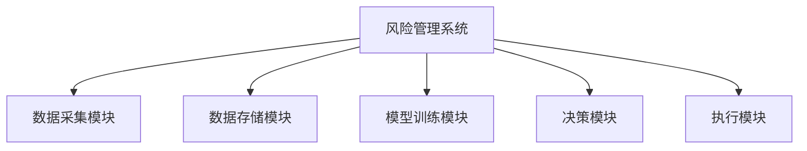
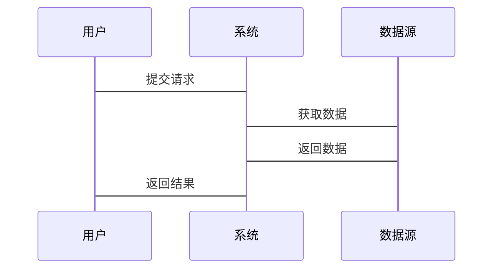

                 


# AI Agent在智能风险管理系统中的应用

**关键词**: AI Agent, 智能风险管理, 机器学习, 风险评估, 系统架构

**摘要**: 本文探讨了AI Agent在智能风险管理系统中的应用，从概念、原理、算法、系统设计到项目实战，全面分析AI Agent如何提升风险管理效率和准确性。通过详细的技术分析和实例展示，阐述了AI Agent在风险管理中的优势和未来发展方向。

---

## 第一章: AI Agent与智能风险管理概述

### 1.1 AI Agent的基本概念

#### 1.1.1 AI Agent的定义与特点
AI Agent（人工智能代理）是一种能够感知环境、自主决策并执行任务的智能实体。其特点包括自主性、反应性、目标导向和学习能力。

#### 1.1.2 AI Agent的核心属性与功能
- **自主性**: 能够独立决策，无需外部干预。
- **反应性**: 能够实时感知环境并做出反应。
- **目标导向**: 以特定目标为导向执行任务。
- **学习能力**: 能够通过数据学习和优化。

#### 1.1.3 AI Agent与传统风险管理工具的对比
| 对比维度 | AI Agent | 传统风险管理工具 |
|----------|-----------|------------------|
| 决策能力 | 自主决策，基于数据和模型 | 依赖人工规则和经验 |
| 处理速度 | 高效，实时处理 | 较慢，依赖人工分析 |
| 可扩展性 | 高，适用于多种场景 | 低，适用于固定场景 |

### 1.2 智能风险管理系统的核心概念

#### 1.2.1 风险管理的定义与分类
风险管理是通过识别、评估和应对潜在风险，以最小化其影响的过程。主要分类包括市场风险、信用风险、操作风险等。

#### 1.2.2 智能风险管理系统的特点
- **数据驱动**: 基于大量数据进行分析和预测。
- **实时监控**: 实时跟踪风险变化，快速响应。
- **智能决策**: 利用AI技术优化决策过程。

#### 1.2.3 AI Agent在智能风险管理中的作用
AI Agent能够实时监控风险，分析数据，预测潜在问题，并制定应对策略。

### 1.3 AI Agent与智能风险管理的结合

#### 1.3.1 AI Agent在风险管理中的应用场景
- **风险识别**: 自动识别潜在风险因素。
- **风险评估**: 基于数据进行风险量化。
- **风险应对**: 制定和执行风险缓解策略。

#### 1.3.2 AI Agent如何提升风险管理效率
- **自动化处理**: 减少人工干预，提高效率。
- **精准预测**: 利用机器学习模型进行精准预测。
- **快速响应**: 实时监控和响应，降低风险影响。

#### 1.3.3 AI Agent在智能风险管理中的优势
- **高效性**: 能够快速处理大量数据。
- **准确性**: 基于模型进行精准分析。
- **适应性**: 能够根据环境变化自适应调整。

### 1.4 本章小结
本章介绍了AI Agent的基本概念及其在智能风险管理中的作用，强调了AI Agent在提升风险管理效率和准确性方面的优势。

---

## 第二章: AI Agent的核心原理与技术

### 2.1 AI Agent的工作原理

#### 2.1.1 AI Agent的基本工作流程
1. **感知环境**: 通过传感器或数据源获取信息。
2. **分析数据**: 利用机器学习模型进行分析和预测。
3. **制定决策**: 基于分析结果制定行动方案。
4. **执行任务**: 根据决策执行具体操作。

#### 2.1.2 AI Agent的感知与决策机制
- **感知机制**: 通过数据采集、特征提取等方式获取环境信息。
- **决策机制**: 基于概率模型或强化学习算法制定决策。

#### 2.1.3 AI Agent的学习与优化过程
- **监督学习**: 基于标注数据进行模型训练。
- **无监督学习**: 通过聚类分析发现潜在模式。
- **强化学习**: 通过奖励机制优化决策策略。

### 2.2 AI Agent的关键技术

#### 2.2.1 自然语言处理（NLP）技术
NLP技术用于处理和分析文本数据，帮助AI Agent理解非结构化数据。

#### 2.2.2 机器学习（ML）算法
机器学习算法用于训练模型，进行风险预测和分类。

#### 2.2.3 强化学习（RL）的应用
强化学习用于优化决策策略，提升AI Agent的应对能力。

### 2.3 AI Agent与其他技术的对比

#### 2.3.1 AI Agent与传统规则引擎的对比
- **规则引擎**: 基于预定义规则进行决策。
- **AI Agent**: 基于机器学习模型进行动态决策。

#### 2.3.2 AI Agent与专家系统的区别
- **专家系统**: 基于专家知识进行推理。
- **AI Agent**: 基于数据和模型进行自主决策。

#### 2.3.3 AI Agent与自动化工具的差异
- **自动化工具**: 基于固定流程执行任务。
- **AI Agent**: 具有自主决策和学习能力。

### 2.4 AI Agent的构建与实现

#### 2.4.1 AI Agent的构建流程
1. **需求分析**: 明确AI Agent的功能和目标。
2. **数据采集**: 收集相关数据并进行预处理。
3. **模型训练**: 基于数据训练机器学习模型。
4. **系统集成**: 将AI Agent集成到智能风险管理系统中。

#### 2.4.2 AI Agent的核心组件分析
- **感知模块**: 负责数据采集和特征提取。
- **决策模块**: 负责分析数据并制定决策。
- **执行模块**: 负责执行具体任务。

#### 2.4.3 AI Agent的实现框架选择
- **开源框架**: 如TensorFlow、PyTorch。
- **商业框架**: 如AWS AI、Azure AI。

### 2.5 本章小结
本章详细介绍了AI Agent的核心原理和技术，包括其工作流程、关键技术和构建方法。

---

## 第三章: AI Agent在智能风险管理中的数学模型与算法

### 3.1 AI Agent的核心算法

#### 3.1.1 基于概率的决策模型
概率模型用于评估风险发生的可能性，常用贝叶斯网络进行建模。

#### 3.1.2 基于强化学习的优化算法
强化学习通过奖励机制优化决策策略，提升风险管理效果。

#### 3.1.3 基于图论的风险传播模型
图论模型用于分析风险在系统中的传播路径和影响范围。

### 3.2 AI Agent的数学模型

#### 3.2.1 风险评估的数学表达式
$$ P(risk) = \sum_{i=1}^{n} P(risk_i | a_i) $$

其中，$P(risk_i | a_i)$ 表示在条件 $a_i$ 下风险 $i$ 发生的概率。

#### 3.2.2 基于马尔可夫链的风险传播模型
马尔可夫链用于建模风险在系统中的传播过程，状态转移概率矩阵用于描述风险传播路径。

#### 3.2.3 基于贝叶斯网络的风险概率计算
贝叶斯网络通过概率推理计算风险发生的概率，支持条件概率的计算和更新。

### 3.3 算法实现与代码示例

#### 3.3.1 基于Python的AI Agent实现
```python
import numpy as np
from sklearn import svm

# 数据预处理
X = np.array([[feature1, feature2, ...], ...])
y = np.array([label1, label2, ...])

# 训练模型
model = svm.SVC()
model.fit(X, y)

# 预测风险
new_data = np.array([[new_feature1, new_feature2, ...]])
prediction = model.predict(new_data)
```

#### 3.3.2 使用机器学习库的风险评估代码
```python
from sklearn.ensemble import RandomForestClassifier

# 训练随机森林模型
model = RandomForestClassifier()
model.fit(X_train, y_train)

# 预测风险概率
prob = model.predict_proba(X_test)
```

#### 3.3.3 强化学习算法的实现示例
```python
import gym
from gym import spaces
from gym.utils import seeding

class RiskManagementEnv(gym.Env):
    def __init__(self):
        super(RiskManagementEnv, self).__init__()
        self.observation_space = spaces.Discrete(100)
        self.action_space = spaces.Discrete(5)
        self.current_state = 0
        self.done = False

    def step(self, action):
        # 根据动作更新状态
        # 返回新的状态、奖励、是否终止
        pass

    def reset(self):
        self.current_state = 0
        self.done = False
        return self.current_state

    def render(self, mode='human'):
        pass
```

### 3.4 算法的数学公式与解释

#### 3.4.1 风险概率计算公式
$$ P(risk) = \sum_{i=1}^{n} P(risk_i | a_i) $$

其中，$P(risk_i | a_i)$ 表示在条件 $a_i$ 下风险 $i$ 发生的概率，通过贝叶斯定理进行计算。

#### 3.4.2 基于强化学习的优化模型
$$ Q(s, a) = r + \gamma \max_{a'} Q(s', a') $$

其中，$Q(s, a)$ 表示状态 $s$ 下执行动作 $a$ 的价值，$r$ 是奖励，$\gamma$ 是折扣因子，$Q(s', a')$ 是下一状态的最大价值。

### 3.5 本章小结
本章详细讲解了AI Agent在智能风险管理中的数学模型与算法，包括概率模型、强化学习和贝叶斯网络的应用。

---

## 第四章: AI Agent在智能风险管理中的系统设计与项目实战

### 4.1 系统分析与架构设计

#### 4.1.1 项目背景与目标
本项目旨在开发一个基于AI Agent的智能风险管理系统，用于实时监控和预测风险。

#### 4.1.2 系统功能设计
- **风险识别**: 自动识别潜在风险。
- **风险评估**: 基于数据进行风险量化。
- **风险应对**: 制定和执行风险缓解策略。

#### 4.1.3 系统架构设计


#### 4.1.4 系统接口设计
- **数据接口**: 与数据源进行数据交换。
- **用户接口**: 提供用户交互界面。
- **外部接口**: 与其他系统进行数据交换。

#### 4.1.5 系统交互流程图


### 4.2 项目实战

#### 4.2.1 环境安装
```bash
pip install numpy scikit-learn gym
```

#### 4.2.2 系统核心实现源代码
```python
import numpy as np
from sklearn.ensemble import RandomForestClassifier

class AI风险管理系统:
    def __init__(self):
        self.model = RandomForestClassifier()
        self.data = []

    def 训练模型(self):
        self.model.fit(np.array([row[:-1] for row in self.data]), np.array([row[-1] for row in self.data]))

    def 预测风险(self, features):
        return self.model.predict(np.array([features]))
```

#### 4.2.3 代码应用解读与分析
- **数据预处理**: 对数据进行清洗和特征提取。
- **模型训练**: 使用随机森林模型进行训练。
- **风险预测**: 基于训练好的模型进行风险预测。

#### 4.2.4 实际案例分析
假设我们有一个金融风险管理项目，使用AI Agent实时监控市场波动，预测潜在风险，并制定应对策略。

#### 4.2.5 项目小结
本项目展示了AI Agent在智能风险管理中的实际应用，通过系统设计和实现，提升了风险管理的效率和准确性。

### 4.3 本章小结
本章通过系统设计和项目实战，详细讲解了AI Agent在智能风险管理中的应用，从环境安装到代码实现，再到案例分析，为读者提供了全面的指导。

---

## 第五章: 总结与展望

### 5.1 总结
本文详细探讨了AI Agent在智能风险管理中的应用，从基本概念到数学模型，再到系统设计和项目实战，全面分析了AI Agent的优势和实现方法。

### 5.2 未来展望
随着AI技术的不断发展，AI Agent在智能风险管理中的应用将更加广泛和深入，未来的研究方向包括更复杂的算法优化、多agent协作以及与其他技术的融合。

### 5.3 最佳实践 Tips
- **数据质量**: 确保数据的准确性和完整性。
- **模型优化**: 定期更新模型，提升预测精度。
- **系统维护**: 定期检查和维护系统，确保其稳定运行。

### 5.4 本章小结
本文总结了AI Agent在智能风险管理中的应用，并展望了未来的发展方向，为读者提供了进一步学习和研究的方向。

---

**附录**: 详细代码和参考资料

---

通过以上目录结构，我们可以系统地了解AI Agent在智能风险管理系统中的应用，从理论到实践，全面掌握其核心技术和实现方法。

