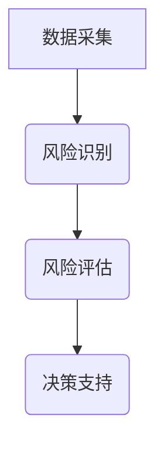
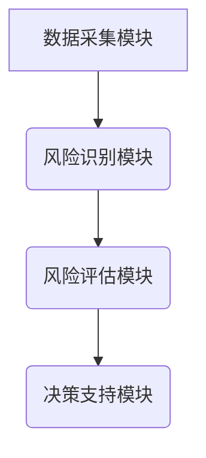
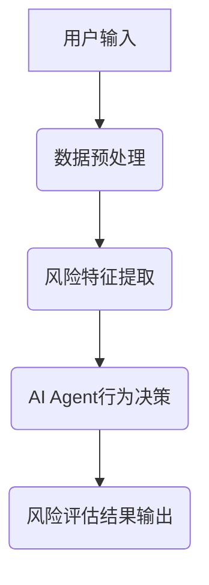

                 


# AI Agent在智能风险评估中的应用

## 关键词：AI Agent, 风险评估, 智能系统, 算法原理, 系统架构

## 摘要：本文详细探讨了AI Agent在智能风险评估中的应用，从基本概念到算法原理，再到系统架构和项目实战，全面分析了AI Agent如何提升风险评估的效率和准确性。

---

# 第一部分: AI Agent与智能风险评估概述

## 第1章: AI Agent与智能风险评估概述

### 1.1 AI Agent的基本概念

#### 1.1.1 AI Agent的定义与特点

AI Agent（人工智能代理）是一种能够感知环境、自主决策并执行任务的智能系统。它具有以下几个关键特点：

1. **自主性**：AI Agent能够在没有外部干预的情况下独立运行。
2. **反应性**：能够实时感知环境变化并做出相应反应。
3. **目标导向**：具有明确的目标，并根据目标驱动行为。
4. **学习能力**：能够通过经验或数据不断优化自身的决策能力。

#### 1.1.2 AI Agent的核心功能与分类

AI Agent的核心功能包括：

1. **感知环境**：通过传感器或其他数据源获取环境信息。
2. **推理与决策**：基于感知信息进行逻辑推理，制定最优决策。
3. **执行动作**：根据决策结果执行具体的动作或任务。

AI Agent的分类主要依据其智能水平和应用场景，常见的分类包括：

1. **简单反射型AI Agent**：基于预设规则进行反应，适用于简单的决策任务。
2. **基于模型的反应式AI Agent**：利用内部模型进行状态评估和决策，适用于复杂环境。
3. **目标驱动型AI Agent**：以特定目标为导向，优化行为以达到目标。
4. **实用驱动型AI Agent**：通过最大化效用函数来优化决策。

#### 1.1.3 智能风险评估的基本概念

智能风险评估是指利用人工智能技术，对潜在风险进行智能化识别、量化和预测的过程。传统的风险评估方法依赖于人工经验或简单的统计模型，而智能风险评估通过引入AI Agent，能够更高效、更准确地进行风险分析。

---

## 1.2 AI Agent在风险评估中的应用背景

### 1.2.1 风险评估的传统方法与局限性

传统的风险评估方法主要包括：

1. **定量分析法**：通过统计模型（如回归分析）进行风险量化。
2. **定性分析法**：基于专家经验进行风险评估。
3. **情景分析法**：通过模拟不同情景来预测风险。

然而，传统方法存在以下局限性：

1. **计算复杂度高**：处理大规模数据时效率低下。
2. **依赖人工经验**：结果受专家主观判断影响较大。
3. **动态适应性差**：难以实时应对环境变化。

### 1.2.2 AI技术在风险评估中的优势

AI技术在风险评估中的优势主要体现在以下几个方面：

1. **数据处理能力**：能够快速处理海量数据，提取有价值的信息。
2. **实时性**：能够实时感知环境变化，进行动态风险评估。
3. **自我优化**：通过机器学习算法不断优化风险评估模型。

### 1.2.3 智能风险评估的场景与应用领域

智能风险评估的应用场景非常广泛，主要包括：

1. **金融领域**：评估投资风险、信用风险等。
2. **网络安全领域**：识别潜在的安全威胁。
3. **医疗领域**：评估患者健康风险。
4. **交通领域**：评估交通事故风险。

---

## 1.3 本章小结

本章主要介绍了AI Agent的基本概念、核心功能及其在风险评估中的应用背景。通过对比传统风险评估方法的局限性，突出了AI Agent在智能风险评估中的重要性。接下来，我们将深入探讨AI Agent的核心原理及其在风险评估中的具体应用。

---

# 第二部分: AI Agent的核心原理与数学模型

## 第2章: AI Agent的核心原理

### 2.1 AI Agent的行为决策机制

#### 2.1.1 状态感知与信息处理

AI Agent通过传感器或数据接口获取环境信息，这些信息可以是结构化的数据（如数值型数据）或非结构化的数据（如文本、图像）。信息处理的过程包括数据清洗、特征提取和数据转换。

#### 2.1.2 行为选择与优化算法

行为选择是AI Agent的核心决策过程，主要依赖于优化算法。常用的优化算法包括：

1. **贪心算法**：在每一步选择当前状态下最优的决策。
2. **动态规划**：通过分解问题，寻找全局最优解。
3. **强化学习**：通过试错机制，优化决策策略。

#### 2.1.3 知识表示与推理

知识表示是AI Agent理解环境的关键，常见的知识表示方法包括：

1. **规则表示法**：通过预设规则进行推理。
2. **概率表示法**：通过概率模型进行推理。
3. **语义网络**：通过语义关系进行推理。

### 2.2 风险评估的基本原理

#### 2.2.1 风险识别与量化

风险识别是风险评估的第一步，主要通过分析潜在风险因素，确定风险的类型和来源。风险量化则是将风险的影响程度用具体的数值表示，常用的量化方法包括：

1. **概率-影响矩阵**：通过风险发生的概率和影响程度，确定风险的优先级。
2. **层次分析法（AHP）**：通过构建层次结构，进行综合评估。

#### 2.2.2 风险概率模型

风险概率模型是风险评估的核心，常用的概率模型包括：

1. **贝叶斯网络**：通过概率分布和条件概率进行风险推理。
2. **马尔可夫链**：通过状态转移概率进行风险传播分析。

#### 2.2.3 风险影响分析

风险影响分析主要是评估风险对系统或目标的影响程度，常用的分析方法包括：

1. **成本效益分析**：评估风险应对措施的成本和效益。
2. **情景分析**：模拟不同情景下的风险影响。

### 2.3 AI Agent与风险评估的结合点

#### 2.3.1 数据驱动的风险评估

数据驱动的风险评估通过分析大量历史数据，发现潜在风险模式。常用的技术包括：

1. **聚类分析**：将相似的样本聚类，发现风险类别。
2. **分类算法**：通过训练分类模型，识别风险类型。

#### 2.3.2 知识驱动的风险评估

知识驱动的风险评估依赖于领域知识和专家经验，常用的技术包括：

1. **规则引擎**：通过预设规则进行风险推理。
2. **知识图谱**：通过语义关系进行风险关联分析。

#### 2.3.3 混合驱动的风险评估

混合驱动的风险评估结合了数据驱动和知识驱动的优点，通过融合两者的优势，提高风险评估的准确性和全面性。

---

## 2.4 本章小结

本章主要探讨了AI Agent的核心原理及其在风险评估中的具体应用。通过分析AI Agent的行为决策机制和风险评估的基本原理，我们深入了解了AI Agent在智能风险评估中的关键作用。接下来，我们将详细讲解AI Agent的风险评估算法与数学模型。

---

# 第三部分: AI Agent的风险评估算法与数学模型

## 第3章: 基于概率论的AI Agent风险评估模型

### 3.1 概率论基础

#### 3.1.1 概率的基本概念

概率是描述事件发生可能性的度量，常用的概率分布包括：

1. **均匀分布**：所有可能值的概率相同。
2. **正态分布**：概率密度函数呈钟型曲线。
3. **贝塔分布**：适用于描述概率分布的概率分布。

#### 3.1.2 条件概率与贝叶斯定理

条件概率是指在已知某个事件发生的条件下，另一个事件发生的概率。贝叶斯定理公式如下：

$$P(A|B) = \frac{P(B|A) \cdot P(A)}{P(B)}$$

其中，$P(A|B)$ 表示在事件B发生的条件下，事件A发生的概率。

#### 3.1.3 贝叶斯网络的基本原理

贝叶斯网络是一种有向无环图（DAG），节点代表随机变量，边代表变量之间的依赖关系。贝叶斯网络能够通过条件概率表（CPT）进行概率推理。

### 3.2 风险评估中的概率模型

#### 3.2.1 风险概率计算公式

风险概率计算公式如下：

$$P(r) = \frac{N_r}{N}$$

其中，$P(r)$ 表示风险 $r$ 的概率，$N_r$ 是风险 $r$ 的发生次数，$N$ 是总样本数。

#### 3.2.2 贝叶斯网络在风险评估中的应用

贝叶斯网络可以用于风险传播分析和风险影响评估。例如，在金融领域，可以通过贝叶斯网络分析不同经济指标对风险的影响。

### 3.3 基于马尔可夫链的风险评估模型

#### 3.3.1 马尔可夫链的基本概念

马尔可夫链是一种描述系统状态转移的数学模型，具有无记忆性，即当前状态仅依赖于前一状态。

#### 3.3.2 马尔可夫链在风险传播中的应用

马尔可夫链可以用于分析风险在不同时间点的传播概率。例如，在网络安全领域，可以通过马尔可夫链模型分析病毒传播的概率。

#### 3.3.3 风险状态转移矩阵的构建

风险状态转移矩阵描述了不同风险状态之间的转移概率，矩阵元素 $a_{ij}$ 表示从状态 $i$ 转移到状态 $j$ 的概率。

---

## 3.4 本章小结

本章主要讲解了基于概率论的AI Agent风险评估模型，重点介绍了贝叶斯网络和马尔可夫链在风险评估中的应用。通过数学模型和算法，我们能够更准确地进行风险预测和评估。接下来，我们将探讨AI Agent驱动的风险评估系统架构。

---

# 第四部分: AI Agent驱动的风险评估系统架构

## 第4章: AI Agent驱动的风险评估系统架构

### 4.1 系统总体架构设计

#### 4.1.1 系统功能模块划分

AI Agent驱动的风险评估系统主要由以下几个功能模块组成：

1. **数据采集模块**：负责采集环境数据。
2. **风险识别模块**：负责识别潜在风险。
3. **风险评估模块**：负责量化和评估风险。
4. **决策支持模块**：负责提供风险应对建议。

#### 4.1.2 系统功能流程图（Mermaid）



### 4.2 系统功能

#### 4.2.1 数据采集模块

数据采集模块是系统的核心模块，负责从多种数据源采集数据。常用的数据采集方法包括：

1. **API接口**：通过API获取实时数据。
2. **文件读取**：从文件中读取历史数据。
3. **传感器数据**：通过传感器获取实时数据。

#### 4.2.2 风险识别模块

风险识别模块通过分析采集到的数据，识别潜在风险。常用的风险识别方法包括：

1. **异常检测**：通过统计方法或机器学习算法检测异常数据。
2. **模式识别**：通过聚类分析或分类算法识别风险模式。

#### 4.2.3 风险评估模块

风险评估模块根据识别出的风险，进行量化评估。常用的风险评估方法包括：

1. **概率-影响矩阵**：根据风险的概率和影响程度，评估风险的优先级。
2. **层次分析法（AHP）**：通过构建层次结构，进行综合评估。

#### 4.2.4 决策支持模块

决策支持模块根据风险评估结果，提供风险应对建议。常用的风险应对策略包括：

1. **风险规避**：通过调整策略避免风险。
2. **风险缓解**：通过降低风险影响减轻风险。
3. **风险转移**：通过保险等方式将风险转移给第三方。

### 4.3 系统架构设计

#### 4.3.1 系统架构图（Mermaid）



#### 4.3.2 系统交互流程图（Mermaid）



### 4.4 本章小结

本章详细介绍了AI Agent驱动的风险评估系统的总体架构设计和功能模块划分，通过Mermaid图展示了系统的交互流程和架构结构。接下来，我们将通过一个具体的项目实战案例，展示如何实现一个基于AI Agent的风险评估系统。

---

# 第五部分: 项目实战: 基于AI Agent的风险评估系统实现

## 第5章: 项目实战: 基于AI Agent的风险评估系统实现

### 5.1 环境安装与配置

#### 5.1.1 系统运行环境

- 操作系统：Windows/Mac/Linux
- Python版本：Python 3.8+
- 依赖库：numpy, pandas, scikit-learn, matplotlib

#### 5.1.2 安装依赖

使用以下命令安装所需的依赖库：

```bash
pip install numpy pandas scikit-learn matplotlib
```

### 5.2 系统核心实现源代码

#### 5.2.1 数据采集模块

```python
import requests

def fetch_data(api_url):
    response = requests.get(api_url)
    return response.json()
```

#### 5.2.2 风险识别模块

```python
from sklearn.ensemble import IsolationForest

def detect_anomalies(data):
    model = IsolationForest(n_estimators=100, contamination=0.05)
    model.fit(data)
    return model.predict(data)
```

#### 5.2.3 风险评估模块

```python
from sklearn.metrics import pairwise_distances

def calculate_similarity(data, new_point):
    distances = pairwise_distances(new_point, data)
    return distances.min()
```

#### 5.2.4 决策支持模块

```python
def generate_recommendations(data, threshold):
    recommendations = []
    for point in data:
        if point['score'] > threshold:
            recommendations.append(point)
    return recommendations
```

### 5.3 代码应用解读与分析

#### 5.3.1 数据采集模块解读

数据采集模块通过调用外部API获取实时数据，返回数据的JSON格式。这种模块化设计使得系统具有良好的扩展性，可以方便地更换数据源。

#### 5.3.2 风险识别模块解读

风险识别模块使用Isolation Forest算法检测异常数据点。该算法适用于高维数据的异常检测，能够有效地识别潜在风险。

#### 5.3.3 风险评估模块解读

风险评估模块通过计算数据点之间的相似性，评估潜在风险的影响程度。该模块使用了scikit-learn库中的pairwise_distances函数，能够高效地计算数据点之间的距离。

#### 5.3.4 决策支持模块解读

决策支持模块根据风险评估结果，生成风险应对建议。该模块通过预设的阈值，筛选出高风险数据点，并返回具体的应对策略。

### 5.4 实际案例分析

#### 5.4.1 案例背景

假设我们正在开发一个金融风险评估系统，需要评估投资组合的风险。我们可以通过以下步骤实现：

1. **数据采集**：从金融数据API获取历史股价数据。
2. **风险识别**：识别股价的异常波动。
3. **风险评估**：评估异常波动对投资组合的影响。
4. **决策支持**：根据评估结果，生成风险应对策略。

#### 5.4.2 案例分析

```python
import numpy as np
import pandas as pd
from sklearn.ensemble import IsolationForest

# 数据采集
data = fetch_data("https://api.example.com/stock_prices")

# 风险识别
anomalies = detect_anomalies(data)

# 风险评估
similarities = calculate_similarity(data, anomalies)

# 决策支持
recommendations = generate_recommendations(data, 0.05)
```

### 5.5 项目小结

通过本项目实战，我们详细展示了如何实现一个基于AI Agent的风险评估系统。从环境配置到代码实现，再到案例分析，每个步骤都进行了详细的解读和分析。这为我们后续的系统优化和功能扩展提供了良好的基础。

---

# 第六部分: 总结与展望

## 第6章: 总结与展望

### 6.1 本章总结

本文详细探讨了AI Agent在智能风险评估中的应用，从基本概念到算法原理，再到系统架构和项目实战，全面分析了AI Agent如何提升风险评估的效率和准确性。通过具体的案例分析，我们展示了AI Agent在实际应用中的巨大潜力。

### 6.2 未来展望

随着人工智能技术的不断发展，AI Agent在风险评估中的应用将更加广泛和深入。未来的研究方向包括：

1. **强化学习的应用**：通过强化学习优化AI Agent的决策策略。
2. **多 Agent协作**：研究多个AI Agent协作进行风险评估的方法。
3. **实时性优化**：提高AI Agent的实时响应能力，适用于更复杂的动态环境。

---

# 附录

## 附录A: AI Agent相关技术术语表

- **AI Agent**：人工智能代理，能够感知环境、自主决策并执行任务的智能系统。
- **风险评估**：对潜在风险进行识别、量化和预测的过程。
- **贝叶斯网络**：一种有向无环图，用于概率推理。
- **马尔可夫链**：描述系统状态转移的数学模型。

## 附录B: Python代码实现示例

```python
import requests
from sklearn.ensemble import IsolationForest
from sklearn.metrics import pairwise_distances

def fetch_data(api_url):
    response = requests.get(api_url)
    return response.json()

def detect_anomalies(data):
    model = IsolationForest(n_estimators=100, contamination=0.05)
    model.fit(data)
    return model.predict(data)

def calculate_similarity(data, new_point):
    distances = pairwise_distances(new_point, data)
    return distances.min()

def generate_recommendations(data, threshold):
    recommendations = []
    for point in data:
        if point['score'] > threshold:
            recommendations.append(point)
    return recommendations
```

---

## 附录C: Mermaid图示例


---

# 结语

感谢您的阅读！希望本文能够为AI Agent在智能风险评估中的应用提供有价值的参考和启发。如果您有任何问题或建议，欢迎随时与我联系。

---

# 参考文献

1. Russell, S., & Norvig, P. (2010). Artificial Intelligence: A Modern Approach.
2. Bishop, C. M. (2006). Pattern Recognition and Machine Learning.
3. Pearl, J. (1988). Probabilistic Reasoning in Intelligent Systems: Networks of Plausible Inference.
4. Shalev-Shwartz, Y., & Ben-David, S. (2017). Understanding Machine Learning: From Theory to Algorithms.

