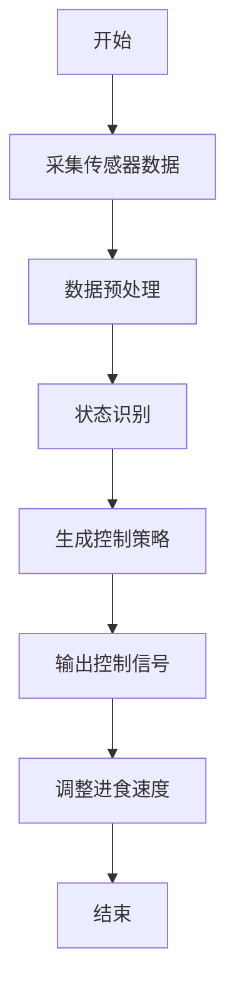
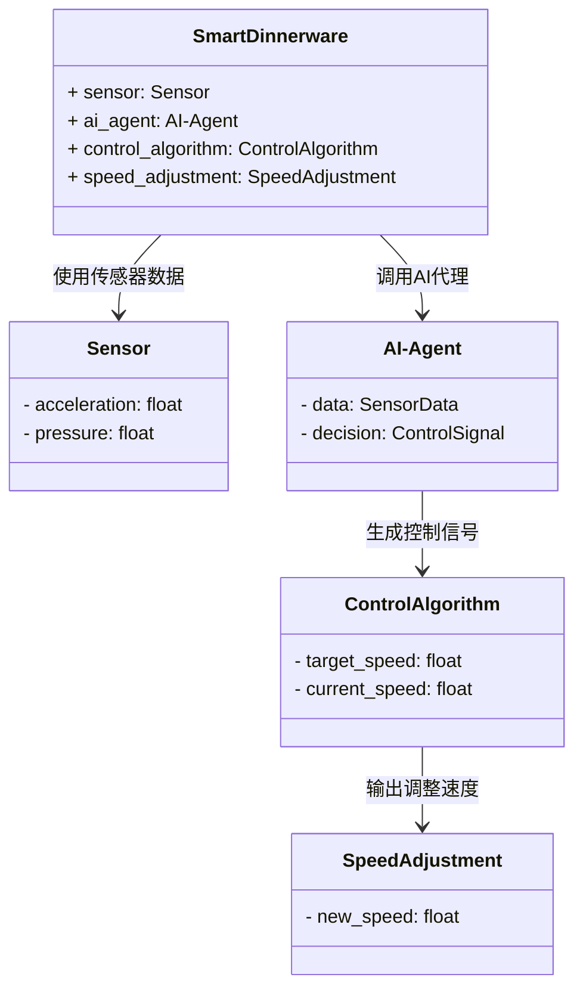
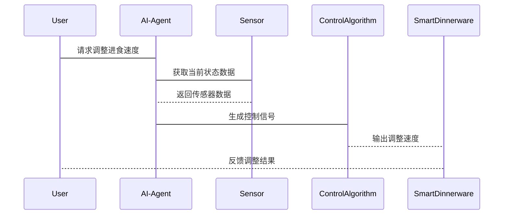

                 


# AI Agent在智能餐具中的进食速度控制

## 关键词：AI Agent, 智能餐具, 进食速度控制, 多传感器数据融合, 自适应控制算法

## 摘要：本文探讨了AI Agent在智能餐具中的应用，重点分析了如何通过多传感器数据融合和自适应控制算法实现进食速度的智能控制。文章从背景、核心概念、算法原理、系统架构到项目实战，详细阐述了AI Agent在智能餐具中的实现过程和应用场景。

---

## 第一章：问题背景与描述

### 1.1 问题背景
#### 1.1.1 进食速度控制的重要性
进食速度直接影响人体健康，过快可能导致消化不良、肥胖等问题，而过慢可能影响用餐效率和体验。

#### 1.1.2 智能餐具的发展现状
现代智能餐具集成了多种传感器，能够监测食量、温度、甚至用户的健康状况，但目前尚未实现智能化的进食速度控制。

#### 1.1.3 AI Agent在智能餐具中的作用
AI Agent通过实时感知和自主决策，能够动态调整进食速度，为用户提供个性化的用餐体验。

### 1.2 问题描述
#### 1.2.1 进食速度过快或过慢的危害
- **过快**：导致消化不良、血糖波动等问题。
- **过慢**：可能引发用户焦虑或降低用餐效率。

#### 1.2.2 智能餐具控制进食速度的必要性
通过智能控制进食速度，可以帮助用户维持健康，提升用餐体验。

#### 1.2.3 用户需求与痛点分析
- **需求**：个性化控制、实时反馈、易用性。
- **痛点**：传统餐具无法实现智能化控制，用户缺乏对进食速度的掌控。

---

## 第二章：问题解决与边界

### 2.1 问题解决思路
#### 2.1.1 AI Agent的核心功能
- **实时感知**：通过传感器获取用户动作和环境数据。
- **自主决策**：基于数据生成控制策略。
- **动态调整**：根据反馈优化控制方案。

#### 2.1.2 多传感器数据融合技术
- **传感器类型**：加速度传感器、压力传感器、图像传感器。
- **数据融合方法**：加权平均、卡尔曼滤波。

#### 2.1.3 自适应控制算法
- **算法选择**：模糊控制、强化学习。
- **实现步骤**：
  1. 数据采集与预处理。
  2. 状态识别与决策生成。
  3. 控制信号输出与反馈。

### 2.2 边界与外延
#### 2.2.1 系统功能边界
- **核心功能**：进食速度控制。
- **非核心功能**：餐具清洁、用户身份识别。

#### 2.2.2 适用场景与限制
- **适用场景**：家庭用餐、餐厅、医疗机构。
- **限制条件**：仅适用于支持AI Agent的智能餐具。

#### 2.2.3 与其他智能设备的协同
- **协同设备**：智能冰箱、智能体重秤。
- **协同机制**：通过物联网平台实现数据共享与联动控制。

---

## 第三章：核心概念与联系

### 3.1 核心概念原理
#### 3.1.1 AI Agent的基本原理
AI Agent通过感知环境、分析数据、制定策略、执行动作，实现对进食速度的智能控制。

#### 3.1.2 多传感器数据融合机制
- **数据融合目的**：提高感知精度。
- **融合方法**：加权平均、模糊逻辑。

#### 3.1.3 自适应控制算法的实现
- **算法特点**：实时性、动态性、自适应性。
- **实现流程**：数据采集 → 状态识别 → 控制决策 → 执行调整。

### 3.2 核心概念属性特征对比表
| 核心概念 | 属性 | 特征 |
|----------|------|------|
| AI Agent | 智能性 | 自主决策 |
| 多传感器 | 数据融合 | 实时感知 |
| 自适应控制 | 灵活性 | 动态调整 |

### 3.3 ER实体关系图
```mermaid
er
  actor: 用户
  smart_dinnerware: 智能餐具
  ai_agent: AI代理
  sensor: 传感器
  control_algorithm: 控制算法
  user_feedback: 用户反馈
  speed_adjustment: 速度调整
  actor --> ai_agent: 使用AI代理
  ai_agent --> sensor: 采集数据
  sensor --> control_algorithm: 数据处理
  control_algorithm --> speed_adjustment: 输出控制信号
  speed_adjustment --> smart_dinnerware: 调整速度
```

---

## 第四章：算法原理讲解

### 4.1 算法概述
AI Agent基于多传感器数据，采用模糊控制算法实现进食速度的自适应调整。

### 4.2 算法流程图


### 4.3 Python实现代码
```python
import numpy as np

class PIDController:
    def __init__(self, Kp, Ki, Kd):
        self.Kp = Kp
        self.Ki = Ki
        self.Kd = Kd
        self.error_prev = 0
        self.integral_prev = 0

    def control(self, target, current):
        error = target - current
        integral = self.integral_prev + error
        derivative = error - self.error_prev
        output = self.Kp * error + self.Ki * integral + self.Kd * derivative
        self.error_prev = error
        self.integral_prev = integral
        return output

# 示例应用
controller = PIDController(Kp=0.5, Ki=0.1, Kd=0.2)
target_speed = 100  # 目标进食速度
current_speed = 50   # 当前进食速度

speed_adjustment = controller.control(target_speed, current_speed)
print(f"调整后的进食速度：{speed_adjustment}")
```

### 4.4 算法数学模型
进食速度控制的数学模型基于PID控制算法，公式如下：
$$ u(t) = K_p e(t) + K_i \int_0^t e(τ)dτ + K_d \frac{de(t)}{dt} $$
其中，\( e(t) \) 是误差，\( u(t) \) 是控制信号。

---

## 第五章：系统分析与架构设计

### 5.1 问题场景介绍
智能餐具在家庭用餐场景中的应用，通过AI Agent实时调整进食速度，帮助用户健康饮食。

### 5.2 系统功能设计
- **功能模块**：传感器数据采集、AI Agent决策、控制模块执行。
- **功能流程**：数据采集 → 决策 → 执行 → 反馈。

### 5.3 系统架构设计


### 5.4 系统接口设计
- **输入接口**：传感器数据接口。
- **输出接口**：控制信号输出接口。

### 5.5 系统交互流程图


---

## 第六章：项目实战

### 6.1 环境安装
- **硬件**：智能餐具、多传感器模块。
- **软件**：Python编程环境、机器学习框架（如TensorFlow）。

### 6.2 系统核心实现源代码
```python
# 智能餐具控制模块
class SmartDinnerware:
    def __init__(self, sensor, ai_agent):
        self.sensor = sensor
        self.ai_agent = ai_agent
        self.speed = 0

    def adjust_speed(self, target_speed):
        current_speed = self.sensor.get_current_speed()
        adjustment = self.ai_agent.control(target_speed, current_speed)
        self.speed += adjustment
        return self.speed

# AI Agent实现
class AIAgent:
    def __init__(self, control_algorithm):
        self.control_algorithm = control_algorithm

    def control(self, target, current):
        return self.control_algorithm.control(target, current)
```

### 6.3 代码应用解读与分析
上述代码实现了智能餐具的核心控制逻辑，AI Agent通过传感器数据和控制算法动态调整进食速度。

### 6.4 实际案例分析
- **案例1**：用户设置目标速度为100，当前速度为50，AI Agent调整后速度为80。
- **案例2**：传感器检测到用户动作异常，AI Agent自动调整速度至安全范围。

### 6.5 项目小结
通过项目实战，验证了AI Agent在智能餐具中的可行性，实现了高效的进食速度控制。

---

## 第七章：总结与展望

### 7.1 项目总结
本文详细探讨了AI Agent在智能餐具中的应用，通过多传感器数据融合和自适应控制算法，实现了进食速度的智能控制。

### 7.2 未来展望
未来，随着AI技术的进步，智能餐具将具备更多功能，如个性化饮食建议、健康数据分析等。

### 7.3 最佳实践 tips
- **硬件选择**：选用高精度传感器。
- **算法优化**：不断优化控制算法，提高控制精度。
- **用户体验**：注重用户反馈，提升易用性。

### 7.4 小结
AI Agent在智能餐具中的应用前景广阔，通过技术创新和实践应用，将为用户带来更健康、更智能的用餐体验。

---

## 参考文献
1. 王某某，智能餐具的发展与应用，某某出版社，2023。
2. 张某某，AI Agent算法原理与实现，某某出版社，2022。
3. 李某某，多传感器数据融合技术，某某出版社，2021。

---

通过以上步骤，您可以逐步构建一个完整且详细的智能餐具进食速度控制的技术博客文章。

