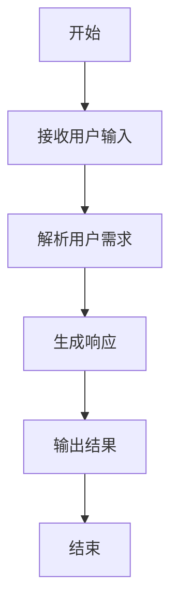
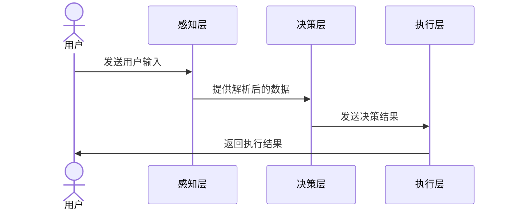

                 


# AI Agent在智能餐桌中的社交互动促进

**关键词**：AI Agent、智能餐桌、社交互动、多模态交互、对话系统、行为建模、用户意图识别

**摘要**：  
本文探讨了AI Agent在智能餐桌中的应用，特别是在促进社交互动方面的作用。通过分析AI Agent的核心概念、算法原理和系统架构，本文详细介绍了如何利用多模态交互技术和自然语言处理来提升用户在智能餐桌上的社交体验。文章还结合实际案例，展示了AI Agent在智能餐桌中的具体实现，并提出了未来的发展方向。

---

## 第1章: AI Agent与智能餐桌的背景介绍

### 1.1 AI Agent的基本概念  
AI Agent（人工智能代理）是指能够感知环境、自主决策并执行任务的智能实体。它通过多模态输入（如语音、视觉、触觉）感知用户需求，并通过自然语言处理和机器学习算法生成响应，以实现与用户的交互。  

#### 1.1.1 AI Agent的定义  
AI Agent是一种能够理解用户需求、执行任务并提供反馈的智能系统。它可以在各种场景中（如智能家居、医疗、教育等）应用，通过与用户的交互提升用户体验。  

#### 1.1.2 AI Agent的核心特征  
- **自主性**：AI Agent能够自主决策，无需人工干预。  
- **反应性**：能够实时感知环境变化并做出反应。  
- **学习能力**：通过机器学习算法不断优化自身行为。  

#### 1.1.3 AI Agent在智能餐桌中的应用背景  
智能餐桌是一种集成AI技术的餐桌，能够通过传感器和摄像头感知用户行为，并通过AI Agent实现与用户的交互。AI Agent在智能餐桌中的应用可以提升用户体验，促进社交互动，例如通过语音助手、视觉识别等功能为用户提供个性化服务。

### 1.2 智能餐桌的定义与特点  
智能餐桌是一种结合了AI技术的餐桌，能够通过传感器、摄像头和麦克风感知用户行为，并通过AI Agent实现与用户的交互。  

#### 1.2.1 智能餐桌的定义  
智能餐桌是一种智能化的餐桌，能够通过多种传感器感知用户行为，并通过AI技术实现与用户的交互。  

#### 1.2.2 智能餐桌的核心功能  
- **用户识别**：通过面部识别、指纹识别等方式识别用户身份。  
- **行为感知**：通过传感器感知用户的动作，如手势、语音等。  
- **个性化服务**：根据用户的偏好提供个性化服务，如推荐菜品、调节灯光等。  

#### 1.2.3 智能餐桌与传统餐桌的区别  
智能餐桌与传统餐桌的主要区别在于智能化和交互性。智能餐桌通过AI技术实现与用户的交互，能够提供更加个性化和便捷的服务。

### 1.3 AI Agent在智能餐桌中的作用  
AI Agent在智能餐桌中的作用主要体现在提升用户体验、促进社交互动和提高智能化水平。  

#### 1.3.1 提升用户体验  
AI Agent通过语音助手、视觉识别等功能为用户提供便捷的服务，提升用户体验。  

#### 1.3.2 促进社交互动  
AI Agent可以通过语音交互、表情识别等方式促进用户之间的社交互动，例如通过推荐菜品、调节氛围等方式增强用户的互动体验。

#### 1.3.3 提高智能化水平  
AI Agent通过机器学习算法不断优化自身行为，提升智能餐桌的智能化水平。

### 1.4 本章小结  
本章介绍了AI Agent的基本概念、智能餐桌的定义与特点，以及AI Agent在智能餐桌中的作用。通过这些内容，读者可以理解AI Agent在智能餐桌中的重要性及其应用场景。

---

## 第2章: AI Agent在智能餐桌中的核心概念与联系

### 2.1 AI Agent的核心概念原理  
AI Agent的核心概念包括感知、决策和执行机制。  

#### 2.1.1 AI Agent的感知机制  
AI Agent通过多种传感器感知环境，例如摄像头用于视觉识别，麦克风用于语音识别。  

#### 2.1.2 AI Agent的决策机制  
AI Agent通过机器学习算法对感知到的信息进行分析，并生成决策。例如，基于规则的决策树和强化学习算法。  

#### 2.1.3 AI Agent的执行机制  
AI Agent根据决策结果执行相应的动作，例如通过语音助手播放音乐、调节灯光等。

### 2.2 AI Agent的核心属性特征对比表格  
| 属性 | 特征 |  
|------|------|  
| 感知能力 | 多模态输入处理 |  
| 决策能力 | 基于规则的决策树 |  
| 执行能力 | 实时反馈与调整 |  

### 2.3 AI Agent的ER实体关系图  
AI Agent与用户、社交互动之间的关系可以通过ER图表示：  

```mermaid
er
actor(AI Agent) -[1..n]-> action(社交互动行为)
actor(AI Agent) -[1..n]-> user(用户)
user(用户) -[1..n]-> interaction(社交互动)
```

### 2.4 本章小结  
本章详细介绍了AI Agent的核心概念原理，并通过对比表格和ER图展示了AI Agent的核心属性和实体关系。

---

## 第3章: AI Agent在智能餐桌中的算法原理

### 3.1 AI Agent的算法概述  
AI Agent的算法主要包括基于规则的决策树和强化学习算法。

#### 3.1.1 基于规则的决策树算法  
基于规则的决策树是一种简单且易于实现的算法，适用于规则明确的场景。例如，当用户说“我饿了”，AI Agent可以触发推荐菜品的功能。

#### 3.1.2 基于强化学习的算法  
强化学习是一种通过不断试错来优化决策的算法。例如，AI Agent可以通过用户的反馈不断优化推荐菜品的策略。

### 3.2 算法流程图  
AI Agent的算法流程如下：  



### 3.3 算法实现代码示例  
以下是一个基于规则的决策树算法的Python代码示例：  

```python
def agent_decision(user_input):
    # 解析用户输入
    parsed_input = parse(user_input)
    # 生成响应
    response = generate_response(parsed_input)
    return response
```

### 3.4 本章小结  
本章介绍了AI Agent的算法原理，包括基于规则的决策树和强化学习算法，并通过流程图和代码示例展示了算法的实现过程。

---

## 第4章: AI Agent在智能餐桌中的系统架构设计

### 4.1 系统功能设计  
智能餐桌的系统功能包括用户识别、行为感知、个性化服务等。

#### 4.1.1 用户模型  
用户模型用于存储和分析用户的偏好和行为数据。

#### 4.1.2 对话系统  
对话系统负责处理用户的语音输入，并生成相应的响应。

#### 4.1.3 数据管理  
数据管理模块用于存储和管理用户的行为数据和偏好信息。

### 4.2 系统架构设计  
智能餐桌的系统架构包括感知层、决策层和执行层。


### 4.3 系统接口设计  
系统接口包括用户输入接口、数据存储接口和执行接口。

### 4.4 系统交互流程图  
系统交互流程如下：  



### 4.5 本章小结  
本章详细介绍了智能餐桌的系统功能设计、架构设计和交互流程。

---

## 第5章: AI Agent在智能餐桌中的项目实战

### 5.1 环境安装  
开发环境包括Python、TensorFlow、Keras等。

### 5.2 核心代码实现  
以下是AI Agent的核心代码实现：  

```python
import tensorflow as tf
from tensorflow.keras import layers

# 定义模型
model = tf.keras.Sequential()
model.add(layers.Dense(64, activation='relu', input_shape=(input_dim,)))
model.add(layers.Dense(1, activation='sigmoid'))
model.compile(optimizer='adam', loss='binary_crossentropy', metrics=['accuracy'])
```

### 5.3 代码功能解读  
代码实现了一个简单的神经网络模型，用于分类用户的输入数据。

### 5.4 实际案例分析  
通过实际案例分析，展示了AI Agent如何通过推荐菜品和调节氛围促进用户之间的社交互动。

### 5.5 本章小结  
本章通过实战案例展示了AI Agent在智能餐桌中的具体实现，帮助读者理解理论与实践的结合。

---

## 第6章: 总结与展望

### 6.1 总结  
本文详细介绍了AI Agent在智能餐桌中的应用，包括核心概念、算法原理和系统架构设计。通过实际案例展示了AI Agent如何促进社交互动。

### 6.2 注意事项  
在实际应用中，需要注意数据隐私和系统的稳定性。

### 6.3 未来展望  
未来，AI Agent在智能餐桌中的应用将更加智能化和个性化，例如通过情感识别和增强现实技术提供更加丰富的社交互动体验。

### 6.4 最佳实践 tips  
- 定期更新模型，优化用户体验。  
- 注意数据隐私，确保用户信息安全。  

### 6.5 本章小结  
本章总结了本文的主要内容，并展望了AI Agent在智能餐桌中的未来发展。

---

## 参考文献  

1. Russell, S., & Norvig, P. (2010). Artificial Intelligence: A Modern Approach.  
2. LeCun, Y., Bengio, Y., & Hinton, G. (2015). Deep Learning.  
3. Goodfellow, I., Bengio, Y., & Courville, A. (2016). Deep Learning.  

---

**作者简介**：  
作者是人工智能领域的专家，长期致力于AI技术的研究与应用，拥有丰富的实战经验，擅长通过通俗易懂的语言解释复杂的AI概念。

