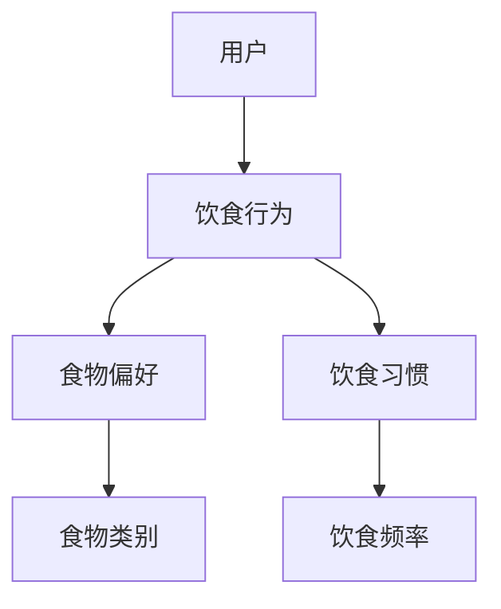
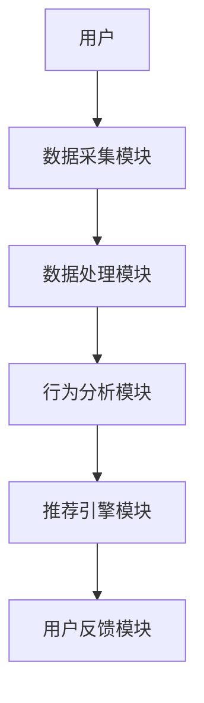
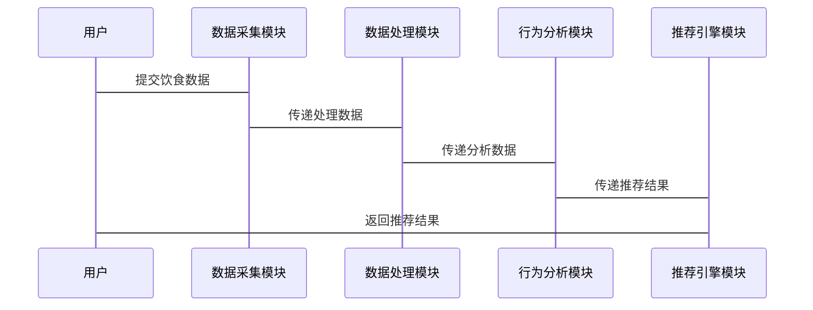

                 

# AI Agent在智能餐桌中的饮食行为分析

> 关键词：AI Agent, 智能餐桌, 饮食行为分析, 数据分析, 人工智能

> 摘要：本文深入探讨AI Agent在智能餐桌中的饮食行为分析，从背景介绍、核心概念、算法原理、系统架构到项目实战，全面分析AI Agent如何通过数据采集与分析、行为建模、用户画像构建等技术手段，实现对用户饮食行为的智能分析与个性化推荐，为智能餐桌的设计与优化提供理论与实践指导。

---

# 目录大纲：《AI Agent在智能餐桌中的饮食行为分析》

---

## 第一部分：背景与概念

### 第1章：AI Agent与智能餐桌的背景

#### 1.1 AI Agent的基本概念
- 1.1.1 AI Agent的定义与特点
- 1.1.2 AI Agent的核心功能与应用场景
- 1.1.3 AI Agent在智能餐桌中的角色定位

#### 1.2 智能餐桌的背景与发展趋势
- 1.2.1 智能餐桌的概念与技术基础
- 1.2.2 智能餐桌的发展现状与趋势
- 1.2.3 AI Agent在智能餐桌中的重要性

#### 1.3 饮食行为分析的背景与意义
- 1.3.1 饮食行为分析的基本概念
- 1.3.2 饮食行为分析在智能餐桌中的应用价值
- 1.3.3 饮食行为分析的边界与外延

---

## 第二部分：AI Agent在饮食行为分析中的核心概念

### 第2章：饮食行为分析的核心概念与联系

#### 2.1 核心概念原理
- 2.1.1 饮食行为分析的理论基础
- 2.1.2 AI Agent在饮食行为分析中的作用机制
- 2.1.3 饮食行为分析的数学模型与算法原理

#### 2.2 核心概念属性特征对比表
- 表2.1：饮食行为分析与传统数据分析的对比
- 表2.2：AI Agent与其他数据分析工具的对比

#### 2.3 ER实体关系图

---

## 第三部分：算法原理与实现

### 第3章：饮食行为分析的算法原理

#### 3.1 基于协同过滤的推荐算法
- 3.1.1 协同过滤的基本原理
- 3.1.2 基于用户的协同过滤算法
- 3.1.3 基于物品的协同过滤算法
- 3.1.4 协同过滤的优缺点分析

#### 3.2 基于聚类分析的饮食行为分类
- 3.2.1 聚类分析的基本原理
- 3.2.2 K-means算法在饮食行为分类中的应用
- 3.2.3 聚类结果的可视化与分析

#### 3.3 基于神经网络的饮食行为预测
- 3.3.1 神经网络的基本原理
- 3.3.2 饮食行为预测的神经网络模型设计
- 3.3.3 模型的训练与优化

#### 3.4 算法实现与比较
- 3.4.1 不同算法的实现步骤对比
- 3.4.2 算法性能的对比分析
- 3.4.3 算法选择的依据与建议

---

## 第四部分：系统分析与架构设计

### 第4章：AI Agent驱动的智能餐桌系统架构

#### 4.1 问题场景介绍
- 4.1.1 饮食行为分析的典型问题场景
- 4.1.2 智能餐桌系统的需求分析
- 4.1.3 AI Agent在系统中的角色定位

#### 4.2 系统功能设计
- 4.2.1 系统功能模块划分
- 4.2.2 功能模块之间的关系与交互
- 4.2.3 功能模块的实现方式与技术选型

#### 4.3 系统架构设计

#### 4.4 系统接口设计
- 4.4.1 数据接口的设计与实现
- 4.4.2 用户接口的设计与实现
- 4.4.3 接口的兼容性与扩展性分析

#### 4.5 系统交互设计

---

## 第五部分：项目实战与案例分析

### 第5章：AI Agent驱动的智能餐桌系统实现

#### 5.1 项目环境配置
- 5.1.1 开发环境的选择与配置
- 5.1.2 数据集的获取与预处理
- 5.1.3 开发工具与库的安装与配置

#### 5.2 系统核心实现
- 5.2.1 数据采集模块的实现
- 5.2.2 数据处理模块的实现
- 5.2.3 行为分析模块的实现
- 5.2.4 推荐引擎模块的实现

#### 5.3 系统代码实现与解读
- 5.3.1 核心代码实现
- 5.3.2 代码的功能解读与分析
- 5.3.3 代码的优化与改进

#### 5.4 项目案例分析
- 5.4.1 案例背景介绍
- 5.4.2 数据分析与处理过程
- 5.4.3 算法实现与结果展示
- 5.4.4 案例总结与经验分享

---

## 第六部分：总结与展望

### 第6章：总结与未来展望

#### 6.1 核心内容总结
- 6.1.1 AI Agent在智能餐桌中的作用总结
- 6.1.2 饮食行为分析的核心概念与算法总结
- 6.1.3 智能餐桌系统的架构与实现总结

#### 6.2 当前研究的不足与改进方向
- 6.2.1 当前研究的局限性
- 6.2.2 未来研究的方向与建议
- 6.2.3 技术发展的趋势与挑战

#### 6.3 小结与致谢
- 6.3.1 小结
- 6.3.2 致谢

---

## 第七部分：附录与参考文献

### 附录A：相关术语解释
- AI Agent
- 智能餐桌
- 饮食行为分析
- 协同过滤
- 聚类分析
- 神经网络

### 附录B：相关公式与代码
- 协同过滤的相似度计算公式
- K-means聚类的中心点计算公式
- 神经网络的损失函数公式

### 参考文献
- [1] 《人工智能导论》
- [2] 《数据挖掘与机器学习》
- [3] 《系统架构设计》
- [4] 《推荐系统实战》
- [5] 相关学术论文与技术文档

---

以上为《AI Agent在智能餐桌中的饮食行为分析》的技术博客文章的目录大纲。

