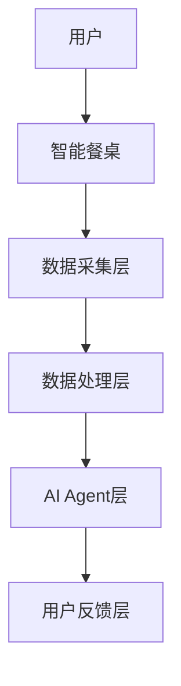

                 


# AI Agent在智能餐桌中的饮食行为矫正

## 关键词：AI Agent，智能餐桌，饮食行为矫正，行为识别，行为矫正策略，系统架构设计

## 摘要：  
本文探讨了AI Agent在智能餐桌中的应用，重点分析了如何通过AI技术矫正用户的饮食行为。从问题背景到解决方案，详细介绍了AI Agent的行为识别算法、矫正策略以及系统架构设计，最后通过实际案例展示了技术的落地应用。

---

## 第1章: 问题背景与目标

### 1.1 问题背景  
现代人由于生活节奏加快和饮食习惯的改变，肥胖、营养失衡等问题日益严重。智能餐桌作为一种新兴的饮食辅助设备，结合AI Agent技术，可以实时监测用户的饮食行为并提供矫正建议，帮助用户养成健康的饮食习惯。

### 1.2 问题描述  
- **问题一**：用户饮食行为缺乏规范，导致营养失衡或过度摄入某类食物。  
- **问题二**：传统矫正方法依赖用户自我约束，效果有限。  
- **问题三**：缺乏实时反馈机制，无法及时纠正不良饮食习惯。  

### 1.3 解决思路  
AI Agent通过实时监测用户的饮食行为，结合预设的矫正策略，提供个性化的反馈和建议，帮助用户逐步矫正不良饮食习惯。  

---

## 第2章: 核心概念解析  

### 2.1 AI Agent的定义与属性  
AI Agent是一种具备自主决策能力的智能体，能够通过感知环境、分析数据并采取行动来实现目标。其核心属性包括：  
- **智能性**：能够学习和适应用户行为。  
- **交互性**：支持多模态交互（如语音、手势）。  
- **实时性**：能够实时响应用户行为。  
- **个性化**：根据用户数据提供定制化建议。  

### 2.2 智能餐桌的功能与结构  
智能餐桌集成了多种传感器和AI技术，能够监测用户的饮食行为，包括：  
- **行为识别**：识别用户是否在用餐、摄入食物的种类和量。  
- **数据采集**：采集用户的饮食数据（如热量、营养成分）。  
- **反馈机制**：通过灯光、声音等方式给予用户反馈。  

### 2.3 饮食行为矫正的实现机制  
- **行为识别**：通过传感器和AI算法识别用户的饮食行为。  
- **矫正策略**：根据识别结果，触发相应的矫正措施（如提醒用户减少热量摄入）。  
- **反馈与优化**：根据用户的反馈不断优化矫正策略。  

---

## 第3章: AI Agent的行为矫正算法  

### 3.1 算法概述  
AI Agent的行为矫正算法基于强化学习，通过奖励机制引导用户形成良好的饮食习惯。算法的核心在于实时分析用户的饮食行为，并根据行为的偏离程度调整矫正策略。

### 3.2 算法实现  
1. **数据采集**：通过智能餐桌传感器获取用户饮食数据。  
2. **行为识别**：使用深度学习模型识别用户行为（如是否过量摄入某类食物）。  
3. **行为分析**：结合用户的历史数据，分析行为特征。  
4. **矫正策略**：根据分析结果，触发相应的矫正措施（如发出提醒）。  

### 3.3 算法的数学模型  
矫正策略的数学模型如下：  
$$ reward = r \times (1 - \frac{|\text{行为偏差}|}{\text{目标偏差}}) $$  
其中，$r$ 是奖励系数，$|\text{行为偏差}|$ 是用户行为与目标的偏差程度。  

---

## 第4章: 系统分析与架构设计  

### 4.1 问题场景  
智能餐桌需要实时监测用户的饮食行为，并通过AI Agent提供矫正建议。系统需要处理以下问题：  
- 如何高效采集和处理饮食数据？  
- 如何保证系统的实时性和稳定性？  

### 4.2 系统架构设计  
1. **数据采集层**：通过传感器采集用户的饮食数据。  
2. **数据处理层**：对采集的数据进行清洗和分析。  
3. **AI Agent层**：基于分析结果，触发矫正策略。  
4. **用户反馈层**：通过智能餐桌提供实时反馈。  

### 4.3 系统架构图  


---

## 第5章: 项目实战  

### 5.1 环境安装  
- **硬件**：智能餐桌、传感器模块。  
- **软件**：Python、TensorFlow、Keras。  

### 5.2 核心代码实现  
```python
import numpy as np
from tensorflow import keras

# 加载预训练模型
model = keras.models.load_model('behavior_model.h5')

# 数据预处理
def preprocess(data):
    # 标准化处理
    return (data - np.mean(data)) / np.std(data)

# 行为识别
def recognize_behavior(data):
    processed_data = preprocess(data)
    prediction = model.predict(processed_data)
    return np.argmax(prediction, axis=1)

# 矫正策略
def apply_correction(user_behavior, target_behavior):
    deviation = np.abs(user_behavior - target_behavior)
    correction = target_behavior - (deviation * 0.5)
    return correction
```

### 5.3 实际案例分析  
假设用户在用餐时摄入过多热量，AI Agent会触发提醒，并建议减少主食摄入量。系统会实时反馈用户的矫正行为，并记录矫正效果。

---

## 第6章: 小结  

通过本文的分析，我们可以看到AI Agent在智能餐桌中的应用潜力巨大。结合实时数据监测和智能算法，AI Agent能够有效地矫正用户的饮食行为，帮助用户养成健康的生活习惯。未来，随着技术的不断发展，AI Agent在饮食行为矫正中的应用将更加广泛和智能化。

