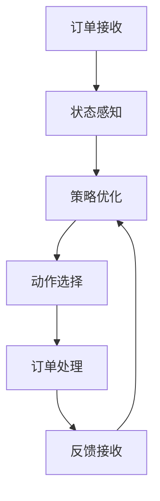
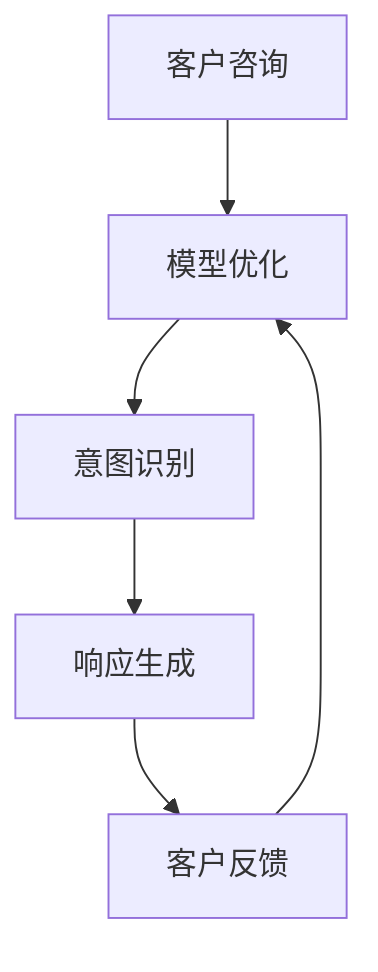
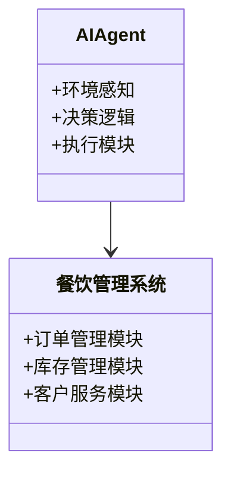
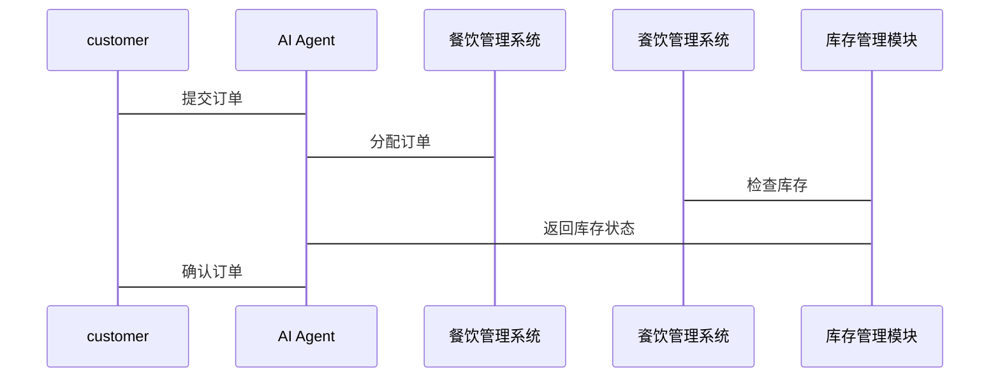

                 


# AI Agent在智能餐饮管理中的实践

> **关键词**：AI Agent, 智能餐饮管理, 多智能体系统, 强化学习, 系统架构设计, 实际案例分析

> **摘要**：随着人工智能技术的快速发展，AI Agent（智能体）在各个行业的应用越来越广泛。本文重点探讨AI Agent在智能餐饮管理中的实践，从背景介绍、核心概念、算法原理到系统架构设计，再到项目实战和最佳实践，全面解析AI Agent如何提升餐饮管理的智能化水平。通过实际案例分析，本文展示了AI Agent在餐饮管理中的巨大潜力和应用前景。

---

# 引言

在当今数字化转型的浪潮中，人工智能（AI）技术正在深刻改变各个行业的管理模式。AI Agent（智能体）作为AI技术的核心组成部分，以其自主决策、学习和适应能力，正在成为智能餐饮管理的重要工具。本文将系统地探讨AI Agent在智能餐饮管理中的应用，分析其技术原理和实际案例，为读者提供一份详尽的实践指南。

---

# 第一部分：AI Agent与智能餐饮管理的背景

## 第1章：AI Agent的基本概念与餐饮管理的结合

### 1.1 AI Agent的核心概念

AI Agent是一种能够感知环境、自主决策并执行任务的智能实体。它具备以下核心特点：
- **自主性**：能够在没有外部干预的情况下独立运作。
- **反应性**：能够实时感知环境变化并做出反应。
- **目标导向**：具有明确的目标，并能通过决策和行动实现目标。
- **学习能力**：能够通过数据和经验不断优化自身的决策能力。

### 1.2 餐饮管理的现状与挑战

传统餐饮管理面临以下痛点：
- **效率低下**：人工操作繁琐，容易出错，效率低。
- **数据孤岛**：各部门数据分散，难以实现协同管理。
- **个性化需求难以满足**：顾客需求多样化，难以提供个性化服务。
- **决策滞后**：依赖人工分析，决策周期长，难以及时应对市场变化。

### 1.3 AI Agent在餐饮管理中的应用价值

AI Agent能够帮助餐饮企业实现以下目标：
- **提升运营效率**：通过自动化处理订单、库存管理和客户预约，减少人工干预。
- **数据驱动决策**：实时分析销售数据、客户反馈和市场趋势，辅助管理层制定精准决策。
- **个性化服务**：根据顾客的偏好和历史行为，提供个性化推荐和定制化服务。
- **风险管理**：实时监控餐厅运营，及时发现并解决潜在问题，降低风险。

---

## 第2章：AI Agent在智能餐饮管理中的核心任务

### 2.1 订单管理与优化

AI Agent能够通过分析历史订单数据和当前库存情况，优化订单处理流程，减少浪费，提高订单准确性。

### 2.2 库存管理与供应链优化

AI Agent能够实时监控库存水平，预测需求变化，并与供应商协同，优化供应链管理，降低运营成本。

### 2.3 客户服务与体验优化

AI Agent可以通过自然语言处理技术（NLP）分析顾客反馈，识别顾客需求，提供个性化的服务建议，提升顾客满意度。

---

# 第二部分：AI Agent的核心技术与算法原理

## 第3章：AI Agent的核心技术

### 3.1 多智能体系统

在智能餐饮管理中，通常需要多个AI Agent协同工作，例如订单处理Agent、库存管理Agent和客户服务Agent。多智能体系统通过协作和通信，共同完成复杂的管理任务。

### 3.2 强化学习算法

强化学习是一种通过试错机制优化决策的算法。AI Agent通过与环境的交互，不断优化自身的决策策略，以实现目标函数的最大化。

### 3.3 知识表示与推理

知识表示是将问题领域中的知识转化为计算机可理解的形式，推理则是基于知识进行逻辑推导，帮助AI Agent做出合理的决策。

---

## 第4章：AI Agent的算法实现

### 4.1 基于强化学习的订单优化算法

以下是一个简单的强化学习算法流程：



### 4.2 基于监督学习的客户服务算法



---

# 第三部分：AI Agent的系统架构设计

## 第5章：系统架构设计

### 5.1 系统功能模块设计



### 5.2 系统交互流程设计



---

## 第6章：系统实现与优化

### 6.1 系统实现

以下是一个简单的Python代码示例，展示AI Agent如何优化订单处理流程：

```python
class OrderOptimizer:
    def __init__(self, inventory):
        self.inventory = inventory

    def optimize_order(self, order_items):
        # 分析库存情况
        for item in order_items:
            if self.inventory[item] < required_quantity:
                # 调整订单量
                self.inventory[item] += required_quantity
        return optimized_order
```

### 6.2 系统优化

通过机器学习模型的不断训练和优化，AI Agent能够提高决策的准确性和效率。例如，通过分析历史订单数据，优化预测模型的参数，提高预测的准确性。

---

## 第7章：项目实战与案例分析

### 7.1 项目背景

某连锁餐饮企业希望引入AI Agent技术，优化订单处理和库存管理流程。

### 7.2 项目实施

1. **需求分析**：与企业相关部门沟通，明确需求和目标。
2. **系统设计**：设计AI Agent的架构和功能模块。
3. **开发与测试**：编写代码，进行功能测试和性能优化。
4. **部署与上线**：在企业系统中部署AI Agent，进行实际应用。

### 7.3 实际案例分析

通过实际数据对比，AI Agent在订单处理效率和库存管理方面显著提升了企业的运营效率，减少了浪费，提高了客户满意度。

---

## 第8章：总结与展望

### 8.1 本章总结

本文详细探讨了AI Agent在智能餐饮管理中的应用，从技术原理到系统架构设计，再到实际案例分析，全面展示了AI Agent在餐饮管理中的巨大潜力。

### 8.2 未来展望

随着AI技术的不断进步，AI Agent在餐饮管理中的应用将更加广泛和深入。未来，可以通过引入更多先进的技术，如区块链和物联网，进一步提升AI Agent的能力和应用范围。

---

# 第四部分：最佳实践与注意事项

## 第9章：最佳实践

### 9.1 项目实施的关键点

- **明确目标**：确保项目目标清晰，避免偏离方向。
- **数据质量**：数据是AI Agent的核心，确保数据的准确性和完整性。
- **系统集成**：AI Agent需要与现有系统无缝集成，确保兼容性和稳定性。

### 9.2 项目实施中的注意事项

- **团队协作**：AI Agent的开发需要跨学科团队的协作，包括数据科学家、软件工程师和业务专家。
- **持续优化**：AI Agent需要不断学习和优化，保持其决策能力的先进性。
- **风险管理**：制定完善的风险管理策略，确保系统运行的稳定性和安全性。

---

## 第10章：总结

AI Agent作为人工智能技术的重要组成部分，正在改变餐饮管理的模式。通过本文的探讨，我们可以看到，AI Agent在提升运营效率、优化决策和提供个性化服务方面具有显著优势。未来，随着技术的不断发展，AI Agent在智能餐饮管理中的应用将更加广泛和深入，为企业创造更大的价值。

---

**关键词**：AI Agent, 智能餐饮管理, 多智能体系统, 强化学习, 系统架构设计, 实际案例分析

**摘要**：本文详细探讨了AI Agent在智能餐饮管理中的实践，从技术原理到系统架构设计，再到实际案例分析，全面展示了AI Agent在餐饮管理中的巨大潜力和应用前景。

