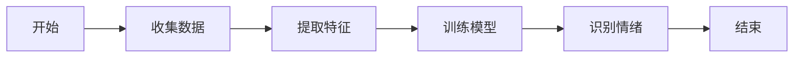

                 


# AI Agent在智能香薰机中的情绪管理助手

## 关键词：
AI Agent，智能香薰机，情绪管理，情感计算，物联网

## 摘要：
本文探讨了AI Agent在智能香薰机中的情绪管理应用，详细分析了情绪识别、香薰推荐等算法，结合系统架构设计和项目实战，展示了AI技术如何提升用户体验。

---

## 第一部分：背景介绍

### 第1章：问题背景与描述

#### 1.1 问题背景
- **情绪管理的重要性**：情绪影响健康和生活质量，通过智能设备调节情绪日益重要。
- **智能香薰机的现状**：传统香薰机仅能固定模式释放香气，缺乏个性化。
- **AI Agent的应用前景**：利用AI技术实现智能化、个性化的情绪管理。

#### 1.2 问题描述
- **用户情绪识别的挑战**：情绪复杂多样，数据收集和分析困难。
- **智能香薰机功能局限**：无法根据情绪变化调整香薰方案。
- **情绪管理助手的必要性**：提供实时反馈和个性化建议。

#### 1.3 问题解决思路
- **AI Agent的引入**：通过机器学习算法实时分析用户情绪。
- **系统架构设计**：构建用户数据采集、情绪分析、香薰推荐模块。

#### 1.4 边界与外延
- **系统边界**：仅关注情绪管理和香薰推荐，不涉及其他功能。
- **情绪管理范围**：主要处理基本情绪，如快乐、放松、专注。

#### 1.5 核心要素与组成
- **AI Agent**：负责数据处理和决策。
- **智能香薰机**：执行香薰方案。
- **情绪数据库**：存储用户情绪数据。

---

## 第二部分：核心概念与联系

### 第2章：AI Agent与智能香薰机的核心概念

#### 2.1 核心概念原理
- **AI Agent**：通过机器学习模型分析用户情绪。
- **智能香薰机**：根据AI Agent的指令释放特定香薰。

#### 2.2 概念属性特征对比

| 特性         | AI Agent                   | 智能香薰机                 |
|--------------|-----------------------------|-----------------------------|
| 功能         | 数据分析与决策             | 执行香薰方案               |
| 输入         | 用户情绪数据               | AI指令                     |
| 输出         | 香薰推荐方案               | 香薰释放                   |

#### 2.3 ER实体关系图
```mermaid
erDiagram
    user {
        id
        name
        emotion_data
    }
    device {
        id
        type
        status
    }
    agent {
        id
        emotion_model
    }
    user --> agent: 提供情绪数据
    agent --> device: 发出香薰指令
    device --> user: 释放香气
```

---

## 第三部分：算法原理讲解

### 第3章：情绪识别与香薰推荐算法

#### 3.1 情绪识别算法
- **数据收集**：通过传感器收集用户生理数据（如心率、皮肤温度）。
- **特征提取**：提取有效特征，如心率变异性。
- **模型训练**：使用随机森林分类器训练情绪识别模型。



#### 3.2 香薰推荐算法
- **数据预处理**：标准化处理用户数据。
- **模型训练**：使用协同过滤推荐系统。
- **推荐结果**：输出香薰方案。

#### 3.3 数学模型与公式
- **情绪评分模型**：
  $$ \text{score} = w_1 \times \text{heart_rate} + w_2 \times \text{skin_temp} $$
- **权重系数计算**：
  $$ w_1 = 0.6, w_2 = 0.4 $$

---

## 第四部分：系统分析与架构设计

### 第4章：系统架构设计

#### 4.1 项目背景
- **目标**：实现智能化情绪管理。
- **用户需求**：个性化香薰推荐。

#### 4.2 系统功能设计
- **用户数据采集**：通过传感器收集数据。
- **情绪分析**：识别用户情绪。
- **香薰推荐**：生成推荐方案。

#### 4.3 系统架构图


---

## 第五部分：项目实战

### 第5章：环境安装与代码实现

#### 5.1 环境安装
- **Python 3.8+**
- **库依赖**：numpy、scikit-learn、pandas。

#### 5.2 核心代码实现
```python
import numpy as np
from sklearn.ensemble import RandomForestClassifier

# 数据预处理
def preprocess(data):
    # 标准化处理
    return (data - np.mean(data)) / np.std(data)

# 情绪识别模型
class EmotionRecognizer:
    def __init__(self):
        self.model = RandomForestClassifier()

    def train(self, X, y):
        self.model.fit(X, y)

    def predict(self, X):
        return self.model.predict(X)

# 香薰推荐系统
class FragranceRecommender:
    def __init__(self):
        pass

    def recommend(self, user_data):
        # 简单的推荐逻辑
        return "薰衣草" if user_data['emotion'] == '放松' else "柑橘"
```

---

## 第六部分：最佳实践

### 第6章：小结与注意事项

#### 6.1 小结
- **技术实现**：AI Agent通过分析用户数据，实现智能化情绪管理。
- **系统优势**：提升用户体验，提供个性化服务。

#### 6.2 注意事项
- **数据隐私**：确保用户数据安全。
- **模型优化**：持续优化算法，提升准确性。

#### 6.3 拓展阅读
- **推荐书籍**：《机器学习实战》。
- **相关论文**：《基于AI的情绪计算研究》。

---

通过以上详细分析，本文全面介绍了AI Agent在智能香薰机中的情绪管理应用，从技术原理到系统实现，为读者提供了深入的指导。

