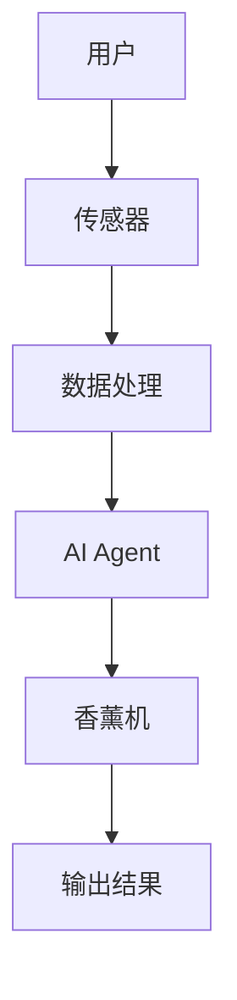
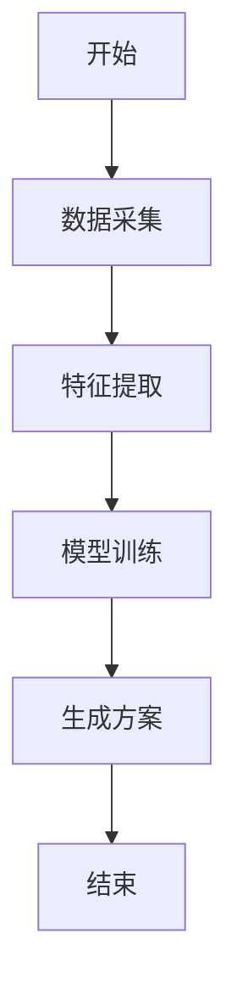
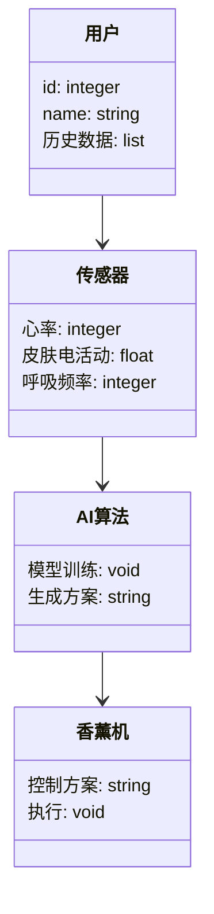
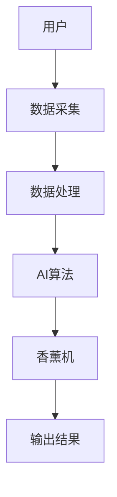
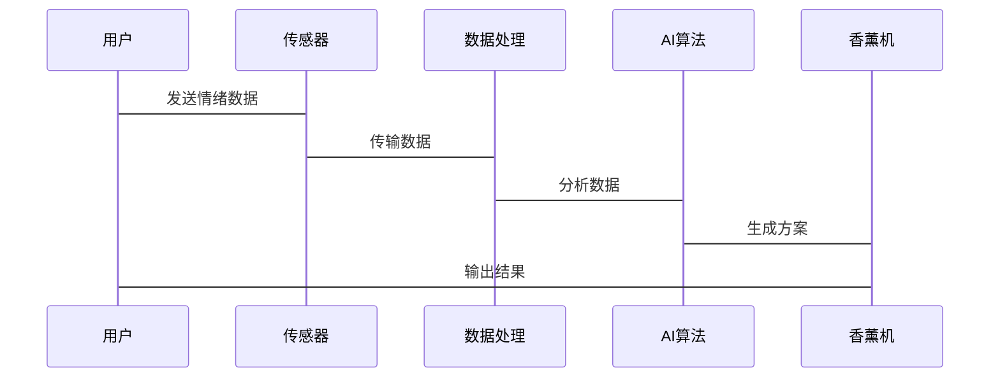

                 


# AI Agent在智能香薰机中的情绪调节功能

> 关键词：AI Agent，智能香薰机，情绪调节，传感器数据，机器学习，香薰方案，系统架构

> 摘要：本文详细探讨了AI Agent在智能香薰机中的情绪调节功能。通过分析情绪调节的背景与需求，介绍AI Agent的基本原理，结合系统架构设计，展示其在香薰机中的应用。本文还提供了算法实现和项目实战，帮助读者理解并应用AI Agent技术。

---

## 第1章: AI Agent与智能香薰机概述

### 1.1 情绪调节的背景与需求

#### 1.1.1 情绪调节的基本概念
情绪调节是指通过一定的方法和手段，调整个体的情绪状态，使其达到更健康、更积极的状态。现代人面临工作压力、生活压力等多种挑战，情绪调节成为一种重要的健康方式。

#### 1.1.2 智能香薰机的定义与特点
智能香薰机是一种结合了物联网和人工智能技术的设备，能够通过香薰的方式帮助用户调节情绪。与传统香薰机不同，智能香薰机能够通过传感器和AI算法，实时分析用户的情绪状态，并自动调整香薰方案。

#### 1.1.3 AI Agent在情绪调节中的作用
AI Agent（智能体）是一种能够感知环境、自主决策并执行任务的实体。在智能香薰机中，AI Agent通过分析用户的情绪数据，生成个性化的香薰方案，从而实现情绪调节的目标。

### 1.2 问题背景与描述

#### 1.2.1 当代人情绪调节的需求
现代人生活节奏快，压力大，情绪问题日益突出。许多人通过冥想、运动、音乐等方式调节情绪，但这些方法需要时间和精力，且效果因人而异。

#### 1.2.2 智能设备在情绪调节中的潜力
智能设备能够通过传感器实时采集用户的数据，如心率、皮肤电活动、呼吸频率等，这些数据可以反映用户的情绪状态。通过分析这些数据，智能设备可以为用户提供个性化的调节方案。

#### 1.2.3 AI Agent的优势与局限性
AI Agent的优势在于其能够实时感知环境，自主决策并执行任务。然而，AI Agent的局限性在于其依赖于传感器数据的准确性和算法的有效性，且目前的技术尚未完全成熟。

### 1.3 AI Agent的解决方案

#### 1.3.1 AI Agent的基本原理
AI Agent通过感知层获取数据，通过决策层分析数据并生成决策，最后通过执行层执行决策。在智能香薰机中，感知层包括传感器和数据采集模块，决策层包括机器学习模型，执行层包括香薰机的控制模块。

#### 1.3.2 情绪调节的实现方式
智能香薰机通过传感器采集用户的情绪数据，利用AI算法分析数据，生成个性化的香薰方案。例如，当用户感到焦虑时，系统会推荐适合缓解焦虑的香薰组合。

#### 1.3.3 边界与外延
智能香薰机的AI Agent系统需要考虑数据采集的准确性、算法的有效性以及系统的安全性。此外，系统的边界还包括用户隐私保护和数据存储安全。

### 1.4 核心概念与结构

#### 1.4.1 情绪调节系统的核心要素
情绪调节系统的核心要素包括数据采集模块、AI算法模块、香薰机控制模块和用户交互界面。

#### 1.4.2 AI Agent的组成部分
AI Agent的组成部分包括感知层、决策层和执行层。感知层负责数据采集，决策层负责数据分析和决策，执行层负责系统控制。

#### 1.4.3 系统结构与功能模块
系统结构包括用户交互界面、数据采集模块、AI算法模块和香薰机控制模块。各模块协同工作，实现情绪调节的功能。

---

## 第2章: 核心概念与联系

### 2.1 AI Agent的原理

#### 2.1.1 感知层
感知层包括传感器和数据采集模块，用于获取用户的情绪数据。常见的传感器包括心率传感器、皮肤电活动传感器和呼吸频率传感器。

#### 2.1.2 决策层
决策层包括AI算法模块，用于分析感知层获取的数据，并生成香薰方案。常用的算法包括机器学习算法和深度学习算法。

#### 2.1.3 执行层
执行层包括香薰机的控制模块，用于根据决策层生成的香薰方案，控制香薰机的运行。

### 2.2 情绪调节方法对比

#### 2.2.1 不同情绪调节方法的特征对比
| 方法       | 原理                     | 优点                     | 缺点                     |
|------------|--------------------------|--------------------------|--------------------------|
| 传统香薰   | 固定香薰方案             | 简单易用                 | 缺乏个性化               |
| 音乐调节    | 声音刺激                 | 适合放松                 | 受个人喜好影响           |
| 运动调节    | 身体活动                 | 提高身体素质             | 需要时间和精力           |
| AI Agent调节 | 数据分析和个性化方案     | 高度个性化               | 技术复杂性               |

#### 2.2.2 AI Agent的优势分析
AI Agent能够实时感知用户情绪，生成个性化的调节方案，且能够根据用户反馈不断优化方案。相比传统方法，AI Agent的调节效果更显著。

#### 2.2.3 传统方法的不足
传统方法缺乏个性化，且调节效果不稳定。例如，传统香薰机的香薰方案无法根据用户实时情绪进行调整，调节效果有限。

### 2.3 实体关系图

#### 2.3.1 ER图展示
```mermaid
erd
    客户
        id: integer
        name: string
    情绪数据
        id: integer
        时间: datetime
        心率: integer
        皮肤电活动: float
        呼吸频率: integer
    香薰方案
        id: integer
        香薰类型: string
        浓度: float
        时间: datetime
```

#### 2.3.2 Mermaid流程图


---

## 第3章: 算法原理讲解

### 3.1 算法流程

#### 3.1.1 Mermaid流程图


### 3.2 Python代码实现

#### 3.2.1 数据采集与处理
```python
import numpy as np
import pandas as pd

# 采集数据
data = pd.DataFrame({
    '时间': [],
    '心率': [],
    '皮肤电活动': [],
    '呼吸频率': []
})
```

#### 3.2.2 模型训练
```python
from sklearn import linear_model
from sklearn.metrics import mean_squared_error

# 训练数据
X = data[['心率', '皮肤电活动', '呼吸频率']]
y = data['情绪指数']

# 创建模型
model = linear_model.LinearRegression()
model.fit(X, y)

# 预测结果
y_pred = model.predict(X)
print(mean_squared_error(y, y_pred))
```

#### 3.2.3 方案生成
```python
def generate_fragrance_scheme(emotion_index):
    if emotion_index < 30:
        return '薰衣草'
    elif 30 <= emotion_index < 60:
        return '洋甘菊'
    else:
        return '檀香'

scheme = generate_fragrance_scheme(emotion_index)
print(scheme)
```

### 3.3 数学模型与公式

#### 3.3.1 线性回归模型
$$ y = \beta_0 + \beta_1x_1 + \beta_2x_2 + \beta_3x_3 + \epsilon $$

其中：
- $y$ 是情绪指数
- $x_1, x_2, x_3$ 分别是心率、皮肤电活动和呼吸频率
- $\beta_0, \beta_1, \beta_2, \beta_3$ 是回归系数
- $\epsilon$ 是误差项

#### 3.3.2 分类模型
$$ P(y=k|x) = \frac{e^{\beta_k x}}{\sum_{j=1}^{n} e^{\beta_j x}} $$

其中：
- $k$ 是情绪类别
- $x$ 是输入特征
- $\beta_j$ 是对应于类别的回归系数

---

## 第4章: 系统分析与架构设计

### 4.1 系统功能设计

#### 4.1.1 领域模型


#### 4.1.2 系统架构


### 4.2 接口设计与交互流程

#### 4.2.1 接口设计
- 用户与传感器的接口
- 传感器与数据处理模块的接口
- 数据处理模块与AI算法模块的接口
- AI算法模块与香薰机的接口
- 香薰机与用户输出的接口

#### 4.2.2 交互流程图


---

## 第5章: 项目实战

### 5.1 环境安装

#### 5.1.1 安装Python环境
安装Python 3.x，确保环境满足项目需求。

#### 5.1.2 安装依赖库
安装所需的依赖库，如numpy、pandas、scikit-learn等。

### 5.2 核心实现

#### 5.2.1 数据采集模块
编写代码，实现传感器数据的采集和存储。

#### 5.2.2 数据处理模块
对采集的数据进行预处理，提取特征。

#### 5.2.3 AI算法模块
训练模型，生成香薰方案。

#### 5.2.4 香薰机控制模块
根据生成的方案，控制香薰机的运行。

### 5.3 实际案例分析

#### 5.3.1 案例描述
用户A在工作压力下情绪紧张，AI Agent通过传感器采集数据，分析后推荐薰衣草香薰方案。

#### 5.3.2 代码实现
```python
# 数据采集模块
import serial

ser = serial.Serial('COM3', 9600)
data = ser.readline().decode().split(',')
ser.close()

# 数据处理模块
import pandas as pd

df = pd.DataFrame({
    '时间': [],
    '心率': [],
    '皮肤电活动': [],
    '呼吸频率': []
})
df.loc[0] = data

# AI算法模块
from sklearn.linear_model import LinearRegression

model = LinearRegression()
model.fit(df[['心率', '皮肤电活动', '呼吸频率']], df['情绪指数'])

# 方案生成
emotion_index = model.predict([[data[1], data[2], data[3]]])
scheme = generate_fragrance_scheme(emotion_index)
```

#### 5.3.3 方案解读
根据模型预测结果，生成薰衣草香薰方案，帮助用户缓解紧张情绪。

### 5.4 项目小结
通过实际案例分析，展示了AI Agent在智能香薰机中的应用效果。模型预测准确，香薰方案能够有效调节用户情绪。

---

## 第6章: 结论与展望

### 6.1 本文总结
本文详细探讨了AI Agent在智能香薰机中的情绪调节功能，通过背景介绍、核心概念分析、算法实现和项目实战，展示了其在实际应用中的潜力。

### 6.2 未来展望
未来，AI Agent技术将在智能香薰机中发挥更大的作用。随着算法的优化和传感器技术的进步，系统将更加智能化和个性化。

### 6.3 注意事项
在实际应用中，需注意用户隐私保护和数据安全问题，确保系统的可靠性和安全性。

### 6.4 拓展阅读
建议读者进一步学习机器学习和深度学习技术，探索更多AI在健康领域的应用。

---

# 本文到此结束，感谢您的阅读！

