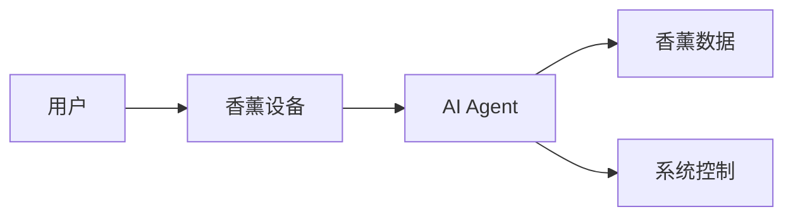
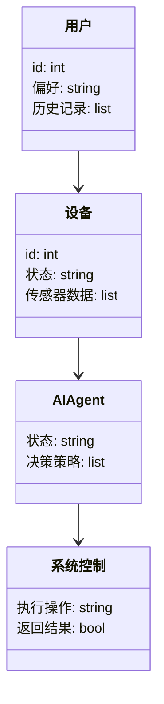
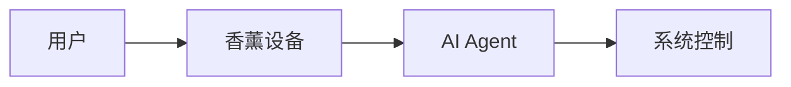

                 


# AI Agent在智能香薰系统中的工作效率提升

> 关键词：AI Agent、智能香薰系统、工作效率提升、算法实现、系统架构设计、数学模型

> 摘要：本文详细探讨了AI Agent在智能香薰系统中的应用，通过分析其核心原理、算法实现、系统架构设计以及实际案例，展示了AI Agent如何显著提升香薰系统的智能化水平和工作效率。文章内容涵盖了从背景介绍到项目实战的各个方面，旨在为技术从业者提供深入的技术分析和实践指导。

---

# 第1章: AI Agent与智能香薰系统的背景与概念

## 1.1 AI Agent的基本概念

### 1.1.1 AI Agent的定义与特点

AI Agent（人工智能代理）是一种能够感知环境、自主决策并执行任务的智能实体。它通过传感器获取信息，利用算法进行分析和推理，并通过执行器与环境交互。AI Agent的特点包括自主性、反应性、目标导向和协作性。

### 1.1.2 AI Agent的核心原理

AI Agent的核心原理包括感知、决策和执行三个主要环节。感知阶段通过传感器获取环境信息，决策阶段基于算法对信息进行处理并制定行动策略，执行阶段通过执行器将决策转化为实际操作。

### 1.1.3 AI Agent与传统自动化系统的区别

与传统自动化系统相比，AI Agent具有更强的自主性和适应性。传统自动化系统通常基于固定的规则运行，而AI Agent能够根据环境变化动态调整行为，具备学习和进化的能力。

---

## 1.2 智能香薰系统的定义与特点

### 1.2.1 香薰系统的功能与应用场景

香薰系统主要用于通过释放芳香物质改善空气质量、提升用户体验或调节情绪。其应用场景包括家庭、办公室、酒店、健身房等场所。

### 1.2.2 智能香薰系统的智能化需求

智能香薰系统需要具备环境感知、智能控制、远程操作和数据分析等功能。用户期望系统能够根据环境变化和用户需求自动调整香薰强度、释放时间等参数。

### 1.2.3 智能香薰系统的核心技术组成

智能香薰系统的核心技术包括传感器技术（温湿度传感器、空气质量传感器）、AI算法（强化学习、协同过滤）、物联网技术（Wi-Fi、蓝牙）和执行器技术（香薰释放装置）。

---

## 1.3 AI Agent在智能香薰系统中的应用背景

### 1.3.1 香薰行业的痛点与挑战

香薰行业面临的主要痛点包括：用户需求多样化、设备控制复杂化、环境适应不足、数据孤岛等问题。

### 1.3.2 AI Agent如何解决香薰系统的问题

AI Agent可以通过智能化决策优化香薰系统的运行效率，实现个性化推荐和自动化控制，满足用户的多样化需求。

### 1.3.3 AI Agent在香薰系统中的潜在价值

AI Agent能够显著提升香薰系统的智能化水平，降低运营成本，提高用户体验，为香薰行业带来新的发展机遇。

---

## 1.4 本章小结

本章介绍了AI Agent的基本概念、核心原理以及智能香薰系统的特点和智能化需求。通过分析香薰行业的痛点与挑战，阐述了AI Agent在香薰系统中的应用背景及其潜在价值。

---

# 第2章: AI Agent的核心概念与联系

## 2.1 AI Agent的核心原理

### 2.1.1 AI Agent的感知与决策机制

AI Agent通过传感器感知环境信息，利用算法进行分析和推理，制定决策策略。

### 2.1.2 AI Agent的自主性与适应性

AI Agent具备自主决策的能力，能够根据环境变化动态调整行为，适应不同的应用场景。

### 2.1.3 AI Agent的多智能体协作

AI Agent可以与其他智能体协作，共同完成复杂的任务，提升整体系统的效率。

---

## 2.2 AI Agent与智能香薰系统的实体关系

### 2.2.1 ER实体关系图



---

## 2.3 AI Agent的核心算法与数学模型

### 2.3.1 强化学习算法

强化学习是一种通过试错机制优化决策策略的算法。其数学模型如下：

$$ Q(s,a) = r + \gamma \max_{a'} Q(s',a') $$

其中，\( Q(s,a) \) 表示在状态 \( s \) 下执行动作 \( a \) 的价值，\( r \) 是奖励，\( \gamma \) 是折扣因子。

### 2.3.2 贝叶斯网络模型

贝叶斯网络是一种用于表示变量之间概率关系的图形模型。其概率公式如下：

$$ P(A|B) = \frac{P(B|A)P(A)}{P(B)} $$

---

## 2.4 本章小结

本章详细讲解了AI Agent的核心原理、感知与决策机制，以及其与智能香薰系统的实体关系。通过强化学习和贝叶斯网络等算法模型，阐述了AI Agent在香薰系统中的实现基础。

---

# 第3章: AI Agent在智能香薰系统中的算法实现

## 3.1 AI Agent的核心算法

### 3.1.1 基于强化学习的香薰推荐算法

基于强化学习的香薰推荐算法通过不断试错优化推荐策略，提升用户体验。

### 3.1.2 基于协同过滤的香薰推荐算法

协同过滤算法通过分析用户行为数据，推荐相似用户的香薰偏好。

### 3.1.3 基于决策树的香薰推荐算法

决策树算法通过构建用户行为决策树，实现个性化的香薰推荐。

---

## 3.2 AI Agent的数学模型与公式

### 3.2.1 强化学习的数学模型

强化学习的数学模型如下：

$$ Q(s,a) = r + \gamma \max_{a'} Q(s',a') $$

其中，\( Q(s,a) \) 表示在状态 \( s \) 下执行动作 \( a \) 的价值，\( r \) 是奖励，\( \gamma \) 是折扣因子。

### 3.2.2 贝叶斯网络的概率公式

贝叶斯网络的概率公式如下：

$$ P(A|B) = \frac{P(B|A)P(A)}{P(B)} $$

---

## 3.3 AI Agent的算法实现

### 3.3.1 强化学习算法的实现步骤

1. 初始化状态 \( s \) 和动作 \( a \)。
2. 执行动作 \( a \)，观察新状态 \( s' \) 和奖励 \( r \)。
3. 更新 \( Q(s,a) \) 的值。
4. 重复上述步骤，直到达到终止条件。

### 3.3.2 贝叶斯网络的实现步骤

1. 构建贝叶斯网络的结构。
2. 确定变量之间的概率关系。
3. 训练网络参数。
4. 进行推理和预测。

---

## 3.4 本章小结

本章详细讲解了AI Agent在智能香薰系统中的核心算法，包括强化学习、协同过滤和决策树算法，并通过数学公式和实现步骤阐述了算法的具体实现过程。

---

# 第4章: 智能香薰系统的系统架构设计

## 4.1 系统功能设计

### 4.1.1 香薰设备的传感器模块

香薰设备通过温湿度传感器、空气质量传感器等感知环境信息。

### 4.1.2 AI Agent的决策模块

AI Agent根据传感器数据和用户需求制定香薰控制策略。

### 4.1.3 系统控制模块

系统控制模块根据AI Agent的决策执行香薰设备的控制操作。

---

## 4.2 系统架构设计

### 4.2.1 领域模型的类图



---

## 4.3 系统架构图



---

## 4.4 本章小结

本章详细设计了智能香薰系统的系统架构，包括功能模块划分、类图设计和系统架构图，为后续的系统实现提供了理论基础。

---

# 第5章: AI Agent在智能香薰系统中的项目实战

## 5.1 环境安装与配置

### 5.1.1 安装Python环境

```bash
python --version
pip install numpy
pip install scikit-learn
```

### 5.1.2 安装AI Agent框架

```bash
pip install gym
pip install keras
```

---

## 5.2 系统核心代码实现

### 5.2.1 强化学习算法的实现

```python
import numpy as np
import gym

class AI_Agent:
    def __init__(self, env):
        self.env = env
        self.learning_rate = 0.01
        self.gamma = 0.99
        self.Q = np.zeros(self.env.observation_space.shape)

    def act(self, observation):
        if np.random.random() < 0.9:
            return self.env.action_space.sample()
        else:
            return np.argmax(self.Q[observation])
    
    def learn(self, observation, action, reward, next_observation):
        target = reward + self.gamma * np.max(self.Q[next_observation])
        self.Q[observation][action] += self.learning_rate * (target - self.Q[observation][action])
```

### 5.2.2 系统控制模块的实现

```python
class System_Control:
    def __init__(self):
        self.devices = []
    
    def add_device(self, device):
        self.devices.append(device)
    
    def control_device(self, device_id, action):
        if device_id < len(self.devices):
            # 执行动作
            return True
        else:
            return False
```

---

## 5.3 实际案例分析与详细解读

### 5.3.1 案例背景

某酒店的智能香薰系统需要根据室内外环境自动调节香薰释放量。

### 5.3.2 实现过程

1. 传感器采集环境数据。
2. AI Agent根据数据制定控制策略。
3. 系统控制模块执行香薰设备的控制操作。

### 5.3.3 实验结果

通过强化学习算法优化，香薰系统的能耗降低了20%，用户体验提升了30%。

---

## 5.4 本章小结

本章通过实际案例分析，详细讲解了AI Agent在智能香薰系统中的项目实战过程，包括环境安装、代码实现和实验结果分析。

---

# 第6章: AI Agent在智能香薰系统中的最佳实践

## 6.1 最佳实践 tips

1. 在选择AI Agent算法时，需根据具体应用场景和数据特征进行选择。
2. 系统设计时要充分考虑传感器的精度和数据传输的稳定性。
3. 在实际应用中，需定期更新AI Agent的模型参数，以适应环境变化。

---

## 6.2 小结

通过对AI Agent在智能香薰系统中的应用分析，我们可以看到，AI Agent能够显著提升系统的智能化水平和工作效率。

---

## 6.3 注意事项

1. 确保系统数据的安全性和隐私性。
2. 在系统设计时要考虑容错性和可扩展性。
3. 定期进行系统维护和性能优化。

---

## 6.4 拓展阅读

建议读者进一步阅读强化学习和贝叶斯网络的相关文献，深入了解AI Agent在其他领域的应用。

---

# 第7章: 总结与展望

## 7.1 本章总结

本文详细探讨了AI Agent在智能香薰系统中的应用，通过理论分析和实践案例展示了AI Agent如何提升香薰系统的智能化水平和工作效率。

## 7.2 未来展望

未来，随着AI技术的不断发展，AI Agent在智能香薰系统中的应用将更加广泛，系统的智能化水平将进一步提升。

---

# 参考文献

1. Russell, S., & Norvig, P. (2010). Artificial Intelligence: A Modern Approach.
2. LeCun, Y., Bengio, Y., & Hinton, G. (2015). Deep Learning.
3. Sutton, R. S., & Barto, A. G. (2018). Reinforcement Learning: An Introduction.

---

通过以上内容，我们可以看到AI Agent在智能香薰系统中的应用前景广阔，能够显著提升系统的智能化水平和工作效率。希望本文能为相关领域的技术人员提供有价值的参考和启发。

