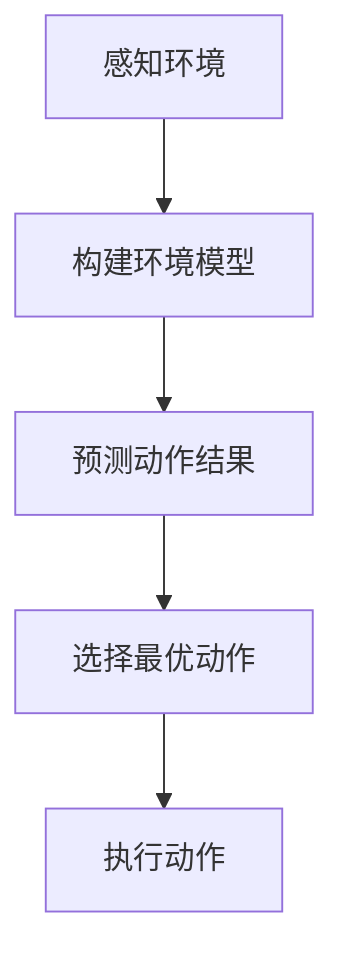
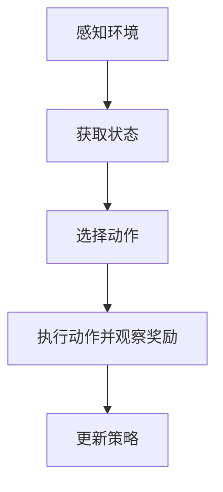
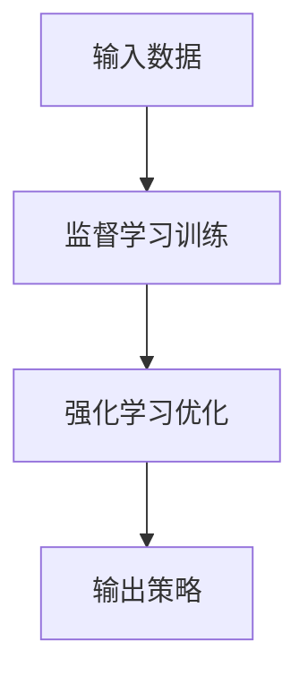
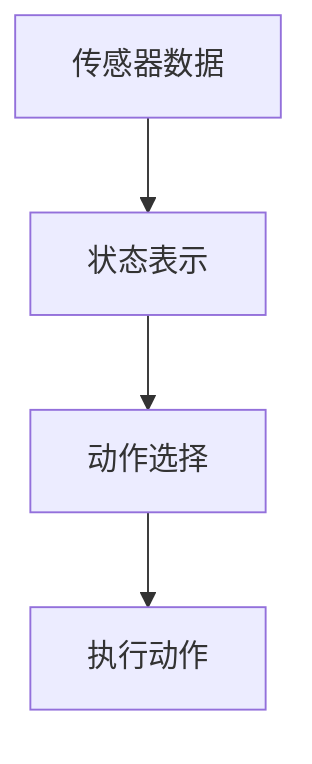
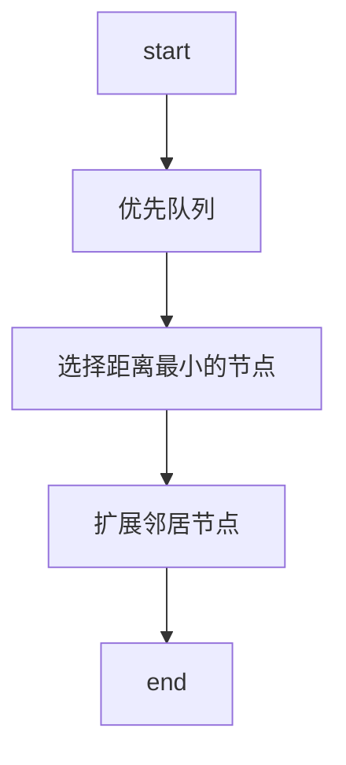
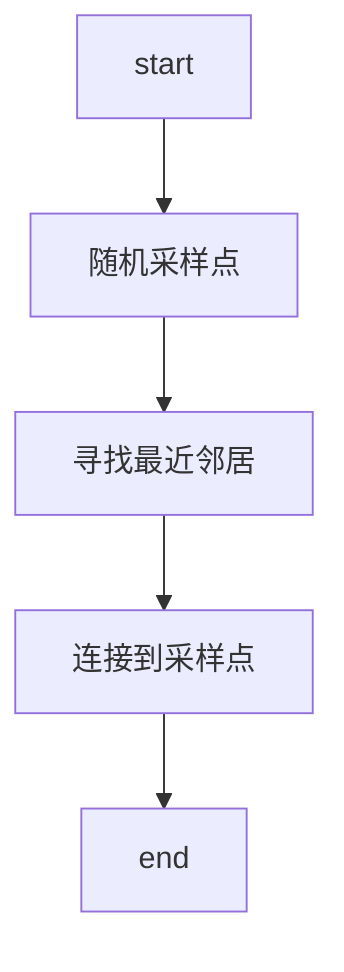

                 


# AI Agent在机器人控制中的应用：自主导航与任务执行

> 关键词：AI Agent, 机器人控制, 自主导航, 任务执行, 强化学习, 多智能体协作

> 摘要：本文深入探讨了AI Agent在机器人控制中的应用，重点分析了自主导航与任务执行的核心技术。通过详细讲解AI Agent的基本概念、导航算法、任务分解方法、系统架构设计以及实际项目案例，展示了如何利用AI技术实现机器人自主控制。本文旨在为机器人开发人员和AI研究人员提供理论与实践相结合的指导。

---

# 第1章: AI Agent的基本概念与问题背景

## 1.1 AI Agent的定义与特点

### 1.1.1 AI Agent的定义

AI Agent（人工智能代理）是指能够感知环境、自主决策并执行任务的智能实体。它能够根据环境信息做出决策，并通过执行动作与环境互动。AI Agent的核心目标是帮助机器人或其他智能系统实现自主性、反应性和适应性。

### 1.1.2 AI Agent的核心特点

| 特性 | 描述 |
|------|------|
| 自主性 | 能够自主决策，无需外部干预 |
| 反应性 | 能够实时感知环境并做出反应 |
| 适应性 | 能够根据环境变化调整行为 |
| 学习性 | 能够通过经验改进性能 |

### 1.1.3 AI Agent与传统控制方法的区别

| 对比维度 | 传统控制方法 | AI Agent |
|----------|---------------|----------|
| 决策方式 | 基于预设规则 | 基于学习与推理 |
| 环境适应 | 固定场景 | 适应动态环境 |
| 复杂性   | 简单任务 | 复杂任务 |

## 1.2 问题背景与应用前景

### 1.2.1 自主机器人控制的挑战

- 复杂环境中的路径规划
- 动态障碍物的避让
- 多目标任务的协调
- 不确定性环境的适应

### 1.2.2 AI Agent在机器人控制中的优势

- 提高任务执行的自主性
- 增强环境适应能力
- 优化资源利用率
- 提高任务执行的效率

### 1.2.3 应用场景与未来趋势

- 工业自动化
- 服务机器人
- 医疗机器人
- 智能交通系统
- 智能家居

## 1.3 本书结构与内容概述

- 第1章：AI Agent的基本概念与问题背景
- 第2章：AI Agent的核心概念与原理
- 第3章：自主导航的基础算法与实现
- 第4章：任务执行的基础与方法
- 第5章：AI Agent的核心算法与实现
- 第6章：系统架构与设计
- 第7章：项目实战与案例分析
- 第8章：优化与扩展

---

# 第2章: AI Agent的核心概念与原理

## 2.1 AI Agent的核心原理

### 2.1.1 基于模型的AI Agent

基于模型的AI Agent通过建立环境模型进行决策。其核心步骤如下：



### 2.1.2 基于模型-free的AI Agent

基于模型-free的AI Agent直接通过试错学习优化策略，核心步骤如下：



### 2.1.3 强化学习与监督学习的结合

通过强化学习（RL）和监督学习（SL）的结合，可以提高AI Agent的决策能力。以下是一个简单的结合流程：



数学公式：
- 监督学习损失函数：$$ L = \frac{1}{n}\sum_{i=1}^{n}(y_i - \hat{y_i})^2 $$
- 强化学习奖励函数：$$ R(s, a) = r $$

## 2.2 AI Agent的感知与决策

### 2.2.1 感知模块的作用

- 传感器数据处理
- 环境建模
- 数据融合

### 2.2.2 决策模块的原理

- 状态表示
- 动作选择
- 策略优化

### 2.2.3 感知与决策的协同工作



---

# 第3章: 自主导航的基础算法与实现

## 3.1 自主导航的基本概念

- 定义：机器人在未知或部分已知环境中，通过传感器数据进行路径规划和导航。
- 核心问题：如何在动态环境中找到一条避开障碍物的路径。
- 应用场景：物流配送、服务机器人、自动驾驶。

## 3.2 常见的导航算法

### 3.2.1 基于Dijkstra算法的路径规划

Dijkstra算法用于寻找起点到终点的最短路径，适用于静态环境。



数学公式：
- 距离计算：$$ d = d_{source} + \text{权重} $$

### 3.2.2 A*算法的实现与优化

A*算法结合了Dijkstra和贪心算法，通过启发式函数优化路径搜索。

```mermaid
graph TD
    A[start] --> B[优先队列]
    B --> C[选择f(n)最小的节点]
    C --> D[扩展邻居节点]
    D --> E[end]
```

启发式函数：$$ h(n) = \text{曼哈顿距离或欧几里得距离} $$

### 3.2.3 RRT算法的应用与特点

RRT（Rapidly-exploring Random Tree）算法适用于高维或动态环境。



## 3.3 自主导航的传感器与定位

### 3.3.1 传感器的作用

- 激光雷达（LiDAR）
- 摄像头（视觉传感器）
- 超声波传感器
- IMU（惯性测量单元）

### 3.3.2 定位与建模

- SLAM（同步定位与地图构建）
- 基于概率的定位方法
- 地图表示（网格地图、概率地图）

---

通过以上章节的详细讲解，我们可以看到AI Agent在机器人控制中的应用涉及多个方面，从基本概念到算法实现，再到系统设计和项目实战，每一部分都需要深入理解和实践。接下来，我将结合具体的案例和代码实现，进一步探讨AI Agent在自主导航和任务执行中的实际应用。

