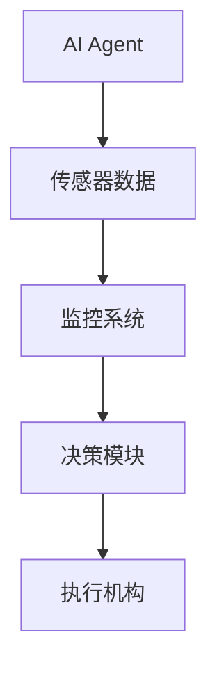
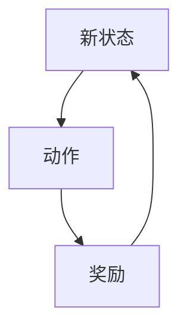
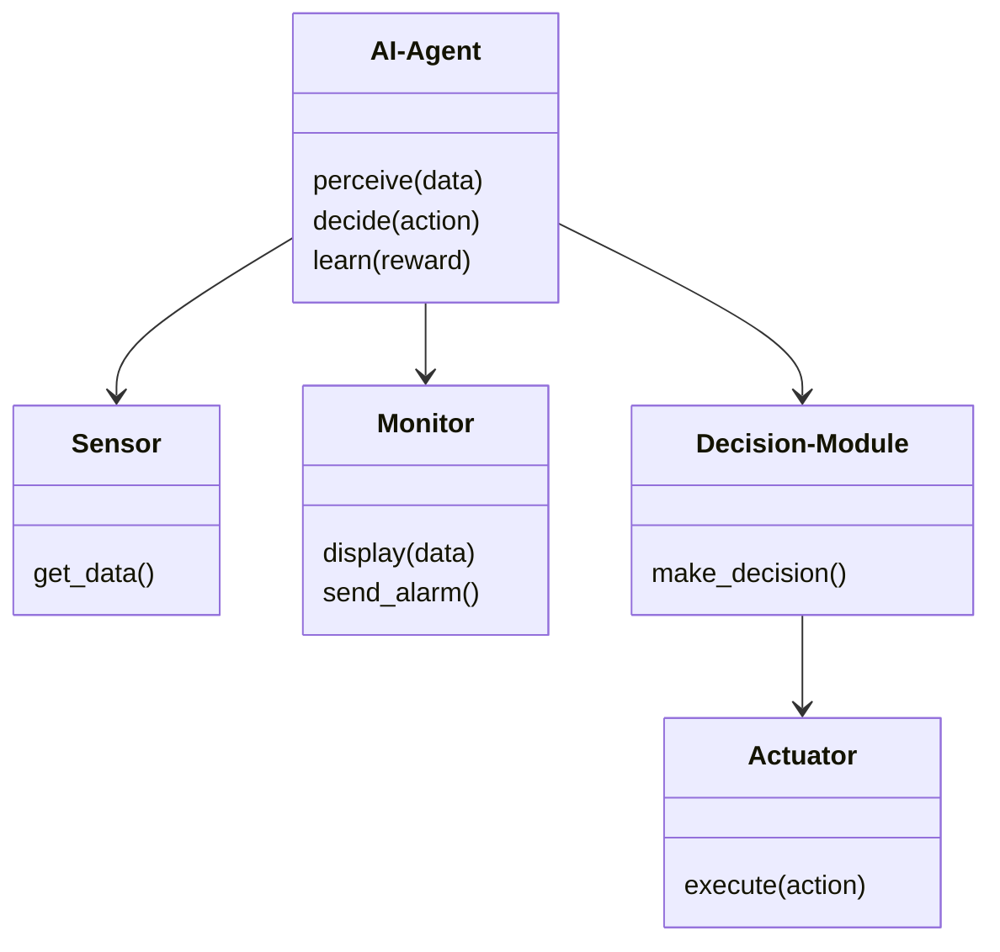
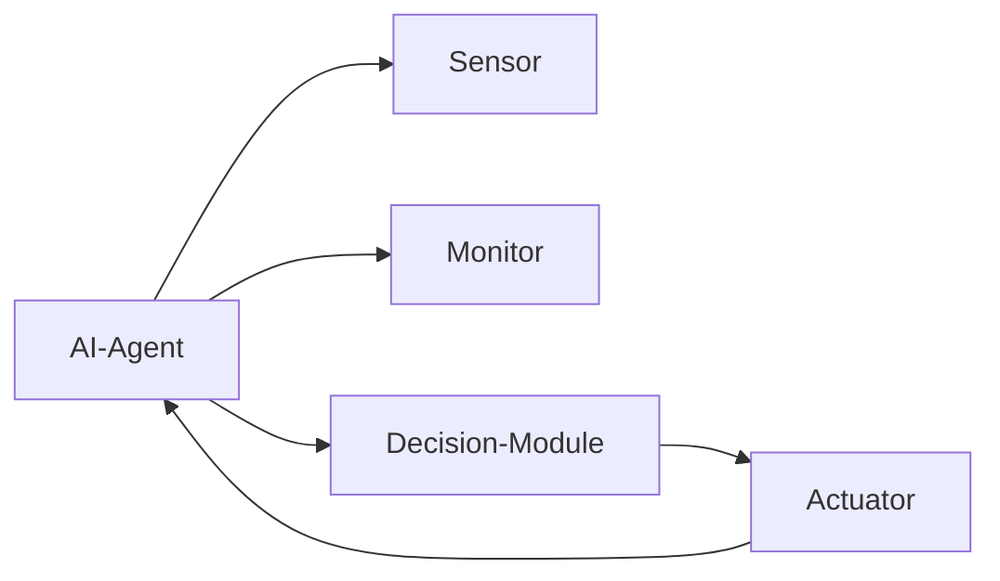
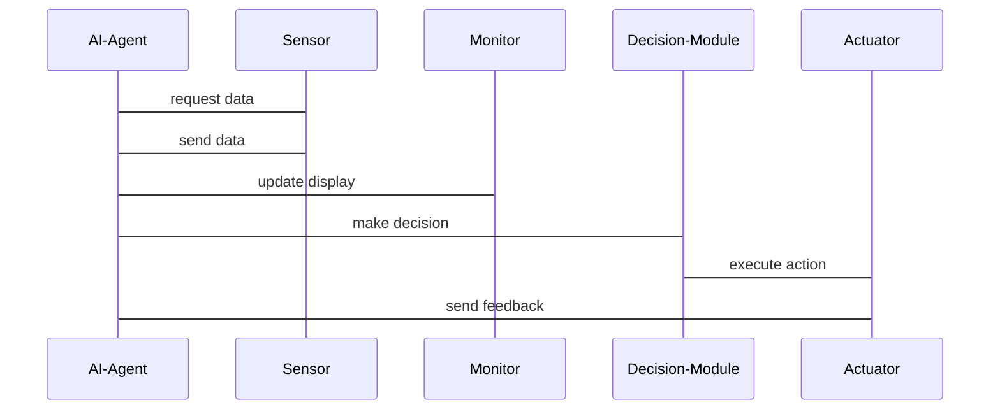

                 


# AI Agent在核电站安全监控中的应用

## 关键词：AI Agent、核电站、安全监控、强化学习、系统架构、数学模型

## 摘要：本文探讨AI Agent在核电站安全监控中的应用，分析其核心概念、算法原理、系统架构，并通过实际案例展示其在提高核电站安全性和效率中的作用。

---

# 第一部分: AI Agent在核电站安全监控中的应用概述

## 第1章: AI Agent与核电站安全监控概述

### 1.1 AI Agent的基本概念
#### 1.1.1 AI Agent的定义与特点
AI Agent（人工智能代理）是一种智能系统，能够感知环境、自主决策并执行任务。其特点包括：
- **自主性**：无需外部干预，自主完成任务。
- **反应性**：能够实时感知环境变化并做出反应。
- **学习能力**：通过数据和经验不断优化决策能力。
- **协作性**：能够与其他系统或AI Agent协同工作。

#### 1.1.2 核电站安全监控的基本原理
核电站安全监控系统负责实时监测核反应堆的各项参数（如温度、压力、辐射水平等），确保其在安全范围内运行。传统监控系统依赖于固定的规则和程序，而引入AI Agent后，系统能够动态调整监控策略，提高响应速度和准确性。

#### 1.1.3 AI Agent在核电站监控中的应用背景
随着核电站规模的扩大和复杂性的增加，传统监控系统在应对复杂故障和极端情况时显得力不从心。AI Agent的引入能够显著提升核电站的安全性、可靠性和运营效率。

### 1.2 核电站安全监控的重要性
#### 1.2.1 核电站的安全风险分析
核电站涉及放射性物质的处理，任何微小的故障都可能导致严重的安全事故。安全监控系统的可靠性直接关系到核电站的安全运行。

#### 1.2.2 传统安全监控的局限性
传统监控系统依赖预设规则，难以应对复杂的动态变化，且在数据量大、情况复杂时容易出现误报或漏报。

#### 1.2.3 引入AI Agent的优势
AI Agent能够实时分析海量数据，快速识别潜在风险，优化决策过程，显著提高监控系统的智能化水平和应对复杂情况的能力。

### 1.3 本章小结
本章介绍了AI Agent的基本概念及其在核电站安全监控中的应用背景，分析了传统监控系统的局限性，强调了引入AI Agent的重要性和优势。

---

# 第二部分: AI Agent的核心概念与原理

## 第2章: AI Agent的核心概念与联系

### 2.1 AI Agent的原理分析
#### 2.1.1 感知层：数据采集与处理
AI Agent通过传感器和数据采集系统获取核电站的实时数据，包括温度、压力、辐射水平等。

#### 2.1.2 决策层：基于数据的智能决策
AI Agent利用机器学习算法（如强化学习、决策树等）对数据进行分析，生成最优决策。

#### 2.1.3 执行层：指令输出与反馈
AI Agent根据决策结果向执行机构（如阀门、冷却系统）发送指令，并实时接收反馈信息，形成闭环控制系统。

### 2.2 AI Agent的核心要素对比
#### 2.2.1 不同AI Agent的属性特征对比

| 特性         | 传统规则引擎 | 基于机器学习的AI Agent |
|--------------|--------------|-------------------------|
| 决策方式     | 预设规则     | 数据驱动               |
| 灵活性       | 低           | 高                     |
| 学习能力     | 无           | 有                     |
| 响应速度     | 较慢         | 快                     |

#### 2.2.2 核电站场景下的实体关系图



### 2.3 本章小结
本章详细分析了AI Agent的核心原理，对比了不同AI Agent的特性，并通过实体关系图展示了核电站监控系统中各组件的协作关系。

---

# 第三部分: AI Agent的算法原理与数学模型

## 第3章: AI Agent的核心算法原理

### 3.1 基于强化学习的AI Agent算法
#### 3.1.1 强化学习的基本原理
强化学习是一种通过试错机制来优化决策的算法。AI Agent通过与环境交互，获得奖励或惩罚，逐步优化策略。

#### 3.1.2 AI Agent在核电站监控中的应用
在核电站监控中，AI Agent可以使用强化学习算法优化安全参数的调整策略，例如在异常情况下选择最优的应急响应措施。

#### 3.1.3 算法流程图



#### 3.1.4 算法实现代码
```python
class AI-Agent:
    def __init__(self):
        self.state = None
        self.action = None
        self.reward = None

    def perceive(self, data):
        # 数据处理逻辑
        pass

    def decide(self):
        # 根据当前状态选择动作
        pass

    def learn(self, reward):
        # 更新策略以最大化奖励
        pass
```

### 3.2 算法的数学模型与公式
#### 3.2.1 强化学习的目标函数
优化目标是最大化累积奖励：

$$ J = \mathbb{E}[ \sum_{t=0}^{\infty} \gamma^t r_t ] $$

其中，$\gamma$ 是折扣因子，$r_t$ 是时间$t$的奖励。

#### 3.2.2 动作选择的策略函数
策略函数$\pi(a|s)$表示在状态$s$下选择动作$a$的概率：

$$ \pi(a|s) = \text{softmax}(Q(s,a)) $$

其中，$Q(s,a)$是动作$a$在状态$s$下的Q值。

#### 3.2.3 示例：优化核电站温度控制
假设核电站的温度控制目标是保持在$T_{\text{target}}$，AI Agent通过调整冷却系统的功率来优化温度控制策略。

---

# 第四部分: 系统分析与架构设计方案

## 第4章: 系统分析与架构设计

### 4.1 核电站安全监控的场景介绍
核电站安全监控系统需要实时监测核反应堆的各项参数，并在异常情况下快速响应，确保系统安全运行。

### 4.2 项目介绍与系统功能设计
#### 4.2.1 系统功能设计
- 实时数据采集与显示
- 异常检测与报警
- 应急响应策略优化
- 历史数据分析与趋势预测

#### 4.2.2 领域模型（Mermaid类图）



### 4.3 系统架构设计
#### 4.3.1 分层架构设计
- **感知层**：传感器和数据采集系统。
- **数据层**：数据存储与处理。
- **决策层**：AI Agent和决策模块。
- **执行层**：执行机构和反馈系统。

#### 4.3.2 系统架构图（Mermaid）



### 4.4 系统接口设计与交互序列图
#### 4.4.1 系统接口设计
- **输入接口**：传感器数据、用户输入。
- **输出接口**：报警信号、执行指令。

#### 4.4.2 交互序列图（Mermaid）



---

# 第五部分: 项目实战

## 第5章: 项目实战

### 5.1 环境安装与配置
#### 5.1.1 安装Python环境
安装Python 3.8及以上版本，安装必要的库（如TensorFlow、Keras、Scikit-learn等）。

#### 5.1.2 安装依赖项
```bash
pip install numpy matplotlib tensorflow scikit-learn
```

### 5.2 系统核心实现源代码
#### 5.2.1 AI Agent的核心代码
```python
import numpy as np
import tensorflow as tf
from tensorflow.keras import layers

class AI-Agent:
    def __init__(self):
        self.model = self.build_model()

    def build_model(self):
        model = tf.keras.Sequential([
            layers.Dense(64, activation='relu', input_shape=(input_dim,)),
            layers.Dense(64, activation='relu'),
            layers.Dense(action_dim, activation='linear')
        ])
        return model

    def perceive(self, data):
        self.state = data
        return self.state

    def decide(self):
        prediction = self.model.predict(np.array([self.state]))
        action = np.argmax(prediction[0])
        return action

    def learn(self, reward):
        # 简单的强化学习更新策略（此处可进一步优化）
        pass
```

### 5.3 代码应用解读与分析
AI Agent通过神经网络模型对输入数据进行处理，生成决策动作。模型通过强化学习不断优化，以提高决策的准确性和效率。

### 5.4 实际案例分析
#### 5.4.1 案例背景
假设核电站某时刻出现温度异常升高，AI Agent需要快速响应，调整冷却系统的功率。

#### 5.4.2 案例分析
AI Agent通过感知层获取实时温度数据，经过决策层分析，选择最优的冷却功率，并通过执行层调整冷却系统。

#### 5.4.3 决策过程
1. **感知层**：获取当前温度数据。
2. **决策层**：基于历史数据和当前状态，生成决策。
3. **执行层**：调整冷却系统功率，确保温度恢复正常。

### 5.5 项目小结
本章通过实际案例展示了AI Agent在核电站安全监控中的应用，详细解读了系统的实现过程和实际效果。

---

# 第六部分: 最佳实践与未来展望

## 第6章: 最佳实践与未来展望

### 6.1 小结
AI Agent在核电站安全监控中的应用显著提高了系统的智能化水平和应对复杂情况的能力。

### 6.2 注意事项
- 数据的准确性和实时性是确保AI Agent有效性的关键。
- 需要定期更新和优化AI Agent的模型和算法，以适应新的安全挑战。
- 系统的安全性和可靠性必须放在首位，确保在极端情况下仍能正常运行。

### 6.3 未来展望
随着AI技术的不断进步，AI Agent在核电站安全监控中的应用将更加广泛和深入。未来的研发方向包括：
- 更高效的强化学习算法。
- 更精准的实时数据分析能力。
- 更智能的异常检测与应急响应机制。

### 6.4 拓展阅读
建议进一步阅读以下内容：
- 《强化学习：算法与应用》。
- 《人工智能在工业安全中的应用》。

---

# 结语

AI Agent在核电站安全监控中的应用是一项具有重要意义的技术创新。通过本文的详细讲解，我们了解了AI Agent的核心原理、系统架构以及实际应用。未来，随着技术的进一步发展，AI Agent将在核电站安全监控中发挥越来越重要的作用，为核能的安全利用提供强有力的技术支持。

