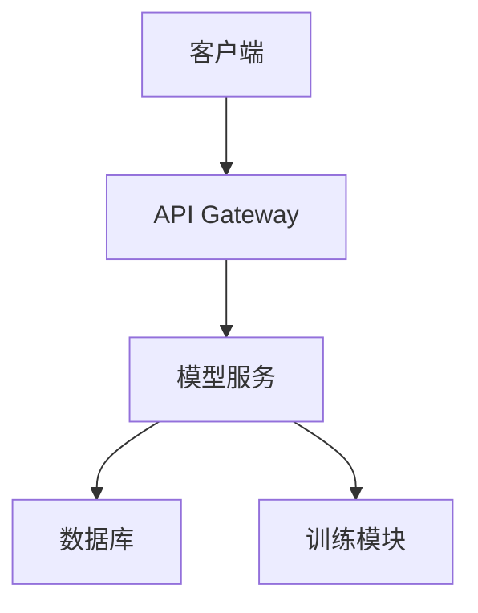

                 


# AI Agent在植物学中的应用：物种识别与生态监测

> 关键词：AI Agent, 植物种识别, 生态监测, 图像识别, 机器学习

> 摘要：本文探讨AI Agent在植物学中的应用，特别是物种识别和生态监测。通过分析AI Agent的核心概念、算法原理和系统架构，结合实际案例，展示其在植物学中的潜力和实际应用价值。

---

## 第一部分：AI Agent与植物学的结合

### 第1章：AI Agent的基本概念

#### 1.1 AI Agent的核心特征
- **自主性**：AI Agent能够自主感知环境并做出决策。
- **反应性**：能够实时响应环境变化。
- **学习能力**：通过数据不断优化识别精度。

#### 1.2 植物学中的问题背景
- **物种识别挑战**：植物种类繁多，形态差异小，传统方法耗时且依赖专家。
- **生态监测需求**：需要实时、高效地监测生态环境变化，保护濒危物种。

### 第2章：AI Agent在植物学中的作用

#### 2.1 AI Agent的核心原理
- **感知与推理**：通过图像识别技术提取植物特征，结合上下文推理。
- **决策与执行**：基于识别结果做出分类或预警。
- **学习与优化**：使用深度学习算法不断优化识别模型。

---

## 第二部分：AI Agent在物种识别中的算法原理

### 第3章：图像识别算法

#### 3.1 卷积神经网络（CNN）
- **CNN结构**：输入层 → 卷积层 → 池化层 → 全连接层 → 输出层。
- **数学模型**：使用卷积核提取特征，池化层降低计算量。
- **损失函数**：交叉熵损失函数：$$ L = -\sum_{i} y_i \log p_i + (1 - y_i) \log (1 - p_i) $$

#### 3.2 目标检测算法
- **Faster R-CNN**：包括特征提取、区域建议、目标检测三部分。
- **锚框生成**：基于图像生成多个候选框，使用非极大值抑制优化。
- **损失计算**：使用分类损失、回归损失和边界框损失的加权和。

---

## 第三部分：生态监测中的系统架构

### 第4章：系统设计与实现

#### 4.1 系统模块划分
- **数据采集**：通过无人机或传感器获取植物图像。
- **模型训练**：使用深度学习模型进行训练和优化。
- **服务部署**：将模型部署为API，供其他系统调用。

#### 4.2 系统架构图


#### 4.3 实际案例分析
- **案例1**：识别珍稀濒危植物，辅助生态监测。
- **案例2**：大规模农田病虫害监测，提高农业生产效率。

---

## 第四部分：项目实战与扩展

### 第5章：项目实战

#### 5.1 环境搭建
- **安装Python**：`python --version`
- **安装库**：`pip install numpy, tensorflow, keras`

#### 5.2 数据预处理
- **图像归一化**：将图像像素值归一化到0-1范围。
- **数据增强**：旋转、翻转、缩放等操作增加数据量。

#### 5.3 模型训练
- **训练脚本**：
  ```python
  import tensorflow as tf
  model = tf.keras.Sequential([
      tf.keras.layers.Conv2D(32, (3,3), activation='relu', input_shape=(224, 224, 3)),
      tf.keras.layers.MaxPooling2D((2,2)),
      tf.keras.layers.Flatten(),
      tf.keras.layers.Dense(128, activation='relu'),
      tf.keras.layers.Dense(10, activation='softmax')
  ])
  model.compile(optimizer='adam', loss='categorical_crossentropy', metrics=['accuracy'])
  model.fit(train_data, train_labels, epochs=10)
  ```

#### 5.4 模型部署
- **API开发**：使用Flask框架搭建API，提供图像识别接口。
- **调用示例**：
  ```python
  from flask import Flask, request, jsonify
  app = Flask(__name__)
  
  @app.route('/classify', methods=['POST'])
  def classify():
      image = request.files['image'].read()
      # 处理图像
      result = model.predict(image)
      return jsonify({'species': result})
  ```

---

## 第五部分：总结与展望

### 6.1 总结
- AI Agent通过深度学习算法，显著提高了植物物种识别和生态监测的效率。
- 系统架构设计确保了识别的准确性和实时性，为植物学研究提供了新工具。

### 6.2 展望
- **模型优化**：引入更复杂的深度学习模型，如Transformer。
- **多模态数据融合**：结合图像、传感器数据等多种信息，提升识别精度。
- **扩展应用**：探索AI Agent在更多植物学领域的应用，如植物生长监测和病虫害预测。

---

## 参考文献
1. LeCun, Y., Bengio, Y., & Hinton, G. (2015). Deep learning. Nature, 521(7555), 436-444.
2. Redmon, J., & Farhadi, A. (2017). YOLOv3: An Incremental Improvement. arXiv preprint arXiv:1804.02688.

