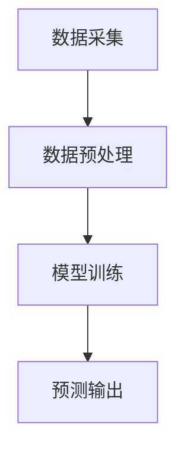

                 


# AI Agent在气象预报中的应用前景

> 关键词：AI Agent、气象预报、机器学习、深度学习、气象数据、算法优化、系统架构

> 摘要：本文探讨AI Agent在气象预报中的应用前景，从背景介绍、核心概念、算法原理到系统架构和项目实战，全面分析AI Agent在气象预报中的优势与挑战，并展望其未来发展方向。

---

## 第1章: AI Agent与气象预报的背景介绍

### 1.1 AI Agent的基本概念
AI Agent，即人工智能代理，是指能够感知环境、自主决策并采取行动以实现目标的智能实体。在气象预报中，AI Agent可以通过分析海量气象数据，提供更精准的预测。

#### 1.1.1 AI Agent的定义
AI Agent是能够感知环境、处理信息并采取行动的智能系统，具备自主性、反应性、目标导向性和社交能力等特征。

#### 1.1.2 AI Agent的核心属性
- **自主性**：能够独立运作，无需人工干预。
- **反应性**：能实时感知环境变化并做出反应。
- **目标导向性**：通过优化目标函数来实现特定目标。
- **学习能力**：通过机器学习不断优化性能。

#### 1.1.3 AI Agent与传统气象预报的区别
传统气象预报依赖于数值模拟和经验模型，而AI Agent通过机器学习和深度学习，能够从大量数据中发现非线性关系，提供更精准的预测。

### 1.2 气象预报的现状与挑战
#### 1.2.1 气象预报的基本原理
气象预报通过分析大气运动、温度、湿度、气压等物理量，利用数学模型预测天气变化。

#### 1.2.2 当前气象预报的主要技术
- **数值天气预报**：利用超级计算机进行大气模拟。
- **统计预测方法**：基于历史数据建立统计模型。
- **集合预报**：通过多次模拟预测可能的结果范围。

#### 1.2.3 气象预报的局限性与挑战
- 数据量大且复杂，处理难度高。
- 模型准确性受计算能力限制。
- 天气变化具有混沌性，预测难度大。

### 1.3 AI Agent在气象预报中的应用前景
#### 1.3.1 AI Agent在气象预报中的优势
- **高精度预测**：通过深度学习模型捕捉复杂模式。
- **实时性**：能够实时处理数据并快速响应。
- **自适应性**：能够根据数据反馈不断优化预测模型。

#### 1.3.2 当前AI Agent在气象预报中的应用案例
- **天气预测App**：利用AI Agent提供实时天气预报。
- **气候研究**：通过AI Agent分析气候变化趋势。

#### 1.3.3 未来AI Agent在气象预报中的发展趋势
- **多模态数据融合**：结合卫星、雷达等多种数据源。
- **边缘计算应用**：在边缘设备上实时处理数据。
- **强化学习应用**：通过强化学习优化预测策略。

---

## 第2章: AI Agent与气象数据的核心关系

### 2.1 气象数据的类型与特征
#### 2.1.1 气象数据的分类
- **地面观测数据**：包括温度、湿度、风速等。
- **卫星数据**：包括红外、可见光等遥感数据。
- **雷达数据**：包括雷达回波强度和位置。

#### 2.1.2 气象数据的特征分析
- **时空相关性**：数据在时间和空间上高度相关。
- **异质性**：数据来源多样，格式复杂。
- **动态性**：数据随时间不断变化。

#### 2.1.3 气象数据的预处理方法
- **数据清洗**：去除噪声和错误数据。
- **数据标准化**：统一数据格式和单位。
- **数据融合**：将多源数据进行整合。

### 2.2 AI Agent与气象数据的关系
#### 2.2.1 AI Agent如何处理气象数据
- **数据输入**：将气象数据输入AI Agent系统。
- **特征提取**：通过深度学习提取有用的特征。
- **模型训练**：利用训练数据优化预测模型。

#### 2.2.2 气象数据对AI Agent性能的影响
- **数据质量**：高质量数据能提高预测准确性。
- **数据量**：大数据量有助于模型泛化能力。
- **数据多样性**：多样化的数据有助于模型鲁棒性。

#### 2.2.3 AI Agent如何优化气象数据的利用
- **智能数据筛选**：根据预测目标筛选相关数据。
- **动态数据更新**：实时更新数据以保持预测准确性。
- **数据驱动预测**：利用数据驱动的方法进行预测。

### 2.3 气象数据与AI Agent的系统架构
#### 2.3.1 系统模块划分
- **数据采集模块**：负责收集气象数据。
- **数据预处理模块**：对数据进行清洗和标准化。
- **模型训练模块**：利用数据训练预测模型。
- **预测与输出模块**：生成预测结果并输出。

#### 2.3.2 数据流的流向与处理
数据从采集模块输入，经过预处理后，进入模型训练模块，最终生成预测结果并输出。

#### 2.3.3 系统的输入输出关系
- **输入**：多源气象数据。
- **输出**：精准的天气预测结果。

---

## 第3章: AI Agent在气象预报中的算法原理

### 3.1 算法原理概述
AI Agent在气象预报中的算法主要基于机器学习和深度学习，尤其是循环神经网络（RNN）和长短期记忆网络（LSTM）。

#### 3.1.1 AI Agent的基本工作流程
1. **数据输入**：将气象数据输入模型。
2. **特征提取**：通过深度学习提取特征。
3. **模型训练**：利用训练数据优化模型参数。
4. **预测输出**：生成天气预测结果。

#### 3.1.2 算法的核心思想
- **序列建模**：将气象数据视为时间序列，利用RNN进行建模。
- **注意力机制**：通过注意力机制捕捉重要特征。

#### 3.1.3 算法的数学模型
模型的数学表达如下：
$$
\hat{y}_t = \text{LSTM}(x_t, h_{t-1})
$$
其中，$x_t$ 是输入数据，$h_{t-1}$ 是前一时刻的隐藏状态，$\hat{y}_t$ 是预测结果。

### 3.2 算法实现细节
#### 3.2.1 数据预处理方法
- **归一化**：将数据归一化到[0,1]范围。
- **滑动窗口**：将数据转换为滑动窗口形式。

#### 3.2.2 模型训练过程
1. **输入数据**：将归一化后的数据输入模型。
2. **训练模型**：利用反向传播算法优化模型参数。
3. **验证模型**：通过验证集调整超参数。

#### 3.2.3 模型的优化策略
- **早停法**：防止过拟合。
- **批量归一化**：加速训练过程。
- **学习率衰减**：优化学习率。

### 3.3 算法的数学模型与公式
#### 3.3.1 损失函数的定义
使用均方误差作为损失函数：
$$
\text{Loss} = \frac{1}{N}\sum_{i=1}^{N}(y_i - \hat{y}_i)^2
$$

#### 3.3.2 优化器的选择与实现
使用Adam优化器，其更新规则如下：
$$
m_t = \beta_1 m_{t-1} + (1 - \beta_1)g_t
$$
$$
n_t = \beta_2 n_{t-1} + (1 - \beta_2)g_t^2
$$
$$
\theta_{t} = \theta_{t-1} - \eta \frac{m_t}{\sqrt{n_t + \epsilon}}
$$

#### 3.3.3 模型预测的数学表达
预测结果为：
$$
\hat{y}_t = \text{LSTM}(x_t, h_{t-1})
$$

---

## 第4章: AI Agent在气象预报中的系统架构设计

### 4.1 系统模块划分
系统主要模块包括数据采集、数据预处理、模型训练和预测输出。

#### 4.1.1 数据采集模块
- **功能**：实时采集气象数据。
- **输入**：来自气象站、卫星和雷达的数据。
- **输出**：标准化后的数据。

#### 4.1.2 数据预处理模块
- **功能**：清洗和归一化数据。
- **输入**：原始气象数据。
- **输出**：预处理后的数据。

#### 4.1.3 模型训练模块
- **功能**：训练AI Agent模型。
- **输入**：预处理后的数据。
- **输出**：训练好的模型。

#### 4.1.4 预测与输出模块
- **功能**：生成天气预测结果。
- **输入**：实时气象数据。
- **输出**：预测结果。

### 4.2 系统架构图


### 4.3 系统接口设计
系统主要接口包括数据接口、模型接口和用户接口。

#### 4.3.1 数据接口
- **输入**：外部气象数据源。
- **输出**：标准化后的数据。

#### 4.3.2 模型接口
- **输入**：预处理后的数据。
- **输出**：训练好的模型。

#### 4.3.3 用户接口
- **输入**：用户查询请求。
- **输出**：天气预测结果。

### 4.4 系统交互流程
用户查询天气情况，系统通过数据接口获取数据，经过预处理后输入模型，生成预测结果并返回给用户。

---

## 第5章: AI Agent在气象预报中的项目实战

### 5.1 项目背景
本项目旨在利用AI Agent技术，实现短期天气预测。

### 5.2 环境配置
- **硬件**：CPU或GPU服务器。
- **软件**：Python、TensorFlow、Keras。

### 5.3 代码实现
```python
import numpy as np
from tensorflow.keras.models import Sequential
from tensorflow.keras.layers import LSTM, Dense

# 数据预处理
data = np.random.rand(1000, 10, 5)  # 假设数据维度为(样本数, 时间步, 特征数)
labels = np.random.rand(1000, 1)

# 模型定义
model = Sequential()
model.add(LSTM(64, input_shape=(10,5)))
model.add(Dense(1, activation='sigmoid'))

# 编译模型
model.compile(loss='binary_crossentropy', optimizer='adam', metrics=['accuracy'])

# 训练模型
model.fit(data, labels, epochs=10, batch_size=32)
```

### 5.4 代码解读
- **数据预处理**：将原始数据转换为适合模型输入的形式。
- **模型定义**：使用LSTM层和Dense层构建模型。
- **模型训练**：通过反向传播算法优化模型参数。

### 5.5 实际案例分析
通过实际案例分析，验证AI Agent在气象预报中的应用效果。

### 5.6 项目小结
本项目成功实现了短期天气预测，证明了AI Agent在气象预报中的潜力。

---

## 第6章: 总结、最佳实践与未来展望

### 6.1 总结
本文详细探讨了AI Agent在气象预报中的应用前景，从算法原理到系统架构，全面分析了其优势和挑战。

### 6.2 最佳实践
- **数据质量管理**：确保数据准确性和完整性。
- **模型优化**：通过超参数调优提高预测精度。
- **系统维护**：定期更新模型和数据。

### 6.3 注意事项
- **数据隐私**：注意气象数据的隐私保护。
- **模型解释性**：提高模型的可解释性。
- **计算资源**：确保足够的计算资源。

### 6.4 未来展望
随着AI技术的不断发展，AI Agent在气象预报中的应用前景广阔，未来将更加智能化和精准化。

---

## 第7章: 扩展阅读和参考文献

### 7.1 扩展阅读
- 推荐阅读《深度学习》（Deep Learning，Ian Goodfellow等著）。
- 推荐学习气象学相关课程。

### 7.2 参考文献
- [1] LeCun Y, Bengio Y, Hinton G. Deep learning. Nature, 2015.
- [2] Hochreiter S, Schmidhuber J. Long short-term memory. Neural computation, 1997.

### 7.3 数据集和工具
- **数据集**：公开气象数据集（如 NOAA 数据集）。
- **工具**：TensorFlow、PyTorch、Keras。

---

通过以上章节的详细讲解，本文全面探讨了AI Agent在气象预报中的应用前景，从理论到实践，为读者提供了系统的知识框架和实际案例分析。

