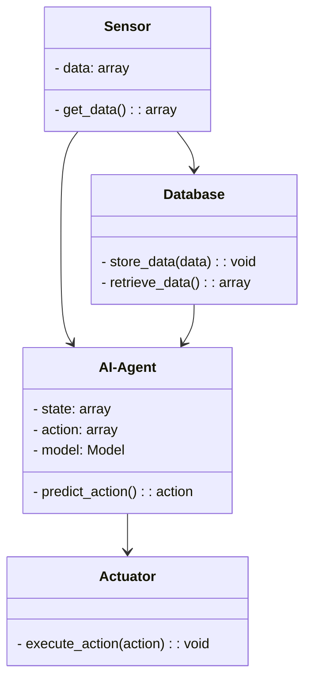
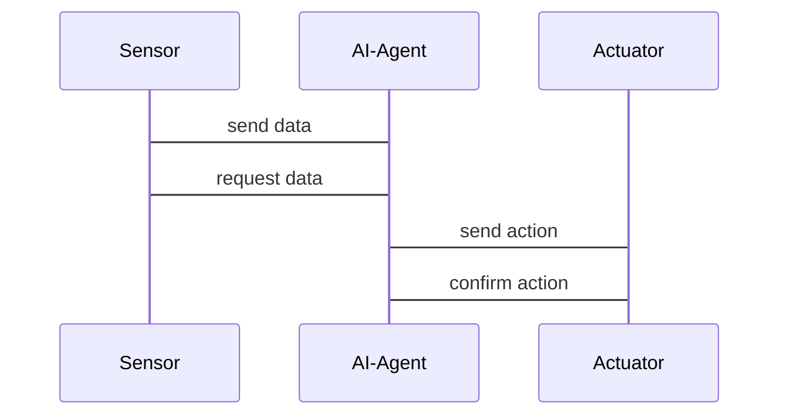

                 


# AI Agent在水资源管理中的应用：水质监测与分配

**关键词**：AI Agent, 水资源管理, 水质监测, 水量分配, 强化学习, 系统架构设计

**摘要**：随着全球水资源短缺问题的加剧，AI Agent技术在水资源管理中的应用日益重要。本文详细探讨了AI Agent在水质监测与水量分配中的应用场景，结合强化学习算法和系统架构设计，展示了如何利用AI技术优化水资源管理流程。

---

## 第1章 AI Agent与水资源管理概述

### 1.1 AI Agent的基本概念

AI Agent（人工智能代理）是指能够感知环境并采取行动以实现特定目标的智能实体。AI Agent的核心特征包括自主性、反应性、目标导向和社会能力。与传统自动化系统相比，AI Agent能够主动适应环境变化，并通过学习和优化提升性能。

### 1.2 水资源管理的挑战与需求

水资源管理面临的主要挑战包括水污染加剧、水资源分配不均、用水需求增长以及气候变化的影响。传统的水资源管理方法依赖人工操作，效率低下且难以应对复杂多变的环境。

### 1.3 AI Agent在水资源管理中的定位

AI Agent在水资源管理中充当决策支持系统的核心角色，能够实时监测水质、优化水量分配并提供智能化的解决方案。AI Agent的优势在于其能够快速响应环境变化，并通过数据驱动的决策提高管理效率。

---

## 第2章 水质监测的基本原理与挑战

### 2.1 水质监测的主要指标

水质监测的主要指标包括pH值、溶解氧、浊度、COD（化学需氧量）和重金属含量等。这些指标反映了水质的好坏，是评估水体健康的重要依据。

### 2.2 水质监测中的传统方法与局限性

传统水质监测方法主要依赖人工采样和实验室分析，存在效率低、成本高且实时性差的问题。此外，传统方法难以应对突发性水质变化，如污染事故。

### 2.3 AI Agent在水质监测中的应用场景

AI Agent可以通过传感器实时采集水质数据，并利用强化学习算法进行分析和预测。在水质异常情况下，AI Agent能够快速触发警报并采取应对措施，例如调整污水处理系统参数。

---

## 第3章 水量分配的基本原理与挑战

### 3.1 水量分配的主要目标与原则

水量分配的目标是合理分配水资源，满足不同用户的用水需求，同时保护生态环境。水量分配的原则包括公平性、可持续性和高效性。

### 3.2 水量分配中的传统方法与局限性

传统水量分配方法通常基于经验法则，难以应对复杂多变的用水需求和环境条件。例如，在干旱季节，传统方法可能无法有效分配有限的水资源。

### 3.3 AI Agent在水量分配中的应用场景

AI Agent可以通过强化学习算法优化水量分配策略，实时调整供水系统参数，确保水资源的高效利用。AI Agent还能够预测未来的用水需求，并提前进行资源调配。

---

## 第4章 强化学习在AI Agent中的应用

### 4.1 强化学习的基本原理

强化学习是一种机器学习方法，通过智能体与环境的交互，学习最优策略以最大化累积奖励。Q-Learning算法是强化学习的核心算法之一，适用于离散动作空间的问题。

### 4.2 强化学习在水资源管理中的应用

在水质监测中，强化学习可以用于异常检测和预测；在水量分配中，强化学习可以用于动态优化和决策支持。

### 4.3 强化学习的数学模型与公式

Q-Learning算法的数学模型如下：

$$ Q(s,a) = Q(s,a) + \alpha (r + \gamma \max Q(s',a') - Q(s,a)) $$

其中，$s$是当前状态，$a$是动作，$r$是奖励，$\gamma$是折扣因子，$\alpha$是学习率。

---

## 第5章 基于强化学习的AI Agent实现

### 5.1 环境安装与配置

为了实现基于强化学习的AI Agent，需要安装以下环境：

- Python 3.8+
- TensorFlow或Keras
- OpenAI Gym库

### 5.2 系统功能设计

以下是系统功能的领域模型类图：



### 5.3 系统架构设计

以下是系统架构图：

```mermaid
graph TD

    A[AI-Agent] --> S[Sensor]: receive data
    A --> D[Database]: store data
    A --> Act[Actuator]: execute action
    S --> D
    D --> Act
```

### 5.4 项目实战

以下是AI Agent的Python实现代码：

```python
import numpy as np
from collections import deque
import random

class AI-Agent:
    def __init__(self, state_size, action_size):
        self.state_size = state_size
        self.action_size = action_size
        self.Q = np.zeros((state_size, action_size))
        self.learning_rate = 0.1
        self.gamma = 0.9

    def take_action(self, state):
        if random.random() < 0.9:
            return random.randint(0, self.action_size-1)
        else:
            return np.argmax(self.Q[state, :])

    def update_Q(self, state, action, reward, next_state):
        self.Q[state, action] = self.Q[state, action] + self.learning_rate * (reward + self.gamma * np.max(self.Q[next_state, :]) - self.Q[state, action])
```

---

## 第6章 系统分析与架构设计方案

### 6.1 问题场景介绍

水资源管理中的水质监测与水量分配问题是一个典型的复杂优化问题。需要实时监测水质数据，并根据需求动态调整水量分配策略。

### 6.2 系统功能设计

以下是系统功能的领域模型类图：


### 6.3 系统架构设计

以下是系统架构图：

```mermaid
graph TD

    A[AI-Agent] --> S[Sensor]: receive data
    A --> D[Database]: store data
    A --> Act[Actuator]: execute action
    S --> D
    D --> Act
```

### 6.4 系统接口设计

以下是系统接口的序列图：



---

## 第7章 项目实战

### 7.1 环境安装

为了实现AI Agent，需要安装以下环境：

- Python 3.8+
- TensorFlow或Keras
- OpenAI Gym库

### 7.2 核心实现

以下是AI Agent的核心实现代码：

```python
import numpy as np
from collections import deque
import random

class AI-Agent:
    def __init__(self, state_size, action_size):
        self.state_size = state_size
        self.action_size = action_size
        self.Q = np.zeros((state_size, action_size))
        self.learning_rate = 0.1
        self.gamma = 0.9

    def take_action(self, state):
        if random.random() < 0.9:
            return random.randint(0, self.action_size-1)
        else:
            return np.argmax(self.Q[state, :])

    def update_Q(self, state, action, reward, next_state):
        self.Q[state, action] = self.Q[state, action] + self.learning_rate * (reward + self.gamma * np.max(self.Q[next_state, :]) - self.Q[state, action])
```

### 7.3 案例分析

以下是AI Agent在水质监测中的应用案例：

```python
# 初始化AI Agent
state_size = 5  # 示例状态空间
action_size = 3  # 示例动作空间
agent = AI-Agent(state_size, action_size)

# 模拟水质监测
for _ in range(100):
    state = np.random.rand(state_size)
    action = agent.take_action(state)
    next_state = np.random.rand(state_size)
    reward = np.random.uniform(-1, 1)
    agent.update_Q(state, action, reward, next_state)
```

---

## 第8章 最佳实践与总结

### 8.1 最佳实践

1. 在实际应用中，建议结合具体场景优化AI Agent的算法参数。
2. 定期更新模型以适应环境变化。
3. 确保数据质量和实时性。

### 8.2 小结

AI Agent技术在水资源管理中的应用前景广阔，尤其是在水质监测与水量分配领域。通过强化学习算法和系统架构设计，可以显著提高水资源管理的效率和智能化水平。

---

## 第9章 拓展阅读

1. 《Reinforcement Learning: Theory and Algorithms》
2. 《AI in Water Resource Management》
3. 《Python强化学习实战》

---

通过以上内容，您可以深入了解AI Agent在水资源管理中的应用，并通过实际案例掌握其具体实现方法。

