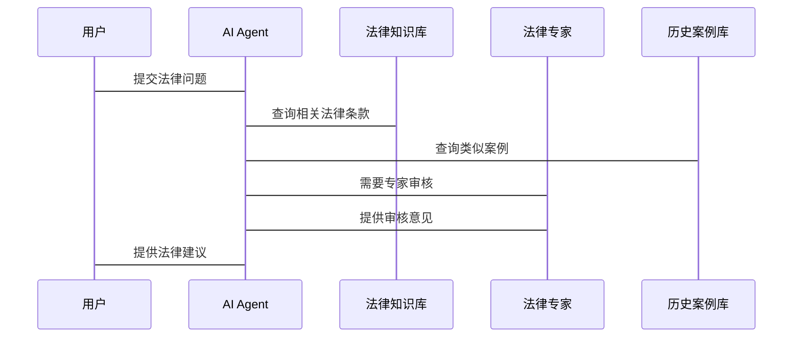
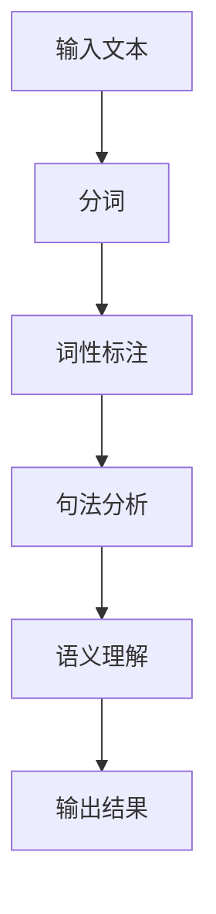
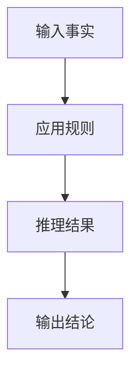
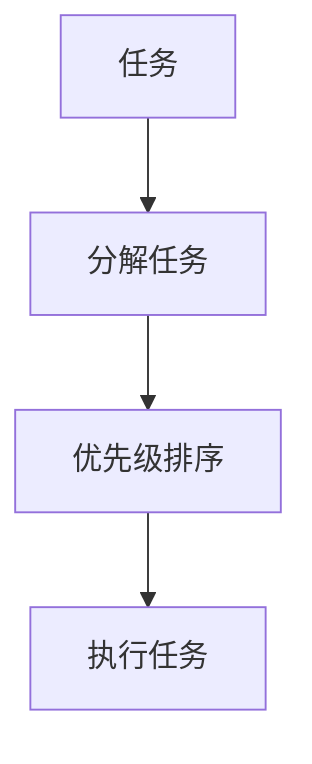
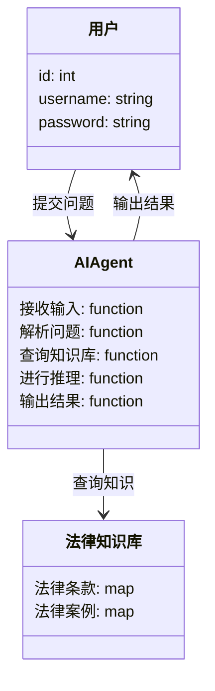
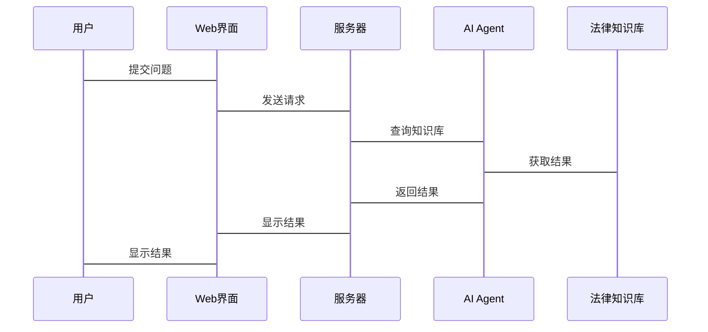

                 


```markdown
# AI Agent在法律服务中的应用

> 关键词：AI Agent，法律服务，自然语言处理，逻辑推理，法律知识库

> 摘要：本文探讨了AI Agent在法律服务中的应用，分析了其核心概念、算法原理、系统架构，并通过实际案例展示了其在法律服务中的应用场景。通过详细的技术分析和实例说明，本文揭示了AI Agent如何提升法律服务的效率和质量。

---

# 第一部分: AI Agent在法律服务中的背景与核心概念

## 第1章: AI Agent与法律服务的背景介绍

### 1.1 AI Agent的核心概念
#### 1.1.1 AI Agent的定义与特点
- AI Agent的定义：智能体（Agent）是指能够感知环境并采取行动以实现目标的实体。
- AI Agent的特点：自主性、反应性、目标导向、社会性。

#### 1.1.2 法律服务的定义与特点
- 法律服务的定义：法律服务是指律师、法律咨询师等专业人员为个人或企业提供法律咨询、文件审查、诉讼代理等服务。
- 法律服务的特点：专业性、复杂性、依赖性。

#### 1.1.3 AI Agent在法律服务中的应用背景
- 法律服务的痛点：效率低下、成本高昂、资源分配不均。
- AI Agent的优势：自动化、高效性、可扩展性。

### 1.2 AI Agent与法律服务的关系
#### 1.2.1 AI Agent在法律服务中的作用
- 提供法律咨询：通过自然语言处理技术，为用户提供法律问题解答。
- 文件审查：自动化审查合同、法律文件，识别潜在风险。
- 案例分析：基于历史数据，提供类似案例的分析和建议。

#### 1.2.2 法律服务场景中的AI Agent边界与外延
- 边界：AI Agent不能替代人类律师，只能辅助完成部分任务。
- 外延：AI Agent可以与法律知识库、法律专家协同工作，形成完整的法律服务体系。

#### 1.2.3 AI Agent与法律服务的交互模式
- 单点交互：用户通过文本或语音输入问题，AI Agent提供即时反馈。
- 多轮交互：用户与AI Agent进行多轮对话，逐步细化需求，AI Agent逐步提供服务。

### 1.3 AI Agent在法律服务中的核心要素
- 法律知识库：包含法律法规、案例分析、法律术语等。
- 自然语言处理技术：用于理解和生成自然语言文本。
- 逻辑推理引擎：用于基于法律知识库进行推理和决策。

---

## 第2章: AI Agent在法律服务中的核心概念

### 2.1 AI Agent的核心原理
#### 2.1.1 AI Agent的基本原理
- 感知环境：通过输入的文本或语音，AI Agent识别用户的需求。
- 问题解析：将用户的问题分解为具体的法律任务。
- 任务执行：基于法律知识库和推理引擎，生成解决方案。
- 反馈输出：将解决方案以文本或语音的形式返回给用户。

#### 2.1.2 法律服务中的AI Agent工作流程
1. 用户输入问题：例如，“我的合同是否符合劳动法规定？”
2. 问题解析：AI Agent识别问题类型（劳动法）和关键词（合同、劳动法）。
3. 任务分解：AI Agent将问题分解为合同审查任务。
4. 知识库查询：AI Agent在法律知识库中检索相关法律法规和案例。
5. 逻辑推理：基于检索到的知识，AI Agent进行逻辑推理，生成初步结论。
6. 输出结果：AI Agent将结论以自然语言形式反馈给用户。

#### 2.1.3 AI Agent与法律知识库的关系
- 法律知识库是AI Agent的核心资源，AI Agent通过检索和推理知识库中的内容来提供服务。
- 知识库的构建需要法律专家的参与，确保内容的准确性和权威性。

### 2.2 法律服务场景中的AI Agent实体关系图
```mermaid
erDiagram
    actor 用户
    actor 法律专家
    actor  AI Agent
    database 法律知识库
    database 历史案例库
    actor 用户 --> 法律专家 : 委托法律服务
    actor 用户 --> AI Agent : 提交法律问题
    AI Agent --> 法律知识库 : 查询法律条款
    AI Agent --> 历史案例库 : 查询类似案例
    AI Agent --> 法律专家 : 需要专家审核
    AI Agent --> 用户 : 提供法律建议
```

### 2.3 AI Agent在法律服务中的交互模式


---

# 第三部分: AI Agent的算法原理与实现

## 第3章: AI Agent的算法原理

### 3.1 AI Agent的核心算法
#### 3.1.1 自然语言处理算法
- 用于理解和生成自然语言文本，例如分词、句法分析、情感分析。
- 常用算法：TF-IDF、Word2Vec、BERT。

#### 3.1.2 逻辑推理算法
- 用于基于法律知识库进行逻辑推理，例如基于规则的推理、基于事实的推理。
- 常用算法：Rete算法、一阶逻辑推理。

#### 3.1.3 任务分解算法
- 用于将复杂问题分解为多个子任务，例如分层次任务分解、基于优先级的任务分解。
- 常用算法：贪心算法、动态规划。

### 3.2 AI Agent算法的数学模型

#### 3.2.1 自然语言处理的数学模型
- 词向量表示：使用Word2Vec将词语映射到高维向量空间。
  $$ \text{Word2Vec: } w_i = \text{sum}(w_{j} \cdot c_j) $$
- 文本相似度计算：使用余弦相似度计算文本的相似性。
  $$ \text{余弦相似度} = \frac{\vec{A} \cdot \vec{B}}{|\vec{A}| |\vec{B}|} $$

#### 3.2.2 逻辑推理的数学模型
- 基于规则的推理：通过预定义的规则进行推理，例如法律条款的匹配。
  $$ \text{如果 } P \rightarrow Q \text{，且 } P \text{ 为真，则 } Q \text{ 为真} $$
- 基于事实的推理：通过事实数据库进行推理，例如法律案例的推理。
  $$ \text{案例推理：} \text{案例1} \sim \text{案例2} \Rightarrow \text{结论1} \Rightarrow \text{结论2} $$

### 3.3 AI Agent算法的实现

#### 3.3.1 自然语言处理算法实现
```python
import spacy
nlp = spacy.load("en_core_web_sm")
doc = nlp("This is a test sentence.")
for token in doc:
    print(token.text, token.pos_)
```

#### 3.3.2 逻辑推理算法实现
```python
from reasoners import Reasoner
reasoner = Reasoner(rules=[
    ("如果A，则B"),
    ("如果B，则C")
])
reasoner.add_fact("A")
print(reasoner.conclude())
```

#### 3.3.3 任务分解算法实现
```python
def hierarchical_task_decomposition(tasks):
    decomposed_tasks = []
    for task in tasks:
        sub_tasks = []
        for sub_task in task.split(','):
            sub_tasks.append(sub_task.strip())
        decomposed_tasks.append(sub_tasks)
    return decomposed_tasks

tasks = ["审查合同，识别法律风险，提供建议"]
decomposed = hierarchical_task_decomposition(tasks)
print(decomposed)
```

---

## 第4章: AI Agent算法的实现

### 4.1 自然语言处理算法实现


#### 4.1.1 分词算法
```python
import jieba
text = "中华人民共和国合同法"
words = jieba.lcut(text)
print(words)
```

#### 4.1.2 词性标注
```python
import spacy
nlp = spacy.load("zh_core_web_sm")
doc = nlp("中华人民共和国合同法")
for token in doc:
    print(token.text, token.pos_)
```

#### 4.1.3 语义理解
- 使用预训练的模型，例如BERT，进行语义理解。
- 代码示例：
  ```python
  from transformers import BertTokenizer, BertModel
  tokenizer = BertTokenizer.from_pretrained('bert-base-chinese')
  model = BertModel.from_pretrained('bert-base-chinese')
  inputs = tokenizer("中华人民共和国合同法", return_tensors='np')
  outputs = model(**inputs)
  ```

### 4.2 逻辑推理算法实现


#### 4.2.1 基于规则的推理
```python
def apply_rules(facts, rules):
    conclusions = []
    for fact in facts:
        for rule in rules:
            if fact.startswith(rule['premise']):
                conclusions.append(rule['hypothesis'])
    return conclusions

facts = ["如果合同中没有明确条款，则视为无效"]
rules = [
    {"premise": "如果A，则B", "hypothesis": "B"}
]
print(apply_rules(facts, rules))
```

#### 4.2.2 基于事实的推理
```python
def case_based_reasoning(cases, new_case):
    similarities = []
    for case in cases:
        similarities.append(similarity_measure(case, new_case))
    max_similarity = max(similarities)
    best_case = cases[similarities.index(max_similarity)]
    return best_case['conclusion']

cases = [
    {"case": "案例1", "conclusion": "合同无效"},
    {"case": "案例2", "conclusion": "合同有效"}
]
new_case = "案例3"
print(case_based_reasoning(cases, new_case))
```

### 4.3 任务分解算法实现


#### 4.3.1 任务分解算法
```python
def task_decomposition(task):
    sub_tasks = []
    for item in task.split(','):
        sub_tasks.append(item.strip())
    return sub_tasks

task = "审查合同，识别法律风险，提供建议"
sub_tasks = task_decomposition(task)
print(sub_tasks)
```

#### 4.3.2 优先级排序
```python
def priority_sorting(tasks, priorities):
    sorted_tasks = []
    for i in range(len(tasks)):
        sorted_tasks.append(tasks[i])
    return sorted_tasks

tasks = ["识别法律风险", "审查合同", "提供建议"]
priorities = [2, 1, 3]
print(priority_sorting(tasks, priorities))
```

---

# 第四部分: AI Agent的系统分析与架构设计

## 第5章: 系统分析与架构设计

### 5.1 法律服务场景介绍
- 用户角色：律师、企业法务、个人用户。
- 使用场景：法律咨询、合同审查、案件分析。

### 5.2 系统功能设计


### 5.3 系统架构设计


### 5.4 系统接口设计
- 用户接口：HTTP API，用于接收用户请求和返回结果。
- 知识库接口：RESTful API，用于查询法律知识和案例。

### 5.5 系统交互设计


---

## 第6章: 项目实战

### 6.1 环境安装与配置
- 安装Python环境：推荐使用Anaconda。
- 安装依赖库：例如，transformers、spacy、jieba。

### 6.2 项目核心代码实现
#### 6.2.1 知识库构建
```python
import json
knowledge_base = {
    "contract_law": {
        "clause": "如果合同中没有明确条款，则视为无效。",
        "example": "案例1：合同未明确条款，被判定无效。"
    },
    "employment_law": {
        "clause": "员工享有最低工资保障。",
        "example": "案例2：员工工资低于最低标准，企业被要求补足。"
    }
}
with open("knowledge_base.json", "w") as f:
    json.dump(knowledge_base, f)
```

#### 6.2.2 AI Agent实现
```python
from transformers import BertTokenizer, BertModel
import spacy
import json

# 加载预训练模型
tokenizer = BertTokenizer.from_pretrained('bert-base-chinese')
model = BertModel.from_pretrained('bert-base-chinese')
nlp = spacy.load("zh_core_web_sm")

# 加载知识库
with open("knowledge_base.json", "r") as f:
    knowledge_base = json.load(f)

# 定义AI Agent函数
def ai_agent(question):
    # 分词和词性标注
    doc = nlp(question)
    # 语义理解
    inputs = tokenizer(question, return_tensors='np')
    outputs = model(**inputs)
    # 查询知识库
    for key in knowledge_base:
        if question in knowledge_base[key]['clause']:
            return knowledge_base[key]['example']
    return "无法找到相关知识。"

# 示例
print(ai_agent("我的合同是否有效？"))
```

### 6.3 项目小结
- 本项目展示了AI Agent在法律服务中的实际应用。
- 通过构建法律知识库和实现自然语言处理功能，AI Agent能够为用户提供高效的法律咨询服务。
- 未来可以进一步优化算法，增加更多法律领域的知识库，提升系统的准确性和智能化水平。

---

## 第7章: 扩展内容

### 7.1 最佳实践
- 知识库的构建需要法律专家的参与，确保内容的准确性和权威性。
- 在实际应用中，建议结合AI Agent与法律专家进行协同工作，形成人机结合的法律服务体系。
- 定期更新知识库，以适应法律法规的变化。

### 7.2 小结
- 本文详细介绍了AI Agent在法律服务中的应用，从核心概念到算法实现，再到系统设计和项目实战，全面展示了其在法律服务中的潜力和价值。

### 7.3 注意事项
- AI Agent不能完全替代法律专家，只能作为辅助工具。
- 在实际应用中，需要考虑数据隐私和法律合规问题。

### 7.4 拓展阅读
- 推荐阅读《法律人工智能》、《自然语言处理在法律中的应用》等书籍。
- 关注AI在法律领域的最新研究和应用案例。

---

# 结语

通过本文的详细讲解，读者可以深入了解AI Agent在法律服务中的应用，掌握其核心算法和系统架构设计。未来，随着人工智能技术的不断发展，AI Agent在法律服务中的应用将更加广泛和深入，为法律行业带来更多的创新和变革。
```

