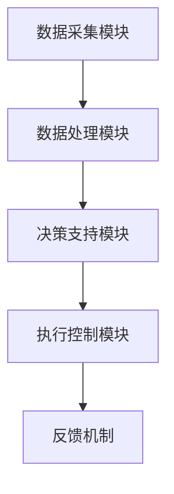
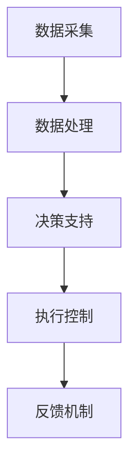
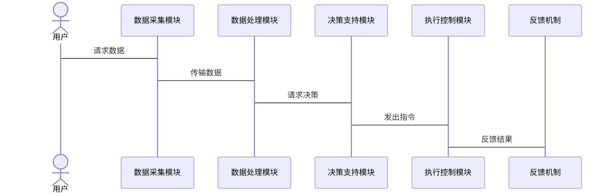

                 


# AI Agent在海洋科学中的应用：海洋资源管理与保护

## 关键词：
AI Agent, 海洋科学, 海洋资源管理, 保护, 海洋环境, 人工智能, 机器学习

## 摘要：
本文探讨了AI Agent在海洋科学中的应用，特别是如何利用AI Agent进行海洋资源管理和保护。通过详细介绍AI Agent的核心原理、算法和系统架构，结合具体案例和代码示例，展示了AI Agent在海洋环境监测、资源保护、灾害预警等方面的重要作用。

---

# 第1章: AI Agent与海洋科学的背景介绍

## 1.1 AI Agent的基本概念

### 1.1.1 AI Agent的定义与核心要素
AI Agent是一种智能实体，能够感知环境、自主决策并执行任务。其核心要素包括：
1. **感知能力**：通过传感器或其他数据源获取环境信息。
2. **推理能力**：利用逻辑推理或机器学习模型处理信息。
3. **决策能力**：基于推理结果做出最优决策。
4. **执行能力**：通过动作或输出影响环境。

### 1.1.2 AI Agent与传统AI的区别
AI Agent具备自主性和适应性，能够与环境动态交互，而传统AI通常是在静态环境中执行特定任务。

### 1.1.3 AI Agent在海洋科学中的应用前景
AI Agent在海洋资源监测、生态保护、灾害预警等领域具有广阔的应用前景。

## 1.2 海洋科学的基本概念

### 1.2.1 海洋资源的定义与分类
海洋资源包括渔业资源、矿产资源、能源资源等，分类依据包括资源类型和分布区域。

### 1.2.2 海洋环境的复杂性与挑战
海洋环境复杂多变，面临污染、过度捕捞等问题，需要智能化解决方案。

### 1.2.3 海洋科学与人类社会的关联
海洋科学的研究成果对经济发展、环境保护具有重要影响。

---

# 第2章: AI Agent在海洋科学中的核心概念与联系

## 2.1 AI Agent的核心原理

### 2.1.1 AI Agent的感知、决策与执行机制
- **感知**：通过传感器获取海洋环境数据。
- **决策**：基于感知数据做出决策。
- **执行**：通过执行机构影响环境。

### 2.1.2 AI Agent的自主性与适应性
AI Agent能够根据环境变化调整行为，具备高度的自主性和适应性。

### 2.1.3 AI Agent与海洋环境的交互方式
AI Agent通过传感器、通信设备与海洋环境交互，实现监测和控制。

## 2.2 AI Agent与海洋科学的实体关系图

```mermaid
erd
    entity 海洋环境 {
        id
        温度
        湿度
        污染物浓度
    }
    entity AI Agent {
        id
        状态
        决策规则
    }
    entity 海洋资源 {
        id
        类型
        分布区域
    }
    relation R1: AI Agent 监测 海洋环境
    relation R2: AI Agent 管理 海洋资源
```

---

# 第3章: AI Agent的感知与数据处理

## 3.1 海洋环境数据的采集与处理

### 3.1.1 海洋传感器数据的获取
AI Agent通过海洋传感器获取实时数据，如温度、盐度、溶解氧等。

### 3.1.2 数据预处理与特征提取
数据预处理包括去噪、归一化等步骤，特征提取则利用主成分分析等方法。

### 3.1.3 数据融合与质量控制
通过数据融合技术，整合多源数据，提高数据准确性。

## 3.2 AI Agent的感知算法

### 3.2.1 基于深度学习的海洋目标识别
使用卷积神经网络（CNN）进行海洋生物识别，如鱼类、珊瑚礁等。

### 3.2.2 基于强化学习的环境感知
通过强化学习算法，AI Agent学习最优的感知策略。

### 3.2.3 感知算法的优缺点对比
| 算法类型 | 优点 | 缺点 |
|----------|------|------|
| CNN      | 高精度 | 计算资源消耗大 |
| 强化学习  | 自适应 | 需大量训练数据 |

---

# 第4章: AI Agent的决策与规划算法

## 4.1 决策算法的核心原理

### 4.1.1 基于规则的决策系统
通过预定义规则进行决策，适用于简单场景。

### 4.1.2 基于概率的决策模型
利用贝叶斯网络等概率模型进行决策。

### 4.1.3 基于强化学习的决策优化
通过强化学习优化决策策略，提高决策效率。

## 4.2 规划算法的实现

### 4.2.1 A*算法在路径规划中的应用
A*算法通过评估节点优先级找到最优路径。

### 4.2.2 RRT算法在动态环境中的应用
RRT算法适用于动态环境中的路径规划。

### 4.2.3 规划算法的性能对比
| 算法 | 优点 | 缺点 |
|------|------|------|
| A*    | 高效 | 不适合动态环境 |
| RRT   | 灵活 | 计算复杂度高 |

---

# 第5章: AI Agent的执行与反馈机制

## 5.1 执行算法的核心原理

### 5.1.1 基于PID控制的执行系统
PID控制是一种常用的反馈控制方法，适用于连续调节任务。

### 5.1.2 基于模糊逻辑的执行策略
模糊逻辑能够处理模糊信息，适用于复杂场景。

### 5.1.3 执行算法的适应性优化
通过不断优化算法参数，提高执行系统的适应性。

## 5.2 反馈机制的设计

### 5.2.1 基于模型的反馈系统
通过建立数学模型进行反馈控制。

### 5.2.2 基于数据驱动的反馈机制
利用机器学习模型进行实时反馈。

### 5.2.3 反馈机制的实时性与稳定性
反馈机制需要在保证实时性的同时，确保系统的稳定性。

---

# 第6章: 海洋资源管理与保护的系统架构设计

## 6.1 系统功能设计

### 6.1.1 系统功能模块
包括数据采集、决策支持、执行控制等模块。

### 6.1.2 功能模块的交互流程


## 6.2 系统架构设计

### 6.2.1 系统架构图


## 6.3 系统接口设计

### 6.3.1 系统接口定义
定义系统各模块之间的接口，确保模块之间的协同工作。

### 6.3.2 接口通信协议
选择合适的通信协议，如HTTP、MQTT等。

## 6.4 系统交互设计

### 6.4.1 系统交互流程


---

# 第7章: 项目实战与案例分析

## 7.1 项目介绍

### 7.1.1 项目背景
某海洋保护区的资源监测项目，旨在利用AI Agent实现智能化管理。

### 7.1.2 项目目标
实现海洋环境的实时监测、资源保护和灾害预警。

## 7.2 核心实现

### 7.2.1 数据采集模块
使用海洋传感器采集实时数据，代码如下：

```python
import serial

ser = serial.Serial('COM1', 9600)
while True:
    data = ser.readline().decode()
    print(data)
```

### 7.2.2 数据处理模块
对采集的数据进行预处理和特征提取，代码如下：

```python
import numpy as np

data = np.array([1, 2, 3, 4, 5])
mean = np.mean(data)
std = np.std(data)
print(f"均值: {mean}, 标准差: {std}")
```

### 7.2.3 决策支持模块
基于机器学习模型进行决策，代码如下：

```python
from sklearn.ensemble import RandomForestClassifier

model = RandomForestClassifier()
model.fit(X_train, y_train)
预测结果 = model.predict(X_test)
```

## 7.3 实际案例分析

### 7.3.1 案例背景
某海域发生赤潮，需要及时监测和处理。

### 7.3.2 案例分析
通过AI Agent实时监测赤潮扩散情况，优化资源分配，减少损失。

## 7.4 项目小结
通过AI Agent实现海洋资源管理与保护，提高了监测效率和保护效果。

---

# 第8章: 总结与展望

## 8.1 总结
AI Agent在海洋科学中的应用前景广阔，能够有效提升海洋资源管理与保护的效率。

## 8.2 展望
未来，AI Agent将在海洋科学中发挥更大的作用，推动海洋科学的发展。

---

# 结语

AI Agent在海洋科学中的应用是技术与实践的完美结合，通过不断的技术创新和实践积累，AI Agent将成为海洋资源管理与保护的重要工具。

