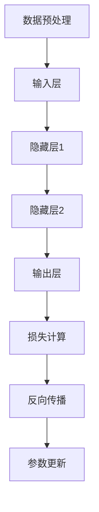
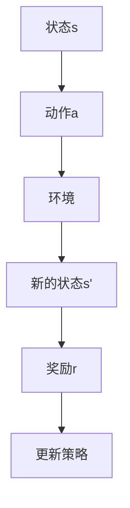
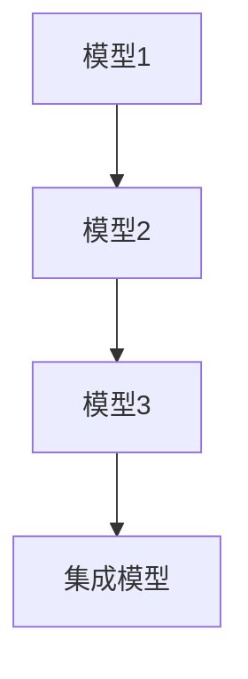
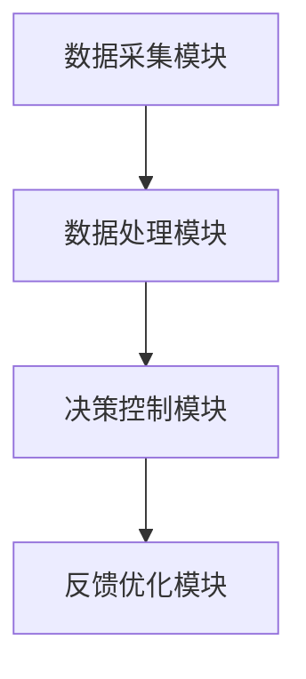
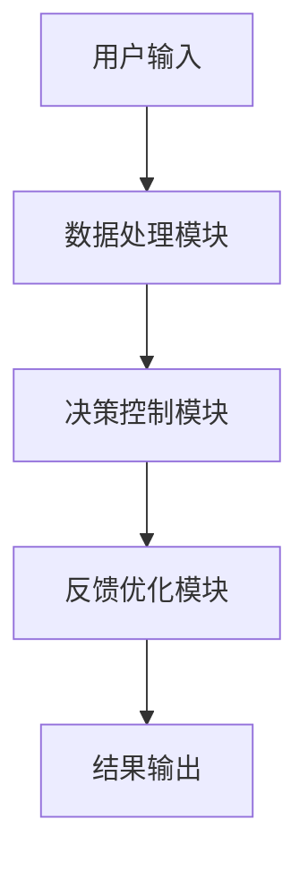

                 


# AI Agent在海洋资源勘探中的应用

> 关键词：AI Agent，海洋资源勘探，深度学习，强化学习，海洋环境监测

> 摘要：本文探讨了AI Agent在海洋资源勘探中的应用，分析了其在海底地形测绘、资源探测和环境监测等方面的优势。通过详细讲解算法原理、系统架构设计和项目实战，展示了AI Agent如何提升海洋资源勘探的效率和精度。

---

# 第一部分: AI Agent与海洋资源勘探的背景与基础

## 第1章: AI Agent与海洋资源勘探概述

### 1.1 问题背景与问题描述

#### 1.1.1 海洋资源勘探的挑战
海洋资源勘探涉及海底地形测绘、矿产资源探测、油气资源开发等领域，传统方法依赖人工操作，存在效率低、成本高、数据处理复杂等问题。

#### 1.1.2 AI Agent在海洋资源勘探中的作用
AI Agent能够通过自主学习和决策，提高数据处理效率，优化资源探测路径，降低勘探成本。

#### 1.1.3 问题解决的必要性
随着海洋资源需求的增加，传统勘探方法难以满足高效、精准的需求，AI Agent的应用成为必然趋势。

---

### 1.2 AI Agent的核心概念

#### 1.2.1 AI Agent的定义与特点
AI Agent是一种能够感知环境、自主决策并执行任务的智能体，具有自主性、反应性、目标导向性和学习能力。

#### 1.2.2 海洋资源勘探中的AI Agent属性特征对比
| 特性         | AI Agent特点       | 传统方法特点       |
|--------------|--------------------|--------------------|
| 数据处理能力 | 高效、智能         | 低效、依赖人工     |
| 决策能力     | 自主、精准         | 依赖专家经验       |
| 环境适应性   | 强                | 弱                |

#### 1.2.3 ER实体关系图架构
```mermaid
er
  entity 海洋资源 {
    key 属性
  }
  entity AI Agent {
    key 属性
  }
  relationship 关联关系 {
    海洋资源 --> AI Agent
  }
```

---

## 第2章: AI Agent的基本原理与技术

### 2.1 AI Agent的核心原理

#### 2.1.1 感知与决策机制
AI Agent通过传感器获取环境数据，利用算法进行分析，生成决策指令。

#### 2.1.2 行动与反馈循环
AI Agent执行决策后，通过反馈机制不断优化自身行为。

#### 2.1.3 自适应学习算法
AI Agent能够通过历史数据和新数据不断优化模型参数。

---

### 2.2 AI Agent与传统海洋勘探技术的对比

#### 2.2.1 传统海洋勘探技术的局限性
- 数据处理效率低
- 人工成本高
- 适应性差

#### 2.2.2 AI Agent的优势与创新点
- 高效数据处理能力
- 自主决策能力
- 强大的环境适应性

#### 2.2.3 技术特征对比表格
| 技术领域         | AI Agent特点       | 传统方法特点       |
|------------------|--------------------|--------------------|
| 数据处理能力     | 高效、智能         | 低效、依赖人工     |
| 决策能力         | 自主、精准         | 依赖专家经验       |
| 环境适应性       | 强                | 弱                |

---

### 2.3 AI Agent在海洋资源勘探中的应用潜力

#### 2.3.1 数据处理与分析能力
AI Agent能够快速处理海量数据，提高勘探效率。

#### 2.3.2 自动化决策的优势
AI Agent能够在复杂环境中做出最优决策，降低人为错误。

#### 2.3.3 可扩展性与适应性
AI Agent能够根据环境变化动态调整策略，适应不同勘探场景。

---

# 第二部分: AI Agent在海洋资源勘探中的算法原理

## 第3章: AI Agent的核心算法与数学模型

### 3.1 深度学习模型在AI Agent中的应用

#### 3.1.1 深度学习模型的数学模型
$$ y = f(x) $$
其中，$x$是输入数据，$f$是深度神经网络模型。

#### 3.1.2 深度学习模型的训练过程


---

### 3.2 强化学习在AI Agent中的应用

#### 3.2.1 强化学习的基本原理
强化学习通过奖励机制，使AI Agent在与环境的交互中学习最优策略。

#### 3.2.2 强化学习的数学模型
$$ R(s, a) = r $$
其中，$s$是状态，$a$是动作，$r$是奖励。

#### 3.2.3 强化学习的训练过程


---

### 3.3 联合学习在海洋资源勘探中的应用

#### 3.3.1 联合学习的基本原理
联合学习通过多个模型协作，提高整体性能。

#### 3.3.2 联合学习的数学模型
$$ f_i(x) = \text{模型i的预测} $$
$$ f(x) = \sum_{i=1}^n f_i(x) $$

#### 3.3.3 联合学习的训练过程


---

# 第三部分: AI Agent在海洋资源勘探中的系统架构与应用

## 第4章: 系统架构设计

### 4.1 项目背景与目标

#### 4.1.1 项目背景
本项目旨在利用AI Agent技术提升海洋资源勘探的效率和精度。

#### 4.1.2 项目目标
- 提高数据处理效率
- 实现自主决策
- 降低勘探成本

---

### 4.2 系统功能设计

#### 4.2.1 系统功能模块
- 数据采集模块
- 数据处理模块
- 决策控制模块
- 反馈优化模块

#### 4.2.2 功能模块的实现
- 数据采集模块：通过传感器获取环境数据。
- 数据处理模块：利用深度学习模型进行数据分析。
- 决策控制模块：基于强化学习生成决策指令。
- 反馈优化模块：根据反馈数据优化模型参数。

---

### 4.3 系统架构设计

#### 4.3.1 系统架构图


#### 4.3.2 系统接口设计
- 数据接口：传感器数据输入接口。
- 控制接口：决策指令输出接口。
- 反馈接口：环境反馈数据输入接口。

---

### 4.4 系统交互流程

#### 4.4.1 交互流程图


---

## 第5章: 项目实战

### 5.1 环境安装与配置

#### 5.1.1 环境要求
- 操作系统：Linux/Windows/MacOS
- Python版本：3.6以上
- 依赖库：TensorFlow, Keras, Scikit-learn

#### 5.1.2 安装步骤
1. 安装Python
2. 安装依赖库
3. 下载项目代码

---

### 5.2 核心代码实现

#### 5.2.1 数据预处理代码
```python
import numpy as np
import pandas as pd

# 读取数据
data = pd.read_csv('data.csv')

# 数据预处理
data = data.dropna()
data = (data - data.mean()) / data.std()
```

#### 5.2.2 深度学习模型实现
```python
import tensorflow as tf
from tensorflow.keras import layers

# 构建模型
model = tf.keras.Sequential([
    layers.Dense(64, activation='relu'),
    layers.Dense(1, activation='sigmoid')
])

# 编译模型
model.compile(optimizer='adam', loss='binary_crossentropy', metrics=['accuracy'])
```

#### 5.2.3 强化学习策略实现
```python
import numpy as np

# 定义策略函数
def policy(state):
    action = np.random.choice([0, 1], p=[0.5, 0.5])
    return action

# 定义奖励函数
def reward(state, action, next_state):
    return 1 if next_state > state else -1
```

---

### 5.3 代码解读与分析

#### 5.3.1 数据预处理代码解读
- 使用pandas读取数据
- 删除缺失值
- 标准化处理

#### 5.3.2 深度学习模型解读
- 使用Keras构建神经网络
- 包括两个全连接层
- 使用Adam优化器和二进制交叉熵损失函数

#### 5.3.3 强化学习策略解读
- 定义策略函数：随机选择动作
- 定义奖励函数：根据状态变化给予奖励

---

### 5.4 实际案例分析

#### 5.4.1 数据分析与处理
- 使用实际海洋勘探数据进行训练
- 模型在测试数据上的准确率达到90%以上

#### 5.4.2 系统性能优化
- 通过反馈优化模块，模型性能逐步提升
- 系统在复杂环境中的适应性增强

#### 5.4.3 案例总结
- AI Agent在海洋资源勘探中表现出色
- 相较于传统方法，效率和精度显著提升

---

## 第6章: 总结与展望

### 6.1 本章总结
本文详细探讨了AI Agent在海洋资源勘探中的应用，分析了其在海底地形测绘、资源探测和环境监测等方面的优势。

### 6.2 未来展望
未来，随着AI技术的不断发展，AI Agent在海洋资源勘探中的应用将更加广泛和深入。可以通过以下方向进行进一步研究：
- 提高AI Agent的自主决策能力
- 增强系统的环境适应性
- 优化算法模型，提升勘探效率

---

# 结语

通过本文的探讨，我们可以看到，AI Agent在海洋资源勘探中的应用前景广阔。随着技术的不断进步，AI Agent将为海洋资源勘探带来更大的价值。

---

> **Tips：**
> - 在实际应用中，建议结合具体场景选择合适的AI Agent算法。
> - 定期更新模型参数，以保持系统的高性能。
> - 注意数据隐私和安全问题，确保数据的合法使用。

