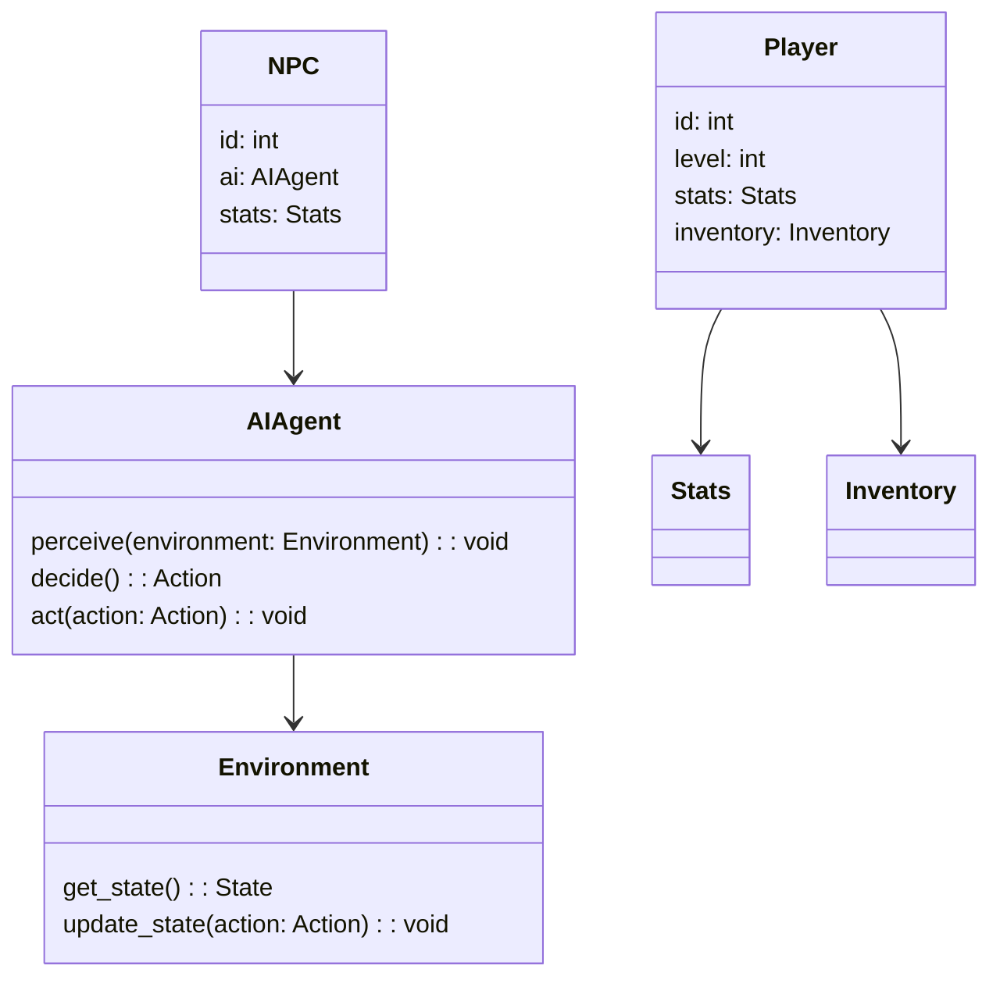
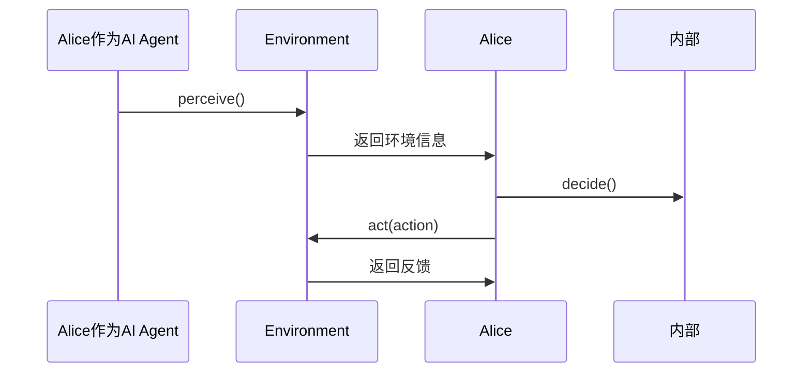

                 


# AI Agent在游戏开发中的创新应用

> 关键词：AI Agent, 游戏开发, 智能NPC, 多智能体协作, 强化学习, 游戏难度自适应

> 摘要：本文探讨AI Agent在游戏开发中的创新应用，包括智能NPC设计、自适应游戏难度调整和多智能体协作与竞争。通过分析AI Agent的核心概念、算法原理和系统架构，结合实际项目案例，展示AI Agent如何提升游戏体验和开发效率。

---

# 第一部分: AI Agent在游戏开发中的创新应用概述

## 第1章: 游戏开发的现状与AI Agent的引入

### 1.1 游戏开发的现状

#### 1.1.1 传统游戏开发的流程与挑战
- **传统开发流程**：需求分析、设计、编码、测试、优化、发布。
- **挑战**：
  - 开发周期长。
  - 需要大量人工调整。
  - 如何让NPC行为多样化、智能是难题。

#### 1.1.2 游戏行业的发展趋势
- **趋势**：游戏智能化、个性化体验、虚拟现实、增强现实。
- **技术推动**：AI、大数据、云计算。

#### 1.1.3 AI技术在游戏领域的潜力
- **潜力点**：
  - 提高NPC智能。
  - 实现动态难度调整。
  - 支持玩家行为预测与分析。

### 1.2 AI Agent的基本概念

#### 1.2.1 什么是AI Agent
- AI Agent是能够感知环境并采取行动以实现目标的智能体。
- **核心特征**：自主性、反应性、学习能力、社交能力。

#### 1.2.2 AI Agent的核心特征
| 特征 | 描述 |
|------|------|
| 自主性 | 能够独立决策和行动。 |
| 反应性 | 能够根据环境变化调整行为。 |
| 学习能力 | 能够通过经验改进表现。 |
| 社交能力 | 能够与其他智能体或玩家互动。 |

#### 1.2.3 AI Agent与传统游戏AI的区别
- **传统游戏AI**：基于规则的简单逻辑。
- **AI Agent**：具备学习和适应能力，能够处理复杂任务。

### 1.3 AI Agent在游戏开发中的应用前景

#### 1.3.1 AI Agent在游戏中的潜在应用领域
- **智能NPC**：实现多样化的交互和行为。
- **自适应游戏难度**：根据玩家水平动态调整难度。
- **多智能体协作**：实现复杂的游戏机制。

#### 1.3.2 游戏开发者采用AI Agent的优势
- **提高游戏体验**：智能NPC和动态难度提升玩家体验。
- **降低开发成本**：自动化处理复杂逻辑，减少人工干预。
- **加速开发周期**：AI技术帮助快速实现复杂功能。

#### 1.3.3 AI Agent应用的挑战与机遇
- **挑战**：算法复杂度高，开发难度大。
- **机遇**：技术创新带来竞争优势。

### 1.4 本章小结
- 介绍了传统游戏开发的挑战和AI技术的潜力。
- 阐述了AI Agent的核心概念及其在游戏开发中的应用前景。

---

## 第2章: AI Agent的核心概念与原理

### 2.1 AI Agent的定义与分类

#### 2.1.1 AI Agent的定义
- AI Agent是具备感知和行动能力的智能体，能够根据环境做出决策。

#### 2.1.2 AI Agent的分类
| 类型 | 描述 |
|------|------|
| 简单反射型 | 基于当前状态做出反应。 |
| 基于模型型 | 使用内部模型进行决策。 |
| 目标驱动型 | 为实现特定目标而行动。 |
| 学习型 | 通过经验改进表现。 |

#### 2.1.3 各类AI Agent的特点对比
- **简单反射型**：反应速度快，但缺乏深度思考。
- **基于模型型**：决策基于内部模型，适合复杂环境。
- **目标驱动型**：专注于实现特定目标。
- **学习型**：通过学习不断优化行为。

### 2.2 AI Agent的核心原理

#### 2.2.1 智能决策机制
- **决策树**：通过树状结构选择最优路径。
- **行为树**：通过任务分解进行行为选择。

#### 2.2.2 行为规划算法
- **路径规划算法**：A*、RRT等。
- **行为树实现**：任务分解与优先级排序。

#### 2.2.3 机器学习的应用
- **强化学习**：通过奖励机制优化行为。
- **监督学习**：基于大量数据进行训练。

### 2.3 AI Agent与游戏环境的交互

#### 2.3.1 状态感知
- **感知方式**：通过传感器或API获取环境信息。
- **信息处理**：对感知信息进行分析和处理。

#### 2.3.2 行为选择
- **基于状态的决策**：根据当前状态选择行为。
- **基于目标的决策**：根据目标选择最优行为。

#### 2.3.3 反馈机制
- **实时反馈**：根据环境反馈调整行为。
- **延迟反馈**：通过学习更新策略。

### 2.4 本章小结
- 阐述了AI Agent的定义、分类及其核心原理。
- 介绍了AI Agent与游戏环境交互的方式和机制。

---

## 第3章: AI Agent在游戏中的创新应用

### 3.1 智能NPC的设计与实现

#### 3.1.1 智能NPC的基本概念
- **智能NPC**：具备自主决策和行为能力的非玩家角色。

#### 3.1.2 基于AI Agent的智能NPC设计
- **行为树设计**：任务分解与优先级排序。
- **状态机实现**：根据状态转换实现行为变化。

#### 3.1.3 智能NPC的行为树实现
- **行为树结构**：根节点、子节点、叶子节点。
- **优先级处理**：根据优先级选择行为。

### 3.2 自适应游戏难度的设计

#### 3.2.1 游戏难度调整的必要性
- **玩家体验**：保持玩家兴趣和挑战性。
- **游戏平衡**：确保游戏公平性和可玩性。

#### 3.2.2 基于玩家行为的难度自适应
- **实时监测**：监测玩家行为和表现。
- **动态调整**：根据玩家水平动态调整难度。

#### 3.2.3 AI Agent在难度调整中的应用
- **学习算法**：通过强化学习优化难度调整策略。

### 3.3 多智能体协作与竞争

#### 3.3.1 多智能体协作的基本概念
- **协作机制**：智能体之间相互协作完成任务。
- **竞争机制**：智能体之间进行竞争，提高游戏难度。

#### 3.3.2 基于AI Agent的多智能体协作实现
- **通信协议**：智能体之间通过通信协议进行协作。
- **协作策略**：制定协作策略实现任务目标。

#### 3.3.3 多智能体竞争机制
- **竞争规则**：制定竞争规则确保公平性。
- **动态调整**：根据竞争结果动态调整策略。

### 3.4 本章小结
- 介绍了智能NPC、自适应难度和多智能体协作与竞争的应用。
- 阐述了AI Agent在游戏中的创新应用和实际效果。

---

## 第4章: AI Agent算法原理与实现

### 4.1 路径规划算法

#### 4.1.1 A*算法原理
- **基本原理**：通过评估函数找到最短路径。
- **算法步骤**：
  1. 初始化开放列表和关闭列表。
  2. 取开放列表中f值最小的节点。
  3. 展开当前节点，生成子节点。
  4. 检查子节点是否在开放列表或关闭列表中。
  5. 更新子节点的g值和f值。
  6. 重复直到找到目标节点。

#### 4.1.2 RRT算法原理
- **基本原理**：通过随机采样生成路径。
- **算法步骤**：
  1. 初始化随机树。
  2. 采样随机点。
  3. 找到最近的树节点。
  4. 添加新边到随机树。
  5. 检查是否到达目标区域。
  6. 重复直到找到可行路径。

#### 4.1.3 算法的优缺点对比
| 算法 | 优点 | 缺点 |
|------|------|------|
| A* | 路径优化，效率高 | 易受地图复杂度影响 |
| RRT | 适用于高维空间 | 计算复杂，路径不一定最优 |

### 4.2 状态机与行为树

#### 4.2.1 状态机的基本概念
- **状态机**：通过状态转换实现行为变化。
- **状态机实现**：使用状态类和状态转移函数。

#### 4.2.2 行为树的实现原理
- **行为树结构**：根节点、子节点、叶子节点。
- **优先级处理**：根据优先级选择行为。

#### 4.2.3 状态机与行为树的结合应用
- **联合使用**：状态机管理全局状态，行为树处理具体任务。

### 4.3 强化学习在游戏AI中的应用

#### 4.3.1 强化学习的基本原理
- **基本原理**：通过试错学习优化策略。
- **数学模型**：
  - 状态空间：S。
  - 行动空间：A。
  - 奖励函数：R(s, a)。
  - 策略：π(a|s)。

#### 4.3.2 强化学习的实现步骤
1. 初始化策略π。
2. 在环境中执行动作，观察奖励和新状态。
3. 更新策略以最大化期望奖励。
4. 重复直到策略收敛。

#### 4.3.3 强化学习在游戏AI中的应用实例
- **案例分析**：使用强化学习训练智能体在复杂环境中生存和战斗。

### 4.4 本章小结
- 阐述了路径规划、状态机和行为树的核心算法及其应用。
- 介绍了强化学习的基本原理和在游戏AI中的应用实例。

---

## 第5章: 系统架构设计与实现

### 5.1 游戏场景介绍

#### 5.1.1 游戏背景设定
- **设定目标**：设计一个支持智能NPC和自适应难度的RPG游戏。

#### 5.1.2 游戏功能需求
- **智能NPC**：实现多样化的交互和行为。
- **自适应难度**：根据玩家水平动态调整难度。
- **多智能体协作**：实现复杂的游戏机制。

### 5.2 系统功能设计

#### 5.2.1 领域模型设计
- **领域模型类图**：


#### 5.2.2 系统架构设计
- **分层架构**：数据层、逻辑层、表现层。
- **组件设计**：AI Agent组件、行为树组件、路径规划组件。

### 5.2.3 系统接口设计
- **AI Agent接口**：
  - `perceive()`: 获取环境信息。
  - `decide()`: 返回决策动作。
  - `act(action)`: 执行动作。

- **环境接口**：
  - `get_state()`: 返回当前状态。
  - `update_state(action)`: 更新环境状态。

#### 5.2.4 系统交互流程
- **交互流程图**：


### 5.3 本章小结
- 阐述了游戏场景的设计和系统功能需求。
- 展示了领域模型类图和系统架构图，描述了各组件的交互流程。

---

## 第6章: 项目实战与代码实现

### 6.1 环境安装与配置

#### 6.1.1 开发工具安装
- **代码编辑器**：Visual Studio、IntelliJ IDEA。
- **版本控制工具**：Git。
- **依赖管理工具**：Maven、npm。

#### 6.1.2 项目初始化
- **创建新项目**：选择合适的技术栈（如Java、Python）。
- **安装依赖库**：如TensorFlow、NumPy。

#### 6.1.3 环境配置
- **配置文件**：设置API密钥、数据库连接信息。
- **权限管理**：设置用户权限。

### 6.2 核心代码实现

#### 6.2.1 AI Agent核心代码
```python
class AIAgent:
    def __init__(self, environment):
        self.environment = environment
        self.perception = Perception()
        self.decision = Decision()
        self.action = Action()

    def perceive(self):
        return self.perception.get_state(self.environment)

    def decide(self, state):
        return self.decision.make_decision(state)

    def act(self, action):
        return self.action.execute_action(action)
```

#### 6.2.2 行为树实现代码
```python
class BehaviorTree:
    def __init__(self, root_node):
        self.root_node = root_node

    def execute(self):
        return self.root_node.execute()
```

#### 6.2.3 强化学习训练代码
```python
class RLAgent:
    def __init__(self, state_space, action_space):
        self.state_space = state_space
        self.action_space = action_space
        self.model = self.build_model()

    def build_model(self):
        # 网络结构定义
        pass

    def act(self, state):
        # 根据策略选择动作
        pass

    def update(self, state, action, reward, next_state):
        # 更新策略
        pass
```

#### 6.2.4 代码解读与分析
- **AI Agent实现**：感知、决策、行动三大部分。
- **行为树实现**：节点执行和状态管理。
- **强化学习实现**：策略网络、动作选择和策略更新。

### 6.3 项目小结

#### 6.3.1 项目成果
- 成功实现智能NPC和自适应难度。
- 验证了AI Agent在游戏开发中的应用潜力。

#### 6.3.2 经验总结
- **代码管理**：版本控制和模块化设计的重要性。
- **算法优化**：选择合适的算法和参数调整。
- **测试与调试**：全面测试和持续优化。

---

## 第7章: 最佳实践与总结

### 7.1 最佳实践 tips

#### 7.1.1 项目管理
- **团队协作**：使用Git进行版本控制，确保代码整洁。
- **模块化设计**：将功能模块化，便于维护和扩展。

#### 7.1.2 技术选型
- **选择合适的AI算法**：根据需求选择路径规划、状态机或强化学习。
- **工具与库的选择**：使用成熟的框架和库提高效率。

#### 7.1.3 测试与优化
- **单元测试**：确保各模块功能正常。
- **性能优化**：减少计算复杂度，提升运行效率。

### 7.2 本章小结
- 总结了AI Agent在游戏开发中的最佳实践。
- 强调了代码管理、技术选型和测试优化的重要性。

### 7.3 注意事项

#### 7.3.1 开发中的常见问题
- **性能瓶颈**：复杂算法可能导致性能下降。
- **代码耦合**：模块间耦合度过高影响维护性。

#### 7.3.2 解决方案
- **优化算法**：选择更适合的算法或优化现有算法。
- **解耦设计**：使用设计模式降低耦合度。

### 7.4 拓展阅读

#### 7.4.1 推荐书籍
- 《AI: A Modern Approach》。
- 《Game AI Programming: Theory and Practice》。

#### 7.4.2 在线资源
- 官方文档：OpenAI、TensorFlow。
- 技术博客：Towards Data Science、Medium。

### 7.5 本章小结
- 提供了开发中的注意事项和拓展阅读资源。
- 帮助读者进一步深入学习和实践。

---

## 附录: AI Agent在游戏开发中的数学公式

### 1. 强化学习的数学模型
- **状态空间**：S。
- **行动空间**：A。
- **奖励函数**：R(s, a)。
- **策略**：π(a|s)。

### 2. A*算法的评估函数
- **g(n)**：从起点到节点n的实际成本。
- **h(n)**：从节点n到目标的估计成本。
- **f(n) = g(n) + h(n)**。

### 3. 强化学习的损失函数
$$ \text{损失} = -\sum_{s,a} \log(\pi(a|s)) \cdot Q(s,a) $$

---

## 参考文献
- Russell, S., & Norvig, P. (2020). AI: A Modern Approach.
- David, C. (2017). Game AI Programming: Theory and Practice.

---

# 结语
通过本文的系统介绍，读者可以全面了解AI Agent在游戏开发中的创新应用，包括核心概念、算法原理、系统架构和项目实战。AI Agent的应用为游戏行业带来了新的可能性，未来随着技术的发展，AI Agent将在游戏开发中发挥更大的作用。

