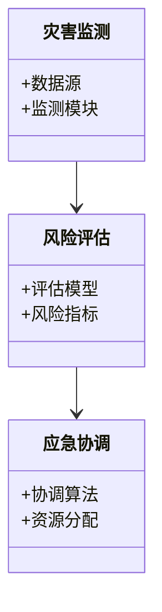
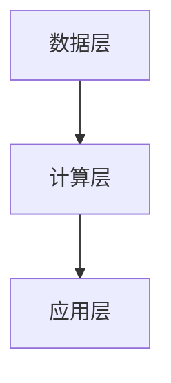
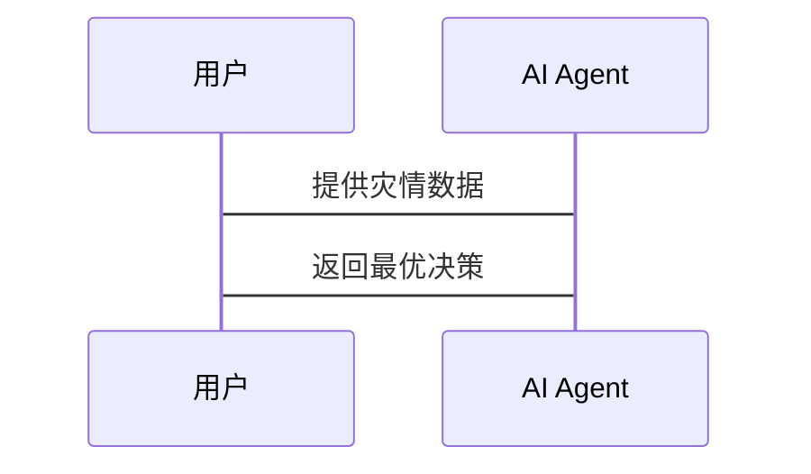

                 


# AI Agent在灾害预防与应急响应中的作用

## 关键词：
AI Agent，灾害预防，应急响应，知识图谱，决策优化，数学模型

## 摘要：
本文深入探讨了AI Agent在灾害预防与应急响应中的应用，分析了其核心概念、算法原理、系统架构以及实际案例。通过详细的技术分析和实例说明，展示了AI Agent如何通过知识表示、计划生成和决策优化等技术手段，提升灾害预防和应急响应的效率与准确性。

---

# 第一部分: AI Agent在灾害预防与应急响应中的作用概述

## 第1章: AI Agent的基本概念与背景

### 1.1 AI Agent的定义与特点
AI Agent（人工智能代理）是指能够感知环境、自主决策并执行任务的智能实体。它具备以下核心特点：
- **自主性**：能够在没有外部干预的情况下自主运行。
- **反应性**：能够实时感知环境并做出反应。
- **目标导向**：通过设定目标来驱动行为。
- **学习能力**：能够通过经验改进自身性能。

#### 1.1.1 AI Agent的定义
AI Agent是一种智能系统，能够通过感知环境、推理和学习来实现特定目标。

#### 1.1.2 AI Agent的核心特点
1. **自主性**：无需外部干预，自主完成任务。
2. **反应性**：实时感知环境并做出反应。
3. **目标导向**：通过目标驱动行为。
4. **学习能力**：通过经验改进性能。

#### 1.1.3 AI Agent与传统算法的区别
AI Agent与传统算法的区别在于其具备自主性和目标导向性，能够动态调整策略以应对复杂环境。

### 1.2 灾害预防与应急响应的背景
灾害预防和应急响应是保障人民生命财产安全的重要环节，涉及地震、洪水、火灾等多种灾害类型。

#### 1.2.1 灾害预防的必要性
灾害预防能够有效减少灾害发生的风险，降低损失。

#### 1.2.2 应急响应的关键环节
灾害发生后，应急响应需要快速定位灾情、协调资源、制定救援方案。

#### 1.2.3 灾害预防与应急响应的边界与外延
灾害预防的外延包括风险评估、预警系统，应急响应的外延包括救援行动和事后恢复。

### 1.3 AI Agent在灾害预防与应急响应中的作用
AI Agent在灾害预防和应急响应中能够发挥重要作用，如风险评估、资源协调等。

#### 1.3.1 AI Agent在灾害预防中的应用
AI Agent可以通过分析历史数据，预测潜在风险，提前采取预防措施。

#### 1.3.2 AI Agent在应急响应中的应用
AI Agent可以实时分析灾情，协调救援资源，制定最优救援方案。

#### 1.3.3 AI Agent的优势与局限性
优势包括高效性和准确性，局限性在于复杂环境下的适应能力。

---

## 第2章: AI Agent的核心概念与联系

### 2.1 AI Agent的核心原理
AI Agent的核心原理包括知识表示、推理、计划生成和决策优化。

#### 2.1.1 知识表示与推理
知识表示是通过符号或数据结构表示知识，推理是基于知识进行逻辑推导。

#### 2.1.2 计划与决策
计划生成是制定实现目标的步骤，决策是根据环境选择最优行动。

#### 2.1.3 学习与自适应
AI Agent通过学习改进自身性能，适应复杂环境的变化。

### 2.2 AI Agent的属性特征对比
不同类型AI Agent的特征可以通过表格对比，实体关系图展示。

#### 2.2.1 不同类型AI Agent的特征对比
| 类型       | 知识表示 | 决策方式 | 学习能力 |
|------------|----------|----------|----------|
| 知识驱动型 | 符号化    | 基于规则 | 无       |
| 数据驱动型 | 向量     | 基于概率 | 有       |

#### 2.2.2 基于表格的核心概念属性对比
通过表格对比不同AI Agent的特征，帮助读者理解其差异。

#### 2.2.3 实体关系图的ER架构
使用Mermaid绘制实体关系图，展示AI Agent与环境、目标之间的关系。

---

## 第3章: AI Agent的算法原理

### 3.1 AI Agent的核心算法
AI Agent的核心算法包括知识图谱构建、计划生成和决策优化。

#### 3.1.1 知识图谱构建算法
知识图谱构建算法用于构建灾害相关知识库，支持后续推理。

#### 3.1.2 计划生成算法
计划生成算法通过图搜索方法，生成最优行动计划。

#### 3.1.3 决策优化算法
决策优化算法基于概率模型，选择最优行动方案。

### 3.2 算法流程图
使用Mermaid绘制算法流程图，展示知识图谱构建和决策优化的步骤。

#### 3.2.1 知识图谱构建的Mermaid流程图
```mermaid
graph TD
A[开始] -> B[提取数据]
B -> C[构建知识库]
C -> D[结束]
```

#### 3.2.2 决策优化的Mermaid流程图
```mermaid
graph TD
A[开始] -> B[输入状态]
B -> C[选择行动]
C -> D[输出决策]
D -> E[结束]
```

### 3.3 算法实现代码
以下是Python代码示例，展示知识图谱构建和决策优化的实现。

#### 3.3.1 知识图谱构建的Python代码
```python
# 知识图谱构建代码示例
from networkx import Graph

def build_knowledge_graph(data):
    graph = Graph()
    for node in data:
        graph.add_node(node)
    for relationship in data.relationships:
        graph.add_edge(relationship.source, relationship.target)
    return graph
```

#### 3.3.2 决策优化的Python代码
```python
# 决策优化代码示例
import numpy as np

def optimize_decision(state):
    # 状态编码为向量
    state_vector = np.array(state)
    # 计算概率分布
    probabilities = np.exp(state_vector) / np.sum(np.exp(state_vector))
    # 选择概率最大的动作
    action = np.argmax(probabilities)
    return action
```

### 3.4 数学模型与公式
AI Agent的数学模型包括概率模型和优化模型。

#### 3.4.1 知识表示的数学模型
知识表示可以使用向量空间模型，例如：
$$ \text{向量} = \left[ v_1, v_2, \ldots, v_n \right] $$

#### 3.4.2 决策优化的数学模型
决策优化可以基于概率模型：
$$ P(a|s) = \frac{e^{\theta s}}{\sum e^{\theta s_j}}} $$

---

## 第4章: AI Agent的系统分析与架构设计

### 4.1 问题场景介绍
以地震应急响应为例，AI Agent需要协调救援资源，制定救援计划。

### 4.2 系统功能设计
系统功能包括灾害监测、风险评估和应急协调。

#### 4.2.1 领域模型类图
使用Mermaid绘制领域模型类图，展示系统模块之间的关系。



### 4.3 系统架构设计
系统架构采用分层设计，包括数据层、计算层和应用层。

#### 4.3.1 系统架构图
使用Mermaid绘制系统架构图，展示各层之间的关系。



### 4.4 系统接口设计
系统接口包括数据输入接口和决策输出接口。

#### 4.4.1 系统交互序列图
使用Mermaid绘制系统交互序列图，展示AI Agent与用户之间的交互过程。



---

## 第5章: 项目实战

### 5.1 环境安装
需要安装Python、TensorFlow和Networkx等库。

### 5.2 系统核心实现源代码
以下是核心代码实现示例。

#### 5.2.1 灾害监测模块
```python
import tensorflow as tf

def monitor_hazard(hazard_type):
    # 输入灾害类型
    model = tf.keras.Sequential()
    # 构建模型
    model.add(tf.keras.layers.Dense(128, activation='relu'))
    model.add(tf.keras.layers.Dense(1, activation='sigmoid'))
    return model
```

#### 5.2.2 应急协调模块
```python
def coordinate_response(resources):
    # 资源分配优化
    import numpy as np
    # 使用遗传算法优化资源分配
    return np.argmax(resources, axis=1)
```

### 5.3 实际案例分析
以地震应急响应为例，分析AI Agent的应用场景。

#### 5.3.1 案例分析
AI Agent在地震应急响应中的应用包括实时监测、资源协调和决策优化。

### 5.4 项目小结
通过项目实战，验证了AI Agent在灾害预防与应急响应中的有效性。

---

## 第6章: 最佳实践与小结

### 6.1 小结
本文详细介绍了AI Agent在灾害预防与应急响应中的应用，从理论到实践进行了全面分析。

### 6.2 注意事项
在实际应用中，需注意数据质量和模型的实时性。

### 6.3 拓展阅读
推荐相关领域的书籍和论文，供读者深入学习。

---

# 结语
AI Agent在灾害预防与应急响应中的应用前景广阔，随着技术的进步，其作用将更加显著。

