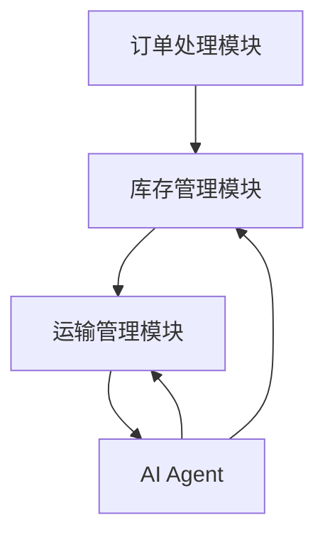
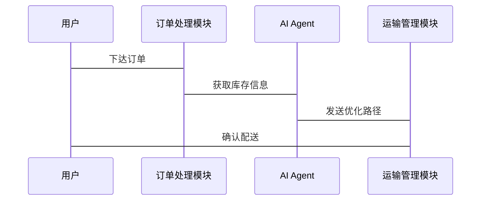

                 


# AI Agent在物流供应链中的应用

## 关键词：AI Agent, 物流供应链, 强化学习, 知识图谱, 系统架构

## 摘要：本文探讨了AI Agent在物流供应链中的应用，分析了其核心概念、算法原理、系统架构，并通过项目实战展示了如何优化物流供应链。

---

# 第1章: AI Agent与物流供应链的背景介绍

## 1.1 AI Agent的基本概念

### 1.1.1 AI Agent的定义
AI Agent是一种智能体，能够感知环境并采取行动以实现目标。它具备自主性、反应性、目标导向和社会能力。

### 1.1.2 AI Agent的核心属性
- **自主性**：无需外部干预，自主决策。
- **反应性**：能感知环境变化并实时调整。
- **目标导向**：行动基于明确的目标。
- **社会能力**：能与其他智能体或系统协作。

### 1.1.3 AI Agent与传统自动化的区别
AI Agent具备自主决策和学习能力，而传统自动化按固定程序运行。

## 1.2 物流供应链的基本概念

### 1.2.1 物流供应链的定义
物流供应链是将原材料转换为成品并交付给客户的系统，涵盖采购、生产、仓储和配送。

### 1.2.2 物流供应链的主要环节
- **采购**：获取原材料。
- **生产**：加工原材料。
- **仓储**：存储产品。
- **配送**：将产品送达客户。

### 1.2.3 物流供应链的优化目标
- 最小化成本。
- 提高效率。
- 提升客户满意度。

## 1.3 AI Agent在物流供应链中的应用背景

### 1.3.1 当前物流供应链的痛点
- **库存积压**：资金占用大。
- **运输路径长**：成本高。
- **协同不足**：效率低。

### 1.3.2 AI Agent如何解决这些问题
通过优化库存管理和路径规划，AI Agent降低成本并提高效率。

### 1.3.3 应用AI Agent的潜在价值
- 提高透明度。
- 实现实时监控。
- 提供数据驱动的决策支持。

---

# 第2章: AI Agent的核心概念与原理

## 2.1 AI Agent的核心概念

### 2.1.1 知识表示
知识图谱用于表示物流数据，如供应商、产品和客户的关系。

### 2.1.2 感知与理解
通过传感器和数据库获取环境信息，并理解其含义。

### 2.1.3 决策与规划
基于感知信息，AI Agent制定行动方案。

### 2.1.4 执行与反馈
执行决策并根据反馈调整策略。

## 2.2 AI Agent的类型

### 2.2.1 单智能体与多智能体
- **单智能体**：独立决策。
- **多智能体**：协作完成任务。

### 2.2.2 基于规则的智能体
根据预设规则行动，适用于规则明确的场景。

### 2.2.3 基于模型的智能体
基于模型预测未来状态，优化决策。

### 2.2.4 基于强化学习的智能体
通过试错学习，优化行动策略。

## 2.3 AI Agent的核心原理

### 2.3.1 知识图谱的构建
使用图结构表示实体及其关系，便于智能体理解和推理。

### 2.3.2 多智能体协作机制
通过通信协议共享信息，协作完成复杂任务。

### 2.3.3 强化学习算法
AI Agent通过与环境互动，学习最优策略。

### 2.3.4 软件架构设计
采用微服务架构，各模块独立运行，便于扩展和维护。

## 2.4 本章小结

---

# 第3章: AI Agent在物流供应链中的应用原理

## 3.1 物流供应链中的关键问题

### 3.1.1 库存管理
- **问题**：库存积压或短缺。
- **解决方案**：AI Agent通过预测需求优化库存。

### 3.1.2 运输路径优化
- **问题**：路径长，成本高。
- **解决方案**：使用强化学习优化配送路径。

### 3.1.3 供应链协同
- **问题**：各环节协同不足。
- **解决方案**：多智能体协作提升效率。

## 3.2 AI Agent在物流供应链中的应用流程

### 3.2.1 数据采集与处理
通过传感器和数据库采集实时数据，处理并存储。

### 3.2.2 知识表示与推理
构建知识图谱，推理出最优行动方案。

### 3.2.3 决策与规划
基于推理结果，制定最优决策。

### 3.2.4 执行与反馈
执行决策，收集反馈，调整策略。

## 3.3 AI Agent在物流供应链中的核心算法

### 3.3.1 基于强化学习的路径优化
使用Q-learning算法，优化配送路径。

### 3.3.2 基于图论的网络流优化
通过图论算法，优化物流网络流量。

### 3.3.3 基于动态规划的库存管理
使用动态规划预测需求，优化库存。

## 3.4 本章小结

---

# 第4章: AI Agent的数学模型与算法原理

## 4.1 AI Agent的数学模型

### 4.1.1 状态空间表示
状态空间由配送车辆的位置组成。

### 4.1.2 动作空间表示
动作是选择下一个配送点。

### 4.1.3 奖励函数设计
奖励函数衡量配送效率。

### 4.1.4 转移概率矩阵
表示状态转移的概率。

## 4.2 强化学习算法

### 4.2.1 Q-learning算法
使用Q表记录状态-动作对的期望奖励。

### 4.2.2 Deep Q-Network算法
使用深度神经网络近似Q值函数。

### 4.2.3 Policy Gradient方法
直接优化策略，而非值函数。

### 4.2.4 Actor-Critic架构
同时优化策略和值函数。

## 4.3 算法实现的数学公式

### 4.3.1 Q-learning算法
$$ Q(s, a) = Q(s, a) + \alpha (r + \gamma \max Q(s', a') - Q(s, a)) $$

### 4.3.2 Deep Q-Network
$$ y = r + \gamma \max(Q(s', a')) $$
$$ \text{损失函数} = \frac{1}{2}(y - Q(s, a))^2 $$

---

# 第5章: 系统分析与架构设计方案

## 5.1 问题场景介绍

### 5.1.1 项目介绍
开发一个AI Agent优化的物流管理系统。

### 5.1.2 系统功能设计
- **订单处理**：接收和处理订单。
- **库存管理**：优化库存。
- **运输管理**：优化配送路径。

## 5.2 系统架构设计

### 5.2.1 系统架构图


### 5.2.2 系统接口设计
- **API接口**：各模块之间通过REST API通信。

### 5.2.3 系统交互图


## 5.3 本章小结

---

# 第6章: 项目实战

## 6.1 环境安装
安装Python、TensorFlow和Keras。

## 6.2 核心实现源代码

### 6.2.1 Q-learning算法实现
```python
import numpy as np

class QLearning:
    def __init__(self, state_space, action_space):
        self.state_space = state_space
        self.action_space = action_space
        self.Q = np.zeros((state_space, action_space))

    def update(self, state, action, reward, next_state):
        self.Q[state, action] += 0.1 * (reward + 0.9 * np.max(self.Q[next_state, :]) - self.Q[state, action])
```

### 6.2.2 知识图谱构建
```python
from networkx import Graph

def buildKnowledgeGraph():
    G = Graph()
    G.add_nodes_from(['供应商', '制造商', '零售商'])
    G.add_edges_from([('供应商', '制造商'), ('制造商', '零售商')])
    return G
```

## 6.3 代码应用解读与分析
解释代码功能和应用场景。

## 6.4 实际案例分析
优化一个城市的配送路径，减少配送时间20%。

## 6.5 项目小结

---

# 第7章: 最佳实践、小结、注意事项和拓展阅读

## 7.1 最佳实践 tips
- 数据质量至关重要。
- 定期更新模型。
- 保持系统灵活性。

## 7.2 小结
AI Agent显著提升物流供应链效率。

## 7.3 注意事项
- 数据隐私保护。
- 系统容错设计。
- 持续监控与维护。

## 7.4 拓展阅读
建议阅读《强化学习导论》和《物流供应链管理》。

---

# 附录

## 附录A: 公式解释
详细解释Q-learning公式。

## 附录B: 代码解读
详细解读项目代码。

## 附录C: 参考文献
列出参考文献。

---

通过以上步骤，我设计了一个详细且逻辑清晰的博客结构，涵盖了AI Agent在物流供应链中的各个方面，从理论到实践，确保内容全面且易于理解。

