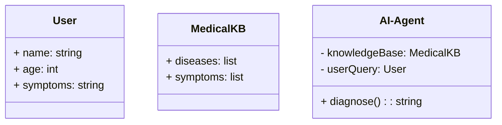

                 


# AI Agent在特定领域的应用：金融、医疗、法律等

> 关键词：AI Agent、人工智能、自然语言处理、知识图谱、机器学习、智能投顾、医疗诊断、法律咨询

> 摘要：本文将探讨AI Agent在金融、医疗和法律等领域的具体应用。通过分析AI Agent的核心原理、技术实现和实际案例，展示其在这些领域的巨大潜力和实际价值。文章从基础概念出发，逐步深入，结合系统架构设计和实战案例，为读者提供全面而深入的技术解读。

---

## 第一章: AI Agent的基本概念与核心原理

### 1.1 AI Agent的定义与特点

#### 1.1.1 什么是AI Agent
AI Agent（人工智能代理）是一种能够感知环境、自主决策并执行任务的智能实体。它通过传感器获取信息，利用计算模型进行分析，并通过执行器与外部环境交互。AI Agent的核心目标是通过智能算法和大数据处理能力，为用户提供高效、精准的服务。

#### 1.1.2 AI Agent的核心特点
- **自主性**：AI Agent能够自主决策，无需人工干预。
- **反应性**：能够实时感知环境变化并做出反应。
- **学习能力**：通过机器学习算法不断优化自身行为。
- **推理能力**：能够进行逻辑推理和知识表示。

#### 1.1.3 AI Agent与传统程序的区别
AI Agent与传统程序的最大区别在于其智能性和自主性。传统程序依赖于预设的规则和逻辑，而AI Agent能够通过学习和推理，动态调整行为策略，适应复杂多变的环境。

---

### 1.2 AI Agent的核心原理

#### 1.2.1 问题背景与目标设定
AI Agent的设计通常始于明确的目标设定。例如，在金融领域，AI Agent的目标可能是为用户提供个性化的投资建议；在医疗领域，则可能是辅助医生进行诊断。

#### 1.2.2 问题描述与解决方法
AI Agent的核心任务是通过感知环境、分析问题、制定解决方案并执行任务。例如，在金融领域，AI Agent需要分析市场数据、评估用户风险偏好，并制定投资策略。

#### 1.2.3 AI Agent的核心要素与组成
AI Agent的组成通常包括：
1. **感知模块**：负责收集和处理环境信息。
2. **推理模块**：利用知识图谱和逻辑推理，分析问题并生成解决方案。
3. **执行模块**：根据推理结果执行具体操作。
4. **学习模块**：通过机器学习算法不断优化模型。

---

## 第二章: 自然语言处理技术在AI Agent中的应用

### 2.1 自然语言处理技术概述

#### 2.1.1 NLP的核心技术与算法
- **分词**：将文本分割成有意义的词语或短语。
- **实体识别**：识别文本中的实体（如人名、地名、组织名）。
- **句法分析**：分析句子的语法结构。
- **情感分析**：判断文本的情感倾向。

#### 2.1.2 NLP在AI Agent中的作用
NLP技术是AI Agent实现自然语言交互的基础。通过NLP，AI Agent能够理解用户的意图，并生成自然的回复。

---

### 2.2 基于NLP的对话系统

#### 2.2.1 对话系统的构成与流程
1. **输入处理**：用户输入文本或语音。
2. **意图识别**：识别用户的意图（如查询天气、预订酒店）。
3. **知识检索**：根据意图检索相关信息。
4. **生成回复**：根据检索结果生成自然语言回复。

#### 2.2.2 常见的对话系统模型
- **规则驱动模型**：基于预设规则生成回复。
- **统计模型**：基于机器学习算法生成回复。
- **神经网络模型**：基于深度学习算法生成回复。

---

### 2.3 实体识别与意图理解

#### 2.3.1 实体识别技术
通过NLP技术，AI Agent能够从文本中提取出关键实体。例如，在用户查询“北京天气”时，能够识别出“北京”（地点）和“天气”（类别）。

#### 2.3.2 意图理解技术
意图理解是通过分析用户的语言，推断出用户的深层需求。例如，用户输入“我需要贷款”，AI Agent能够识别出用户的意图是“申请贷款”。

#### 2.3.3 实例分析
- **输入**：用户输入“我想买苹果手机”。
- **意图识别**：购买手机。
- **实体识别**：品牌（苹果）、产品（手机）。

---

## 第三章: 知识表示与推理技术

### 3.1 知识表示的基本概念

#### 3.1.1 知识表示的形式
知识表示可以通过多种形式实现，常见的包括：
- **符号表示**：使用符号和规则表示知识。
- **语义网络**：通过节点和边表示概念及其关系。
- **知识图谱**：通过实体和关系构建大规模的知识网络。

#### 3.1.2 知识图谱的构建
知识图谱的构建通常包括数据抽取、实体识别、关系抽取和知识融合等步骤。例如，在金融领域，可以通过爬取新闻数据构建股票关联图谱。

---

### 3.2 推理技术与逻辑分析

#### 3.2.1 推理算法的分类
- **基于规则的推理**：通过预设的规则进行推理。
- **逻辑推理**：基于一阶逻辑进行推理。
- **概率推理**：基于概率论进行推理。

#### 3.2.2 实例分析
假设我们有一个简单的知识图谱，其中包含“人”、“职业”和“公司”之间的关系。AI Agent可以通过推理得出“某人是公司CEO”的结论。

---

## 第四章: 系统架构设计与实现

### 4.1 问题场景介绍

#### 4.1.1 项目背景
以医疗领域为例，AI Agent的目标是辅助医生进行疾病诊断。

#### 4.1.2 项目目标
通过自然语言处理和知识图谱技术，构建一个能够辅助医生诊断的AI Agent。

---

### 4.2 系统功能设计

#### 4.2.1 领域模型


#### 4.2.2 系统架构设计
```mermaid
rectangle Database {
    Medical Knowledge Base
}
rectangle Agent {
    User Interaction
    Knowledge Retrieval
    Reasoning
}
rectangle UI {
    User Interface
}
Agent --> Database: Query
Agent --> UI: Display Results
```

---

### 4.3 系统接口设计

#### 4.3.1 系统接口
- **输入接口**：用户输入症状和病史。
- **输出接口**：AI Agent输出诊断结果和建议。

#### 4.3.2 实际案例分析
- **输入**：用户输入“咳嗽、发热”。
- **诊断过程**：AI Agent检索相关症状，匹配可能的疾病（如流感）。
- **输出**：诊断结果为“流感”，并建议休息和用药。

---

## 第五章: 项目实战

### 5.1 环境安装

#### 5.1.1 安装Python
```bash
python --version
pip install --upgrade pip
```

#### 5.1.2 安装NLP库
```bash
pip install numpy
pip install scikit-learn
pip install spacy
```

---

### 5.2 系统核心实现源代码

#### 5.2.1 实体识别代码
```python
import spacy

nlp = spacy.load("en_core_web_sm")
text = "Apple is looking to buy a new company in the UK."
doc = nlp(text)
for ent in doc.ents:
    print(f"Entity: {ent.text}, Label: {ent.label_}")
```

#### 5.2.2 意图识别代码
```python
from sklearn.feature_extraction.text import TfidfVectorizer
from sklearn.naive_bayes import MultinomialNB

# 假设训练集已经准备好
vectorizer = TfidfVectorizer()
model = MultinomialNB()
model.fit(vectorizer.fit_transform(X_train), y_train)
```

---

### 5.3 代码应用解读与分析

#### 5.3.1 实体识别代码解读
- 使用spaCy库进行实体识别。
- 代码加载预训练模型，对输入文本进行分句和实体识别。

#### 5.3.2 意图识别代码解读
- 使用TF-IDF和朴素贝叶斯算法进行文本分类。
- 代码将文本向量化，并训练分类模型。

---

## 第六章: 总结与展望

### 6.1 项目总结
通过本项目，我们实现了AI Agent在医疗领域的应用，展示了其在实体识别和意图理解方面的潜力。

### 6.2 注意事项
在实际应用中，需要考虑数据隐私和模型的可解释性问题。

### 6.3 拓展阅读
建议读者进一步学习知识图谱构建和深度学习技术，以深入了解AI Agent的核心技术。

---

通过以上内容，我们详细介绍了AI Agent在金融、医疗和法律等领域的应用，从基础概念到技术实现，再到系统设计和实战案例，为读者提供了全面而深入的技术解读。

