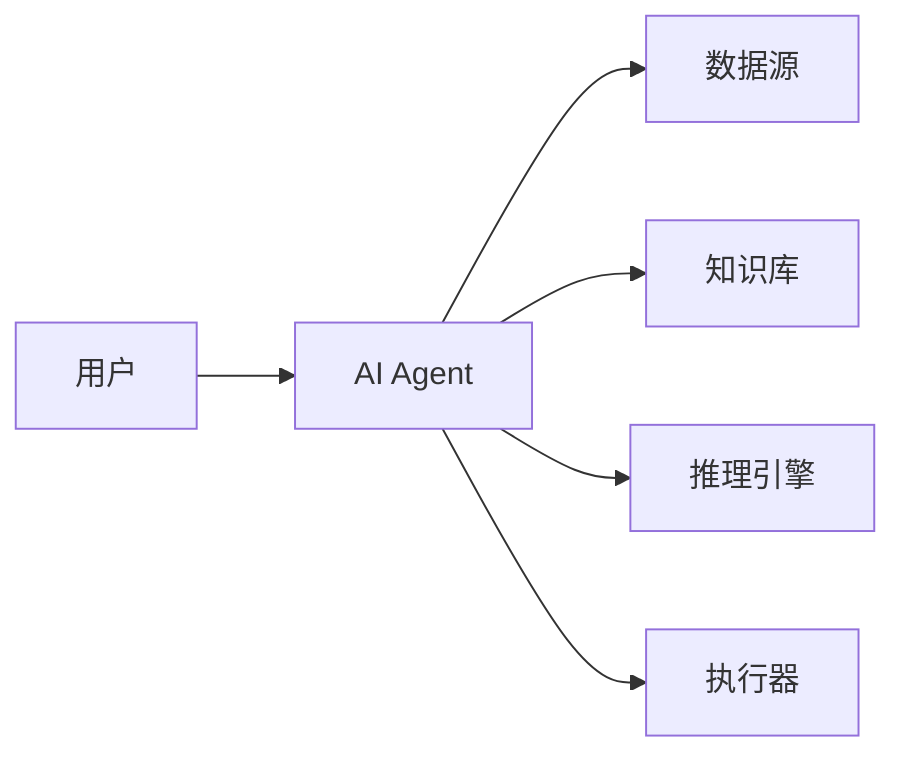
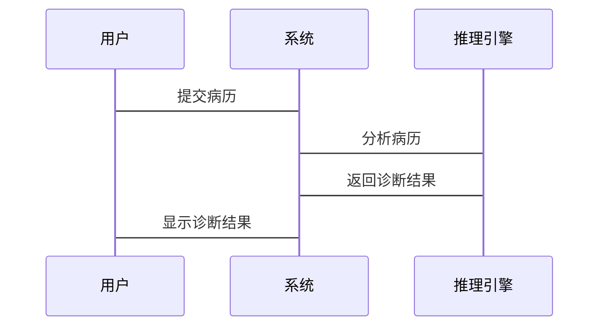

                 


# AI Agent在特定领域的深度应用：法律、医疗、金融

---

## 关键词
- AI Agent  
- 法律  
- 医疗  
- 金融  
- 人工智能  
- 深度应用  

---

## 摘要
本文探讨AI Agent在法律、医疗和金融领域的深度应用，分析其核心原理、算法模型、系统架构及实际案例。通过详细的技术分析和实例解读，揭示AI Agent在这些领域的优势与挑战，为读者提供全面的技术视角和实践指导。

---

# 第一章: AI Agent的核心概念与背景

## 1.1 AI Agent的基本概念
AI Agent（人工智能代理）是能够感知环境、做出决策并执行任务的智能实体。它通过数据输入、模型处理和输出结果，帮助用户完成特定任务。AI Agent的核心在于其自主性、反应性和主动性，能够在复杂环境中适应变化。

## 1.2 AI Agent在法律、医疗、金融的应用背景
### 1.2.1 法律领域
法律领域的AI Agent主要用于合同审查、案例分析和法律咨询。通过自然语言处理技术，AI Agent能够快速分析大量法律文档，识别关键条款并提供法律建议，提高律师的工作效率。

### 1.2.2 医疗领域
在医疗领域，AI Agent用于辅助诊断、疾病预测和患者管理。例如，AI Agent可以通过分析患者的病历和症状，提供诊断建议，帮助医生做出更准确的判断。

### 1.2.3 金融领域
金融领域的AI Agent用于风险评估、欺诈检测和投资建议。通过实时数据分析，AI Agent能够识别潜在的金融风险，帮助金融机构做出更明智的投资决策。

---

# 第二章: AI Agent的核心原理与系统架构

## 2.1 AI Agent的核心原理
AI Agent的工作流程分为感知、决策和执行三个阶段：
1. **感知阶段**：通过传感器或数据输入，AI Agent获取环境信息。
2. **决策阶段**：基于感知的数据，AI Agent使用算法进行分析和决策。
3. **执行阶段**：根据决策结果，AI Agent采取行动或输出结果。

## 2.2 AI Agent的系统架构
### 2.2.1 分层架构
分层架构将系统分为感知层、决策层和执行层，每层负责不同的功能。这种架构便于模块化开发和维护。

### 2.2.2 微服务架构
微服务架构将系统功能分解为独立的服务，每个服务负责特定的任务。这种架构具有良好的扩展性和灵活性。

### 2.2.3 混合架构
混合架构结合了分层架构和微服务架构的优点，适用于复杂系统的开发。

## 2.3 AI Agent的实体关系图


---

# 第三章: AI Agent的算法原理与数学模型

## 3.1 AI Agent的感知算法
### 3.1.1 特征提取
特征提取是感知阶段的关键步骤，通过提取数据中的有用特征，提高模型的准确性。例如，在法律合同审查中，特征提取可以识别关键词和条款。

### 3.1.2 分类与回归
分类和回归是常用的感知算法，用于对数据进行分类或预测。例如，使用支持向量机（SVM）进行分类，预测患者是否患有某种疾病。

### 3.1.3 自然语言处理
自然语言处理（NLP）用于理解和生成人类语言。在法律领域，NLP技术用于合同审查和法律咨询。

## 3.2 AI Agent的数学模型
### 3.2.1 线性回归模型
线性回归模型用于预测连续型变量，公式如下：
$$y = \beta_0 + \beta_1x + \epsilon$$

### 3.2.2 支持向量机模型
支持向量机用于分类和回归，公式如下：
$$\text{max} \quad \frac{1}{2}\|w\|^2$$
$$\text{subject to} \quad y_i(w \cdot x_i + b) \geq 1$$

## 3.3 AI Agent的Python实现示例
```python
import numpy as np
from sklearn.svm import SVC

# 示例数据
X = np.array([[1, 0], [0, 1], [2, 2], [3, 3]])
y = np.array([0, 1, 1, 0])

# 训练模型
model = SVC()
model.fit(X, y)

# 预测
print(model.predict([[2.5, 2.5]]))  # 输出：[1]
```

---

# 第四章: 系统分析与架构设计方案

## 4.1 问题场景介绍
以医疗领域为例，假设我们需要开发一个AI Agent用于辅助诊断。系统需要处理患者的病历数据，分析症状，并提供诊断建议。

## 4.2 系统功能设计
### 4.2.1 领域模型
```mermaid
classDiagram
    class 病人
        姓名 : String
        症状 : List[String]
        病历 : String
    class 系统
        分析病历 (病历: String) : 病症诊断
   病人 --> 系统
    系统 --> 病症诊断
```

### 4.2.2 系统架构


### 4.2.3 接口设计
系统需要通过API接口与前端交互，接收病历数据并返回诊断结果。

### 4.2.4 交互设计


---

# 第五章: 项目实战

## 5.1 环境安装
安装所需的Python库，例如：
- `scikit-learn`：用于机器学习算法
- `numpy`：用于数据处理
- `transformers`：用于自然语言处理

## 5.2 系统核心实现
```python
from sklearn.feature_extraction.text import TfidfVectorizer
from sklearn.naive_bayes import MultinomialNB

# 示例数据
texts = ['The cat sits on the mat.', 'The cat sits on the mat.']
labels = ['animal', 'animal']

# 特征提取
vectorizer = TfidfVectorizer()
X = vectorizer.fit_transform(texts)

# 训练模型
model = MultinomialNB()
model.fit(X, labels)

# 预测
new_text = ['The cat plays with the ball.']
new_X = vectorizer.transform(new_text)
print(model.predict(new_X))  # 输出：['animal']
```

---

# 第六章: 最佳实践、小结、注意事项、拓展阅读

## 6.1 最佳实践
- 在开发AI Agent时，确保数据质量和多样性。
- 定期更新模型以适应新数据和环境变化。
- 注重系统的可解释性，避免“黑箱”问题。

## 6.2 小结
本文详细探讨了AI Agent在法律、医疗和金融领域的深度应用，分析了其核心原理、算法模型和系统架构，并通过实际案例展示了其应用价值。

## 6.3 注意事项
- 数据隐私和安全是AI Agent应用中的重要问题。
- 在实际应用中，需考虑模型的泛化能力和鲁棒性。

## 6.4 拓展阅读
- 《Deep Learning》：深入理解机器学习模型。
- 《Natural Language Processing with Python》：学习自然语言处理技术。

---

通过本文的详细分析，读者可以全面理解AI Agent在特定领域的应用潜力，并在实际项目中加以应用和优化。

