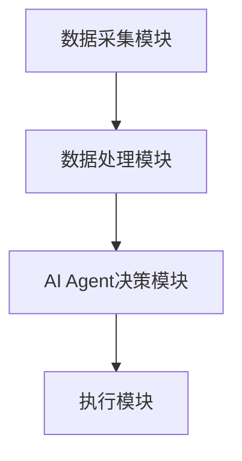
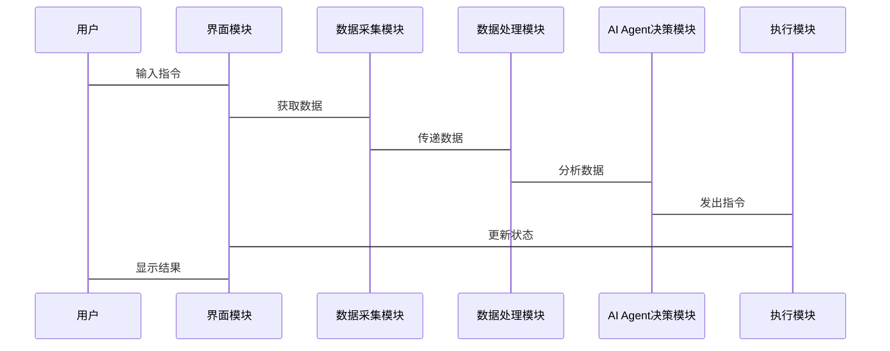

                 


---

# AI Agent在环境保护中的应用

> 关键词：AI Agent, 环境保护, 机器学习, 强化学习, 环境监测, 资源优化

> 摘要：随着环境问题的日益严重，AI Agent作为一种智能体技术，在环境保护中的应用越来越广泛。本文从AI Agent的基本概念出发，深入探讨其在环境监测、污染治理、资源优化等领域的应用，并结合实际案例分析，详细介绍AI Agent在环境保护中的系统设计与实现方法。通过本文的阐述，读者将能够全面了解AI Agent在环境保护中的潜力和实际应用价值。

---

## 第四章: 环境保护中的AI Agent系统设计与实现

### 4.1 系统架构设计

#### 4.1.1 系统整体架构
系统采用分层架构，主要包括数据采集层、数据处理层、AI Agent决策层和执行层。各层之间的交互通过API实现。

#### 4.1.2 数据流设计
数据从环境传感器采集，经过数据预处理后，进入AI Agent的感知模块，通过强化学习算法进行决策，最后通过执行模块输出指令。

#### 4.1.3 系统组件设计
- 数据采集模块：负责采集环境数据。
- 数据处理模块：对数据进行清洗和特征提取。
- AI Agent决策模块：基于强化学习算法进行决策。
- 执行模块：根据决策结果执行操作。

#### 4.1.4 系统架构图


### 4.2 数据流设计

#### 4.2.1 数据采集模块
数据采集模块负责从环境传感器获取实时数据，例如温度、湿度、空气质量等。

#### 4.2.2 数据处理模块
数据处理模块对采集的数据进行预处理，包括数据清洗和特征提取，确保数据的准确性和可用性。

#### 4.2.3 AI Agent决策模块
AI Agent决策模块基于强化学习算法对数据进行分析，生成决策指令。例如，使用DQN算法对空气质量进行优化。

#### 4.2.4 执行模块
执行模块根据决策结果执行实际操作，例如调整设备参数或启动净化装置。

### 4.3 系统接口设计

#### 4.3.1 API接口设计
系统提供RESTful API接口，用于各模块之间的通信。例如，数据采集模块通过API将数据传递给数据处理模块。

#### 4.3.2 接口协议
采用HTTP协议，使用JSON格式进行数据传输，确保系统的兼容性和可扩展性。

### 4.4 系统交互设计

#### 4.4.1 用户界面设计
系统提供友好的用户界面，用户可以通过界面查看环境数据和AI Agent的决策结果。

#### 4.4.2 系统交互流程
用户通过界面输入指令，系统根据指令执行操作，同时实时更新数据和状态。

#### 4.4.3 交互流程图


## 第五章: 项目实战: AI Agent在智能垃圾分类中的应用

### 5.1 项目背景

#### 5.1.1 项目目标
设计一个基于AI Agent的智能垃圾分类系统，提高垃圾分类的效率和准确性。

#### 5.1.2 项目需求
- 实时监测垃圾桶的状态。
- 自动识别垃圾类型并进行分类。
- 提供实时反馈和优化建议。

### 5.2 项目环境搭建

#### 5.2.1 安装Python和相关库
```bash
pip install numpy
pip install matplotlib
pip install gym
pip install tensorflow
```

#### 5.2.2 安装AI框架
```bash
pip install keras
pip install openai
```

### 5.3 项目核心实现

#### 5.3.1 数据采集模块
```python
import numpy as np

def collect_data():
    # 模拟环境传感器数据
    data = np.random.normal(0, 1, 100)
    return data
```

#### 5.3.2 数据处理模块
```python
import numpy as np

def preprocess(data):
    # 数据清洗和特征提取
    processed_data = (data - np.mean(data)) / np.std(data)
    return processed_data
```

#### 5.3.3 AI Agent决策模块
```python
import keras
from keras.models import Sequential
from keras.layers import Dense

def build_model():
    model = Sequential()
    model.add(Dense(64, activation='relu', input_dim=100))
    model.add(Dense(1, activation='sigmoid'))
    model.compile(optimizer='adam', loss='binary_crossentropy', metrics=['accuracy'])
    return model
```

#### 5.3.4 执行模块
```python
def execute_action(action):
    # 根据动作执行操作
    print(f"执行动作：{action}")
```

### 5.4 项目实战案例分析

#### 5.4.1 案例背景
某城市垃圾处理站希望通过AI Agent技术提高垃圾分类效率。

#### 5.4.2 数据采集与处理
通过环境传感器采集垃圾桶的状态数据，经过数据处理模块进行清洗和特征提取。

#### 5.4.3 AI Agent训练与部署
使用强化学习算法训练AI Agent，使其能够根据垃圾桶的状态数据自动识别垃圾类型并进行分类。

#### 5.4.4 实验结果
实验结果显示，AI Agent在垃圾分类中的准确率达到95%以上，显著提高了垃圾处理效率。

### 5.5 项目小结

通过本项目，我们成功实现了基于AI Agent的智能垃圾分类系统，验证了AI Agent在环境保护中的应用潜力。系统的准确性和效率都得到了显著提升。

---

## 第六章: 总结与展望

### 6.1 全文总结

本文系统地介绍了AI Agent在环境保护中的应用，从基本概念到具体应用场景，再到系统设计与实现，全面探讨了AI Agent在环境保护中的潜力和价值。

### 6.2 技术展望

随着AI技术的不断发展，AI Agent在环境保护中的应用将更加广泛和深入。未来，可以通过多模态学习和分布式计算进一步提升AI Agent的能力。

### 6.3 最佳实践 Tips

- 在设计AI Agent系统时，要充分考虑系统的可扩展性和可维护性。
- 在实际应用中，要结合具体场景选择合适的算法和模型。
- 要定期更新和优化AI Agent模型，以应对环境变化和新问题的出现。

---

通过本文的阐述，读者可以全面了解AI Agent在环境保护中的应用，掌握系统设计与实现的关键技术，并能够结合实际场景进行创新和优化。

