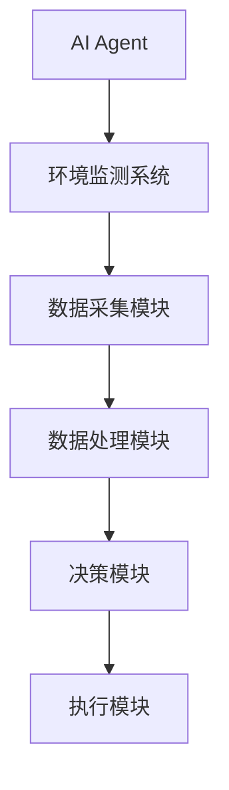
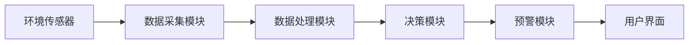
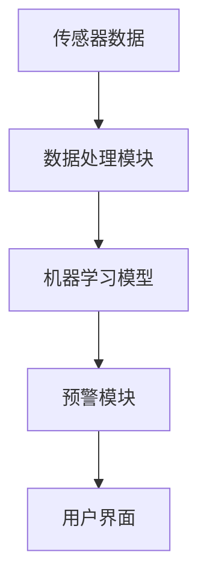

                 


# AI Agent在环境监测与预警中的实践

> 关键词：AI Agent，环境监测，预警系统，机器学习，实时数据处理，智能决策

> 摘要：本文探讨AI Agent在环境监测与预警中的应用，从核心概念、算法原理到系统架构，结合实际案例，详细讲解如何利用AI Agent提升环境监测的效率和准确性，实现智能化的预警系统。

---

## 第1章: AI Agent与环境监测的背景介绍

### 1.1 AI Agent的基本概念

AI Agent（人工智能代理）是指能够感知环境、自主决策并采取行动以实现目标的智能实体。它具备以下核心特征：
- **自主性**：无需外部干预，自主完成任务。
- **反应性**：能实时感知环境变化并做出反应。
- **目标导向**：所有行动都以实现特定目标为导向。
- **社会能力**：能够与其他系统或人类进行交互协作。

AI Agent与传统自动化系统的区别在于其智能化和自主决策能力，使其在复杂环境中能够灵活应对各种变化。

### 1.2 环境监测与预警的背景

环境监测是指通过传感器、卫星等手段收集环境数据，分析环境状况，预测潜在风险的过程。随着工业化和城市化的快速发展，环境问题日益突出，传统的监测方法效率低下，难以应对海量数据和复杂场景的需求。AI Agent的引入为环境监测带来了新的可能性。

### 1.3 AI Agent在环境监测中的作用

AI Agent能够实时收集、分析环境数据，预测潜在风险，并自动触发预警机制。其在环境监测中的具体作用包括：
- **实时数据处理**：快速分析传感器数据，识别异常情况。
- **智能预测**：基于历史数据和当前趋势，预测未来环境状况。
- **自动化响应**：根据预测结果，自动启动应急措施，减少人为干预。

### 1.4 挑战与边界

尽管AI Agent在环境监测中具有巨大潜力，但也面临诸多挑战：
- **数据复杂性**：环境数据种类繁多，涉及气象、水质、空气质量等多个方面。
- **实时性要求高**：需要在极短时间内处理数据并做出决策。
- **决策准确性**：错误的预警可能带来严重后果。

## 第2章: AI Agent的核心概念与环境监测的联系

### 2.1 AI Agent的核心原理

AI Agent通过感知、决策和执行三个主要阶段实现目标：
1. **感知**：通过传感器或数据源获取环境信息。
2. **决策**：基于感知数据，分析并制定行动计划。
3. **执行**：根据决策结果采取相应行动。

### 2.2 环境监测中的AI Agent架构

在环境监测中，AI Agent的架构通常包括以下几个模块：
- **数据采集模块**：负责采集环境数据（如温度、湿度、污染物浓度等）。
- **数据处理模块**：对采集的数据进行预处理、特征提取和分析。
- **决策模块**：利用机器学习模型预测环境变化并制定预警策略。
- **执行模块**：根据决策结果触发预警信号或启动应急措施。

### 2.3 AI Agent与环境监测系统的交互

AI Agent通过与环境监测系统的交互，实现数据的实时处理和智能预警。下图展示了AI Agent与环境监测系统的交互流程：



## 第3章: AI Agent的感知与决策算法

### 3.1 感知算法

感知算法负责从环境中获取数据并进行预处理。常用算法包括：
- **时间序列分析**：用于处理连续性数据，发现趋势和周期性变化。
- **异常检测**：识别数据中的异常值，及时发现潜在风险。

### 3.2 决策算法

决策算法基于感知数据，预测环境变化并制定预警策略。常用算法包括：
- **随机森林**：用于分类和回归任务，能够处理高维数据。
- **神经网络**：适用于非线性关系建模，能够捕捉复杂的数据模式。

### 3.3 算法实现示例

以下是基于随机森林的空气质量预测模型实现：

```python
from sklearn.ensemble import RandomForestRegressor
import numpy as np

# 示例数据
X = np.array([[0.1, 0.2, 0.3], [0.4, 0.5, 0.6]])
y = np.array([0.7, 0.8])

# 训练模型
model = RandomForestRegressor(n_estimators=100)
model.fit(X, y)

# 预测新数据
new_data = np.array([[0.7, 0.8, 0.9]])
prediction = model.predict(new_data)
print("预测结果:", prediction)
```

## 第4章: 系统架构与数据流设计

### 4.1 系统架构设计

AI Agent在环境监测系统中的架构设计如下：



### 4.2 数据流设计

数据在系统中的流动过程如下：



## 第5章: 项目实战——空气质量监测预警系统

### 5.1 环境搭建

安装必要的依赖：
```bash
pip install numpy scikit-learn matplotlib
```

### 5.2 核心代码实现

空气质量预测模型实现：

```python
import pandas as pd
from sklearn.model

