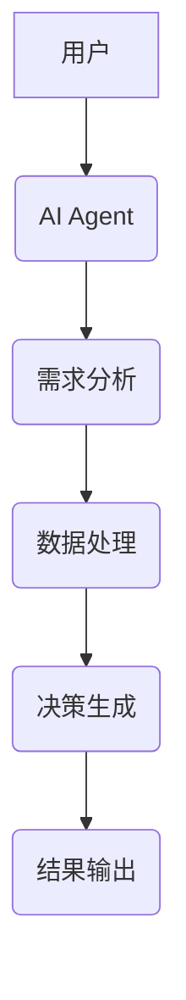
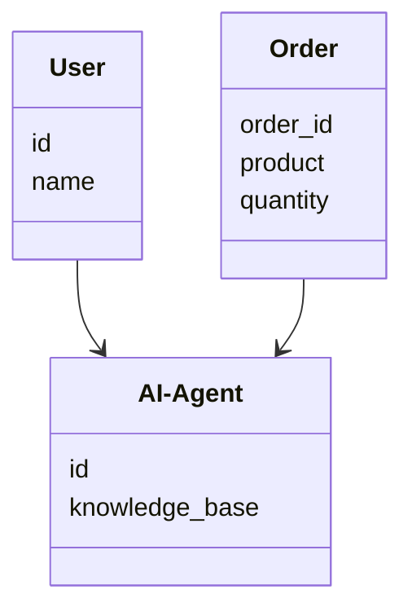

                 


# AI Agent在电子商务中的应用：智能客服与销售预测

> 关键词：AI Agent, 智能客服, 销售预测, 机器学习, 自然语言处理, 系统架构

> 摘要：随着人工智能技术的飞速发展，AI Agent（人工智能代理）在电子商务中的应用日益广泛。本文将详细探讨AI Agent在智能客服和销售预测领域的具体应用，从技术背景、核心概念、算法原理到系统架构和项目实战，全面解析AI Agent如何赋能电子商务，提升用户体验和商业效率。

---

# 第1章: AI Agent与电子商务的背景介绍

## 1.1 AI Agent的基本概念

### 1.1.1 AI Agent的定义
AI Agent，即人工智能代理，是一种能够感知环境、自主决策并执行任务的智能实体。它通过传感器获取信息，利用推理机制分析数据，并通过执行器采取行动，以实现特定目标。

### 1.1.2 AI Agent的核心要素
1. **感知能力**：通过传感器或数据接口获取环境信息。
2. **推理能力**：利用算法对信息进行分析和推理。
3. **决策能力**：基于推理结果做出最优决策。
4. **执行能力**：通过执行器将决策转化为实际操作。

### 1.1.3 AI Agent的分类
1. **简单反射型**：基于预定义规则直接响应。
2. **基于模型型**：利用内部知识库进行推理。
3. **目标驱动型**：以特定目标为导向自主决策。
4. **效用驱动型**：通过最大化效用函数实现目标。

## 1.2 电子商务中的AI Agent应用

### 1.2.1 智能客服的基本概念
智能客服是一种基于AI技术的自动化服务系统，能够通过自然语言处理（NLP）技术理解用户需求，并提供个性化的解决方案。它能够处理多种渠道的客户咨询，包括文本、语音和视频。

### 1.2.2 销售预测的基本概念
销售预测是利用历史销售数据和外部因素，通过机器学习模型预测未来销售趋势的过程。AI Agent可以通过分析市场动态、用户行为和库存信息，帮助商家优化库存管理和销售策略。

### 1.2.3 AI Agent在电子商务中的优势
1. **24/7可用性**：智能客服可以全天候为用户提供服务，无需休息。
2. **个性化体验**：基于用户行为和偏好，提供定制化建议。
3. **高效决策**：通过实时数据分析，快速做出准确预测和响应。

## 1.3 技术背景与发展趋势

### 1.3.1 机器学习与自然语言处理的发展
机器学习（ML）和自然语言处理（NLP）技术的进步为AI Agent的应用提供了坚实的技术基础。深度学习模型（如BERT、GPT）的出现，显著提升了NLP任务的准确性。

### 1.3.2 AI Agent在电商中的技术背景
电子商务的复杂性和用户需求的多样性，使得传统的人工客服和简单预测模型难以满足需求。AI Agent通过整合机器学习和NLP技术，能够更高效地处理复杂任务。

### 1.3.3 未来发展趋势
随着AI技术的不断进步，AI Agent在电子商务中的应用将更加智能化和个性化。未来，AI Agent将能够处理更复杂的任务，并与更多业务系统无缝集成。

## 1.4 本章小结
本章介绍了AI Agent的基本概念、分类及其在电子商务中的具体应用，重点分析了智能客服和销售预测两大领域的优势和技术背景，为后续章节的深入探讨奠定了基础。

---

# 第2章: AI Agent的核心概念与原理

## 2.1 AI Agent的核心原理

### 2.1.1 知识表示与推理
知识表示是将信息以计算机可理解的形式存储的过程。常用的知识表示方法包括语义网络和规则表示。推理是基于知识库进行逻辑推理的过程，以得出新的结论。

### 2.1.2 行为决策机制
行为决策机制是AI Agent根据环境信息做出决策的核心部分。常见的决策方法包括基于规则的决策、基于模型的决策和基于学习的决策。

### 2.1.3 人机交互方式
AI Agent的人机交互方式包括文本交互、语音交互和视觉交互。文本交互是最常见的形式，广泛应用于智能客服和聊天机器人。

## 2.2 AI Agent与电子商务的联系

### 2.2.1 AI Agent在电商中的角色
AI Agent在电子商务中扮演着多重角色，包括智能客服、销售预测、库存管理和个性化推荐。

### 2.2.2 AI Agent与用户需求的关系
AI Agent通过分析用户行为和偏好，理解用户需求，并提供个性化的服务。这种双向互动能够显著提升用户体验和满意度。

### 2.2.3 AI Agent与电商系统的整合
AI Agent需要与电商系统中的多个模块（如订单管理、库存管理和客户关系管理）进行无缝集成，以实现高效协同工作。

## 2.3 核心概念对比表

| **对比维度** | **AI Agent** | **传统客服** |
|--------------|--------------|--------------|
| **响应速度** | 实时响应      | 可能延迟      |
| **覆盖范围** | 全球覆盖      | 局限于特定区域 |
| **成本效益** | 成本低        | 成本高        |
| **可用性**   | 24/7可用     | 有限时间可用  |

## 2.4 ER实体关系图

```mermaid
erd
  customer
  staff
  product
  order
  payment
```

## 2.5 AI Agent工作流程图（Mermaid）



## 2.6 本章小结
本章详细阐述了AI Agent的核心原理和其在电子商务中的角色，通过对比表和流程图，直观展示了AI Agent与传统方法的区别和优势。

---

# 第3章: AI Agent的算法原理讲解

## 3.1 决策树算法

### 3.1.1 决策树算法简介
决策树是一种基于树结构的分类和回归方法，广泛应用于机器学习任务中。

### 3.1.2 决策树算法的工作流程
1. 特征选择：选择对目标变量影响最大的特征。
2. 数据分割：根据特征将数据分成子集。
3. 生成叶子节点：当数据无法再分割时，生成叶子节点。

### 3.1.3 决策树算法的实现代码

```python
from sklearn.tree import DecisionTreeClassifier
from sklearn.model_selection import train_test_split

# 数据准备
X = ...
y = ...
X_train, X_test, y_train, y_test = train_test_split(X, y, test_size=0.2)

# 模型训练
clf = DecisionTreeClassifier()
clf.fit(X_train, y_train)

# 模型预测
y_pred = clf.predict(X_test)
```

### 3.1.4 决策树算法的数学模型
决策树的划分标准通常采用信息增益或基尼指数。信息增益的计算公式如下：

$$
\text{信息增益} = \text{熵}(X) - \text{期望熵}(X|A)
$$

其中，熵的计算公式为：

$$
\text{熵}(X) = -\sum_{i=1}^{n} p_i \log p_i
$$

## 3.2 随机森林算法

### 3.2.1 随机森林算法简介
随机森林是一种基于决策树的集成学习方法，通过构建多棵决策树并对结果进行投票或平均，显著提升了模型的准确性和鲁棒性。

### 3.2.2 随机森林算法的工作流程
1. 生成多个决策树：通过随机采样数据和特征生成多个决策树。
2. 集成预测：对多棵决策树的预测结果进行集成。

### 3.2.3 随机森林算法的实现代码

```python
from sklearn.ensemble import RandomForestClassifier

# 数据准备
X = ...
y = ...

# 模型训练
clf = RandomForestClassifier(n_estimators=100)
clf.fit(X_train, y_train)

# 模型预测
y_pred = clf.predict(X_test)
```

### 3.2.4 随机森林算法的数学模型
随机森林通过投票或平均的方式进行预测，其数学模型如下：

$$
y_{\text{pred}} = \arg\max_{y} \sum_{i=1}^{n} \mathbb{I}(y_i = y)
$$

其中，$\mathbb{I}$表示指示函数。

## 3.3 词嵌入算法（如Word2Vec）

### 3.3.1 词嵌入算法简介
词嵌入是一种将词语映射为低维稠密向量的技术，常用于自然语言处理任务中。

### 3.3.2 Word2Vec算法的工作流程
1. 训练词向量：通过_skip-gram_或_CBOW_模型训练词向量。
2. 应用词向量：将词语映射为向量，用于后续任务。

### 3.3.3 Word2Vec算法的实现代码

```python
from gensim.models import Word2Vec

# 数据准备
sentences = [...]  # 列表中的每个元素是一个句子

# 模型训练
model = Word2Vec(sentences, vector_size=100, window=5, min_count=1, workers=4)

# 获取词向量
vector = model.get_vector('word')
```

### 3.3.4 词嵌入算法的数学模型
Word2Vec的训练目标是最小化以下损失函数：

$$
\text{损失} = -\sum_{c} \log p(w_c)
$$

其中，$p(w_c)$是上下文词$c$的概率。

## 3.4 本章小结
本章详细讲解了决策树、随机森林和词嵌入算法的原理和实现，为后续章节的系统设计和项目实战奠定了算法基础。

---

# 第4章: 系统分析与架构设计方案

## 4.1 问题场景介绍

### 4.1.1 智能客服系统
智能客服系统需要处理大量的用户咨询，提供快速响应和个性化服务。

### 4.1.2 销售预测系统
销售预测系统需要基于历史数据和外部因素，预测未来的销售趋势。

## 4.2 系统功能设计

### 4.2.1 领域模型（Mermaid类图）



### 4.2.2 系统架构设计（Mermaid架构图）

```mermaid
subgraph Frontend
    User
end
subgraph Backend
    AI-Agent
    Database
    Order
end
User --> AI-Agent
AI-Agent --> Database
```

### 4.2.3 系统接口设计
系统接口设计需要考虑REST API和WebSocket通信，确保系统的高效性和实时性。

## 4.3 本章小结
本章通过问题场景介绍和系统功能设计，展示了AI Agent在电子商务中的实际应用，为后续的系统实现提供了清晰的设计思路。

---

# 第5章: 项目实战

## 5.1 环境安装与配置

### 5.1.1 Python环境安装
使用Python 3.8及以上版本，安装必要的库（如scikit-learn、gensim、flask）。

### 5.1.2 数据集准备
准备电子商务相关的数据集，包括用户行为数据、订单数据和产品数据。

## 5.2 核心代码实现

### 5.2.1 智能客服系统实现

```python
from flask import Flask, request, jsonify
from sklearn.tree import DecisionTreeClassifier

app = Flask(__name__)
clf = DecisionTreeClassifier()

@app.route('/api/query', methods=['POST'])
def query():
    data = request.json
    result = clf.predict([data['query']])
    return jsonify({'result': result[0]})
```

### 5.2.2 销售预测系统实现

```python
from sklearn.ensemble import RandomForestClassifier

app = Flask(__name__)
clf = RandomForestClassifier()

@app.route('/api/predict', methods=['POST'])
def predict():
    data = request.json
    result = clf.predict([data['features']])
    return jsonify({'prediction': result[0]})
```

## 5.3 代码解读与分析
通过对代码的解读和分析，展示了AI Agent在智能客服和销售预测中的具体实现方式。

## 5.4 实际案例分析
通过具体案例分析，展示了AI Agent在实际应用中的效果和优势。

## 5.5 本章小结
本章通过项目实战，详细讲解了AI Agent在电子商务中的具体实现过程，为读者提供了宝贵的实践经验。

---

# 第6章: 最佳实践与总结

## 6.1 最佳实践 tips
1. **数据质量**：确保数据的准确性和完整性。
2. **模型优化**：定期更新模型，提升预测准确率。
3. **用户体验**：注重用户反馈，优化人机交互体验。

## 6.2 本章小结
总结全书内容，强调了AI Agent在电子商务中的重要性及其应用前景。

## 6.3 注意事项
1. **隐私保护**：确保用户数据的安全和隐私。
2. **系统稳定性**：保障系统的高效运行和故障恢复能力。

## 6.4 拓展阅读
推荐相关书籍和论文，鼓励读者深入学习AI Agent和电子商务的相关知识。

---

# 结语

AI Agent作为人工智能技术的重要应用，正在深刻改变电子商务的运作方式。通过本文的详细讲解，读者可以全面了解AI Agent在智能客服和销售预测中的应用，并掌握其实现方法和最佳实践。未来，随着技术的不断进步，AI Agent在电子商务中的应用将更加广泛和深入。

--- 

**全文完**

