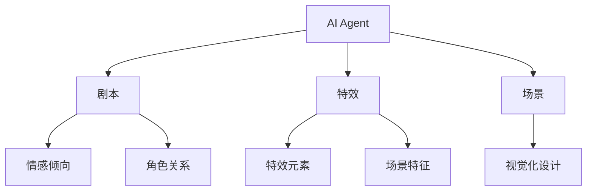
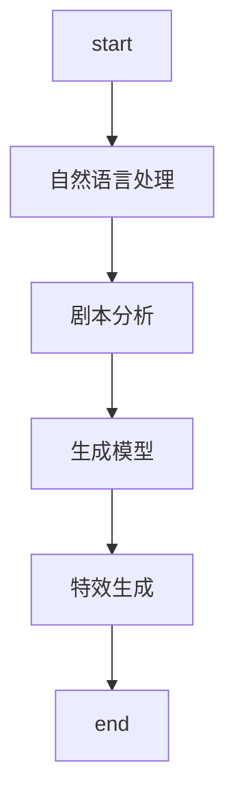
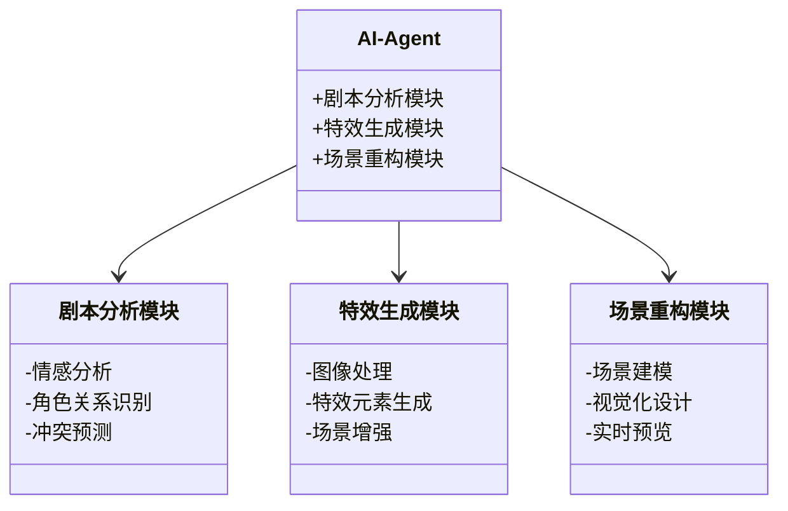
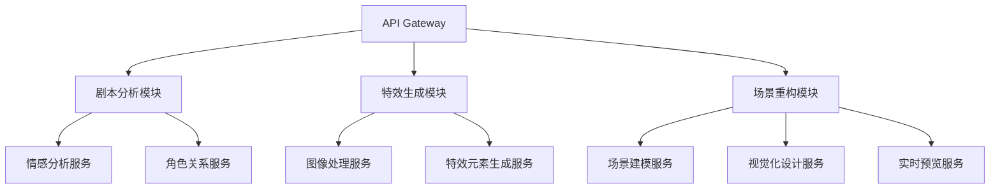

                 


# AI Agent在电影制作中的应用：剧本分析与特效辅助

## 关键词：AI Agent, 电影制作, 剧本分析, 特效辅助, 人工智能

## 摘要：  
本文探讨了AI Agent在电影制作中的应用，特别是在剧本分析和特效辅助领域。通过分析AI Agent的工作原理、算法实现和系统架构，结合实际案例，展示了AI技术如何优化电影制作流程。文章还提供了代码实现和系统设计，帮助读者深入理解AI Agent在电影制作中的潜力和应用前景。

---

# 第一部分: AI Agent在电影制作中的应用概述

## 第1章: AI Agent与电影制作的背景介绍

### 1.1 问题背景与描述

#### 1.1.1 传统电影制作的流程与挑战
传统电影制作涉及剧本创作、拍摄、特效制作等多个环节，流程复杂且耗时。剧本分析依赖人工经验，特效制作成本高昂且效率低下。这些问题限制了电影制作的效率和创新能力。

#### 1.1.2 AI技术在电影制作中的潜力
AI技术，尤其是AI Agent，能够通过自然语言处理和计算机视觉技术，自动分析剧本、优化特效制作，显著提升制作效率和质量。

#### 1.1.3 AI Agent的核心概念与目标
AI Agent是一种智能代理，能够理解并执行复杂任务。在电影制作中，AI Agent的目标是通过自动化和智能化手段，优化剧本分析和特效辅助流程，降低成本并提高效率。

### 1.2 问题解决与边界

#### 1.2.1 AI Agent如何优化电影制作流程
AI Agent能够自动分析剧本，预测潜在问题，优化场景设计，并协助特效制作。通过自动化处理，AI Agent显著缩短了制作周期，降低了成本。

#### 1.2.2 剧本分析与特效辅助的边界与外延
剧本分析的边界包括情节结构、角色关系和潜在冲突，而特效辅助的边界则涉及场景重构、特效生成和实时预览。外延则包括AI Agent在编剧辅助和后期制作中的应用。

#### 1.2.3 AI Agent在电影制作中的应用场景
AI Agent在电影制作中的应用场景包括剧本优化、场景设计、特效生成、实时预览和后期制作辅助。

### 1.3 核心要素与概念结构

#### 1.3.1 AI Agent的基本组成
AI Agent由自然语言处理模块、计算机视觉模块和生成模型组成，能够处理文本、图像和视频数据。

#### 1.3.2 电影制作流程的关键环节
关键环节包括剧本创作、拍摄准备、特效制作和后期合成，每个环节都需要AI Agent的支持。

#### 1.3.3 AI Agent与电影制作的关联关系
AI Agent通过分析剧本和图像数据，优化场景设计，协助特效制作，显著提升了电影制作的效率和质量。

## 第2章: AI Agent的核心概念与原理

### 2.1 AI Agent的基本原理

#### 2.1.1 自然语言处理在剧本分析中的应用
自然语言处理用于分析剧本的情感倾向、角色关系和潜在冲突，帮助编剧优化情节结构。

#### 2.1.2 计算机视觉在特效辅助中的作用
计算机视觉技术用于分析场景图像，提取关键特征，生成高质量的特效。

#### 2.1.3 生成模型在场景重构中的应用
生成模型能够根据剧本描述生成虚拟场景，辅助导演进行视觉化设计。

### 2.2 核心概念属性对比

#### 2.2.1 剧本分析与特效辅助的对比分析
剧本分析注重文本理解，特效辅助注重图像处理。两者在数据类型和处理目标上存在差异，但协同工作以优化制作流程。

#### 2.2.2 不同AI技术的优劣势对比
自然语言处理在文本分析上优势明显，而计算机视觉在图像处理上更具优势。生成模型则能够生成高质量的内容，但在可控性方面存在挑战。

#### 2.2.3 AI Agent与其他工具的差异
AI Agent不仅能够执行单一任务，还能够协同工作，形成完整的解决方案，显著提升制作效率。

### 2.3 概念结构与ER实体关系图



---

## 第3章: AI Agent的算法原理

### 3.1 算法流程与实现



#### 3.1.1 自然语言处理算法
使用Transformer模型进行文本编码和解码，实现剧本的情感分析和主题识别。

```python
import torch
from transformers import AutoTokenizer, AutoModelForMaskedLM

tokenizer = AutoTokenizer.from_pretrained('bert-base-uncased')
model = AutoModelForMaskedLM.from_pretrained('bert-base-uncased')
inputs = tokenizer.encode('The main character is feeling ', add_special_tokens=True)
inputs[0] = tokenizer.mask_token_id
outputs = model(torch.tensor([inputs]))
```

#### 3.1.2 计算机视觉算法
利用卷积神经网络提取图像特征，生成高质量的特效。

```python
import cv2
import numpy as np

image = cv2.imread('input.jpg')
# 提取特征
features = model.extract_features(image)
# 生成特效
effect = generate_effect(features)
cv2.imwrite('output.jpg', effect)
```

#### 3.1.3 生成模型的数学公式
生成模型通常采用以下公式：

$$P(x|y) = \frac{P(x,y)}{P(y)}$$

其中，x表示生成的输出，y表示条件输入。

---

## 第4章: 系统分析与架构设计

### 4.1 问题场景介绍

#### 4.1.1 电影制作中的问题场景
场景包括复杂的剧本分析和高难度的特效制作，传统方法效率低下，成本高昂。

### 4.2 系统功能设计



### 4.3 系统架构设计



### 4.4 系统接口设计

#### 4.4.1 API接口定义
API接口用于剧本分析、特效生成和场景重构模块之间的通信。

```python
from flask import Flask, request

app = Flask(__name__)

@app.route('/analyze_script', methods=['POST'])
def analyze_script():
    # 处理剧本分析请求
    pass

@app.route('/generate_effect', methods=['POST'])
def generate_effect():
    # 处理特效生成请求
    pass

@app.route('/reconstruct_scene', methods=['POST'])
def reconstruct_scene():
    # 处理场景重构请求
    pass

if __name__ == '__main__':
    app.run()
```

---

## 第5章: 项目实战与案例分析

### 5.1 项目实战

#### 5.1.1 环境安装
需要安装以下依赖：

```bash
pip install transformers torch cv2 numpy
```

#### 5.1.2 核心代码实现

```python
import torch
from transformers import AutoTokenizer, AutoModelForMaskedLM
import cv2

# 自然语言处理模块
tokenizer = AutoTokenizer.from_pretrained('bert-base-uncased')
model_nlp = AutoModelForMaskedLM.from_pretrained('bert-base-uncased')

# 计算机视觉模块
model_cv = cv2.dnn.readNet('model.weights')

# 生成模型
generator = DiffusionModel()

def analyze_script(text):
    inputs = tokenizer.encode(text, add_special_tokens=True)
    inputs[0] = tokenizer.mask_token_id
    outputs = model_nlp(torch.tensor([inputs]))
    return process_outputs(outputs)

def generate_effect(image_path):
    image = cv2.imread(image_path)
    features = model_cv.extract_features(image)
    effect = generator.generate_effect(features)
    return effect

def reconstruct_scene(description):
    scene = generator.reconstruct(description)
    return scene
```

#### 5.1.3 案例分析

##### 案例1: 剧本分析
给定剧本片段，AI Agent分析角色关系和潜在冲突，优化情节结构。

##### 案例2: 特效生成
根据场景描述，AI Agent生成特效元素，显著提升视觉效果。

### 5.2 项目小结

---

## 第6章: 最佳实践与总结

### 6.1 最佳实践

#### 6.1.1 注意事项
确保数据质量和模型训练充分，避免过拟合和欠拟合。

#### 6.1.2 工具选择
选择适合的AI工具和框架，优化系统性能和用户体验。

#### 6.1.3 拓展阅读
建议阅读相关论文和技术文档，深入理解AI Agent的原理和应用。

### 6.2 小结

AI Agent在电影制作中的应用前景广阔，能够显著提升制作效率和质量。通过自动化和智能化手段，AI Agent正在改变传统电影制作的流程，推动电影产业的创新和发展。

---

## 结束语

AI Agent在电影制作中的应用是一个充满潜力的领域。通过深入了解其工作原理、系统设计和实际案例，读者可以更好地理解AI技术如何优化电影制作流程，推动电影产业的未来发展。

--- 

希望这篇文章能够为读者提供有价值的信息，帮助他们理解AI Agent在电影制作中的应用。

