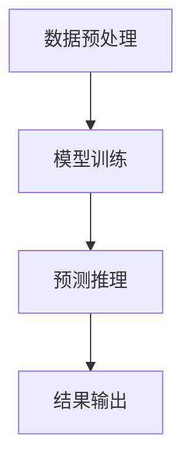
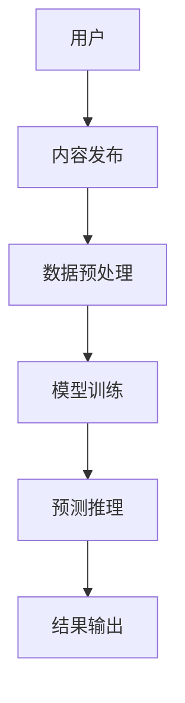

                 


# AI Agent在社交媒体中的应用：内容审核与趋势分析

## 关键词：AI Agent, 社交媒体, 内容审核, 趋势分析, 自然语言处理, 机器学习, 社交媒体分析

## 摘要：  
随着社交媒体的快速发展，内容审核和趋势分析已成为保障网络环境安全、提升用户体验的重要任务。AI Agent作为一种智能代理，能够通过自然语言处理和机器学习技术，高效地完成内容审核与趋势预测。本文从AI Agent的核心概念出发，详细分析其在内容审核与趋势分析中的算法原理、系统架构设计和实际应用场景，结合具体的Python代码示例和数学模型，帮助读者全面理解AI Agent在社交媒体中的应用价值与技术实现。

---

## 第1章: AI Agent与社交媒体的背景介绍

### 1.1 AI Agent的定义与核心概念

#### 1.1.1 AI Agent的基本概念  
AI Agent（人工智能代理）是一种能够感知环境、自主决策并执行任务的智能系统。它通过数据输入、模型训练和算法推理，能够实现对社交媒体内容的理解、分析和预测。

#### 1.1.2 社交媒体的定义与现状  
社交媒体是指基于互联网的社交网络平台，用户通过发布文字、图片、视频等内容进行互动。截至2023年，全球社交媒体用户超过50亿，每天产生海量内容，对内容审核和趋势分析的需求日益增加。

#### 1.1.3 AI Agent在社交媒体中的优势  
AI Agent能够快速处理海量数据，识别潜在风险，优化用户体验。与传统人工审核相比，AI Agent具有高效、精准和可扩展的特点。

#### 1.1.4 AI Agent的核心要素与概念结构  
AI Agent的核心要素包括感知模块、决策模块和执行模块。感知模块负责数据输入和分析，决策模块基于模型推理，执行模块完成任务输出。

---

### 1.2 AI Agent与社交媒体的结合

#### 1.2.1 AI Agent在社交媒体中的应用场景  
AI Agent可以用于垃圾信息过滤、虚假信息识别、用户行为分析等场景。

#### 1.2.2 AI Agent与社交媒体用户的互动模式  
AI Agent通过自然语言处理技术与用户交互，提供个性化推荐、内容解释等服务。

#### 1.2.3 AI Agent的边界与外延  
AI Agent的应用范围包括内容审核、趋势预测、用户画像等，但目前仍存在数据隐私和模型解释性等挑战。

---

## 第2章: AI Agent的核心概念与联系

### 2.1 AI Agent的核心原理

#### 2.1.1 自然语言处理（NLP）在AI Agent中的应用  
NLP技术用于文本理解、情感分析和内容分类。例如，AI Agent可以通过分词、实体识别等技术提取文本信息。

#### 2.1.2 机器学习模型在AI Agent中的作用  
机器学习模型用于训练内容分类器，预测文本的类别（如垃圾信息、正能量内容等）。

#### 2.1.3 AI Agent的决策机制与算法原理  
AI Agent通过监督学习和强化学习算法，优化决策策略。例如，基于支持向量机（SVM）或深度学习模型进行分类。

---

### 2.2 核心概念对比与ER实体关系图

#### 2.2.1 AI Agent与传统内容审核方法的对比分析  
| 特性       | AI Agent               | 传统人工审核         |
|------------|------------------------|----------------------|
| 效率       | 高                     | 低                   |
| 精准度     | 高                     | 中等                 |
| 可扩展性   | 高                     | 低                   |
| 成本       | 低                     | 高                   |

#### 2.2.2 AI Agent的ER实体关系图  
```mermaid
erd
    entity 用户 {
        id 用户ID
        name 用户名
        创建时间 创建时间
    }
    entity 内容 {
        id 内容ID
        类型 内容类型
        创建时间 创建时间
    }
    entity AI Agent {
        id AgentID
        类型 Agent类型
        状态 状态
    }
    用户 --> 内容: 发布
    内容 <---> AI Agent: 审核
```

---

## 第3章: AI Agent在内容审核中的算法原理

### 3.1 内容审核的流程与算法

#### 3.1.1 内容审核的基本流程  
内容审核流程包括数据预处理、模型训练、预测推理和结果输出。

#### 3.1.2 基于NLP的内容审核算法  


#### 3.1.3 机器学习模型的训练与优化  
使用Python的scikit-learn库训练朴素贝叶斯分类器，优化模型参数以提高准确率。

### 3.2 内容审核的数学模型与公式

#### 3.2.1 NLP模型的数学表达式  
文本分类问题可以表示为：$y = f(x)$，其中$x$是输入文本，$y$是输出类别。

#### 3.2.2 机器学习模型的损失函数  
交叉熵损失函数：$$L = -\frac{1}{N}\sum_{i=1}^{N} y_i \log(p_i)$$

---

## 第4章: AI Agent在趋势分析中的应用

### 4.1 趋势分析的基本原理

#### 4.1.1 趋势分析的定义与方法  
趋势分析通过时间序列分析和聚类分析，预测未来的趋势。

#### 4.1.2 AI Agent在趋势分析中的作用  
AI Agent能够实时监控社交媒体数据，预测热门话题和用户行为趋势。

#### 4.1.3 趋势分析的核心算法与模型  
使用LSTM（长短期记忆网络）进行时间序列预测。

---

### 4.2 趋势分析的数学模型与公式

#### 4.2.1 时间序列分析的数学模型  
LSTM模型的结构可以用以下公式表示：$$f_t = \sigma(W_{f}x_t + U_{f}h_{t-1} + b_f)$$

#### 4.2.2 聚类分析的数学公式  
K-means聚类的目标函数：$$\sum_{i=1}^{k} \sum_{j \in C_i} (x_j - \mu_i)^2$$

---

## 第5章: 系统分析与架构设计方案

### 5.1 问题场景介绍

#### 5.1.1 内容审核的挑战与痛点  
数据量大、内容类型多样、模型解释性差。

#### 5.1.2 趋势分析的复杂性与解决方案  
实时性要求高，需要高效的算法和分布式计算。

### 5.2 系统功能设计

#### 5.2.1 领域模型Mermaid类图  
```mermaid
classDiagram
    class 用户 {
        id
        name
    }
    class 内容 {
        id
        type
    }
    class AI Agent {
        id
        type
    }
    用户 --> 内容: 发布
    内容 <---> AI Agent: 审核
```

#### 5.2.2 系统架构设计Mermaid架构图  


---

## 第6章: 项目实战

### 6.1 环境安装

```bash
pip install numpy scikit-learn matplotlib
```

### 6.2 系统核心实现源代码

```python
from sklearn.naive_bayes import MultinomialNB
from sklearn.feature_extraction.text import TfidfVectorizer

# 数据预处理
vectorizer = TfidfVectorizer()
X = vectorizer.fit_transform(X)

# 模型训练
model = MultinomialNB()
model.fit(X, y)

# 预测推理
y_pred = model.predict(X_test)
```

---

## 第7章: 总结与展望

AI Agent在社交媒体中的应用前景广阔，未来可以通过强化学习和深度学习技术进一步提升其能力。建议读者深入学习相关技术，探索更多应用场景。

--- 

通过以上步骤，我们可以系统地分析AI Agent在社交媒体中的应用，从理论到实践，逐步深入理解其技术原理和实际价值。

