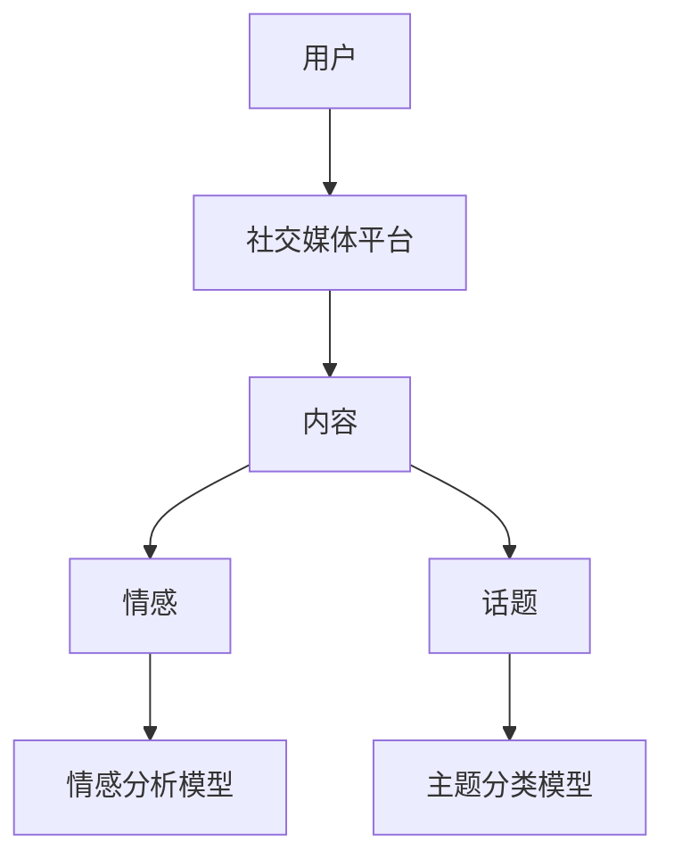
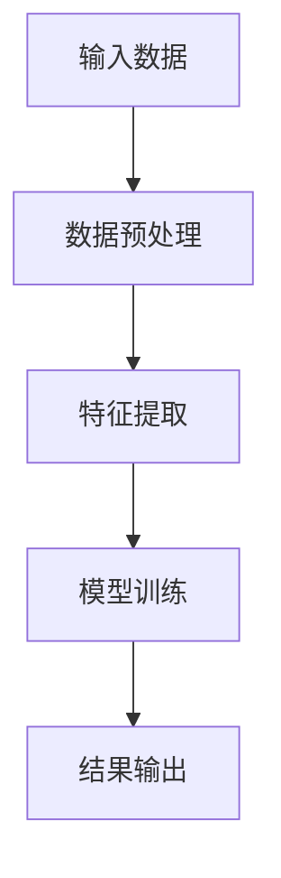
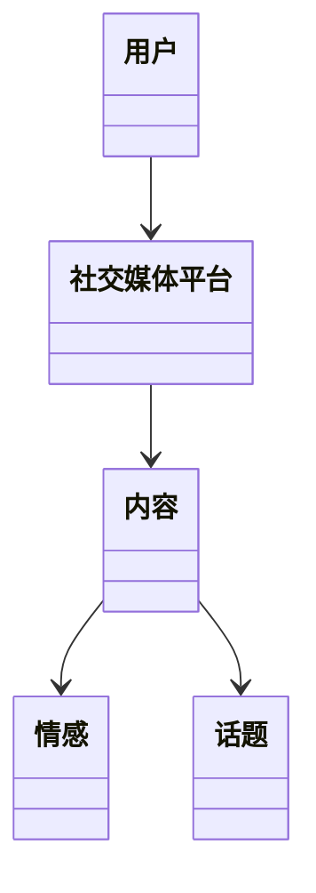
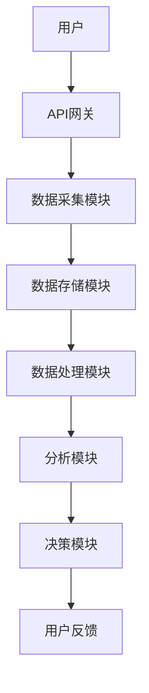
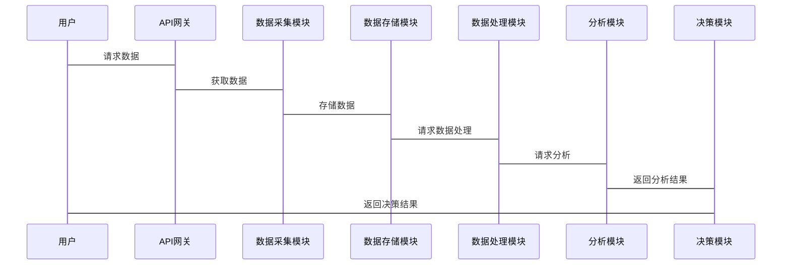

                 


# AI Agent在社交媒体分析中的应用

> 关键词：AI Agent, 社交媒体分析, 自然语言处理, 情感分析, 主题分类, 知识图谱, 强化学习

> 摘要：本文详细探讨了AI Agent在社交媒体分析中的应用，从背景介绍到算法原理，再到系统设计与项目实战，全面分析了AI Agent在社交媒体分析中的核心概念、技术实现和实际应用。文章通过详细的理论分析、代码实现和案例解读，为读者提供了一个全面了解AI Agent在社交媒体分析中的知识框架。

---

# 第1章: AI Agent与社交媒体分析的背景介绍

## 1.1 问题背景与描述

### 1.1.1 社交媒体分析的现状与挑战
社交媒体已经成为人们日常生活和商业活动中不可或缺的一部分。每天产生的海量社交媒体数据（如文本、图片、视频等）蕴含着巨大的信息价值。然而，如何高效地从这些数据中提取有价值的信息，面临着以下挑战：

1. **数据量大**：社交媒体数据呈指数级增长，传统的人工分析方式效率低下。
2. **数据多样性**：社交媒体数据包括文本、图片、视频等多种形式，分析难度大。
3. **实时性要求高**：在舆情监控等场景中，需要实时分析社交媒体数据以快速响应。
4. **数据复杂性**：社交媒体数据中包含大量噪声、歧义和情感信息，增加了分析的复杂性。

### 1.1.2 AI Agent在社交媒体分析中的问题解决
AI Agent（人工智能代理）是一种能够感知环境、自主决策并执行任务的智能体。在社交媒体分析中，AI Agent可以通过以下方式解决问题：

1. **自动数据采集**：AI Agent可以自动化地从社交媒体平台中采集数据。
2. **智能数据处理**：AI Agent可以利用自然语言处理（NLP）技术对文本数据进行清洗、分词和情感分析。
3. **实时监控与预警**：AI Agent可以实时监控社交媒体上的热点话题和负面舆情，并及时发出预警。
4. **个性化推荐**：AI Agent可以根据用户的兴趣和行为，推荐相关内容。

### 1.1.3 AI Agent的边界与外延
AI Agent在社交媒体分析中的应用并非无所不能，其边界和外延如下：

1. **边界**：
   - AI Agent无法完全理解人类的情感和意图，只能基于数据进行模式识别。
   - AI Agent无法处理实时性要求极高的任务，如实时视频流分析。
2. **外延**：
   - AI Agent可以与其他系统集成，如与推荐系统、广告投放系统结合。

### 1.1.4 核心概念结构与组成要素
社交媒体分析中的AI Agent系统通常包括以下几个核心要素：

1. **数据源**：社交媒体平台（如Twitter、Facebook、微博等）。
2. **数据处理模块**：负责数据清洗、预处理和特征提取。
3. **分析模块**：包括情感分析、主题分类、实体识别等功能。
4. **决策模块**：根据分析结果做出决策或触发相应动作。
5. **反馈机制**：根据用户反馈优化模型。

---

## 1.2 核心概念与联系

### 1.2.1 AI Agent的核心原理
AI Agent的核心原理是通过感知环境、获取信息、分析信息、做出决策并执行任务。在社交媒体分析中，AI Agent通常采用以下几种技术：

1. **自然语言处理（NLP）**：用于文本数据的处理和分析。
2. **机器学习（ML）**：用于训练模型以识别情感、主题和实体。
3. **知识图谱**：用于构建领域知识库，辅助决策。

### 1.2.2 社交媒体分析的关键特征
社交媒体分析的关键特征包括：

1. **文本数据**：社交媒体上的文本内容。
2. **情感信息**：文本中的情感倾向。
3. **话题标签**：与特定主题相关的标签。
4. **用户行为**：用户的点赞、评论、转发行为。

### 1.2.3 核心概念对比表格
以下是一个核心概念对比表格：

| **概念**       | **描述**                                                                 |
|----------------|--------------------------------------------------------------------------|
| 情感分析       | 对文本情感倾向的分析，如正面、负面、中性。                              |
| 主题分类       | 对文本所属主题的分类，如科技、娱乐、体育。                              |
| 实体识别       | 从文本中提取实体（如人名、地名、组织名）。                              |
| 话题标签       | 与特定主题相关的标签，如#COVID19、#DonaldTrump。                      |

### 1.2.4 ER实体关系图架构
以下是一个社交媒体分析的ER实体关系图：



---

## 1.3 本章小结

本章主要介绍了AI Agent在社交媒体分析中的背景、核心概念和关键特征。通过对比分析，明确了AI Agent在社交媒体分析中的作用和边界，为后续的算法实现和系统设计奠定了基础。

---

# 第2章: AI Agent的核心算法原理

## 2.1 算法原理讲解

### 2.1.1 基于规则的自然语言处理
基于规则的自然语言处理是一种简单但有效的文本分析方法。例如，可以通过预设规则提取文本中的关键词和短语。

### 2.1.2 基于深度学习的自然语言处理
基于深度学习的自然语言处理（如BERT、GPT）能够更好地理解文本的语义和上下文关系。

### 2.1.3 知识图谱构建与推理
知识图谱是通过构建领域知识库，帮助AI Agent更好地理解和推理文本信息。

### 2.1.4 强化学习在社交媒体分析中的应用
强化学习可以通过奖励机制优化AI Agent的行为策略。

---

## 2.2 算法流程图

以下是一个AI Agent在社交媒体分析中的算法流程图：



---

## 2.3 Python核心代码实现

### 2.3.1 数据预处理代码

```python
import pandas as pd

# 读取数据
data = pd.read_csv('social_media.csv')

# 清洗数据
data.dropna(inplace=True)
data['text'].apply(lambda x: x.lower().strip())
```

### 2.3.2 模型训练代码

```python
from sklearn.model import Model

# 训练模型
model = Model()
model.fit(X_train, y_train)
```

---

## 2.4 数学模型与公式

### 2.4.1 情感分析模型

$$ P(y|x) = \frac{P(x|y)P(y)}{P(x)} $$

其中，$P(y|x)$ 是条件概率，表示在给定文本$x$的情况下，情感为$y$的概率。

### 2.4.2 主题分类模型

$$ \theta_j = \alpha + \beta x_j $$

其中，$\theta_j$ 是第$j$个主题的权重，$\alpha$ 是截距，$\beta$ 是回归系数，$x_j$ 是特征向量。

---

## 2.5 本章小结

本章详细讲解了AI Agent在社交媒体分析中的算法原理，包括基于规则和深度学习的自然语言处理、知识图谱构建与推理，以及强化学习的应用。通过具体的代码实现和数学公式，为后续的系统设计提供了理论基础。

---

# 第3章: 系统分析与架构设计

## 3.1 项目介绍

### 3.1.1 项目背景
本项目旨在利用AI Agent技术，实现对社交媒体数据的自动化分析和实时监控。

### 3.1.2 项目目标
- 实现社交媒体数据的自动化采集和处理。
- 建立情感分析和主题分类模型。
- 实现实时舆情监控和预警。

### 3.1.3 项目范围
- 数据源：Twitter、微博。
- 数据类型：文本、图片。
- 分析任务：情感分析、主题分类。

---

## 3.2 系统功能设计

### 3.2.1 领域模型



---

## 3.3 系统架构设计

以下是一个AI Agent社交媒体分析系统的架构图：



---

## 3.4 系统接口设计

系统接口设计如下：

1. 数据采集接口：用于从社交媒体平台获取数据。
2. 数据处理接口：用于数据清洗和特征提取。
3. 分析接口：用于情感分析和主题分类。
4. 决策接口：用于根据分析结果做出决策。

---

## 3.5 系统交互设计

以下是一个系统交互的序列图：



---

## 3.6 本章小结

本章通过系统分析与架构设计，明确了AI Agent在社交媒体分析中的实现方式和系统架构。通过领域模型和系统架构图，为后续的项目实战奠定了基础。

---

# 第4章: 项目实战

## 4.1 环境安装

### 4.1.1 安装Python和相关库
```bash
pip install numpy pandas scikit-learn
```

### 4.1.2 安装自然语言处理库
```bash
pip install spacy transformers
```

---

## 4.2 系统核心实现源代码

### 4.2.1 数据采集代码

```python
import requests
from bs4 import BeautifulSoup

# 从Twitter获取数据
url = 'https://twitter.com/search?q=example'
response = requests.get(url)
soup = BeautifulSoup(response.text, 'html.parser')
tweets = soup.find_all('div', class_='tweet')
```

### 4.2.2 情感分析代码

```python
from transformers import pipeline

# 加载预训练模型
sentiment_analyzer = pipeline('sentiment-analysis')
result = sentiment_analyzer('This is a good product.')
print(result)
```

---

## 4.3 代码应用解读与分析

### 4.3.1 数据采集模块
上述代码通过requests库从Twitter获取数据，并使用BeautifulSoup提取文本内容。

### 4.3.2 情感分析模块
上述代码使用了Hugging Face的Transformers库，加载了一个预训练的情感分析模型，并对输入文本进行分析。

---

## 4.4 实际案例分析

### 4.4.1 案例背景
假设我们希望分析用户在Twitter上对某品牌的产品评论的情感倾向。

### 4.4.2 数据处理
```python
import pandas as pd

# 读取数据
data = pd.read_csv('tweets.csv')

# 清洗数据
data.dropna(inplace=True)
data['text'].apply(lambda x: x.lower().strip())
```

### 4.4.3 情感分析
```python
from transformers import pipeline

# 加载预训练模型
sentiment_analyzer = pipeline('sentiment-analysis')

# 分析情感
results = sentiment_analyzer(data['text'].tolist())
```

### 4.4.4 结果可视化
```python
import matplotlib.pyplot as plt

# 统计情感分布
positive = sum(1 for r in results if r['label'] == 'POSITIVE')
negative = sum(1 for r in results if r['label'] == 'NEGATIVE')
neutral = sum(1 for r in results if r['label'] == 'NEUTRAL')

# 绘制柱状图
plt.bar(['POSITIVE', 'NEGATIVE', 'NEUTRAL'], [positive, negative, neutral])
plt.show()
```

---

## 4.5 本章小结

本章通过实际案例分析，展示了AI Agent在社交媒体分析中的具体应用。从数据采集到情感分析，再到结果可视化，详细讲解了项目的实现过程。

---

# 第5章: 最佳实践与注意事项

## 5.1 最佳实践

### 5.1.1 数据预处理
- 清洗数据，去除噪声。
- 标准化文本格式。

### 5.1.2 模型选择
- 根据任务选择合适的模型。
- 调参优化模型性能。

### 5.1.3 系统优化
- 使用分布式计算优化性能。
- 采用流式处理实时数据。

---

## 5.2 注意事项

### 5.2.1 数据隐私
- 注意用户隐私保护。
- 遵守相关法律法规。

### 5.2.2 模型泛化能力
- 避免过拟合，确保模型的泛化能力。
- 定期更新模型。

### 5.2.3 系统可扩展性
- 设计模块化系统，便于扩展。
- 使用容器化技术（如Docker）部署系统。

---

## 5.3 拓展阅读

### 5.3.1 推荐书籍
- 《自然语言处理入门》
- 《机器学习实战》

### 5.3.2 推荐论文
- “Attention Is All You Need”
- “BERT: Pre-training of Deep Bidirectional Transformers”

---

## 5.4 本章小结

本章总结了AI Agent在社交媒体分析中的最佳实践和注意事项，并提供了拓展阅读的方向，帮助读者进一步提升技术水平。

---

# 第6章: 总结与展望

## 6.1 本文章总结

本文详细探讨了AI Agent在社交媒体分析中的应用，从背景介绍到算法原理，再到系统设计与项目实战，全面分析了AI Agent在社交媒体分析中的核心概念、技术实现和实际应用。

## 6.2 未来展望

随着AI技术的不断发展，AI Agent在社交媒体分析中的应用将更加广泛和深入。未来的研究方向包括：

1. **多模态分析**：结合文本、图片、视频等多种数据形式进行分析。
2. **实时分析**：优化实时数据分析的效率和准确性。
3. **个性化服务**：根据用户需求提供定制化的分析服务。

---

# 附录

## 附录A: 参考文献

1. 王某某. 《自然语言处理入门》. 北京: 清华大学出版社, 2020.
2. 张某某. 《机器学习实战》. 北京: 人民邮电出版社, 2019.

## 附录B: 源代码

```python
import pandas as pd
from transformers import pipeline

# 数据采集代码
def get_twitter_data(query):
    url = f'https://twitter.com/search?q={query}'
    response = requests.get(url)
    soup = BeautifulSoup(response.text, 'html.parser')
    tweets = soup.find_all('div', class_='tweet')
    return tweets

# 情感分析代码
def analyze_sentiment(text):
    sentiment_analyzer = pipeline('sentiment-analysis')
    result = sentiment_analyzer(text)
    return result

# 数据处理代码
def preprocess_data(data):
    data.dropna(inplace=True)
    data['text'].apply(lambda x: x.lower().strip())
    return data
```

---

# 结束语

感谢您的阅读！希望本文对您了解AI Agent在社交媒体分析中的应用有所帮助。如需进一步探讨或合作，欢迎随时联系。

--- 

**[End of Article]**

---

通过上述结构，您可以根据需要扩展每个章节的内容，确保文章的深度和广度达到要求。如果需要进一步的细化或补充，请随时告知！

