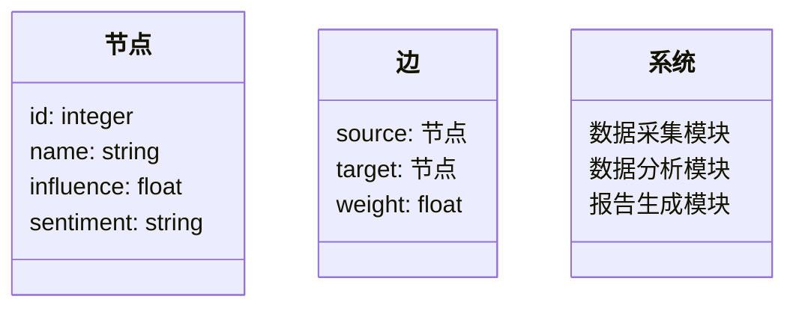
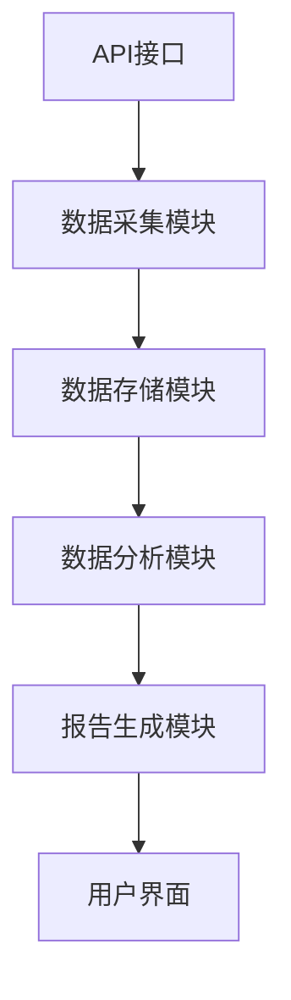
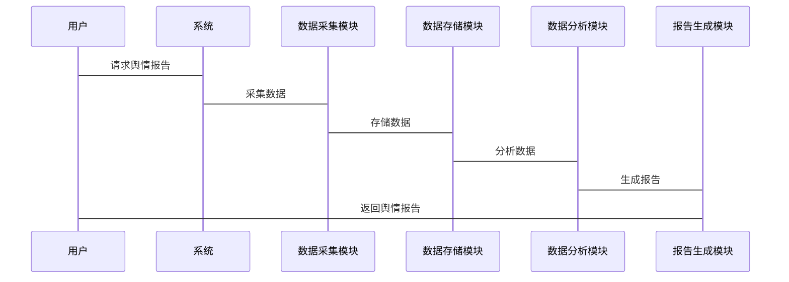

                 


```markdown
# AI Agent在社交网络分析中的应用：舆情监测与影响力评估

> 关键词：AI Agent，社交网络分析，舆情监测，影响力评估，算法原理，系统架构

> 摘要：本文系统地探讨了AI Agent在社交网络分析中的应用，重点分析了舆情监测与影响力评估的核心概念、算法原理、系统架构及项目实战。通过详细的技术分析和实际案例，深入阐述了AI Agent如何赋能社交网络分析，帮助读者全面理解并掌握相关技术。

---

# 第一部分: AI Agent与社交网络分析基础

## 第1章: AI Agent的基本概念与应用

### 1.1 AI Agent的定义与特点
#### 1.1.1 AI Agent的定义
AI Agent（人工智能代理）是指能够感知环境、自主决策并执行任务的智能实体。它能够通过传感器获取信息，利用算法进行分析，并通过执行器完成目标。

#### 1.1.2 AI Agent的核心特点
- **自主性**：能够在没有外部干预的情况下自主完成任务。
- **反应性**：能够实时感知环境变化并做出反应。
- **学习能力**：能够通过数据学习和优化自身行为。
- **协作性**：能够与其他Agent或系统协同工作。

#### 1.1.3 AI Agent与传统算法的区别
AI Agent不仅是一个算法，而是一个具备感知、决策和执行能力的实体。传统算法通常需要明确的输入和输出，而AI Agent能够动态调整行为以适应环境变化。

### 1.2 社交网络分析的背景与意义
#### 1.2.1 社交网络的基本概念
社交网络是由用户、关系和内容构成的复杂图结构。用户之间通过关注、点赞、评论等行为建立联系，形成了复杂的网络关系。

#### 1.2.2 社交网络分析的重要性
社交网络分析能够帮助我们发现网络中的关键节点、识别社区结构、分析信息传播路径等，为舆情监测和影响力评估提供基础。

#### 1.2.3 舆情监测与影响力评估的必要性
舆情监测可以帮助企业及时了解公众对其产品或服务的评价，而影响力评估则能够帮助企业识别关键意见领袖（KOL）并制定有效的传播策略。

## 第2章: 舆情监测与影响力评估的核心概念

### 2.1 舆情监测的基本原理
#### 2.1.1 舆情监测的定义
舆情监测是指通过采集和分析社交网络上的文本数据，了解公众对特定话题、品牌或产品的看法和态度。

#### 2.1.2 舆情监测的主要方法
- **关键词提取**：通过NLP技术提取文本中的关键词，识别相关话题。
- **情感分析**：判断文本的情感倾向（正面、负面、中性）。
- **话题跟踪**：实时跟踪特定话题的热度变化。

#### 2.1.3 舆情监测的实现步骤
1. 数据采集：通过API或爬虫获取社交网络上的文本数据。
2. 数据预处理：清洗数据，去除噪声。
3. 关键词提取：提取与目标相关的关键词。
4. 情感分析：判断文本的情感倾向。
5. 舆情报告：生成舆情分析报告。

### 2.2 影响力评估的定义与模型
#### 2.2.1 影响力评估的定义
影响力评估是指通过分析社交网络中的节点属性和关系结构，评估用户在网络中的影响力。

#### 2.2.2 影响力评估的主要模型
- **中心性分析**：包括度中心性、接近中心性、中间中心性等。
- **影响力传播模型**：如PageRank算法、LSI模型等。

#### 2.2.3 影响力评估的实现步骤
1. 数据采集：获取社交网络的节点和边信息。
2. 数据预处理：清洗数据，构建网络图。
3. 模型选择：选择合适的影响力评估模型。
4. 模型计算：计算每个节点的影响力值。
5. 结果分析：根据影响力值制定传播策略。

## 第3章: AI Agent在社交网络分析中的应用

### 3.1 AI Agent在舆情监测中的应用
#### 3.1.1 基于AI Agent的舆情采集
AI Agent可以通过API或爬虫自动采集社交网络上的文本数据，实时获取最新的舆情信息。

#### 3.1.2 基于AI Agent的舆情分析
AI Agent能够通过自然语言处理技术对文本数据进行情感分析，识别关键词，并生成舆情报告。

#### 3.1.3 基于AI Agent的舆情预警
AI Agent能够实时监控舆情变化，当发现负面舆情时，及时发出预警信号。

### 3.2 AI Agent在影响力评估中的应用
#### 3.2.1 基于AI Agent的影响力计算
AI Agent能够通过中心性分析和影响力传播模型计算每个节点的影响力值。

#### 3.2.2 基于AI Agent的影响力预测
AI Agent可以通过时间序列分析预测未来的信息传播趋势。

#### 3.2.3 基于AI Agent的影响力优化
AI Agent可以优化信息传播路径，最大化信息的传播效果。

---

# 第二部分: AI Agent的算法原理与数学模型

## 第4章: 舆情监测的算法原理

### 4.1 情感分析算法
#### 4.1.1 基于规则的情感分析
通过预定义的关键词和规则进行情感分类，适用于简单的文本分析。

#### 4.1.2 基于机器学习的情感分析
使用机器学习算法（如SVM、随机森林）训练情感分类模型。

#### 4.1.3 基于深度学习的情感分析
使用神经网络（如LSTM、BERT）进行情感分析，能够处理复杂的文本语义。

### 4.2 关键词提取算法
#### 4.2.1 基于TF-IDF的关键词提取
通过计算文本中关键词的TF-IDF值，提取最重要的关键词。

#### 4.2.2 基于主题模型的关键词提取
使用LDA等主题模型提取文本的主题关键词。

### 4.3 舆情传播模型
#### 4.3.1 PageRank算法
通过计算节点的PageRank值，评估节点的影响力。

#### 4.3.2 LSIS模型
通过计算节点的潜在语义相似性，评估节点的影响力。

---

## 第5章: 影响力评估的数学模型

### 5.1 中心性分析模型
#### 5.1.1 度中心性
$$ C_d(v) = \frac{1}{\sqrt{\sum_{i} C_d(i)}} \sum_{j} A_{jv} $$
其中，$A_{jv}$表示节点$j$与节点$v$之间是否有边。

#### 5.1.2 接近中心性
$$ C_a(v) = \frac{1}{\sqrt{\sum_{i} C_a(i)}} \sum_{j} \text{shortest path}(v, j) $$
其中，$\text{shortest path}(v, j)$表示节点$v$到节点$j$的最短路径长度。

#### 5.1.3 中间中心性
$$ C_b(v) = \frac{1}{\sqrt{\sum_{i} C_b(i)}} \sum_{j} \text{number of shortest paths}(v, j) $$
其中，$\text{number of shortest paths}(v, j)$表示节点$v$到节点$j$的最短路径数量。

### 5.2 影响力传播模型
#### 5.2.1 PageRank算法
$$ PR(v) = \alpha \sum_{u \in I(v)} \frac{PR(u)}{\text{out-degree}(u)} + (1 - \alpha) \frac{1}{N} $$
其中，$I(v)$表示指向节点$v$的节点集合，$\text{out-degree}(u)$表示节点$u$的出度，$N$表示网络中节点的总数，$\alpha$是阻尼系数。

#### 5.2.2 LSIS模型
$$ \text{sim}(v, u) = \frac{\sum_{k=1}^{n} \lambda_k t_k(v) t_k(u)}{\sqrt{\sum_{k=1}^{n} \lambda_k t_k(v)^2} \sqrt{\sum_{k=1}^{n} \lambda_k t_k(u)^2}} $$
其中，$\lambda_k$是主题模型中的主题权重，$t_k(v)$是节点$v$在主题$k$上的概率。

---

## 第6章: 系统分析与架构设计方案

### 6.1 问题场景介绍
舆情监测与影响力评估系统需要实时处理海量数据，对数据进行清洗、分析和存储，并生成实时报告。

### 6.2 系统功能设计
#### 6.2.1 领域模型


#### 6.2.2 系统架构


#### 6.2.3 系统接口设计
- 数据采集模块接口：`get_data()`，用于获取社交网络数据。
- 数据分析模块接口：`analyze_data()`，用于对数据进行情感分析和影响力评估。
- 报告生成模块接口：`generate_report()`，用于生成舆情分析报告。

#### 6.2.4 系统交互


---

## 第7章: 项目实战

### 7.1 环境安装
- Python 3.8+
- Anaconda
- Numpy
- Pandas
- Sklearn
- Networkx
- Plotly

### 7.2 核心代码实现
#### 7.2.1 情感分析代码
```python
from sklearn.feature_extraction.text import TfidfVectorizer
from sklearn.svm import SVC

# 数据预处理
vectorizer = TfidfVectorizer()
X = vectorizer.fit_transform(corpus)
y = [sentiment for sentiment in sentiments]

# 模型训练
model = SVC()
model.fit(X, y)

# 模型预测
test_data = ["这是一个很好的产品"]
test_vector = vectorizer.transform(test_data)
print(model.predict(test_vector))
```

#### 7.2.2 影响力传播代码
```python
import networkx as nx

G = nx.Graph()
G.add_edges_from(edges)
nx.pagerank(G)
```

### 7.3 实际案例分析
以某品牌的产品评论为例，分析其情感倾向，并识别具有高影响力的用户。

---

## 第8章: 最佳实践与小结

### 8.1 最佳实践
- 定期更新模型，避免过时。
- 选择合适的算法，结合业务需求。
- 注意数据隐私，遵守相关法律法规。

### 8.2 小结
AI Agent在社交网络分析中的应用为舆情监测和影响力评估提供了新的思路和技术手段。通过本文的系统讲解和实际案例分析，读者可以深入理解AI Agent的核心原理和实际应用。

### 8.3 注意事项
- 数据质量和完整性直接影响分析结果。
- 算法选择需结合具体业务场景。
- 系统设计需考虑可扩展性和可维护性。

### 8.4 拓展阅读
- 《网络科学导论》
- 《机器学习实战》
- 《自然语言处理入门》
```

---

通过以上目录结构，本文系统地介绍了AI Agent在社交网络分析中的应用，从基础概念到算法原理，再到系统设计和项目实战，帮助读者全面掌握相关技术。

