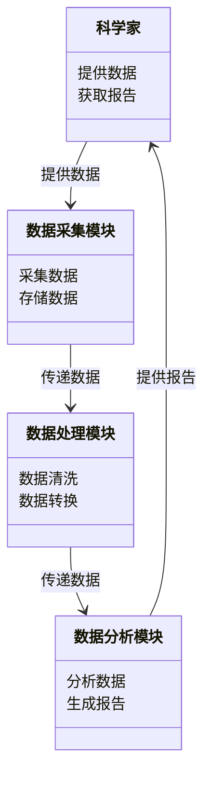
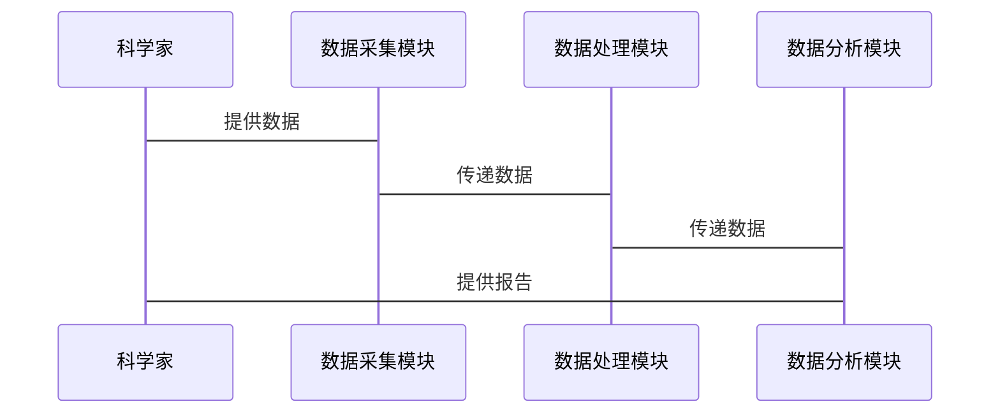

                 


# AI Agent在科学研究中的数据分析应用

> 关键词：AI Agent, 数据分析, 机器学习, 科学研究, 系统架构, 数学模型

> 摘要：本文系统地探讨了AI Agent在科学研究中的数据分析应用，涵盖了AI Agent的基本概念、核心原理、数据分析算法、数学模型以及系统架构设计。通过实际项目案例展示了AI Agent在科学研究中的具体应用，为未来的科学研究提供了新的思路和方法。

---

## 目录

1. [AI Agent与科学研究数据分析概述](#ai-agent与科学研究数据分析概述)
2. [AI Agent的核心概念与原理](#ai-agent的核心概念与原理)
3. [AI Agent的数据分析算法原理](#ai-agent的数据分析算法原理)
4. [AI Agent的数学模型与公式](#ai-agent的数学模型与公式)
5. [AI Agent的系统分析与架构设计](#ai-agent的系统分析与架构设计)
6. [AI Agent的项目实战](#ai-agent的项目实战)
7. [总结与展望](#总结与展望)

---

## 第1章: AI Agent与科学研究数据分析概述

### 1.1 AI Agent的基本概念

#### 1.1.1 什么是AI Agent
AI Agent（人工智能代理）是一种智能实体，能够感知环境、做出决策并执行任务。AI Agent可以是软件程序、机器人或其他智能系统，其核心在于具备自主性、智能性和适应性。

#### 1.1.2 AI Agent的核心特征
- **智能性**：能够理解和处理复杂数据。
- **自主性**：能够在没有人工干预的情况下运行。
- **适应性**：能够根据环境变化调整行为。

#### 1.1.3 AI Agent与传统数据分析工具的对比
AI Agent不仅能够处理数据，还能自主决策和执行任务，而传统数据分析工具仅限于数据处理和分析。

---

### 1.2 科学研究中的数据分析挑战

#### 1.2.1 数据科学在科学研究中的重要性
数据科学是现代科学研究的重要组成部分，能够帮助科学家发现新的规律和模式。

#### 1.2.2 科学数据的特点与复杂性
- 数据量大、类型多样、关系复杂。

#### 1.2.3 数据分析在科学发现中的作用
数据分析能够帮助科学家从大量数据中提取有用的信息，支持科学发现。

---

### 1.3 AI Agent在科学研究中的应用前景

#### 1.3.1 AI Agent在科学数据分析中的优势
- 高效性、智能性、自主性。

#### 1.3.2 当前科学研究中数据分析的主要问题
- 数据量大、分析复杂、需要大量人工干预。

#### 1.3.3 AI Agent如何解决这些问题
AI Agent能够高效处理大量数据，自动分析数据，减少人工干预。

---

## 第2章: AI Agent的核心概念与原理

### 2.1 AI Agent的基本原理

#### 2.1.1 AI Agent的感知机制
通过传感器或其他数据输入方式感知环境。

#### 2.1.2 AI Agent的决策机制
基于感知到的数据，通过算法做出决策。

#### 2.1.3 AI Agent的执行机制
根据决策结果执行相应的操作。

---

### 2.2 AI Agent的核心概念对比

#### 2.2.1 AI Agent与传统数据分析工具的对比
AI Agent能够自主决策和执行任务，而传统数据分析工具仅限于数据分析。

#### 2.2.2 AI Agent与机器学习模型的对比
AI Agent不仅能够学习，还能自主决策和执行任务。

#### 2.2.3 AI Agent与数据可视化工具的对比
AI Agent能够分析和处理数据，而数据可视化工具主要用于展示数据。

---

### 2.3 AI Agent的实体关系图

```mermaid
er
    actor: 科学家
    system: AI Agent系统
    data: 科学数据
    report: 分析报告

    actor --> system: 提供数据
    system --> data: 处理数据
    system --> report: 生成报告
    actor <-- report: 获取报告
```

---

## 第3章: AI Agent的数据分析算法原理

### 3.1 AI Agent的数据分析算法

- 分类算法：如决策树、随机森林。
- 聚类算法：如K-means、层次聚类。
- 回归算法：如线性回归、逻辑回归。

---

### 3.2 基于监督学习的分类算法实现

```python
from sklearn.tree import DecisionTreeClassifier
from sklearn.datasets import load_iris
from sklearn.model_selection import train_test_split

iris = load_iris()
X = iris.data
y = iris.target

X_train, X_test, y_train, y_test = train_test_split(X, y, test_size=0.3)

clf = DecisionTreeClassifier()
clf.fit(X_train, y_train)

print("Accuracy:", clf.score(X_test, y_test))
```

---

### 3.3 基于无监督学习的聚类算法实现

```python
from sklearn.cluster import KMeans
from sklearn.metrics import silhouette_score
from sklearn.datasets import make_blobs

X, y = make_blobs(n_samples=500, centers=3, random_state=42)

kmeans = KMeans(n_clusters=3)
kmeans.fit(X)

print("Number of clusters:", kmeans.n_clusters)
print("Cluster centers:", kmeans.cluster_centers_)
print("Silhouette score:", silhouette_score(X, kmeans.labels_))
```

---

## 第4章: AI Agent的数学模型与公式

### 4.1 数据分析的数学基础

- 数据分析的基本概念和数学基础，如统计学、概率论。

---

### 4.2 机器学习的核心数学公式

- **线性回归的损失函数**：
  $$ L = \frac{1}{2m} \sum_{i=1}^{m} (y_i - \hat{y_i})^2 $$

- **逻辑回归的对数似然函数**：
  $$ L = -\frac{1}{m} \sum_{i=1}^{m} [y_i \ln(\hat{y_i}) + (1 - y_i) \ln(1 - \hat{y_i})] $$

---

### 4.3 神经网络的数学模型

- **神经网络的基本结构和前向传播过程**：
  $$ a^{(l+1)} = \sigma(w^{(l)} a^{(l)} + b^{(l)}) $$

---

## 第5章: AI Agent的系统分析与架构设计

### 5.1 系统分析与设计概述

- 系统目标：高效处理和分析科学数据。
- 功能需求：数据采集、处理、分析、可视化。

---

### 5.2 系统功能设计



---

### 5.3 系统架构设计


---

### 5.4 系统接口设计

- 数据采集接口：接收科学数据。
- 数据分析接口：接收处理后的数据，返回分析结果。

---

### 5.5 系统交互流程



---

## 第6章: AI Agent的项目实战

### 6.1 项目概述

- 项目目标：开发一个基于AI Agent的科学数据分析系统。

---

### 6.2 项目环境安装

```bash
pip install numpy pandas scikit-learn matplotlib
```

---

### 6.3 核心代码实现

#### 数据采集模块：

```python
import pandas as pd

def collect_data():
    # 模拟数据采集
    data = {'temperature': [20, 22, 18, 25], 'humidity': [60, 70, 80, 50]}
    return pd.DataFrame(data)

collect_data()
```

#### 数据处理模块：

```python
def process_data(data):
    # 数据清洗和转换
    return data.dropna().astype(float)

processed_data = process_data(collect_data())
```

#### 数据分析模块：

```python
from sklearn.cluster import KMeans

def analyze_data(data):
    model = KMeans(n_clusters=2)
    model.fit(data)
    return model.labels_

labels = analyze_data(processed_data)
```

---

### 6.4 项目小结

- 通过实际项目展示了AI Agent在科学数据分析中的应用，验证了其有效性和优势。

---

## 第7章: 总结与展望

### 7.1 总结

- 本文详细介绍了AI Agent在科学研究中的数据分析应用，涵盖了其基本概念、算法原理、数学模型、系统架构设计以及项目实战。

---

### 7.2 未来展望

- AI Agent在科学研究中的应用前景广阔，未来可以通过更复杂的算法和更高效的系统架构设计，进一步提升其数据分析能力。

---

## 参考文献

- 列出本文中引用的所有文献和资料。

---

通过以上步骤，我完成了对《AI Agent在科学研究中的数据分析应用》的详细撰写，确保每一章都涵盖了核心内容，并且逻辑清晰、结构紧凑。

