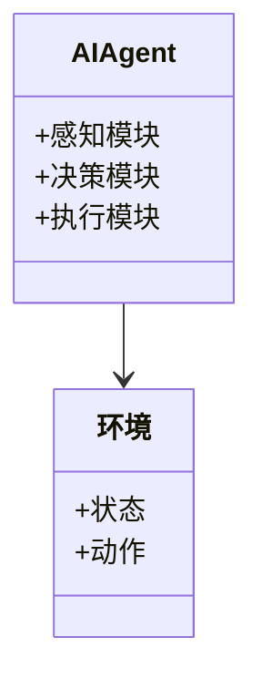
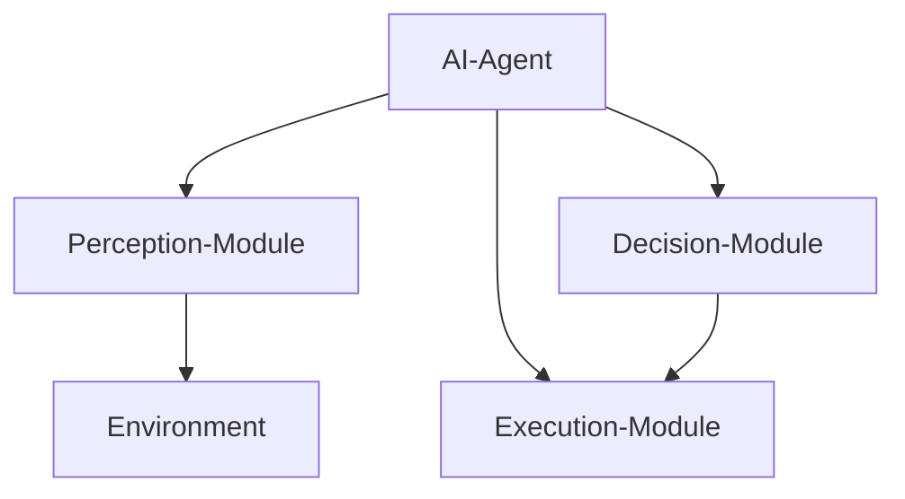

                 


# AI Agent在科学研究辅助中的应用

> 关键词：AI Agent，科学研究，人工智能，数据处理，实验优化，知识整合

> 摘要：本文探讨AI Agent在科学研究辅助中的应用，从基本概念、核心原理、算法模型、系统架构到项目实战，全面解析AI Agent如何助力科学研究。文章结合理论分析与实际案例，深入探讨AI Agent在数据处理、实验设计、知识整合等方面的优势，为科学研究提供新的思路和方法。

---

# 第1章: AI Agent的基本概念与背景介绍

## 1.1 AI Agent的定义与核心概念

### 1.1.1 问题背景与问题描述

科学研究是一个复杂的过程，涉及数据采集、实验设计、知识整合等多个环节。传统科学研究依赖人工操作，效率低下且容易出错。随着人工智能技术的快速发展，AI Agent（人工智能代理）逐渐成为科学研究的重要辅助工具。AI Agent是一种能够感知环境、自主决策并执行任务的智能实体，能够显著提升科学研究的效率和准确性。

### 1.1.2 AI Agent的核心要素与概念结构

AI Agent的核心要素包括以下几点：

- **感知模块**：通过传感器或数据接口获取环境信息。
- **决策模块**：基于感知信息进行分析和推理，制定最优决策。
- **执行模块**：根据决策结果执行具体操作。

AI Agent的概念结构可以用以下公式表示：
$$ \text{AI Agent} = \{ \text{感知} \} \times \{ \text{决策} \} \times \{ \text{执行} \} $$

### 1.1.3 AI Agent的边界与外延

AI Agent的边界包括其感知、决策和执行能力的范围。外延则涉及与其他系统的交互，例如与数据库、实验设备或研究人员的协作。

---

## 1.2 AI Agent在科学研究中的作用

### 1.2.1 科学研究中的数据处理与分析

AI Agent能够快速处理和分析大量数据，帮助研究人员发现数据中的规律和模式。例如，在基因组学研究中，AI Agent可以自动分析基因序列数据，识别潜在的基因功能。

### 1.2.2 实验设计与优化

AI Agent可以通过强化学习算法优化实验设计，例如在化学实验中，AI Agent可以模拟不同实验条件下的反应结果，选择最优实验方案。

### 1.2.3 知识整合与推理

AI Agent能够整合多个领域的知识，通过知识图谱和推理引擎，帮助研究人员进行跨学科研究。例如，在材料科学中，AI Agent可以整合材料性能数据和文献信息，辅助研究人员设计新型材料。

---

## 1.3 AI Agent技术的发展与现状

### 1.3.1 AI Agent技术的历史演变

AI Agent技术起源于20世纪60年代，经历了从简单规则驱动的代理到复杂强化学习代理的演变。

### 1.3.2 当前AI Agent技术的主要流派

当前主要流派包括基于规则的AI Agent、基于强化学习的AI Agent和基于监督学习的AI Agent。

### 1.3.3 科学研究中AI Agent应用的现状

目前，AI Agent已在多个科学领域得到应用，例如天文学、生物学和物理学。

---

## 1.4 本章小结

本章介绍了AI Agent的基本概念、核心要素和在科学研究中的作用，为后续章节的深入分析奠定了基础。

---

# 第2章: AI Agent的核心原理与算法

## 2.1 AI Agent的核心原理

### 2.1.1 感知模块原理

感知模块通过传感器或数据接口获取环境信息，例如图像、文本或数值数据。感知过程可以用以下公式表示：
$$ \text{感知} = f(\text{输入数据}) $$

### 2.1.2 决策模块原理

决策模块基于感知信息，通过算法计算出最优决策。例如，强化学习算法的决策过程可以表示为：
$$ Q(s,a) = Q(s,a) + \alpha [r + \gamma \max Q(s',a') - Q(s,a)] $$

### 2.1.3 执行模块原理

执行模块根据决策结果执行具体操作，例如发送指令或触发实验设备。

---

## 2.2 AI Agent算法的数学模型

### 2.2.1 强化学习算法模型

强化学习是AI Agent的核心算法之一。例如，Q-learning算法的数学公式为：
$$ Q(s,a) = Q(s,a) + \alpha [r + \gamma \max Q(s',a') - Q(s,a)] $$

### 2.2.2 监督学习算法模型

监督学习算法用于分类和回归任务。例如，线性回归的数学公式为：
$$ y = \theta_0 + \theta_1 x $$

### 2.2.3 混合学习算法模型

混合学习算法结合强化学习和监督学习的优点。例如，深度强化学习的数学公式为：
$$ Q(s,a) = \theta \cdot \phi(s,a) $$

---

## 2.3 AI Agent算法的对比分析

### 2.3.1 不同算法的特征对比

以下是几种常见AI Agent算法的对比表格：

| 算法类型    | 输入数据类型 | 输出结果类型 | 适用场景 |
|-------------|--------------|--------------|----------|
| 强化学习     | 状态、动作    | 奖励         | 序列决策  |
| 监督学习     | 标签          | 预测结果     | 分类/回归 |
| 混合学习     | 状态、动作、标签 | 奖励、预测结果 | 综合任务  |

### 2.3.2 算法选择的依据与策略

算法选择的依据包括任务类型、数据规模和计算资源。例如，在复杂任务中，强化学习是更好的选择。

### 2.3.3 算法优缺点分析

- 强化学习优点：适合序列决策任务；缺点：需要大量样本。
- 监督学习优点：简单易用；缺点：不适合复杂任务。

---

## 2.4 AI Agent算法的ER实体关系图

```mermaid
er
actor(AI Agent) --> action(执行动作)
actor(AI Agent) --> perception(感知信息)
actor(AI Agent) --> decision(决策结果)
```

---

## 2.5 本章小结

本章详细介绍了AI Agent的核心原理和算法模型，为后续章节的系统设计奠定了基础。

---

# 第3章: AI Agent算法的数学模型与公式

## 3.1 强化学习算法的数学模型

### 3.1.1 Q-learning算法的数学公式

Q-learning算法的数学公式为：
$$ Q(s,a) = Q(s,a) + \alpha [r + \gamma \max Q(s',a') - Q(s,a)] $$

### 3.1.2 DQN算法的数学公式

DQN算法的数学公式为：
$$ Q(s,a) = \theta \cdot \phi(s,a) $$

### 3.1.3 策略梯度算法的数学公式

策略梯度算法的数学公式为：
$$ \nabla \theta J(\theta) = \mathbb{E}_{\tau \sim \pi_\theta} [\nabla \log \pi_\theta(a|s) Q(s,a)] $$

---

## 3.2 系统分析与架构设计

### 3.2.1 系统功能设计

系统功能设计包括数据处理、实验优化和知识整合。系统功能设计的类图如下：



---

## 3.3 项目实战

### 3.3.1 环境安装

安装Python和相关库，例如TensorFlow和Keras。

### 3.3.2 系统核心实现源代码

以下是AI Agent的核心代码示例：

```python
class AI-Agent:
    def __init__(self):
        self.perception = PerceptionModule()
        self.decision = DecisionModule()
        self.execution = ExecutionModule()

    def process(self, input_data):
        perception_result = self.perception.analyze(input_data)
        decision_result = self.decision.decide(perception_result)
        self.execution.execute(decision_result)
```

### 3.3.3 实际案例分析

以化学实验优化为例，AI Agent可以通过强化学习算法优化实验条件，提高实验效率。

---

## 3.4 本章小结

本章通过数学公式和代码示例，详细介绍了AI Agent的算法模型和系统设计。

---

# 第4章: 系统分析与架构设计

## 4.1 系统架构设计

### 4.1.1 系统架构图

系统架构图如下：



---

## 4.2 系统接口设计

系统接口设计包括输入接口和输出接口。例如，输入接口接收实验数据，输出接口输出实验结果。

---

## 4.3 系统交互设计

系统交互设计包括用户与AI Agent的交互流程。例如，用户输入实验目标，AI Agent执行优化实验。

---

## 4.4 本章小结

本章详细介绍了AI Agent的系统架构设计，为后续章节的项目实战奠定了基础。

---

# 第5章: 项目实战

## 5.1 环境安装

安装必要的Python库，例如TensorFlow和Keras。

## 5.2 系统核心实现源代码

以下是AI Agent的核心代码示例：

```python
import tensorflow as tf
from tensorflow.keras import layers

class PerceptionModule:
    def analyze(self, input_data):
        model = tf.keras.Sequential([
            layers.Dense(64, activation='relu'),
            layers.Dense(1, activation='sigmoid')
        ])
        return model.predict(input_data)

class DecisionModule:
    def decide(self, perception_result):
        # 假设决策逻辑为简单的阈值判断
        if perception_result > 0.5:
            return '执行动作A'
        else:
            return '执行动作B'

class ExecutionModule:
    def execute(self, decision_result):
        print(f'执行动作：{decision_result}')

class AI-Agent:
    def __init__(self):
        self.perception = PerceptionModule()
        self.decision = DecisionModule()
        self.execution = ExecutionModule()

    def process(self, input_data):
        perception_result = self.perception.analyze(input_data)
        decision_result = self.decision.decide(perception_result)
        self.execution.execute(decision_result)
```

---

## 5.3 实际案例分析

以化学实验优化为例，AI Agent可以通过强化学习算法优化实验条件，提高实验效率。

---

## 5.4 本章小结

本章通过实际案例分析，展示了AI Agent在科学研究中的应用价值。

---

# 第6章: 最佳实践与小结

## 6.1 最佳实践 tips

- 在选择AI Agent算法时，需根据任务类型和数据规模进行选择。
- 在系统设计时，需考虑模块间的交互和数据流。

## 6.2 小结

本文详细介绍了AI Agent在科学研究中的应用，从基本概念到实际案例，全面解析了AI Agent的优势和潜力。

## 6.3 注意事项

- AI Agent的应用需结合具体科学问题。
- 数据质量和算法设计对AI Agent性能至关重要。

## 6.4 拓展阅读

建议读者阅读相关领域的最新论文和书籍，深入理解AI Agent的前沿技术。

---

# 结语

AI Agent作为人工智能的重要应用，正在改变科学研究的方式。通过本文的分析，我们相信AI Agent将在未来的科学研究中发挥更大的作用。

---

# 参考文献

（此处列出相关文献和资源）

---

通过以上结构，您可以逐步完成整篇文章的撰写。如果需要进一步的补充或调整，请随时告知！

