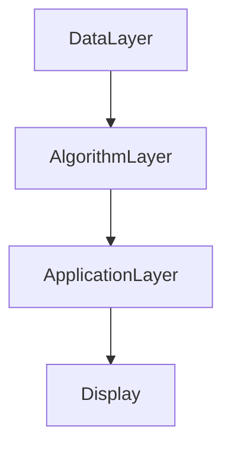

                 


# AI Agent在网络安全中的应用

## 关键词
AI Agent, 网络安全, 强化学习, 深度学习, 网络威胁, 自适应安全

## 摘要
AI Agent在网络安全中的应用是当前研究的热点，利用AI Agent的强大能力，可以实现对网络威胁的实时检测、防御和响应。本文详细探讨了AI Agent的基本概念、核心原理、系统架构及实际应用，结合具体案例分析，为读者提供全面的指导。

---

# 第一部分: AI Agent与网络安全的背景介绍

## 第1章: AI Agent的基本概念

### 1.1 AI Agent的定义与特点
AI Agent是一种智能体，能够在特定环境中感知并自主决策。其特点包括自主性、反应性、目标导向和社会能力。AI Agent能够通过传感器获取信息，并通过决策系统制定行动策略。

### 1.2 网络安全的基本问题
网络安全的核心问题是保护网络系统的机密性、完整性和可用性。主要挑战包括病毒、蠕虫、DDoS攻击和数据泄露等。

### 1.3 AI Agent在网络安全中的应用背景
AI Agent通过实时学习和自适应能力，能够有效应对复杂多变的网络威胁。其独特价值在于能够快速响应和预测潜在威胁。

---

## 第2章: AI Agent在网络安全中的核心概念与原理

### 2.1 AI Agent的基本原理
AI Agent在网络安全中的应用基于强化学习，通过状态空间、动作空间和奖励函数来优化决策过程。例如，DQN算法通过经验回放和策略网络来实现最优策略。

### 2.2 AI Agent的数学模型与算法原理
马尔可夫决策过程（MDP）是AI Agent的核心模型，定义了状态、动作、奖励和策略的关系。通过数学公式，我们可以表示Q-learning算法：

$$ Q(s, a) = Q(s, a) + \alpha [r + \gamma \max Q(s', a') - Q(s, a)] $$

其中，$\alpha$是学习率，$\gamma$是折扣因子。

### 2.3 AI Agent与传统安全技术的对比
AI Agent相比传统基于规则的安全技术，具有更高的适应性和灵活性。例如，在异常检测中，AI Agent能够识别未知威胁，而传统方法仅依赖已知模式。

---

## 第3章: 系统分析与架构设计

### 3.1 网络安全问题场景
考虑一个企业网络，需要检测未知的DDoS攻击。传统方法依赖签名匹配，而AI Agent可以通过强化学习动态调整检测策略。

### 3.2 系统功能设计
系统包括数据采集、威胁分析、决策制定和执行反馈四个模块。领域模型展示了各模块之间的交互：

```mermaid
classDiagram
    class 数据采集模块 {
        收集网络流量数据
    }
    class �威 �胁 分 析 模 块 {
        分析流量数据，识别异常行为
    }
    class 决 策 制 定 模 块 {
        生成防御策略
    }
    class �执 行 反 馈 模 块 {
        执行策略并反馈结果
    }
    数据采集模块 --> 威胁分析模块
    威胁分析模块 --> 决策制定模块
    决策制定模块 --> 执行反馈模块
```

### 3.3 系统架构设计
采用分层架构，包括数据层、算法层和应用层。架构图展示各层之间的交互：



---

## 第4章: 项目实战

### 4.1 环境安装
使用Python和TensorFlow搭建AI Agent环境。安装步骤包括安装依赖包、配置网络接口和启动数据采集工具。

### 4.2 核心代码实现
实现基于DQN的AI Agent，代码示例如下：

```python
import numpy as np
import tensorflow as tf

class DQNAgent:
    def __init__(self, state_space, action_space):
        self.state_space = state_space
        self.action_space = action_space
        self.model = self.build_model()

    def build_model(self):
        model = tf.keras.Sequential([
            tf.keras.layers.Dense(64, activation='relu', input_dim=self.state_space),
            tf.keras.layers.Dense(self.action_space, activation='linear')
        ])
        model.compile(optimizer='adam', loss='mse')
        return model

    def remember(self, state, action, reward, next_state):
        # 实现经验回放
        pass

    def act(self, state):
        # 实现动作选择
        pass

    def replay(self, batch_size):
        # 回放记忆并训练模型
        pass
```

### 4.3 案例分析
以DDoS攻击检测为例，分析AI Agent如何通过强化学习动态调整阈值，识别异常流量。

---

## 第5章: 最佳实践与未来展望

### 5.1 最佳实践
在部署AI Agent时，建议结合多模态数据源，定期更新模型，并确保可解释性。例如，使用可解释AI技术如SHAP分析，提高决策透明度。

### 5.2 未来展望
未来研究方向包括多智能体协作、边缘计算应用和对抗训练。例如，通过联邦学习实现分布式威胁检测。

### 5.3 小结
AI Agent在网络安全中的应用前景广阔，但需克服实时性、可解释性和鲁棒性等挑战。结合跨学科方法，AI Agent将推动网络安全进入新阶段。

---

## 总结

通过以上分析，AI Agent在网络安全中的应用展示了其强大的潜力。从基础概念到实际部署，AI Agent通过强化学习和深度学习技术，为网络安全提供了创新的解决方案。未来，随着技术进步，AI Agent将在更多场景中发挥重要作用。

