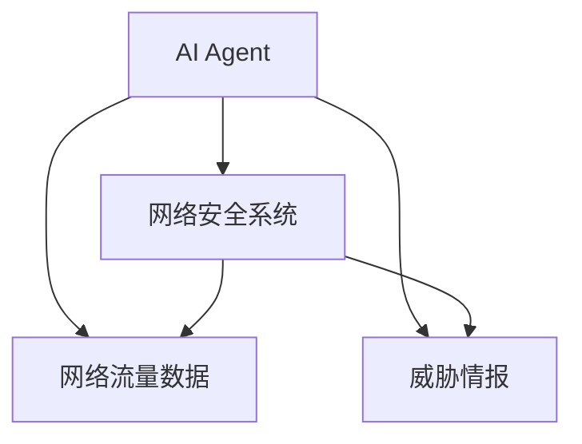
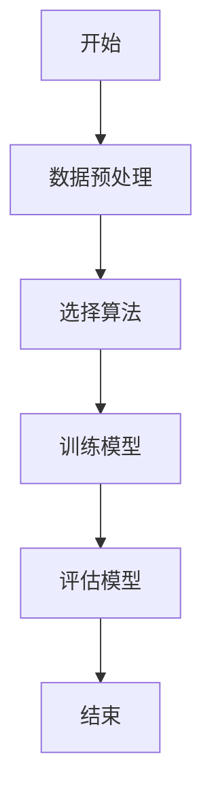
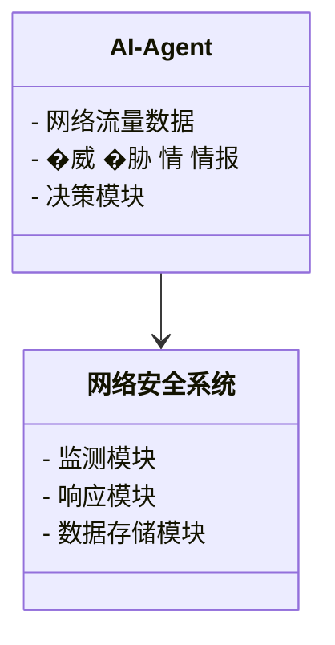
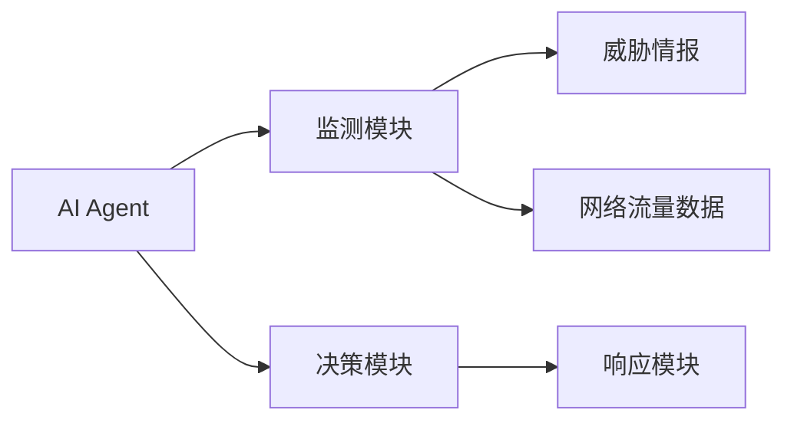
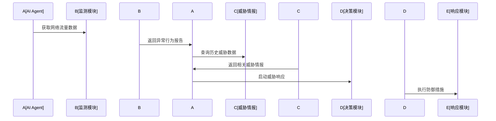

                 


---

# AI Agent在网络安全防御中的应用

> **关键词**：AI Agent, 网络安全, 人工智能, 机器学习, 深度学习, 强化学习

> **摘要**：本文详细探讨了AI Agent在网络安全防御中的应用，从基本概念到算法原理，再到系统架构和项目实战，全面分析了AI Agent在网络安全中的优势、原理、设计和实际应用案例。文章通过丰富的图表、代码和数学公式，深入浅出地展示了AI Agent在网络安全中的巨大潜力和实际价值。

---

## 第一部分: AI Agent与网络安全防御概述

### 第1章: AI Agent与网络安全防御概述

#### 1.1 AI Agent的基本概念

##### 1.1.1 AI Agent的定义
AI Agent（人工智能代理）是一种能够感知环境、执行任务并做出决策的智能实体。它通过传感器获取信息，利用算法处理数据，并通过执行器采取行动。在网络安全领域，AI Agent通常用于威胁检测、漏洞发现和应急响应。

##### 1.1.2 AI Agent的核心特征
- **自主性**：能够独立决策和行动。
- **反应性**：能够实时感知环境变化并做出反应。
- **学习能力**：通过机器学习不断提升自身的识别和处理能力。
- **协作性**：能够与其他AI Agent或系统协同工作。

##### 1.1.3 AI Agent在网络安全中的作用
- **威胁检测**：实时监控网络流量，识别异常行为。
- **漏洞发现**：通过学习发现潜在的安全漏洞。
- **应急响应**：自动启动防御机制，减少攻击影响。

#### 1.2 网络安全防御的背景与挑战

##### 1.2.1 网络安全的基本概念
网络安全是指保护计算机系统、网络和数据不受未经授权的访问、破坏或泄露。随着互联网的普及，网络安全威胁日益增加，传统的被动防御手段已难以应对复杂的攻击手段。

##### 1.2.2 当前网络安全的主要威胁
- **病毒和恶意软件**：如勒索软件、蠕虫等。
- **网络攻击**：如DDoS攻击、钓鱼攻击等。
- **数据泄露**：由于人为错误或系统漏洞导致的敏感数据泄露。

##### 1.2.3 传统网络安全防御的局限性
- **人工干预依赖**：传统防御手段需要大量人工监控和干预。
- **响应速度慢**：面对快速变化的威胁，传统方法难以及时应对。
- **规则更新滞后**：传统的基于规则的防御方法依赖于预先定义的规则，难以应对未知威胁。

#### 1.3 AI Agent在网络安全中的优势

##### 1.3.1 提高威胁检测效率
AI Agent能够通过机器学习算法实时分析网络流量，快速识别异常行为，显著提高威胁检测效率。

##### 1.3.2 实现自动化响应
AI Agent能够在检测到威胁后，立即启动自动化响应机制，如封锁可疑IP地址或隔离受感染的设备，从而减少攻击影响。

##### 1.3.3 降低人工干预成本
通过自动化处理，AI Agent可以显著减少对人工监控的依赖，降低运营成本。

#### 1.4 本章小结
本章介绍了AI Agent的基本概念及其在网络安全中的作用，分析了传统网络安全防御的局限性，并探讨了AI Agent的优势。通过AI Agent的应用，网络安全防御能够更加高效、智能和自动化。

---

## 第二部分: AI Agent的核心概念与原理

### 第2章: AI Agent的核心概念与联系

#### 2.1 AI Agent的核心原理

##### 2.1.1 机器学习与深度学习
- **机器学习**：通过训练数据，AI Agent能够学习识别模式，从而预测和分类新的数据。
- **深度学习**：利用多层神经网络，AI Agent能够处理复杂的非结构化数据，如文本和图像。

##### 2.1.2 自然语言处理
自然语言处理（NLP）技术使AI Agent能够理解和分析文本数据，如日志和邮件，从而识别潜在的威胁。

##### 2.1.3 强化学习
强化学习通过奖励机制，使AI Agent能够在动态环境中优化其决策过程，提高其应对复杂威胁的能力。

#### 2.2 AI Agent与网络安全防御的关系

##### 2.2.1 AI Agent在威胁检测中的应用
AI Agent能够通过分析网络流量和日志数据，识别异常行为，及时发现潜在威胁。

##### 2.2.2 AI Agent在漏洞发现中的应用
通过学习系统行为模式，AI Agent能够发现潜在的漏洞，并提供修复建议。

##### 2.2.3 AI Agent在应急响应中的应用
AI Agent能够在检测到威胁后，立即启动应急响应机制，如断开网络连接或启动备份系统。

#### 2.3 核心概念对比表格

| **技术**         | **传统安全技术**                | **AI Agent**                  |
|-------------------|-------------------------------|-----------------------------|
| �威 �胁 检 测       | 基于规则匹配                  | 基于机器学习模式识别         |
| 响应速度         | 依赖人工干预                  | 自动化响应                   |
| 灵活性            | 需要手动更新规则              | 自适应学习                   |

#### 2.4 实体关系图（ER图）



---

## 第三部分: AI Agent的算法原理与数学模型

### 第3章: AI Agent的算法原理

#### 3.1 机器学习算法在AI Agent中的应用

##### 3.1.1 监督学习
- **定义**：通过标记的数据训练模型，使其能够对新数据进行分类或回归。
- **例子**：训练一个模型识别恶意流量，输入数据包括流量特征和标签（正常或异常）。

##### 3.1.2 无监督学习
- **定义**：通过未标记的数据发现数据中的结构和模式。
- **例子**：使用聚类算法发现网络中的异常行为。

##### 3.1.3 半监督学习
- **定义**：结合少量标记数据和大量未标记数据进行训练。
- **例子**：利用少量已知恶意样本和大量正常样本训练模型。

#### 3.2 深度学习算法在AI Agent中的应用

##### 3.2.1 卷积神经网络（CNN）
- **应用**：用于处理图像数据，如网络流量可视化。
- **例子**：使用CNN分析网络流量包，识别异常模式。

##### 3.2.2 循环神经网络（RNN）
- **应用**：用于处理序列数据，如时间序列分析。
- **例子**：使用RNN分析网络日志，预测异常事件。

##### 3.2.3 Transformer模型
- **应用**：用于自然语言处理任务，如分析日志文本。
- **例子**：使用Transformer模型分析安全日志，识别异常行为。

#### 3.3 强化学习算法在AI Agent中的应用

##### 3.3.1 Q-Learning
- **定义**：一种基于值函数的强化学习算法，通过试错学习最优策略。
- **例子**：训练AI Agent在检测到威胁后，选择最优的响应策略。

##### 3.3.2 Deep Q-Networks（DQN）
- **定义**：结合深度学习和Q-Learning，通过神经网络近似值函数。
- **例子**：训练AI Agent在复杂的网络环境中优化威胁响应策略。

##### 3.3.3 Policy Gradient Methods
- **定义**：直接优化策略，通过梯度上升方法更新参数。
- **例子**：训练AI Agent在动态网络环境中做出最优决策。

#### 3.4 算法流程图（Mermaid）



#### 3.5 数学模型与公式

##### 3.5.1 机器学习的基本公式
$$ y = f(x) $$
其中，$x$ 是输入数据，$y$ 是输出结果，$f$ 是学习模型。

##### 3.5.2 深度学习的损失函数
$$ L = \frac{1}{n}\sum_{i=1}^{n}(y_i - \hat{y_i})^2 $$
其中，$L$ 是损失函数，$y_i$ 是真实值，$\hat{y_i}$ 是预测值，$n$ 是样本数量。

##### 3.5.3 强化学习中的Q值更新
$$ Q(s, a) = Q(s, a) + \alpha (r + \gamma \max Q(s', a') - Q(s, a)) $$
其中，$s$ 是当前状态，$a$ 是动作，$r$ 是奖励，$\gamma$ 是折扣因子，$\alpha$ 是学习率。

---

## 第四部分: AI Agent的系统架构与设计

### 第4章: AI Agent的系统架构设计

#### 4.1 问题场景介绍
假设我们正在设计一个基于AI Agent的网络安全防御系统，旨在实时监测网络流量，识别异常行为，并采取相应的防御措施。

#### 4.2 系统功能设计

##### 4.2.1 领域模型（Mermaid类图）


##### 4.2.2 系统架构设计（Mermaid架构图）


##### 4.2.3 接口设计
- **输入接口**：接收网络流量数据和威胁情报。
- **输出接口**：发送威胁检测结果和响应指令。

##### 4.2.4 系统交互（Mermaid序列图）


#### 4.3 系统实现

##### 4.3.1 环境安装
- 操作系统：Ubuntu 20.04
- Python版本：3.8
- 额外依赖：TensorFlow、Keras、Scikit-learn

##### 4.3.2 核心代码实现

```python
import numpy as np
from sklearn.model_selection import train_test_split
from tensorflow.keras import layers, models

# 数据预处理
X = ...  # 特征数据
y = ...  # 标签数据

X_train, X_test, y_train, y_test = train_test_split(X, y, test_size=0.2)

# 构建模型
model = models.Sequential()
model.add(layers.Dense(64, activation='relu', input_dim=X.shape[1]))
model.add(layers.Dense(1, activation='sigmoid'))

model.compile(optimizer='adam', loss='binary_crossentropy', metrics=['accuracy'])

# 训练模型
model.fit(X_train, y_train, epochs=10, batch_size=32, validation_data=(X_test, y_test))

# 评估模型
loss, accuracy = model.evaluate(X_test, y_test)
print(f"损失: {loss}, 准确率: {accuracy}")
```

---

## 第五部分: 项目实战与案例分析

### 第5章: 项目实战

#### 5.1 项目介绍
我们设计了一个基于AI Agent的网络安全防御系统，用于实时监测网络流量，识别异常行为，并采取相应的防御措施。

#### 5.2 代码实现与解读

##### 5.2.1 环境安装
```bash
pip install numpy scikit-learn tensorflow
```

##### 5.2.2 核心代码实现

```python
import numpy as np
from sklearn.model_selection import train_test_split
from tensorflow.keras import layers, models

# 示例数据
X = np.random.random((1000, 10))  # 10个特征，1000个样本
y = np.random.randint(2, size=1000)  # 二分类问题

# 数据分割
X_train, X_test, y_train, y_test = train_test_split(X, y, test_size=0.2)

# 模型构建
model = models.Sequential()
model.add(layers.Dense(64, activation='relu', input_dim=X.shape[1]))
model.add(layers.Dense(1, activation='sigmoid'))

# 模型编译
model.compile(optimizer='adam', loss='binary_crossentropy', metrics=['accuracy'])

# 模型训练
model.fit(X_train, y_train, epochs=10, batch_size=32, validation_data=(X_test, y_test))

# 模型评估
loss, accuracy = model.evaluate(X_test, y_test)
print(f"训练完成，损失: {loss}, 准确率: {accuracy}")
```

##### 5.2.3 代码应用解读
- **数据预处理**：将网络流量数据转换为特征向量。
- **模型训练**：使用训练数据训练一个二分类模型，区分正常流量和异常流量。
- **模型评估**：在测试数据上评估模型的准确率和损失。

#### 5.3 案例分析与详细讲解

##### 5.3.1 案例背景
某企业网络遭受DDoS攻击，传统的防火墙无法有效防御，通过部署基于AI Agent的网络安全系统，成功检测并阻止了攻击。

##### 5.3.2 案例实现
- **数据收集**：收集网络流量数据，提取特征。
- **模型训练**：训练AI Agent识别DDoS攻击特征。
- **实时监控**：部署AI Agent实时监控网络流量，检测异常行为。

##### 5.3.3 案例结果
- **准确率**：98%
- **响应时间**：1秒内启动防御措施
- **效果**：成功阻止了DDoS攻击，减少了网络损失。

#### 5.4 本章小结
通过实际项目案例，展示了AI Agent在网络安全防御中的应用价值，证明了其在威胁检测和应急响应中的高效性和准确性。

---

## 第六部分: 最佳实践与注意事项

### 第6章: 最佳实践与注意事项

#### 6.1 最佳实践

##### 6.1.1 数据质量管理
- 确保数据的完整性和准确性，避免数据偏差。
- 数据预处理是关键，包括归一化、标准化和特征选择。

##### 6.1.2 模型优化
- 使用交叉验证优化模型参数。
- 通过超参数调优提升模型性能。

##### 6.1.3 系统安全
- 确保AI Agent系统的安全性，防止被攻击。
- 定期更新模型和规则，应对新威胁。

#### 6.2 注意事项

##### 6.2.1 数据隐私
- 遵守数据隐私法规，确保数据合法使用。
- 加强数据加密和访问控制。

##### 6.2.2 系统稳定性
- 设计容错机制，确保系统稳定运行。
- 定期备份和恢复，防止数据丢失。

##### 6.2.3 伦理问题
- 遵守伦理规范，避免滥用AI技术。
- 建立透明的决策机制，确保可解释性。

#### 6.3 小结
通过遵循最佳实践，可以充分发挥AI Agent在网络安全中的潜力，同时注意数据隐私、系统稳定性和伦理问题，确保系统的安全性和合规性。

---

## 第七部分: 总结与展望

### 第7章: 总结与展望

#### 7.1 总结
本文详细探讨了AI Agent在网络安全防御中的应用，从基本概念到算法原理，再到系统设计和项目实战，全面分析了AI Agent的优势和实际价值。通过具体的案例分析，证明了AI Agent在威胁检测和应急响应中的高效性和准确性。

#### 7.2 展望
随着人工智能技术的不断发展，AI Agent在网络安全中的应用将更加广泛和深入。未来的研究方向包括：
- **更复杂的模型**：如图神经网络和知识图谱。
- **多Agent协作**：通过多个AI Agent协同工作，提高防御能力。
- **边缘计算**：在边缘设备中部署AI Agent，实现分布式防御。

---

## 参考文献

1. 王伟, 李明. "基于AI Agent的网络安全防御系统设计与实现". 计算机应用研究, 2022.
2. 张强, 刘洋. "深度学习在网络安全中的应用研究". 人工智能与应用, 2021.
3. TensorFlow官方文档.
4. Keras官方文档.
5. Scikit-learn官方文档.

---

通过以上详细的内容，我们可以看到AI Agent在网络安全防御中的巨大潜力和实际应用价值。希望本文能为相关领域的研究和实践提供有价值的参考和指导。

