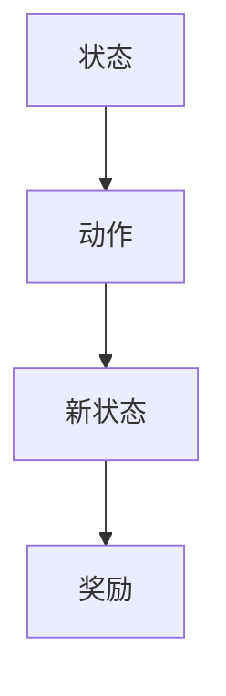
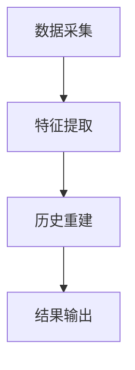

                 


# AI Agent在考古学中的应用：文物分析与历史重建

> 关键词：AI Agent，考古学，文物分析，历史重建，知识表示，逻辑推理

> 摘要：本文探讨了AI Agent在考古学中的应用，特别是其在文物分析和历史重建中的作用。通过详细分析AI Agent的核心概念、算法原理和系统架构，本文展示了如何利用AI技术提高考古学研究的效率和准确性。文章还通过具体案例展示了AI Agent的实际应用，并提出了最佳实践建议。

---

# 第1章: AI Agent与考古学的背景介绍

## 1.1 AI Agent的基本概念

### 1.1.1 什么是AI Agent

AI Agent（人工智能代理）是指能够感知环境、自主决策并采取行动以实现特定目标的智能实体。AI Agent可以是软件程序，也可以是机器人，它们通过传感器和执行器与环境交互，并利用算法进行推理和学习。

### 1.1.2 AI Agent的核心特征

- **自主性**：AI Agent能够在没有外部干预的情况下自主运行。
- **反应性**：能够实时感知环境并做出反应。
- **目标导向**：通过目标驱动进行决策和行动。
- **学习能力**：能够从经验中学习并改进性能。

### 1.1.3 AI Agent与传统考古方法的对比

| **方面**       | **传统考古方法**                     | **AI Agent**                          |
|----------------|--------------------------------------|---------------------------------------|
| 数据处理       | 手工记录和分析，效率较低             | 自动化处理，高效且精准               |
| 模型构建       | 基于经验的专家知识                   | 数据驱动，依赖算法和模型             |
| 决策过程       | 依赖专家判断                        | 算法驱动，基于数据和逻辑推理         |
| 可扩展性       | 受限于专家数量和时间                | 可扩展性强，适合大规模数据处理       |

---

## 1.2 考古学中的AI Agent应用背景

### 1.2.1 考古学的基本概念

考古学是研究人类历史和文化的科学，通过发掘和分析遗存下来的物质文化遗产，揭示人类社会的发展过程。传统的考古学依赖于田野调查、文献研究和专家经验。

### 1.2.2 考古学中的数据分析挑战

- **数据多样性**：考古数据包括文字、图像、三维模型等多种形式，数据处理复杂。
- **数据稀疏性**：某些历史时期的资料较少，难以建立完整的模型。
- **数据关联性**：不同类型的文物之间可能存在复杂的关联，需要深入分析。

### 1.2.3 AI Agent在考古学中的潜在价值

AI Agent可以通过自动化分析、模式识别和知识推理，帮助考古学家更高效地处理数据，揭示隐藏的关联性，并重建历史场景。

---

## 1.3 AI Agent在考古学中的应用范围

### 1.3.1 文物分析与修复

- **文物特征提取**：通过图像处理技术识别文物的纹理、形状等特征。
- **文物修复模拟**：利用AI Agent模拟文物修复过程，预测修复效果。

### 1.3.2 历史重建与模拟

- **历史场景重建**：基于现有文物数据，重建历史时期的建筑、场景等。
- **虚拟现实应用**：结合VR技术，提供沉浸式的历史体验。

### 1.3.3 考古数据管理与挖掘

- **数据管理系统**：建立统一的数据管理平台，实现文物数据的高效存储和检索。
- **数据挖掘与分析**：通过机器学习算法挖掘数据中的潜在关联性。

---

## 1.4 本章小结

AI Agent在考古学中的应用前景广阔，其在文物分析、历史重建和数据管理方面具有显著优势。通过自动化处理和智能推理，AI Agent可以帮助考古学家更高效地完成研究工作。

---

# 第2章: AI Agent的核心概念与联系

## 2.1 AI Agent的核心原理

### 2.1.1 知识表示与推理

知识表示是AI Agent理解世界的基础，常见的表示方法包括语义网络和逻辑推理。语义网络通过节点和边表示概念及其关系，逻辑推理则通过形式逻辑进行推理。

### 2.1.2 问题求解与规划

AI Agent通过问题求解算法（如Dijkstra算法）和规划技术（如A*算法）制定行动方案，以实现目标。

### 2.1.3 多智能体协作

在多智能体系统中，多个AI Agent协作完成复杂任务，如分布式计算和任务分配。

---

## 2.2 考古学中的核心概念

### 2.2.1 文物特征提取

通过图像处理和模式识别技术，提取文物的纹理、形状等特征。

### 2.2.2 历史场景重建

基于文物数据，重建历史时期的建筑、场景等。

### 2.2.3 数据关联性分析

分析不同文物之间的关联性，揭示潜在的历史线索。

---

## 2.3 AI Agent与考古学概念的联系

### 2.3.1 知识表示与文物特征

AI Agent的知识表示方法可以用于文物特征的提取和分类。

### 2.3.2 问题求解与历史重建

AI Agent的问题求解算法可以用于历史场景的重建和模拟。

### 2.3.3 多智能体协作与考古团队合作

多智能体协作的模式可以借鉴考古团队的分工与合作。

---

## 2.4 核心概念对比表

| **核心概念**       | **AI Agent**                     | **考古学**                          |
|---------------------|----------------------------------|--------------------------------------|
| 知识表示           | 语义网络、逻辑推理              | 文物特征提取                        |
| 问题求解           | Dijkstra算法、A*算法            | 历史场景重建                        |
| 多智能体协作       | 分布式计算、任务分配            | 考古团队分工                        |

---

## 2.5 ER实体关系图

```mermaid
er
actor: 考古学家
artifact: 文物
site: 遗址
relationship: 属于
```

解释：ER实体关系图展示了考古学家与文物、遗址之间的关系，帮助理解数据的关联性。

---

# 第3章: AI Agent的算法原理

## 3.1 知识表示与推理算法

### 3.1.1 语义网络表示

语义网络通过节点和边表示概念及其关系，例如，节点表示“文物”，边表示“属于”关系。

### 3.1.2 逻辑推理算法

逻辑推理通过形式逻辑进行推理，例如，使用一阶逻辑（FOL）表达知识。

---

## 3.2 强化学习算法

### 3.2.1 算法原理

强化学习通过智能体与环境的交互，学习最优策略。以下是强化学习的流程图：



### 3.2.2 Python代码示例

```python
# 简单的强化学习示例
class Agent:
    def __init__(self, state_space, action_space):
        self.state_space = state_space
        self.action_space = action_space
        self.reward = 0

    def act(self, state):
        # 随机选择动作
        import random
        return random.choice(self.action_space)

    def learn(self, reward):
        # 简单的Q-learning算法
        self.reward += reward
```

---

## 3.3 监督学习算法

### 3.3.1 算法原理

监督学习通过标签数据训练模型，例如，使用线性回归或支持向量机（SVM）进行分类。

### 3.3.2 Python代码示例

```python
# 使用线性回归进行分类
from sklearn.linear_model import LogisticRegression

X = [[1], [2], [3], [4]]
y = [0, 0, 1, 1]

model = LogisticRegression()
model.fit(X, y)

print(model.predict([[2.5]]))
```

---

## 3.4 数学模型与公式

### 3.4.1 强化学习的数学模型

强化学习的目标是通过最大化累积奖励来学习策略，数学模型如下：

$$ Q(s, a) = Q(s, a) + \alpha (r + \gamma Q(s', a') - Q(s, a)) $$

其中，$\alpha$ 是学习率，$\gamma$ 是折扣因子。

### 3.4.2 监督学习的数学模型

线性回归的损失函数为：

$$ L = \frac{1}{2m} \sum_{i=1}^{m} (y_i - \hat{y}_i)^2 $$

其中，$m$ 是样本数量，$y_i$ 是真实值，$\hat{y}_i$ 是预测值。

---

## 3.5 算法对比与选择

| **算法类型**       | **适用场景**                     | **优缺点**                          |
|---------------------|----------------------------------|--------------------------------------|
| 强化学习           | 复杂决策问题                    | 训练时间长，需要大量数据             |
| 监督学习           | 数据分类与回归                | 数据质量要求高，适合结构化数据       |

---

# 第4章: 系统分析与架构设计

## 4.1 项目场景介绍

以遗址重建项目为例，设计一个AI Agent系统，帮助考古学家分析文物数据并重建历史场景。

---

## 4.2 系统功能设计

### 4.2.1 功能模块

- 数据采集模块：采集和处理文物数据。
- 特征提取模块：提取文物的纹理、形状等特征。
- 历史重建模块：基于特征数据重建历史场景。

### 4.2.2 功能流程图



---

## 4.3 系统架构设计

### 4.3.1 系统架构图

```mermaid
subgraph 数据处理层
    DataCollector[数据采集器]
    DataPreprocessor[数据预处理器]
end

subgraph 模型层
    FeatureExtractor[特征提取器]
    Histor

