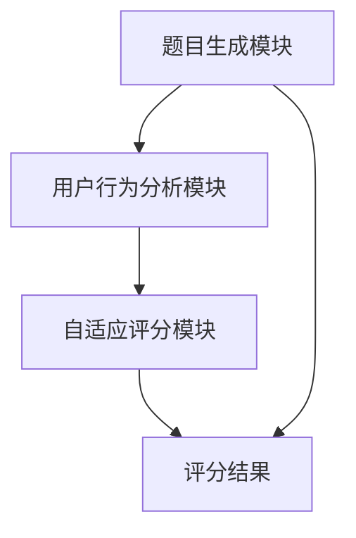
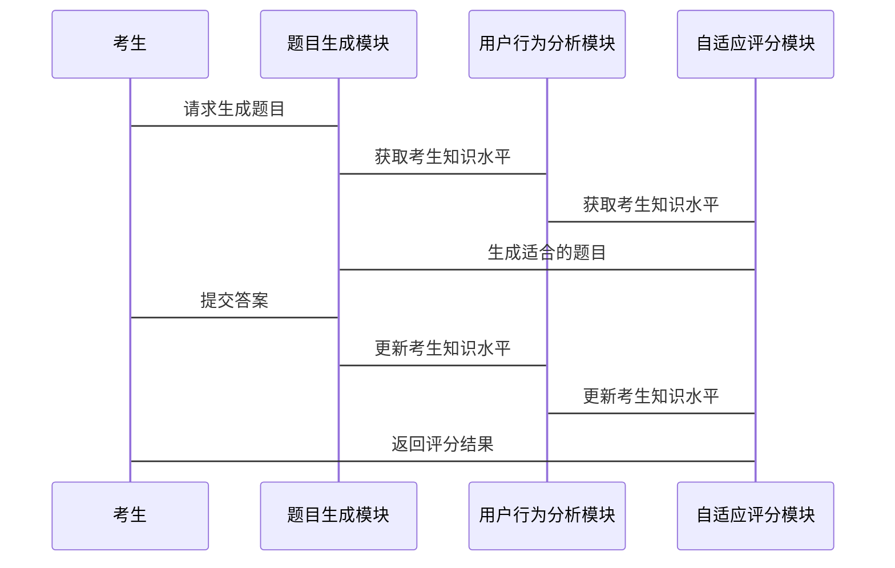

                 


# 第三部分: 自适应考试系统的算法原理

## 第3章: 自适应题目生成的算法原理

### 3.1 基于生成模型的题目生成算法

#### 3.1.1 生成模型的定义与核心原理
生成模型是一种用于生成新数据的机器学习模型，自适应考试系统中可以利用生成模型来根据考生的知识水平动态生成适合的题目。

#### 3.1.2 基于生成对抗网络的题目生成
生成对抗网络（GAN）包括生成器和判别器两部分。生成器负责生成题目，判别器负责判断生成的题目是否与真实题目相似。

##### 生成器网络结构
使用循环神经网络（RNN）或变换器（Transformer）来生成题目内容。

##### 判别器网络结构
使用卷积神经网络（CNN）或深度信念网络（DBN）来判断生成的题目是否真实。

##### 训练过程
1. 初始化生成器和判别器的参数。
2. 迭代训练生成器，使得生成的题目能够欺骗判别器。
3. 同时训练判别器，使其能够区分生成的题目和真实题目。
4. 直到生成器生成高质量的题目。

#### 3.1.3 生成模型的数学模型
生成模型的损失函数可以用以下公式表示：

$$ \mathcal{L}_{\text{GAN}} = \mathcal{L}_{\text{D}} + \mathcal{L}_{\text{G}} $$

其中：
- $$ \mathcal{L}_{\text{D}} $$ 是判别器的损失函数。
- $$ \mathcal{L}_{\text{G}} $$ 是生成器的损失函数。

#### 3.1.4 生成模型的实现
代码实现示例：

```python
import torch
import torch.nn as nn

class Generator(nn.Module):
    def __init__(self, input_size, hidden_size, output_size):
        super(Generator, self).__init__()
        self.fc = nn.Linear(input_size, hidden_size)
        self.relu = nn.ReLU()
        self.fc_output = nn.Linear(hidden_size, output_size)
        
    def forward(self, x):
        x = self.fc(x)
        x = self.relu(x)
        x = self.fc_output(x)
        return x

class Discriminator(nn.Module):
    def __init__(self, input_size, hidden_size, output_size):
        super(Discriminator, self).__init__()
        self.fc = nn.Linear(input_size, hidden_size)
        self.relu = nn.ReLU()
        self.fc_output = nn.Linear(hidden_size, output_size)
        
    def forward(self, x):
        x = self.fc(x)
        x = self.relu(x)
        x = self.fc_output(x)
        return x

# 初始化生成器和判别器
input_size = 100  # 输入向量维度
hidden_size = 256  # 隐藏层维度
output_size = 1  # 输出维度

generator = Generator(input_size, hidden_size, output_size)
discriminator = Discriminator(input_size, hidden_size, output_size)

# 定义损失函数和优化器
criterion = nn.BCELoss()
optimizer_generator = torch.optim.Adam(generator.parameters(), lr=0.0002)
optimizer_discriminator = torch.optim.Adam(discriminator.parameters(), lr=0.0002)

# 训练过程
for epoch in range(100):
    # 生成假数据
    noise = torch.randn(batch_size, input_size)
    generated_data = generator(noise)
    
    # 判别器训练
    optimizer_discriminator.zero_grad()
    real_data = torch.randn(batch_size, input_size)
    real_labels = torch.ones(batch_size, 1)
    fake_labels = torch.zeros(batch_size, 1)
    
    # 判别器真实数据的输出
    real_output = discriminator(real_data)
    # 判别器假数据的输出
    fake_output = discriminator(generated_data)
    
    # 判别器的损失
    d_loss = criterion(real_output, real_labels) + criterion(fake_output, fake_labels)
    d_loss.backward()
    optimizer_discriminator.step()
    
    # 生成器训练
    optimizer_generator.zero_grad()
    # 生成器的输出
    fake_output = discriminator(generated_data)
    # 生成器的损失
    g_loss = criterion(fake_output, torch.ones(batch_size, 1))
    g_loss.backward()
    optimizer_generator.step()
```

## 3.2 基于回归模型的评分算法

### 3.2.1 回归模型的定义与核心原理
回归模型是一种用于预测目标变量的机器学习模型，自适应考试系统中可以利用回归模型根据考生的回答情况预测其知识水平。

### 3.2.2 回归模型的数学模型
线性回归模型可以表示为：

$$ y = \beta_0 + \beta_1 x_1 + \beta_2 x_2 + ... + \beta_n x_n + \epsilon $$

其中：
- $$ y $$ 是目标变量（考生的知识水平）。
- $$ x_i $$ 是自变量（考生的回答情况）。
- $$ \beta_i $$ 是回归系数。
- $$ \epsilon $$ 是误差项。

### 3.2.3 回归模型的实现
代码实现示例：

```python
import torch
import torch.nn as nn

class RegressionModel(nn.Module):
    def __init__(self, input_features, output_features):
        super(RegressionModel, self).__init__()
        self.linear = nn.Linear(input_features, output_features)
        
    def forward(self, x):
        return self.linear(x)

# 初始化回归模型
input_features = 5  # 输入特征数量
output_features = 1  # 输出特征数量

model = RegressionModel(input_features, output_features)

# 定义损失函数和优化器
criterion = nn.MSELoss()
optimizer = torch.optim.SGD(model.parameters(), lr=0.01)

# 训练过程
for epoch in range(100):
    # 前向传播
    outputs = model(inputs)
    # 计算损失
    loss = criterion(outputs, labels)
    # 反向传播和优化
    optimizer.zero_grad()
    loss.backward()
    optimizer.step()
```

## 3.3 自适应考试系统的数学模型

### 3.3.1 综合模型的数学表示
自适应考试系统可以通过综合生成模型和回归模型的输出来生成适合考生的题目。

### 3.3.2 综合模型的实现
代码实现示例：

```python
import torch
import torch.nn as nn

class AdaptiveSystem(nn.Module):
    def __init__(self, generator, discriminator, regression_model):
        super(AdaptiveSystem, self).__init__()
        self.generator = generator
        self.discriminator = discriminator
        self.regression_model = regression_model
        
    def forward(self, input):
        # 生成题目
        generated_data = self.generator(input)
        # 判别生成题目是否真实
        is_real = self.discriminator(generated_data)
        # 预测考生的知识水平
        knowledge_level = self.regression_model(input)
        return generated_data, is_real, knowledge_level

# 初始化各个模型
generator = Generator(input_size, hidden_size, output_size)
discriminator = Discriminator(input_size, hidden_size, output_size)
regression_model = RegressionModel(input_features, output_features)

# 组合成自适应系统
adaptive_system = AdaptiveSystem(generator, discriminator, regression_model)

# 训练过程
# ... 如上所述
```

# 第四部分: 自适应考试系统的系统分析与架构设计

## 第4章: 系统功能设计

### 4.1 题目生成模块

#### 4.1.1 题目生成模块的功能描述
题目生成模块负责根据考生的知识水平生成适合的题目。

#### 4.1.2 题目生成模块的输入输出
- 输入: 考生的知识水平（通过回归模型预测）
- 输出: 自动生成适合的题目

#### 4.1.3 题目生成模块的关键算法
使用生成模型生成题目，确保生成的题目符合知识水平要求。

### 4.2 用户行为分析模块

#### 4.2.1 用户行为分析模块的功能描述
用户行为分析模块负责分析考生的回答行为，以进一步调整生成的题目。

#### 4.2.2 用户行为分析模块的输入输出
- 输入: 考生的回答记录
- 输出: 用户的知识水平更新

### 4.3 自适应评分模块

#### 4.3.1 自适应评分模块的功能描述
自适应评分模块负责根据考生的回答情况动态调整评分标准。

#### 4.3.2 自适应评分模块的输入输出
- 输入: 考生的回答和知识水平
- 输出: 动态调整后的评分

## 第5章: 系统架构设计

### 5.1 系统架构图

使用 Mermaid 绘制系统架构图：



### 5.2 模块之间的关系

- 题目生成模块根据用户行为分析模块提供的知识水平生成题目。
- 用户行为分析模块根据考生的回答行为更新知识水平。
- 自适应评分模块根据知识水平和回答情况动态调整评分标准。

## 第6章: 接口设计与交互流程图

### 6.1 系统接口设计

- 题目生成接口
- 用户行为分析接口
- 自适应评分接口

### 6.2 交互流程图

使用 Mermaid 绘制交互流程图：



# 第五部分: 项目实战

## 第7章: 环境安装与核心代码实现

### 7.1 环境安装

安装必要的 Python 包：

```bash
pip install torch
pip install matplotlib
pip install numpy
```

### 7.2 核心代码实现

#### 7.2.1 生成模型的实现

```python
import torch
import torch.nn as nn

class Generator(nn.Module):
    def __init__(self, input_size, hidden_size, output_size):
        super(Generator, self).__init__()
        self.fc = nn.Linear(input_size, hidden_size)
        self.relu = nn.ReLU()
        self.fc_output = nn.Linear(hidden_size, output_size)
        
    def forward(self, x):
        x = self.fc(x)
        x = self.relu(x)
        x = self.fc_output(x)
        return x

# 初始化生成器
input_size = 100  # 输入向量维度
hidden_size = 256  # 隐藏层维度
output_size = 1  # 输出维度

generator = Generator(input_size, hidden_size, output_size)
```

#### 7.2.2 判别器的实现

```python
import torch
import torch.nn as nn

class Discriminator(nn.Module):
    def __init__(self, input_size, hidden_size, output_size):
        super(Discriminator, self).__init__()
        self.fc = nn.Linear(input_size, hidden_size)
        self.relu = nn.ReLU()
        self.fc_output = nn.Linear(hidden_size, output_size)
        
    def forward(self, x):
        x = self.fc(x)
        x = self.relu(x)
        x = self.fc_output(x)
        return x

# 初始化判别器
input_size = 100  # 输入向量维度
hidden_size = 256  # 隐藏层维度
output_size = 1  # 输出维度

discriminator = Discriminator(input_size, hidden_size, output_size)
```

#### 7.2.3 回归模型的实现

```python
import torch
import torch.nn as nn

class RegressionModel(nn.Module):
    def __init__(self, input_features, output_features):
        super(RegressionModel, self).__init__()
        self.linear = nn.Linear(input_features, output_features)
        
    def forward(self, x):
        return self.linear(x)

# 初始化回归模型
input_features = 5  # 输入特征数量
output_features = 1  # 输出特征数量

regression_model = RegressionModel(input_features, output_features)
```

#### 7.2.4 自适应系统的实现

```python
import torch
import torch.nn as nn

class AdaptiveSystem(nn.Module):
    def __init__(self, generator, discriminator, regression_model):
        super(AdaptiveSystem, self).__init__()
        self.generator = generator
        self.discriminator = discriminator
        self.regression_model = regression_model
        
    def forward(self, input):
        generated_data = self.generator(input)
        is_real = self.discriminator(generated_data)
        knowledge_level = self.regression_model(input)
        return generated_data, is_real, knowledge_level

# 组合成自适应系统
adaptive_system = AdaptiveSystem(generator, discriminator, regression_model)
```

### 7.3 代码应用解读与分析

- 生成模型负责生成题目，判别器负责验证生成题目的真实性，回归模型负责预测考生的知识水平，自适应系统综合以上模块生成适合考生的题目并进行评分。

### 7.4 实际案例分析

假设我们有一个考生，知识水平为中等，自适应系统会根据其知识水平生成适合的题目，并根据其回答情况动态调整评分标准。

### 7.5 项目小结

通过以上代码实现，我们可以构建一个基于AI Agent的自适应考试系统，实现动态生成题目和评分。

# 第六部分: 最佳实践

## 第8章: 项目小结与注意事项

### 8.1 项目小结

通过本项目，我们了解了AI Agent在自适应考试系统中的应用，包括生成模型和回归模型的实现，以及系统架构设计。

### 8.2 注意事项

- 在实际应用中，需要考虑模型的泛化能力和鲁棒性。
- 需要处理生成模型的训练时间较长的问题。
- 需要考虑用户隐私和数据安全问题。

## 第9章: 拓展阅读与进一步学习

### 9.1 拓展阅读

- 《Deep Learning》
- 《机器学习实战》
- 《生成对抗网络：理论与实践》

### 9.2 进一步学习

- 深入学习生成对抗网络（GAN）的原理和应用。
- 学习其他类型的生成模型，如变分自编码器（VAE）。
- 研究自适应考试系统的实际应用案例。

## 第10章: 总结

通过本篇文章，我们详细讲解了AI Agent在自适应考试系统中的应用，包括生成模型、回归模型、系统架构设计和项目实战。希望读者能够通过本文对自适应考试系统有一个全面的了解，并能够在实际应用中灵活运用这些知识。

