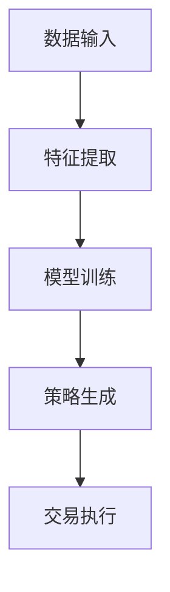
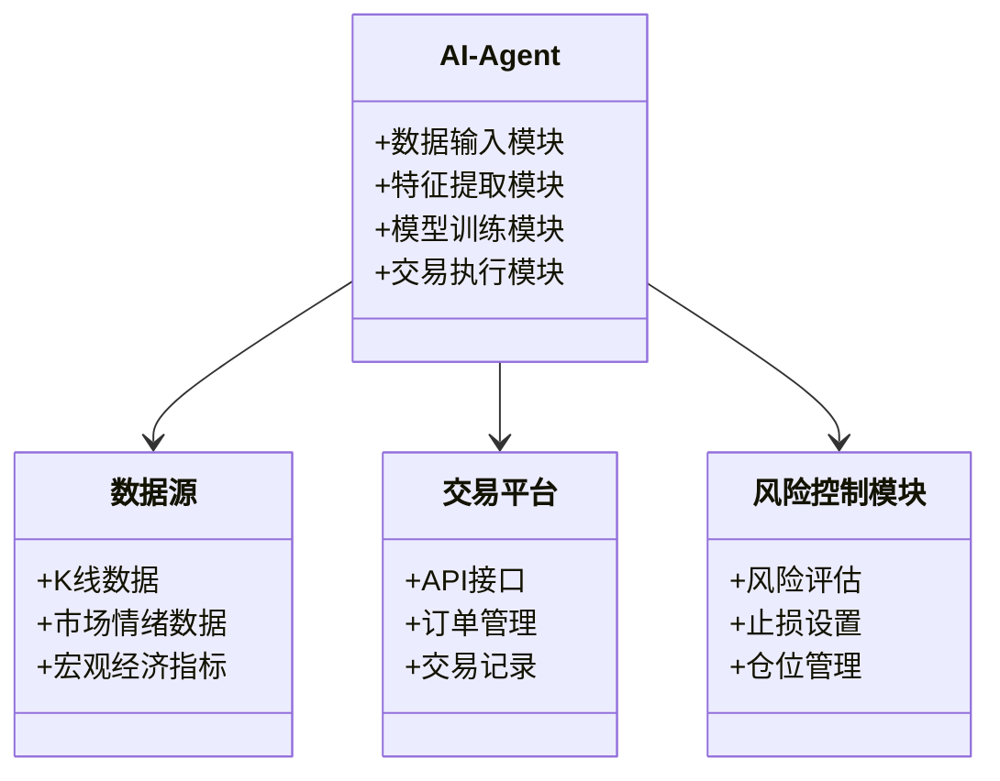
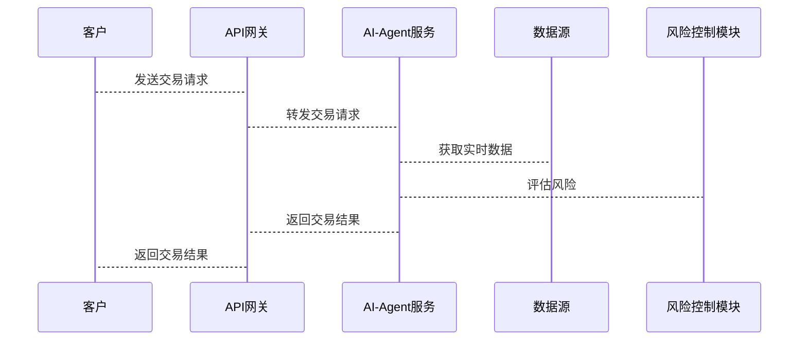

                 


# AI Agent在股票交易中的自动化策略

> 关键词：AI Agent, 股票交易, 自动化策略, 机器学习, 深度学习, 强化学习

> 摘要：本文系统地探讨了AI Agent在股票交易中的自动化策略，从基础概念到高级算法，从系统设计到实战应用，全面解析了AI Agent如何通过感知、决策和执行机制实现股票交易的自动化。文章深入分析了机器学习、深度学习和强化学习在股票交易中的应用，结合数学模型和算法流程图，详细讲解了AI Agent的核心原理和实现方法。同时，本文还提供了具体的系统架构设计和项目实战案例，为读者提供了一套完整的AI Agent在股票交易中的解决方案。

---

# 第一部分: AI Agent在股票交易中的自动化策略概述

## 第1章: AI Agent与股票交易概述

### 1.1 AI Agent的基本概念
#### 1.1.1 AI Agent的定义与特点
AI Agent（人工智能代理）是一种能够感知环境、自主决策并执行任务的智能实体。在股票交易中，AI Agent通常用于分析市场数据、制定交易策略并执行交易操作。

#### 1.1.2 AI Agent的核心要素与功能
- **感知能力**：通过数据采集、特征提取和模式识别，AI Agent能够从复杂的市场数据中提取有用的信息。
- **决策能力**：基于感知到的信息，AI Agent通过机器学习、深度学习和强化学习等算法，制定最优的交易策略。
- **执行能力**：AI Agent能够通过API或交易平台接口，自动执行交易指令。

#### 1.1.3 AI Agent在股票交易中的应用潜力
- **高频交易**：AI Agent可以快速分析市场数据并执行交易，提高交易效率。
- **情绪分析**：通过自然语言处理技术，AI Agent可以分析新闻、社交媒体等非结构化数据，预测市场情绪。
- **个性化投资策略**：基于投资者的风险偏好和收益目标，AI Agent可以定制个性化的交易策略。

### 1.2 股票交易的基本原理
#### 1.2.1 股票市场的基本运作机制
股票市场是一个复杂的系统，涉及买方、卖方、做市商、交易所等多方参与者。股票价格由供需关系决定，受市场情绪、宏观经济指标等多种因素影响。

#### 1.2.2 股票交易的主要策略类型
- **长期投资**：基于基本面分析，长期持有优质股票。
- **短线交易**：通过技术分析，捕捉短期价格波动。
- **套利交易**：利用市场价差，进行无风险或低风险套利。

#### 1.2.3 自动化交易的现状与趋势
自动化交易已经成为现代股票市场的重要组成部分，占据了很大一部分交易量。高频交易、算法交易和智能投顾等技术正在快速发展。

### 1.3 AI Agent在股票交易中的优势
#### 1.3.1 高效性与准确性
AI Agent可以快速处理海量数据，提高交易决策的准确性和效率。

#### 1.3.2 理性决策与情绪控制
与人类交易者相比，AI Agent能够避免情绪化决策，始终保持理性。

#### 1.3.3 大数据分析能力
AI Agent可以通过机器学习算法，分析历史数据、市场情绪和宏观经济指标，制定更加科学的交易策略。

### 1.4 本章小结
本章介绍了AI Agent的基本概念和股票交易的基本原理，分析了AI Agent在股票交易中的优势，为后续章节的深入探讨奠定了基础。

---

# 第二部分: AI Agent的原理与算法基础

## 第2章: AI Agent的核心原理

### 2.1 AI Agent的感知机制
#### 2.1.1 数据采集与特征提取
AI Agent需要从多种数据源（如K线图、成交量、市场情绪等）中采集数据，并通过特征工程提取有用的特征。

#### 2.1.2 市场情绪分析
通过自然语言处理技术，AI Agent可以分析新闻、社交媒体等非结构化数据，预测市场情绪。

#### 2.1.3 信号处理与模式识别
AI Agent可以通过时间序列分析、频域分析等方法，识别市场中的周期性模式和趋势。

### 2.2 AI Agent的决策机制
#### 2.2.1 交易策略的选择与优化
基于感知到的市场信息，AI Agent需要选择合适的交易策略，并通过优化算法（如遗传算法）进行策略优化。

#### 2.2.2 风险评估与收益预测
AI Agent需要评估每笔交易的风险，并预测未来的收益，以制定最优的交易计划。

#### 2.2.3 多目标优化算法
在股票交易中，AI Agent需要在收益、风险、流动性等多个目标之间进行权衡，因此需要使用多目标优化算法。

### 2.3 AI Agent的执行机制
#### 2.3.1 自动化交易执行流程
AI Agent需要通过API或交易平台接口，自动执行交易指令。

#### 2.3.2 系统化风险管理
AI Agent需要实时监控市场风险，并根据风险变化动态调整交易策略。

#### 2.3.3 交易成本控制
通过优化交易频率和交易量，AI Agent可以有效控制交易成本。

## 第3章: AI Agent的算法基础

### 3.1 常见AI算法在股票交易中的应用
#### 3.1.1 机器学习算法
- **线性回归**：用于预测股票价格的趋势。
- **支持向量机（SVM）**：用于分类和回归任务。
- **随机森林**：用于特征重要性分析和预测。

#### 3.1.2 深度学习算法
- **RNN与LSTM网络**：用于时间序列分析和预测。
- **CNN**：用于图像特征提取，可以应用于K线图分析。
- **Transformer**：用于长序列分析，可以应用于长周期市场预测。

#### 3.1.3 强化学习算法
- **Q-Learning**：用于制定最优交易策略。
- **Deep Q-Networks (DQN)**：用于复杂的交易决策问题。

### 3.2 基于机器学习的股票预测模型
#### 3.2.1 线性回归模型
$$ y = \beta_0 + \beta_1x_1 + \beta_2x_2 + \dots + \beta_nx_n $$

#### 3.2.2 支持向量机模型
$$ \text{max}(\text{distance between classes}) $$

#### 3.2.3 随机森林模型
$$ \text{集成多个决策树的预测结果} $$

### 3.3 基于深度学习的股票预测模型
#### 3.3.1 RNN与LSTM网络
$$ \text{LSTM单元结构: } f_t = \text{sigmoid}(W_f \cdot [h_{t-1}, x_t]) $$

#### 3.3.2 CNN在时间序列分析中的应用
$$ \text{卷积层: } y = \text{ReLU}(W \cdot x + b) $$

#### 3.3.3 Transformer模型的创新应用
$$ \text{自注意力机制: } \text{softmax}\left(\frac{QK^T}{\sqrt{d_k}}\right) $$

### 3.4 算法流程图（Mermaid）


## 第4章: AI Agent的数学模型与公式

### 4.1 时间序列分析模型
#### 4.1.1 ARIMA模型
$$ ARIMA(p, d, q) $$

#### 4.1.2 GARCH模型
$$ GARCH(p, q) $$

### 4.2 深度学习模型
#### 4.2.1 LSTM网络
$$ \text{LSTM单元结构: } f_t = \text{sigmoid}(W_f \cdot [h_{t-1}, x_t]) $$

#### 4.2.2 Transformer模型
$$ \text{自注意力机制: } \text{softmax}\left(\frac{QK^T}{\sqrt{d_k}}\right) $$

### 4.3 强化学习模型
#### 4.3.1 Q-Learning算法
$$ Q(s, a) = Q(s, a) + \alpha (r + \gamma \max Q(s', a') - Q(s, a)) $$

#### 4.3.2 Deep Q-Networks (DQN)
$$ Q(s) = \epsilon \cdot \text{rand} + (1 - \epsilon) \cdot \max Q(s) $$

---

# 第三部分: 系统分析与架构设计

## 第5章: 系统分析与架构设计方案

### 5.1 问题场景介绍
在股票交易中，AI Agent需要处理高频交易、实时数据流、复杂市场环境等挑战。因此，系统需要具备高性能、高可靠性和高可扩展性。

### 5.2 项目介绍
本项目旨在开发一个基于AI Agent的股票交易系统，实现自动化交易、风险控制和收益最大化。

### 5.3 系统功能设计
#### 5.3.1 领域模型（Mermaid类图）


#### 5.3.2 系统架构设计（Mermaid架构图）


#### 5.3.3 系统接口设计
- **数据接口**：AI Agent需要通过API获取实时数据和历史数据。
- **交易接口**：AI Agent需要通过API发送交易指令和查询订单状态。
- **风险控制接口**：AI Agent需要与风险控制模块交互，获取风险评估结果。

#### 5.3.4 系统交互流程（Mermaid序列图）


### 5.4 本章小结
本章通过系统分析和架构设计，明确了AI Agent在股票交易系统中的角色和功能，为后续的实现奠定了基础。

---

# 第四部分: 项目实战

## 第6章: 项目实战

### 6.1 环境安装
- **Python**：安装Python 3.8及以上版本。
- **深度学习框架**：安装TensorFlow或PyTorch。
- **数据源**：使用Yahoo Finance或Polygon获取股票数据。
- **交易平台**：使用Interactive Brokers或Backtrader模拟交易。

### 6.2 系统核心实现
#### 6.2.1 数据处理模块
```python
import pandas as pd
import numpy as np

def load_data(ticker):
    data = pd.read_csv(f"data/{ticker}.csv")
    return data
```

#### 6.2.2 模型训练模块
```python
import tensorflow as tf
from tensorflow.keras import layers

model = tf.keras.Sequential([
    layers.LSTM(64, input_shape=(None, 64)),
    layers.Dense(1)
])
model.compile(optimizer='adam', loss='mean_squared_error')
```

#### 6.2.3 交易执行模块
```python
from ibapi.client import EClient
from ibapi.decoder import *
from ibapi.order import Order

class Trader:
    def __init__(self):
        self.client = EClient()
        self.client.connect()

    def execute_order(self, ticker, quantity, price):
        order = Order()
        order.symbol = ticker
        order.quantity = quantity
        order.price = price
        self.client.place_order(order)
```

#### 6.2.4 风险控制模块
```python
class RiskControl:
    def __init__(self, max_loss):
        self.max_loss = max_loss

    def assess_risk(self, position):
        if position.loss > self.max_loss:
            return True  # 需要平仓
        return False
```

### 6.3 案例分析
#### 6.3.1 数据分析与特征工程
- 数据清洗：处理缺失值、异常值。
- 特征提取：提取技术指标（如MA、MACD、RSI）和市场情绪指标。

#### 6.3.2 模型训练与验证
- 训练模型：使用历史数据训练AI Agent的预测模型。
- 验证模型：通过回测验证模型的预测准确性和交易收益。

#### 6.3.3 交易策略与执行
- 制定策略：基于模型预测结果制定交易策略。
- 执行交易：通过交易平台API自动执行交易指令。

### 6.4 项目小结
本章通过具体的项目实战，详细讲解了AI Agent在股票交易中的实现过程，从数据处理到模型训练，从策略制定到交易执行，为读者提供了一套完整的解决方案。

---

# 第五部分: 总结与展望

## 第7章: 总结与展望

### 7.1 本章总结
本文系统地探讨了AI Agent在股票交易中的自动化策略，从基础概念到高级算法，从系统设计到实战应用，全面解析了AI Agent如何通过感知、决策和执行机制实现股票交易的自动化。

### 7.2 未来展望
随着AI技术的不断发展，AI Agent在股票交易中的应用前景广阔。未来，可以通过以下方式进一步优化和扩展：

#### 7.2.1 技术创新
- **更复杂的强化学习算法**：如DeepMind的AlphaGo架构。
- **多模态数据融合**：结合文本、图像等多种数据源进行分析。

#### 7.2.2 应用扩展
- **个性化投资服务**：根据投资者的个性化需求，定制专属的交易策略。
- **智能投顾**：结合AI Agent和人类专家，提供更智能的投顾服务。

#### 7.2.3 风险控制
- **更先进的风险管理模型**：如基于机器学习的实时风险评估。
- **多策略组合优化**：通过组合不同的交易策略，降低风险，提高收益。

### 7.3 最佳实践Tips
- **数据质量**：确保数据的准确性和完整性。
- **模型调优**：通过网格搜索、随机搜索等方法优化模型参数。
- **风险控制**：始终将风险管理放在首位，避免过度杠杆和过度交易。

### 7.4 本章小结
本文通过总结和展望，指出了AI Agent在股票交易中的应用潜力和发展方向，为读者提供了进一步学习和实践的指导。

---

# 参考文献

（此处可列出相关文献和资料）

---

通过以上目录大纲，我们可以看到，本文系统地探讨了AI Agent在股票交易中的自动化策略，从基础概念到高级算法，从系统设计到实战应用，全面解析了AI Agent如何通过感知、决策和执行机制实现股票交易的自动化。本文不仅为读者提供了理论上的知识，还通过具体的代码示例和实际案例分析，帮助读者更好地理解和掌握AI Agent在股票交易中的应用。

