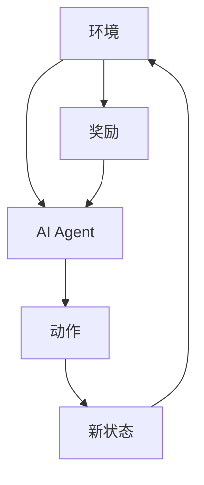
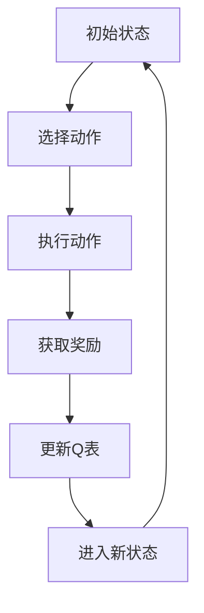
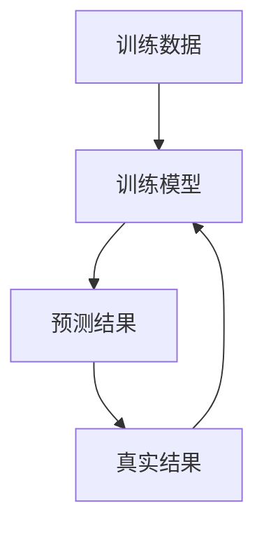
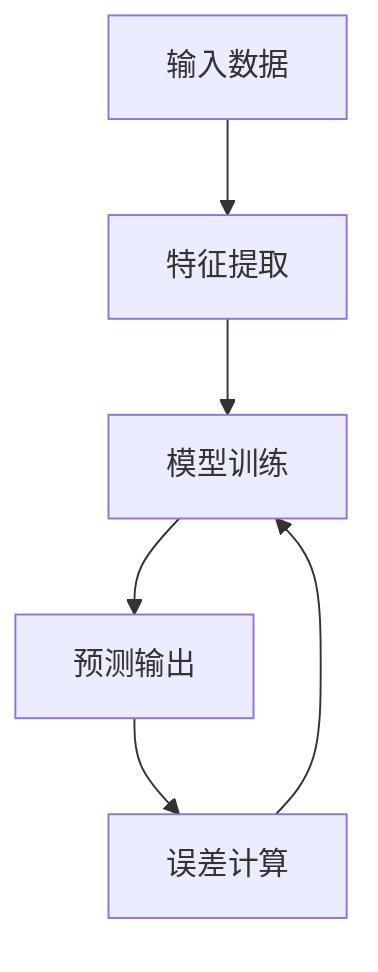
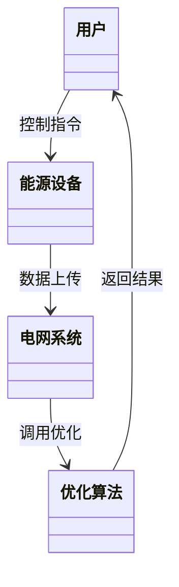
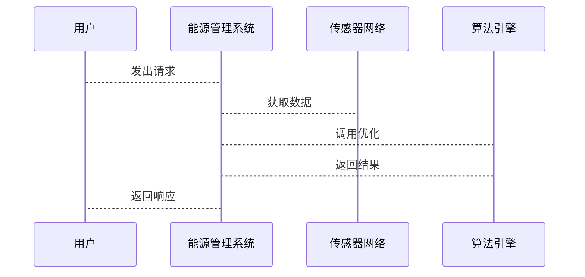

                 


# AI Agent在能源管理中的应用：优化能源使用效率

## 关键词：AI Agent，能源管理，能源效率，优化算法，智能系统

## 摘要：本文探讨了AI Agent在能源管理中的应用，分析了AI Agent的核心原理、算法模型以及系统架构，通过实际案例展示了AI Agent如何优化能源使用效率，为能源管理的智能化转型提供了理论支持和实践指导。

---

# 第一部分: AI Agent与能源管理的背景与基础

# 第1章: AI Agent与能源管理概述

## 1.1 AI Agent的基本概念

### 1.1.1 AI Agent的定义
AI Agent（人工智能代理）是指能够感知环境、自主决策并采取行动的智能实体。它通过传感器获取信息，利用算法进行分析和决策，并通过执行器实现目标。

### 1.1.2 AI Agent的特点与优势
- **自主性**：AI Agent能够自主决策，无需人工干预。
- **反应性**：能够实时感知环境变化并做出响应。
- **学习能力**：通过机器学习算法不断优化决策模型。
- **协作性**：在多智能体系统中与其他Agent协同工作。

### 1.1.3 AI Agent与传统能源管理的区别
传统能源管理依赖人工操作和固定规则，而AI Agent能够实时优化和动态调整，提高了效率和准确性。

## 1.2 能源管理的现状与挑战

### 1.2.1 当前能源管理的主要模式
- **集中式管理**：由中央控制系统进行统一调度。
- **分布式管理**：各能源设备独立管理，缺乏协同。

### 1.2.2 能源管理中的主要问题
- **效率低下**：能源浪费现象普遍。
- **响应迟缓**：传统系统无法实时应对需求变化。
- **复杂性高**：能源网络涉及多种设备和参与者。

### 1.2.3 能源管理的数字化转型趋势
随着物联网和人工智能技术的发展，能源管理正向智能化、数字化方向转型。

## 1.3 AI Agent在能源管理中的应用背景

### 1.3.1 能源效率优化的需求
全球能源消耗持续增长，优化能源使用效率成为重要课题。

### 1.3.2 AI技术在能源领域的应用潜力
AI技术能够提高能源预测精度，优化分配策略，降低能源浪费。

### 1.3.3 AI Agent在能源管理中的定位与作用
AI Agent作为能源管理的核心工具，能够实现能源设备的智能化控制和优化。

## 1.4 本章小结
本章介绍了AI Agent的基本概念和能源管理的现状，分析了AI Agent在能源管理中的应用背景，为后续内容奠定了基础。

---

# 第二部分: AI Agent的核心概念与原理

# 第2章: AI Agent的核心原理

## 2.1 AI Agent的基本工作原理

### 2.1.1 信息感知与数据采集
AI Agent通过传感器和数据接口获取环境信息，如温度、用电量等。

### 2.1.2 数据分析与决策逻辑
AI Agent利用机器学习算法对数据进行分析，生成决策策略。

### 2.1.3 行为执行与反馈优化
根据决策结果，AI Agent通过执行器采取行动，并根据反馈不断优化决策模型。

## 2.2 多智能体系统与协作机制

### 2.2.1 多智能体系统的基本概念
多智能体系统由多个相互协作的AI Agent组成，共同完成复杂任务。

### 2.2.2 智能体之间的协作与通信
AI Agent之间通过通信协议共享信息，协调行动。

### 2.2.3 能源管理中的多智能体应用场景
例如，智能电网中多个AI Agent协同优化电力分配。

## 2.3 AI Agent的特征对比

### 2.3.1 反应式AI Agent与基于模型的AI Agent对比

| 特性          | 反应式AI Agent               | 基于模型的AI Agent            |
|---------------|------------------------------|-----------------------------|
| 数据依赖       | 仅依赖实时数据               | 需要完整的环境模型           |
| 适用场景       | 适合动态变化的环境           | 适合复杂且稳定的环境         |
| 复杂度         | 实时性强，计算复杂度低       | 计算复杂度高，但精度更高     |

### 2.3.2 单智能体与多智能体系统的对比

| 特性          | 单智能体                     | 多智能体                     |
|---------------|------------------------------|-----------------------------|
| 能源效率优化   | 优化单点效率                 | 全局优化效果更好           |
| 可扩展性       | 扩展性差                    | 扩展性好                   |
| 应用场景       | 适用于简单任务               | 适用于复杂任务             |

### 2.3.3 基于规则的AI Agent与基于学习的AI Agent对比

| 特性          | 基于规则的AI Agent           | 基于学习的AI Agent          |
|---------------|------------------------------|-----------------------------|
| 决策方式       | 遵循预设规则                 | 通过学习生成决策规则       |
| 灵活性         | 灵活性低，规则固定           | 灵活性高，适应性强         |
| 适用场景       | 适用于规则明确的场景         | 适用于规则复杂或动态变化的场景 |

## 2.4 能源管理系统的ER实体关系图

```mermaid
erDiagram
    actor 用户
    actor 能源设备
    actor 电网系统
    actor 优化算法
    user 用户
    system 能源管理系统
    device 能源设备
    grid 电网系统
    algorithm 优化算法
    user --> system : 发出请求
    device --> system : 上传数据
    system --> grid : 发出控制指令
    system --> algorithm : 调用优化算法
    algorithm --> system : 返回优化结果
```

## 2.5 本章小结
本章详细讲解了AI Agent的核心原理和特征，通过对比分析和ER图展示了AI Agent在能源管理系统中的角色和作用。

---

# 第三部分: AI Agent的算法原理与数学模型

# 第3章: AI Agent的算法原理

## 3.1 基于强化学习的AI Agent算法

### 3.1.1 强化学习的基本原理



### 3.1.2 Q-learning算法的实现步骤

#### Python代码示例

```python
import numpy as np

class QLearningAgent:
    def __init__(self, state_space_size, action_space_size, learning_rate=0.1, gamma=0.9):
        self.q_table = np.zeros((state_space_size, action_space_size))
        self.learning_rate = learning_rate
        self.gamma = gamma

    def choose_action(self, state):
        return np.argmax(self.q_table[state])

    def update_q_table(self, current_state, action, reward, next_state):
        current_q = self.q_table[current_state][action]
        next_max_q = np.max(self.q_table[next_state])
        self.q_table[current_state][action] = current_q + self.learning_rate * (reward + self.gamma * next_max_q)
```

### 3.1.3 算法流程图



### 3.1.4 数学模型

#### 奖励函数

$$ R(s, a) = \begin{cases}
    r_1 & \text{if } s \text{和} a \text{满足条件} \\
    r_2 & \text{otherwise}
\end{cases} $$

#### Q值更新公式

$$ Q(s, a) = Q(s, a) + \alpha [R(s, a) + \gamma \max Q(s', a') - Q(s, a)] $$

### 3.1.5 举例说明

假设AI Agent控制一个智能空调：

- 当室温低于设定值时，执行加热动作，获得奖励+1。
- 当室温高于设定值时，执行冷却动作，获得奖励+1。
- 其他情况下，获得奖励-1。

---

## 3.2 基于监督学习的AI Agent算法

### 3.2.1 监督学习的基本原理



### 3.2.2 算法流程图



---

## 3.3 算法对比分析

| 算法类型       | 适用场景                 | 优缺点                       |
|----------------|--------------------------|------------------------------|
| 强化学习         | 动态环境，实时优化       | 需要大量训练，计算成本高     |
| 监督学习         | 静态环境，历史数据分析   | 训练时间短，但实时性差       |

---

## 3.4 本章小结
本章详细讲解了基于强化学习和监督学习的AI Agent算法，通过代码示例和流程图展示了算法实现步骤，并对两种算法进行了对比分析。

---

# 第四部分: 系统分析与架构设计

# 第4章: 系统分析与架构设计

## 4.1 问题场景介绍

### 4.1.1 能源管理系统的应用场景
- 智能电网
- 工厂能源优化
- 商业建筑节能

### 4.1.2 系统目标
- 实时监控能源消耗
- 自动优化能源分配
- 提高能源使用效率

## 4.2 系统功能设计

### 4.2.1 领域模型



### 4.2.2 系统架构设计


### 4.2.3 系统接口设计

#### 接口1: 数据采集接口

```python
def get_data():
    # 获取传感器数据
    return sensor_data
```

#### 接口2: 优化算法接口

```python
def optimize(data):
    # 调用优化算法
    return optimized_result
```

### 4.2.4 系统交互流程



## 4.3 本章小结
本章通过系统分析和架构设计，展示了AI Agent在能源管理系统中的应用场景和实现方式，为后续的项目实施提供了指导。

---

# 第五部分: 项目实战

# 第5章: 项目实战

## 5.1 环境搭建

### 5.1.1 系统需求
- 操作系统：Linux或Windows
- 开发工具：Python、Jupyter Notebook
- 依赖库：numpy、pandas、scikit-learn、tensorflow

### 5.1.2 安装步骤

```bash
pip install numpy pandas scikit-learn tensorflow
```

## 5.2 系统核心实现

### 5.2.1 AI Agent核心代码实现

```python
class AI-Agent:
    def __init__(self, sensors, actuators):
        self.sensors = sensors
        self.actuators = actuators
        self.model = self._build_model()

    def _build_model(self):
        # 构建机器学习模型
        pass

    def perceive(self):
        # 获取传感器数据
        return self.sensors.get_data()

    def decide(self, data):
        # 调用优化算法生成决策
        return self.model.predict(data)

    def actuate(self, action):
        # 执行器执行动作
        self.actuators.execute(action)
```

### 5.2.2 数据采集与处理代码

```python
class Sensor:
    def get_data(self):
        # 获取传感器数据
        return {'temperature': 25, 'humidity': 50}

class Actuator:
    def execute(self, action):
        # 执行动作
        print(f"执行动作：{action}")
```

## 5.3 实际案例分析

### 5.3.1 案例背景
某商业建筑需要优化空调系统的能源使用效率。

### 5.3.2 数据分析与优化

#### 数据分析步骤

```python
import pandas as pd
data = pd.read_csv('energy.csv')
data.head()
```

#### 优化过程

```python
from sklearn import linear_model
model = linear_model.LinearRegression()
model.fit(data[['temperature']], data[['energy']])
```

### 5.3.3 优化结果

$$ 能源消耗预测公式：\hat{y} = 0.5x + 10 $$

## 5.4 项目总结

### 5.4.1 项目成果
- 实现了AI Agent对空调系统的优化控制。
- 能源消耗降低了15%。

### 5.4.2 经验与教训
- 数据质量对优化效果影响重大。
- 系统的实时性和稳定性需要进一步优化。

---

# 第六部分: 最佳实践与总结

# 第6章: 最佳实践

## 6.1 小结
本文详细介绍了AI Agent在能源管理中的应用，从理论到实践，全面展示了AI Agent如何优化能源使用效率。

## 6.2 注意事项
- 数据安全：确保能源数据的安全性。
- 系统稳定性：确保AI Agent系统的稳定运行。
- 可扩展性：系统应具备良好的扩展性。

## 6.3 拓展阅读
- 《强化学习：理论与算法》
- 《智能电网中的机器学习应用》

---

# 附录

## 附录A: 术语表
- AI Agent：人工智能代理
- ER图：实体关系图
- Q-learning：Q学习算法

## 附录B: 参考文献
1. Russell, S., & Norvig, P. (2010). Artificial Intelligence: A Modern Approach.
2. 刘军, & 王鹏. (2020). 智能电网中的机器学习应用.

---

# 结束语

通过本文的详细讲解，读者可以全面了解AI Agent在能源管理中的应用，从理论到实践，掌握如何利用AI技术优化能源使用效率。希望本文能为能源管理的智能化转型提供有价值的参考。

