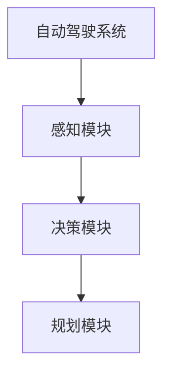

                 


# AI Agent在自动驾驶决策中的应用

> 关键词：自动驾驶、AI Agent、强化学习、决策系统、系统架构

> 摘要：本文深入探讨AI Agent在自动驾驶决策中的应用，从基本概念、算法原理到系统架构，结合实际案例，详细阐述了AI Agent如何在自动驾驶中做出高效、可靠的决策。

---

# 第1章: 自动驾驶与AI Agent的背景介绍

## 1.1 自动驾驶的定义与分类

自动驾驶是一种通过先进传感器、计算系统和执行机构实现车辆自主行驶的技术。根据自动化程度的不同，自动驾驶可以分为以下几个等级：

1. **L0：无自动化**：完全由驾驶员操作，系统无任何辅助功能。
2. **L1：驾驶辅助**：系统在特定条件下提供辅助，如自适应巡航控制。
3. **L2：部分自动驾驶**：系统可以同时执行转向和车速控制，但驾驶员仍需保持注意力。
4. **L3：有条件自动驾驶**：系统在特定条件下完全接管驾驶任务，驾驶员在需要时提供干预。
5. **L4：高度自动驾驶**：系统在大多数条件下自动驾驶，但可能在特定区域或天气下需要人类干预。
6. **L5：完全自动驾驶**：车辆在所有条件下都能自动驾驶，无需人类干预。

## 1.2 AI Agent的基本概念

AI Agent（智能体）是指能够感知环境并采取行动以实现目标的实体。AI Agent的核心属性包括：

1. **自主性**：能够在没有外部干预的情况下运行。
2. **反应性**：能够实时感知环境并做出反应。
3. **目标导向性**：具有明确的目标，并采取行动以实现这些目标。
4. **学习能力**：通过经验改进自身的决策能力。

## 1.3 自动驾驶中AI Agent的应用背景

自动驾驶的决策过程涉及复杂的环境感知、路径规划和行为决策。传统的基于规则的系统在面对复杂场景时往往显得力不从心，而AI Agent的引入为自动驾驶提供了更灵活和高效的解决方案。AI Agent能够通过强化学习等技术，不断优化自身的决策策略，从而在复杂的交通环境中做出更合理的决策。

---

# 第2章: 自动驾驶决策的核心概念与联系

## 2.1 自动驾驶决策的原理

自动驾驶的决策过程通常包括以下几个模块：

1. **感知模块**：通过摄像头、激光雷达、雷达等传感器感知车辆周围的环境信息。
2. **决策模块**：基于感知到的信息，结合车辆状态和目标，做出驾驶决策。
3. **规划模块**：根据决策结果，生成具体的行驶路径和控制指令。

## 2.2 AI Agent在决策中的作用

AI Agent在自动驾驶决策中的作用主要体现在以下几个方面：

1. **状态感知与目标设定**：AI Agent能够实时感知车辆的当前状态，并根据任务目标设定决策的目标。
2. **行为决策与策略优化**：通过强化学习等技术，AI Agent能够不断优化自身的决策策略，以应对复杂的交通环境。
3. **多目标平衡与风险评估**：在复杂的交通场景中，AI Agent需要在多个目标之间进行平衡，并评估潜在的风险，以做出最优决策。

## 2.3 核心概念的ER实体关系图

以下是自动驾驶决策系统的核心概念的ER实体关系图：

```mermaid
er
actor: 自动驾驶系统
goal: 行驶目标
state: 系统状态
action: 执行动作
```

---

# 第3章: AI Agent的算法原理与数学模型

## 3.1 强化学习算法

### 3.1.1 Q-learning算法

Q-learning是一种基于值函数的强化学习算法，其核心思想是通过不断更新Q值表来学习最优策略。Q值表的更新公式如下：

$$ Q(s, a) = Q(s, a) + \alpha [r + \gamma \max Q(s', a') - Q(s, a)] $$

其中：
- \( Q(s, a) \) 表示在状态 \( s \) 下执行动作 \( a \) 的期望回报。
- \( \alpha \) 是学习率。
- \( r \) 是即时回报。
- \( \gamma \) 是折扣因子。
- \( s' \) 是下一个状态。

### 3.1.2 Deep Q-Network (DQN)算法

DQN算法将Q值函数表示为一个深度神经网络，通过经验回放和目标网络等技术来稳定学习过程。其核心思想是通过神经网络近似Q值函数，从而避免了Q值表的维度灾难问题。

### 3.1.3 策略梯度算法

策略梯度算法是一种基于策略的强化学习算法，其核心思想是通过优化策略分布来最大化期望回报。策略梯度算法的优化目标函数如下：

$$ \theta = \arg \max_{\theta} \mathbb{E}_{\tau \sim \pi_\theta} [\log \pi_\theta(a|s) Q_\theta(s, a)] $$

其中：
- \( \theta \) 是神经网络的参数。
- \( \tau \) 是策略 \( \pi_\theta \) 产生的轨迹。
- \( Q_\theta(s, a) \) 是Q值函数。

## 3.2 数学模型与公式

### 3.2.1 Q-learning的数学模型

$$ Q(s, a) = Q(s, a) + \alpha [r + \gamma \max Q(s', a') - Q(s, a)] $$

### 3.2.2 DQN的网络结构

$$ Q(s) = \text{神经网络}(s) $$

---

# 第4章: 自动驾驶决策系统的架构设计

## 4.1 系统功能设计

### 4.1.1 感知模块

感知模块的主要功能是通过传感器获取车辆周围的环境信息，并将其转换为可以被计算机处理的数据。常见的传感器包括摄像头、激光雷达、雷达和超声波传感器。

### 4.1.2 决策模块

决策模块的核心任务是基于感知到的环境信息和车辆状态，做出驾驶决策。决策模块通常采用强化学习算法，如Q-learning或DQN，来优化决策策略。

### 4.1.3 规划模块

规划模块的主要任务是根据决策结果，生成具体的行驶路径和控制指令。常见的路径规划算法包括A*算法、RRT算法和贝叶斯规划等。

## 4.2 系统架构图

以下是自动驾驶决策系统的架构图：



---

# 第5章: 项目实战与代码实现

## 5.1 环境安装

### 5.1.1 安装Python

```bash
python --version
```

### 5.1.2 安装深度学习框架

```bash
pip install tensorflow
```

### 5.1.3 安装依赖库

```bash
pip install numpy matplotlib
```

## 5.2 核心代码实现

### 5.2.1 Q-learning算法实现

```python
import numpy as np

class QLearning:
    def __init__(self, state_space, action_space):
        self.q_table = np.zeros((state_space, action_space))
        self.learning_rate = 0.1
        self.discount_factor = 0.9

    def update(self, state, action, reward, next_state):
        self.q_table[state, action] = self.q_table[state, action] + self.learning_rate * (reward + self.discount_factor * np.max(self.q_table[next_state, :]) - self.q_table[state, action])

    def get_action(self, state, epsilon=0.1):
        if np.random.random() < epsilon:
            return np.random.randint(0, self.q_table.shape[1]-1)
        else:
            return np.argmax(self.q_table[state])
```

### 5.2.2 代码解读与分析

1. **Q-learning类的初始化**：初始化Q表，设置学习率和折扣因子。
2. **update方法**：更新Q表，基于当前状态、动作、奖励和下一个状态。
3. **get_action方法**：根据epsilon-greedy策略选择动作。

---

# 第6章: 总结与展望

## 6.1 总结

本文详细探讨了AI Agent在自动驾驶决策中的应用，从基本概念到算法实现，再到系统架构，结合实际案例，全面阐述了AI Agent在自动驾驶中的重要作用。

## 6.2 未来展望

随着人工智能技术的不断进步，AI Agent在自动驾驶中的应用将更加广泛和深入。未来的研究方向包括更高效的强化学习算法、更智能的感知和决策系统，以及更安全的系统架构设计。

---

通过本文的介绍，读者可以全面了解AI Agent在自动驾驶决策中的应用，从理论到实践，为后续的研究和开发提供了重要的参考和指导。

