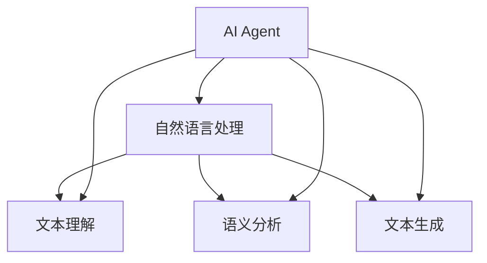
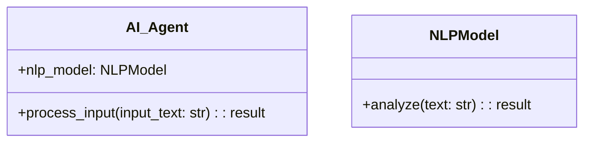
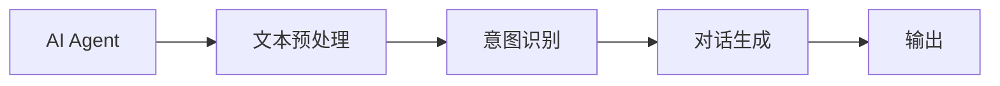
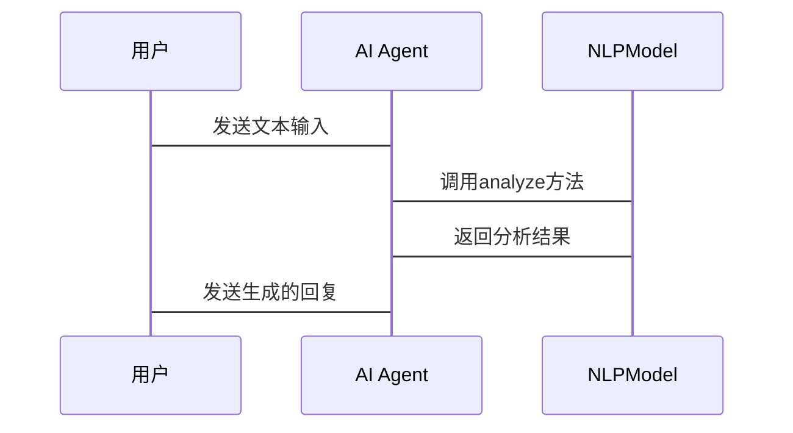

                 


# AI Agent在自然语言处理中的最新进展与应用

## 关键词：AI Agent, 自然语言处理, NLP, 机器学习, 大模型, 多模态

## 摘要：本文将全面探讨AI Agent在自然语言处理中的最新进展与应用。首先，我们将介绍AI Agent和自然语言处理的基本概念和核心特征。然后，分析AI Agent在自然语言处理中的算法原理和数学模型，包括基于规则、机器学习和深度学习的算法。接着，我们将讨论AI Agent与自然语言处理的系统架构设计，包括系统功能模块、架构图和交互流程。最后，通过实际案例分析AI Agent在自然语言处理中的应用，并总结当前的技术挑战和未来的发展趋势。

---

## 第1章: AI Agent与自然语言处理的背景介绍

### 1.1 AI Agent的基本概念

#### 1.1.1 什么是AI Agent
AI Agent（人工智能代理）是指能够感知环境、自主决策并执行任务的智能实体。它可以是一个软件程序、机器人或其他智能系统，旨在通过与环境交互来实现特定目标。

#### 1.1.2 AI Agent的核心特征
- **自主性**：能够自主决策和行动。
- **反应性**：能够感知环境并实时响应。
- **目标导向性**：通过目标驱动行动。
- **学习能力**：能够通过经验改进性能。

#### 1.1.3 AI Agent与传统程序的区别
AI Agent能够自主决策，具有学习能力和适应性，而传统程序通常遵循固定的逻辑，不具备自主性和适应性。

### 1.2 自然语言处理的基本概念

#### 1.2.1 自然语言处理的定义
NLP（Natural Language Processing）是指让计算机能够理解、分析和生成人类语言的技术。它涉及语言理解、语义分析和文本生成等多个方面。

#### 1.2.2 NLP的核心任务
- **文本分类**：将文本归类到预定义的类别中。
- **信息抽取**：从文本中提取结构化信息。
- **机器翻译**：将一种语言翻译成另一种语言。
- **对话生成**：生成自然语言对话。

#### 1.2.3 NLP的挑战与解决方案
- **语言的复杂性**：语言具有模糊性和多义性，需要上下文理解。
- **数据稀疏性**：某些语言或领域数据不足，影响模型性能。
- **计算资源需求**：深度学习模型需要大量计算资源。

---

## 第2章: AI Agent在自然语言处理中的应用背景

### 2.1 当前AI Agent的发展现状

#### 2.1.1 AI Agent的历史发展
AI Agent的概念起源于20世纪60年代，随着人工智能技术的发展，AI Agent逐渐从理论研究走向实际应用。

#### 2.1.2 当前AI Agent的主要技术特点
- **基于大模型**：如GPT-3、GPT-4等，具备强大的生成能力和理解能力。
- **多模态交互**：能够处理文本、语音、图像等多种模态信息。
- **实时性**：能够在动态环境中快速响应。

#### 2.1.3 AI Agent在NLP领域的应用现状
AI Agent在NLP中的应用广泛，包括智能客服、智能助手、自动对话生成等。

### 2.2 自然语言处理的最新进展

#### 2.2.1 大模型在NLP中的应用
大模型如GPT系列在文本生成、对话生成等领域取得了显著进展。

#### 2.2.2 多模态NLP的发展
多模态NLP结合了文本、图像、语音等多种信息，能够提供更丰富的理解和生成能力。

#### 2.2.3 NLP的未来趋势
- **更强大的生成能力**：通过大模型和多模态技术，生成更自然、更复杂的文本。
- **实时性增强**：优化模型的推理速度，提高实时交互能力。
- **个性化服务**：根据用户需求定制化生成内容。

---

## 第3章: AI Agent与自然语言处理的核心概念与联系

### 3.1 AI Agent与NLP的核心概念对比

#### 3.1.1 AI Agent的核心概念
- **自主性**：AI Agent能够自主决策和行动。
- **目标导向性**：通过目标驱动行动。
- **学习能力**：能够通过经验改进性能。

#### 3.1.2 NLP的核心概念
- **文本理解**：理解输入文本的含义。
- **语义分析**：分析文本中的语义信息。
- **文本生成**：生成符合语义的文本。

#### 3.1.3 对比分析
| 核心概念 | AI Agent | NLP |
|----------|-----------|-----|
| 自主性   | 高         | 中  |
| 目标导向性 | 高         | 中  |
| 学习能力 | 高         | 中  |
| 文本理解 | 中         | 高  |
| 语义分析 | 中         | 高  |
| 文本生成 | 中         | 高  |

### 3.2 AI Agent与NLP的实体关系图



---

## 第4章: AI Agent的算法原理

### 4.1 AI Agent的基本算法

#### 4.1.1 基于规则的AI Agent算法
基于规则的AI Agent通过预定义的规则来实现任务，适用于任务简单、规则明确的场景。

#### 4.1.2 基于机器学习的AI Agent算法
基于机器学习的AI Agent通过学习数据中的模式来生成决策，适用于任务复杂、规则不明确的场景。

#### 4.1.3 基于深度学习的AI Agent算法
基于深度学习的AI Agent利用神经网络模型来处理和生成文本，适用于复杂的NLP任务。

### 4.2 自然语言处理的算法原理

#### 4.2.1 词嵌入算法
词嵌入算法如Word2Vec、GloVe通过将词表示为向量，降低文本处理的维度。

#### 4.2.2 语法分析算法
语法分析算法如分词、句法分析，用于理解文本的结构和语法关系。

#### 4.2.3 文本生成算法
文本生成算法如RNN、Transformer通过生成模型来生成符合语义的文本。

---

## 第5章: AI Agent与自然语言处理的联合算法

### 5.1 联合算法的基本原理

#### 5.1.1 算法流程
AI Agent通过自然语言处理技术来理解和生成文本，结合上下文信息进行决策和行动。

#### 5.1.2 算法实现
```python
class AI_Agent:
    def __init__(self, nlp_model):
        self.nlp_model = nlp_model
    
    def process_input(self, input_text):
        # 使用自然语言处理模型进行分析
        result = self.nlp_model.analyze(input_text)
        return result
```

#### 5.1.3 算法优化
通过结合上下文信息和反馈机制，优化AI Agent的自然语言处理能力。

### 5.2 算法的数学模型与公式

#### 5.2.1 算法的数学模型
AI Agent的自然语言处理模型通常基于概率图模型或神经网络模型。

#### 5.2.2 算法的数学公式
文本生成模型的损失函数：
$$ \mathcal{L} = -\sum_{t=1}^{T} \log P(y_t | y_{<t}) $$
其中，$y_t$表示生成的第$t$个词。

---

## 第6章: 系统分析与架构设计方案

### 6.1 问题场景介绍

#### 6.1.1 系统功能需求
- 信息抽取：从文本中提取关键信息。
- 意图识别：识别用户的意图。
- 对话生成：生成符合意图的对话回复。

### 6.2 系统功能设计

#### 6.2.1 功能模块
- 文本预处理：对输入文本进行分词、去停用词等处理。
- 意图识别：使用机器学习模型识别用户的意图。
- 对话生成：基于意图生成回复文本。

#### 6.2.2 功能模块类图



### 6.3 系统架构设计

#### 6.3.1 系统架构图



### 6.4 系统接口设计

#### 6.4.1 接口描述
- 输入接口：接受用户输入的文本。
- 输出接口：输出生成的对话回复。

#### 6.4.2 接口交互流程



---

## 第7章: 项目实战

### 7.1 环境安装

#### 7.1.1 安装Python
安装Python 3.8及以上版本。

#### 7.1.2 安装依赖库
安装必要的Python库，如numpy、pandas、transformers。

### 7.2 系统核心实现

#### 7.2.1 核心代码实现
```python
from transformers import pipeline

# 初始化NLP模型
nlp_model = pipeline("text-classification", model="bert-base")

# AI Agent类
class AI_Agent:
    def __init__(self, nlp_model):
        self.nlp_model = nlp_model
    
    def process_input(self, input_text):
        result = self.nlp_model(input_text)
        return result

# 使用AI Agent
agent = AI_Agent(nlp_model)
input_text = "我需要帮助"
output = agent.process_input(input_text)
print(output)
```

#### 7.2.2 代码解读
- 初始化NLP模型：使用transformers库中的预训练模型。
- AI Agent类：封装NLP模型，提供处理输入的方法。
- 使用示例：调用process_input方法，生成输出结果。

### 7.3 实际案例分析

#### 7.3.1 案例描述
用户输入：“我需要帮助”。

#### 7.3.2 案例分析
AI Agent通过NLP模型分析输入文本，识别用户的意图是寻求帮助，然后生成相应的回复。

---

## 第8章: 最佳实践、小结与展望

### 8.1 最佳实践 tips

#### 8.1.1 数据质量
确保训练数据的质量和多样性，以提高模型的性能。

#### 8.1.2 模型优化
通过调参和优化算法，提高模型的生成能力和理解能力。

#### 8.1.3 安全性
确保AI Agent的安全性，防止滥用和误用。

### 8.2 小结

通过本文的介绍，我们全面探讨了AI Agent在自然语言处理中的最新进展与应用，包括基本概念、算法原理、系统架构设计和项目实战。AI Agent与自然语言处理的结合为智能交互带来了新的可能性。

### 8.3 未来展望

随着大模型和多模态技术的不断发展，AI Agent在自然语言处理中的应用将更加广泛和深入。未来的研究方向包括提高生成能力、优化实时性以及增强个性化服务。

### 8.4 拓展阅读

- 《Deep Learning》
- 《自然语言处理入门》
- 《AI Agent与智能系统》

---

通过本文的详细讲解，读者可以全面理解AI Agent在自然语言处理中的最新进展与应用，并能够实际操作相关技术。希望本文能够为读者提供有价值的参考和启发。

