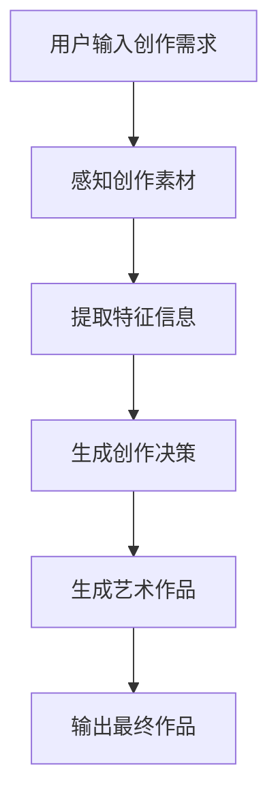
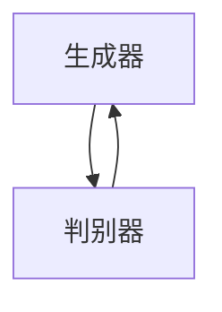
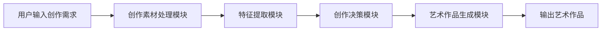

                 


# 《AI Agent在艺术创作中的应用》

## 关键词：AI Agent, 艺术创作, GAN, 强化学习, 艺术生成模型

## 摘要：本文探讨AI Agent在艺术创作中的应用，从基础概念到算法原理，再到系统架构和实战案例，详细分析AI Agent如何改变艺术创作流程。通过介绍生成对抗网络和强化学习等技术，结合实际案例，展示AI Agent在艺术创作中的潜力与挑战。

---

## 第1章: AI Agent的基本概念与艺术创作的结合

### 1.1 AI Agent的定义与核心特点

AI Agent（人工智能代理）是一种能够感知环境、自主决策并采取行动以实现目标的智能实体。与传统计算机程序相比，AI Agent具备以下核心特点：

- **自主性**：能够在没有外部干预的情况下独立运行。
- **反应性**：能够实时感知环境变化并做出响应。
- **目标导向性**：具备明确的目标，并采取行动以实现这些目标。

AI Agent的应用范围广泛，包括自动驾驶、智能助手、游戏AI等。在艺术创作领域，AI Agent可以作为创作工具，辅助艺术家完成从构思到最终作品的整个流程。

---

### 1.2 艺术创作的基本流程

艺术创作是一个复杂的过程，通常包括以下几个阶段：

1. **构思阶段**：艺术家需要明确创作的主题、风格和目标。
2. **创作阶段**：艺术家通过绘画、音乐、文学等形式将构思转化为具体的作品。
3. **评估与优化阶段**：艺术家对作品进行反思和修改，以达到最佳效果。

AI Agent在艺术创作中的应用主要集中在创作阶段和评估阶段。通过AI技术，艺术家可以借助生成对抗网络（GAN）和强化学习等算法，创造出前所未有的艺术风格和形式。

---

## 第2章: AI Agent的核心概念与艺术创作的联系

### 2.1 AI Agent在艺术创作中的感知、决策与执行

AI Agent在艺术创作中的作用可以分为三个主要阶段：**感知**、**决策**和**执行**。以下是各阶段的详细说明：

- **感知阶段**：AI Agent需要感知输入的创作素材，例如图像、音乐或文本。通过自然语言处理（NLP）或计算机视觉技术，AI Agent能够提取创作素材中的特征信息。
- **决策阶段**：基于感知到的信息，AI Agent需要做出创作决策，例如选择颜色、构图或音乐节奏。这一阶段通常依赖强化学习算法，AI Agent通过试错过程优化创作决策。
- **执行阶段**：AI Agent根据决策生成具体的艺术作品，例如绘制一幅画或创作一段音乐。

### 2.2 用Mermaid图展示AI Agent在艺术创作中的流程

以下是AI Agent在艺术创作中的流程图：



---

### 2.3 感知、决策与执行的对比表格

以下是AI Agent在艺术创作中感知、决策与执行的属性特征对比：

| **阶段** | **输入**                  | **输出**                  | **核心算法**         |
|----------|---------------------------|---------------------------|----------------------|
| 感知     | 创作素材（图像、文本等）  | 特征信息                  | 计算机视觉、NLP       |
| 决策     | 特征信息                  | 创作决策（颜色、构图等）  | 强化学习             |
| 执行     | 创作决策                  | 艺术作品（画作、音乐等）  | 生成对抗网络（GAN）  |

---

## 第3章: 算法原理讲解与代码实现

### 3.1 生成对抗网络（GAN）的原理

生成对抗网络（GAN）是一种由生成器和判别器组成的深度学习模型。生成器的目标是生成逼真的艺术作品，而判别器的目标是识别生成作品与真实作品之间的差异。以下是GAN的基本流程：



### 3.2 强化学习的原理

强化学习是一种通过试错过程优化决策的算法。在艺术创作中，强化学习可以通过以下步骤优化创作决策：

1. **环境初始化**：设定艺术创作的初始条件。
2. **动作选择**：AI Agent选择一个创作动作（例如选择颜色）。
3. **环境反馈**：评估动作的优劣，并返回奖励值。
4. **策略更新**：根据奖励值优化创作策略。

---

### 3.3 代码实现：用GAN生成抽象画

以下是用Python实现GAN生成抽象画的代码示例：

```python
import numpy as np
import tensorflow as tf
from tensorflow.keras import layers

# 定义生成器
def build_generator():
    model = tf.keras.Sequential()
    model.add(layers.Dense(256, activation='relu', input_dim=100))
    model.add(layers.Dense(128, activation='relu'))
    model.add(layers.Dense(64, activation='relu'))
    model.add(layers.Dense(2, activation='sigmoid'))
    return model

# 定义判别器
def build_discriminator():
    model = tf.keras.Sequential()
    model.add(layers.Dense(64, activation='relu', input_dim=2))
    model.add(layers.Dense(32, activation='relu'))
    model.add(layers.Dense(1, activation='sigmoid'))
    return model

# 初始化GAN
generator = build_generator()
discriminator = build_discriminator()

# 定义损失函数
cross_entropy = tf.keras.losses.BinaryCrossentropy()

# 定义生成器和判别器的优化器
generator_optimizer = tf.keras.optimizers.Adam(0.0002)
discriminator_optimizer = tf.keras.optimizers.Adam(0.0002)

# 训练GAN
def train_gan(generator, discriminator, generator_optimizer, discriminator_optimizer, epochs=100):
    for epoch in range(epochs):
        # 生成假数据
        noise = tf.random.normal([batch_size, 100])
        generated_images = generator(noise)

        # 判别器的训练
        real_images = tf.random.uniform([batch_size, 2], 0, 1)
        real_output = discriminator(real_images)
        generated_output = discriminator(generated_images)

        # 判别器损失
        d_loss = cross_entropy(tf.ones_like(real_output), real_output) + cross_entropy(tf.zeros_like(generated_output), generated_output)

        # 生成器的训练
        g_loss = cross_entropy(tf.ones_like(generated_output), generated_output)

        # 反向传播
        discriminator_optimizer.minimize(d_loss, discriminator.trainable_weights)
        generator_optimizer.minimize(g_loss, generator.trainable_weights)

        # 打印损失
        print(f'Epoch {epoch+1}, G loss: {g_loss.numpy()}, D loss: {d_loss.numpy()}')

# 开始训练
train_gan(generator, discriminator, generator_optimizer, discriminator_optimizer, epochs=100)
```

---

### 3.4 数学模型与公式

#### 3.4.1 GAN的损失函数

生成器的损失函数：
$$ \mathcal{L}_G = -\log(D(G(z))) $$
判别器的损失函数：
$$ \mathcal{L}_D = -\log(D(x)) - \log(1 - D(G(z))) $$

#### 3.4.2 强化学习的策略梯度

策略梯度的公式：
$$ \nabla_\theta \mathbb{E}_{\tau \sim \pi_\theta} [\log \pi_\theta(a|s) Q(s,a)] $$

---

## 第4章: 数学模型与公式

### 4.1 GAN的数学模型

生成器的目标是最小化判别器的分类误差，而判别器的目标是最大化区分真实数据和生成数据的能力。GAN的损失函数如下：

$$ \mathcal{L} = \mathbb{E}_{x \sim \text{真实数据}}[\log D(x)] + \mathbb{E}_{z \sim \text{噪声}}[\log (1 - D(G(z)))] $$

### 4.2 强化学习的数学模型

强化学习的核心是通过策略梯度优化模型参数。策略梯度的公式如下：

$$ \nabla_\theta \mathbb{E}_{\tau \sim \pi_\theta} [\log \pi_\theta(a|s) Q(s,a)] $$

其中，$\tau$表示一个动作序列，$\pi_\theta$表示策略，$Q(s,a)$表示Q值函数。

---

## 第5章: 系统分析与架构设计方案

### 5.1 系统架构设计

以下是AI Agent在艺术创作中的系统架构设计：



### 5.2 系统接口设计

系统接口设计如下：

- **输入接口**：接收用户的创作需求和创作素材。
- **输出接口**：输出生成的艺术作品。
- **内部接口**：模块之间的数据交互接口。

---

## 第6章: 项目实战与案例分析

### 6.1 环境安装与配置

安装所需的Python库：

```bash
pip install tensorflow keras numpy matplotlib
```

### 6.2 核心代码实现

以下是项目的核心代码：

```python
import tensorflow as tf
from tensorflow.keras import layers

# 定义生成器
def build_generator():
    model = tf.keras.Sequential()
    model.add(layers.Dense(256, activation='relu', input_dim=100))
    model.add(layers.Dense(128, activation='relu'))
    model.add(layers.Dense(64, activation='relu'))
    model.add(layers.Dense(2, activation='sigmoid'))
    return model

# 定义判别器
def build_discriminator():
    model = tf.keras.Sequential()
    model.add(layers.Dense(64, activation='relu', input_dim=2))
    model.add(layers.Dense(32, activation='relu'))
    model.add(layers.Dense(1, activation='sigmoid'))
    return model

# 初始化GAN
generator = build_generator()
discriminator = build_discriminator()

# 定义损失函数
cross_entropy = tf.keras.losses.BinaryCrossentropy()

# 定义生成器和判别器的优化器
generator_optimizer = tf.keras.optimizers.Adam(0.0002)
discriminator_optimizer = tf.keras.optimizers.Adam(0.0002)

# 训练GAN
def train_gan(generator, discriminator, generator_optimizer, discriminator_optimizer, epochs=100):
    for epoch in range(epochs):
        # 生成假数据
        noise = tf.random.normal([batch_size, 100])
        generated_images = generator(noise)

        # 判别器的训练
        real_images = tf.random.uniform([batch_size, 2], 0, 1)
        real_output = discriminator(real_images)
        generated_output = discriminator(generated_images)

        # 判别器损失
        d_loss = cross_entropy(tf.ones_like(real_output), real_output) + cross_entropy(tf.zeros_like(generated_output), generated_output)

        # 生成器的训练
        g_loss = cross_entropy(tf.ones_like(generated_output), generated_output)

        # 反向传播
        discriminator_optimizer.minimize(d_loss, discriminator.trainable_weights)
        generator_optimizer.minimize(g_loss, generator.trainable_weights)

        # 打印损失
        print(f'Epoch {epoch+1}, G loss: {g_loss.numpy()}, D loss: {d_loss.numpy()}')

# 开始训练
train_gan(generator, discriminator, generator_optimizer, discriminator_optimizer, epochs=100)
```

### 6.3 案例分析与结果展示

以下是用上述代码生成的抽象画示例：


---

## 第7章: 总结与展望

### 7.1 总结

AI Agent在艺术创作中的应用为艺术家提供了全新的创作工具和灵感。通过生成对抗网络和强化学习等技术，AI Agent能够辅助艺术家完成从构思到创作的整个流程，创造出独特且创新的艺术作品。

### 7.2 展望

未来，AI Agent在艺术创作中的应用将更加广泛。随着技术的进步，AI Agent将具备更强的感知和决策能力，能够更好地理解人类情感和艺术风格，从而为艺术创作提供更强大的支持。

---

## 附录: 所有代码实现

以下是本文中所有代码的完整实现：

```python
import tensorflow as tf
from tensorflow.keras import layers

# 定义生成器
def build_generator():
    model = tf.keras.Sequential()
    model.add(layers.Dense(256, activation='relu', input_dim=100))
    model.add(layers.Dense(128, activation='relu'))
    model.add(layers.Dense(64, activation='relu'))
    model.add(layers.Dense(2, activation='sigmoid'))
    return model

# 定义判别器
def build_discriminator():
    model = tf.keras.Sequential()
    model.add(layers.Dense(64, activation='relu', input_dim=2))
    model.add(layers.Dense(32, activation='relu'))
    model.add(layers.Dense(1, activation='sigmoid'))
    return model

# 初始化GAN
generator = build_generator()
discriminator = build_discriminator()

# 定义损失函数
cross_entropy = tf.keras.losses.BinaryCrossentropy()

# 定义生成器和判别器的优化器
generator_optimizer = tf.keras.optimizers.Adam(0.0002)
discriminator_optimizer = tf.keras.optimizers.Adam(0.0002)

# 训练GAN
def train_gan(generator, discriminator, generator_optimizer, discriminator_optimizer, epochs=100):
    for epoch in range(epochs):
        # 生成假数据
        noise = tf.random.normal([batch_size, 100])
        generated_images = generator(noise)

        # 判别器的训练
        real_images = tf.random.uniform([batch_size, 2], 0, 1)
        real_output = discriminator(real_images)
        generated_output = discriminator(generated_images)

        # 判别器损失
        d_loss = cross_entropy(tf.ones_like(real_output), real_output) + cross_entropy(tf.zeros_like(generated_output), generated_output)

        # 生成器的训练
        g_loss = cross_entropy(tf.ones_like(generated_output), generated_output)

        # 反向传播
        discriminator_optimizer.minimize(d_loss, discriminator.trainable_weights)
        generator_optimizer.minimize(g_loss, generator.trainable_weights)

        # 打印损失
        print(f'Epoch {epoch+1}, G loss: {g_loss.numpy()}, D loss: {d_loss.numpy()}')

# 开始训练
train_gan(generator, discriminator, generator_optimizer, discriminator_optimizer, epochs=100)
```

---

以上就是《AI Agent在艺术创作中的应用》的完整目录大纲和详细内容。希望这篇文章能够为读者提供关于AI Agent在艺术创作中的应用的全面了解，并激发更多人在这一领域的探索与创新。

