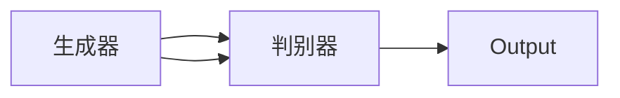
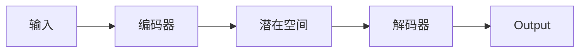
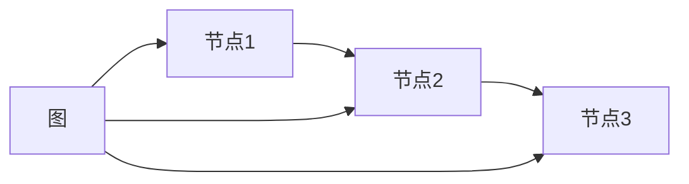
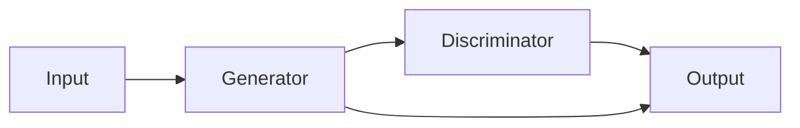
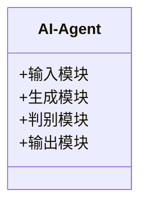

                 


# AI Agent在艺术创作中的应用：新形式探索

> 关键词：AI Agent, 艺术创作, 生成对抗网络, 变分自编码器, 图神经网络

> 摘要：本文探讨AI Agent在艺术创作中的应用，分析其核心算法如生成对抗网络（GAN）、变分自编码器（VAE）和图神经网络（GNN）的原理，并结合实际案例，详细阐述AI Agent在艺术创作中的系统架构设计与实现。通过分析艺术创作中的数据流与交互流程，本文揭示了AI Agent如何革新艺术创作形式，并提出在实际应用中的最佳实践建议。

---

# 第一部分: AI Agent与艺术创作的背景介绍

## 第1章: AI Agent的基本概念与艺术创作的背景

### 1.1 AI Agent的定义与核心概念

#### 1.1.1 什么是AI Agent
AI Agent（人工智能代理）是指能够感知环境、自主决策并执行任务的智能实体。它可以是一个软件程序、机器人或其他智能系统，旨在通过学习和推理完成特定目标。

#### 1.1.2 AI Agent的核心特征
- **自主性**：能够在无外部干预的情况下独立运作。
- **反应性**：能够实时感知环境并做出反应。
- **目标导向性**：通过目标驱动进行决策和行动。
- **学习能力**：能够通过数据和经验不断优化自身性能。

#### 1.1.3 AI Agent与传统AI的区别
- **传统AI**：基于规则和预定义逻辑完成任务，缺乏自主性和适应性。
- **AI Agent**：具备自主决策能力，能够根据环境动态调整行为。

### 1.2 艺术创作的背景与挑战

#### 1.2.1 艺术创作的基本概念
艺术创作是人类通过视觉、听觉等感官形式表达思想、情感和想象力的过程。传统艺术创作依赖于艺术家的个人风格和技术。

#### 1.2.2 数字化艺术创作的现状
随着数字技术的发展，艺术创作逐渐从传统媒介转向数字化工具，如数字绘画、3D建模和虚拟现实等。

#### 1.2.3 当代艺术创作中的技术应用
- **数字工具**：如Photoshop、3D建模软件等。
- **数据驱动创作**：利用大数据进行艺术风格分析和创作。

### 1.3 AI Agent在艺术创作中的应用背景

#### 1.3.1 AI技术在艺术领域的潜力
AI技术能够模拟人类创造力，生成新的艺术作品，优化创作流程。

#### 1.3.2 AI Agent在艺术创作中的独特优势
- **自动化创作**：AI Agent可以独立完成从构思到最终作品的全过程。
- **风格迁移**：能够将一种艺术风格转换为另一种风格。
- **无限可能性**：通过算法优化，AI Agent可以探索人类难以想象的艺术表现形式。

#### 1.3.3 当前AI艺术创作的主要形式与问题
- **主要形式**：图像生成、音乐创作、文学创作等。
- **主要问题**：生成作品缺乏深度情感，创作过程缺乏透明度。

### 1.4 本章小结
本章介绍了AI Agent的基本概念及其在艺术创作中的应用背景，强调了AI Agent在艺术创作中的潜力和优势，同时也指出了当前技术面临的挑战。

---

# 第二部分: AI Agent的核心概念与原理

## 第2章: AI Agent的核心概念与原理

### 2.1 AI Agent的核心原理

#### 2.1.1 AI Agent的基本原理
AI Agent通过感知环境、目标设定、决策制定和行动执行来完成任务。其核心在于通过算法实现自主决策和优化。

#### 2.1.2 AI Agent的决策机制
AI Agent的决策过程包括环境感知、状态分析、目标设定、策略选择和行动执行。

#### 2.1.3 AI Agent的学习与进化
通过机器学习算法，AI Agent能够从数据中学习，不断优化自身的决策能力和创作水平。

### 2.2 AI Agent在艺术创作中的应用原理

#### 2.2.1 艺术创作的数字化表达
艺术创作可以通过数字化形式进行表达，如图像、音乐、文本等，这些形式可以通过AI算法进行处理和生成。

#### 2.2.2 AI Agent的艺术创作过程
AI Agent在艺术创作中的流程包括数据输入、风格分析、内容生成和结果输出。

#### 2.2.3 AI Agent与人类艺术家的协作模式
AI Agent可以作为辅助工具，帮助艺术家快速生成灵感、优化作品，同时艺术家也可以对AI生成的内容进行调整和再创作。

### 2.3 AI Agent的核心算法与技术

#### 2.3.1 生成对抗网络（GAN）
生成对抗网络是一种由生成器和判别器组成的深度学习模型，能够生成逼真的图像和其他形式的艺术作品。

#### 2.3.2 变分自编码器（VAE）
变分自编码器是一种用于生成模型的算法，能够通过学习数据的潜在表示来生成新的数据样本。

#### 2.3.3 图神经网络（GNN）
图神经网络能够处理图结构数据，适用于复杂的艺术创作场景，如社交网络中的艺术传播分析。

### 2.4 本章小结
本章详细介绍了AI Agent的核心原理及其在艺术创作中的应用原理，重点分析了GAN、VAE和GNN等核心算法的特点和应用场景。

---

# 第三部分: AI Agent在艺术创作中的算法原理

## 第3章: AI Agent的核心算法与实现

### 3.1 生成对抗网络（GAN）的原理与实现

#### 3.1.1 GAN的基本原理
GAN由生成器和判别器组成，生成器的目标是生成能够欺骗判别器的样本，而判别器的目标是区分真实样本和生成样本。

#### 3.1.2 GAN的数学模型与公式
生成器和判别器的损失函数如下：

$$ \text{生成器损失} = -\log(D(G(z))) $$
$$ \text{判别器损失} = -(\log(D(x)) + \log(1 - D(G(z)))) $$

其中，$D(x)$是判别器对真实样本的判断概率，$G(z)$是生成器生成的样本。

#### 3.1.3 GAN的实现代码与流程图
以下是GAN的实现代码示例：

```python
import tensorflow as tf
from tensorflow.keras import layers

def make_generator_model():
    model = tf.keras.Sequential()
    model.add(layers.Dense(256, activation='relu', input_shape=(100,)))
    model.add(layers.Dense(512, activation='relu'))
    model.add(layers.Dense(784, activation='sigmoid'))
    return model

def make_discriminator_model():
    model = tf.keras.Sequential()
    model.add(layers.Dense(784, activation='relu', input_shape=(784,)))
    model.add(layers.Dense(1, activation='sigmoid'))
    return model
```

流程图如下：



### 3.2 变分自编码器（VAE）的原理与实现

#### 3.2.1 VAE的基本原理
VAE通过引入隐变量$z$，将数据$x$映射到潜在空间，再从潜在空间生成新的数据。

#### 3.2.2 VAE的数学模型与公式
VAE的目标是最小化以下损失函数：

$$ \mathcal{L} = \mathbb{E}_{z}[ -\log p(x|z) ] + \text{KL}(q(z|x) || p(z)) $$

其中，$\text{KL}$表示KL散度，$p(x|z)$是生成分布，$q(z|x)$是后验分布。

#### 3.2.3 VAE的实现代码与流程图
以下是VAE的实现代码示例：

```python
import tensorflow as tf
from tensorflow.keras import layers

def make_vae_encoder():
    encoder = tf.keras.Sequential()
    encoder.add(layers.Dense(256, activation='relu', input_shape=(784,)))
    encoder.add(layers.Dense(128, activation='relu'))
    return encoder

def make_vae_decoder():
    decoder = tf.keras.Sequential()
    decoder.add(layers.Dense(128, activation='relu', input_shape=(128,)))
    decoder.add(layers.Dense(784, activation='sigmoid'))
    return decoder
```

流程图如下：



### 3.3 图神经网络（GNN）的原理与实现

#### 3.3.1 GNN的基本原理
GNN通过处理图结构数据，能够分析节点之间的关系，适用于复杂的艺术创作场景。

#### 3.3.2 GNN的数学模型与公式
GNN的传播规则如下：

$$ h_i^{(l+1)} = \sigma(\sum_{j \in N(i)} W_{ij} h_j^{(l)}) $$

其中，$h_i^{(l)}$表示节点$i$在第$l$层的表示，$N(i)$表示节点$i$的邻居节点。

#### 3.3.3 GNN的实现代码与流程图
以下是GNN的实现代码示例：

```python
import tensorflow as tf
from tensorflow.keras import layers

def make_gnn_model():
    model = tf.keras.Sequential()
    model.add(layers.GraphConvolution(units=16, activation='relu', input_dim=16))
    model.add(layers.GraphConvolution(units=1, activation='sigmoid'))
    return model
```

流程图如下：



### 3.4 本章小结
本章详细介绍了GAN、VAE和GNN的核心算法及其在艺术创作中的实现，通过数学公式和代码示例帮助读者理解这些算法的工作原理。

---

# 第四部分: AI Agent艺术创作系统的架构设计

## 第4章: AI Agent艺术创作系统的架构设计

### 4.1 系统架构设计概述

#### 4.1.1 系统模块划分
AI Agent艺术创作系统主要包括数据输入模块、生成模块、判别模块和输出模块。

#### 4.1.2 系统架构图


#### 4.1.3 系统数据流设计
- 数据输入：接收艺术家的创作需求和初始数据。
- 数据处理：对输入数据进行预处理和特征提取。
- 数据输出：生成艺术作品并输出结果。

#### 4.1.4 系统交互流程
- 用户输入创作需求。
- 系统根据需求生成艺术作品。
- 用户对生成作品进行反馈和调整。

### 4.2 系统功能设计

#### 4.2.1 领域模型
领域模型是系统的核心模块，负责处理艺术创作相关的逻辑。



#### 4.2.2 系统架构
系统架构采用模块化设计，各模块之间通过接口进行交互。


#### 4.2.3 系统接口设计
系统接口包括输入接口、输出接口和反馈接口。

#### 4.2.4 系统交互流程
用户与系统通过交互界面进行创作需求的输入和输出。

### 4.3 本章小结
本章详细描述了AI Agent艺术创作系统的架构设计，包括模块划分、系统架构和交互流程。

---

# 第五部分: 项目实战与最佳实践

## 第5章: 项目实战——使用AI Agent生成艺术图像

### 5.1 环境安装

#### 5.1.1 安装TensorFlow
使用以下命令安装TensorFlow：

```bash
pip install tensorflow
```

#### 5.1.2 安装其他依赖
安装必要的依赖库，如numpy、matplotlib等。

### 5.2 系统核心实现源代码

#### 5.2.1 GAN实现代码
```python
import tensorflow as tf
from tensorflow.keras import layers

def make_generator_model():
    model = tf.keras.Sequential()
    model.add(layers.Dense(256, activation='relu', input_shape=(100,)))
    model.add(layers.Dense(512, activation='relu'))
    model.add(layers.Dense(784, activation='sigmoid'))
    return model

def make_discriminator_model():
    model = tf.keras.Sequential()
    model.add(layers.Dense(784, activation='relu', input_shape=(784,)))
    model.add(layers.Dense(1, activation='sigmoid'))
    return model
```

#### 5.2.2 VAE实现代码
```python
import tensorflow as tf
from tensorflow.keras import layers

def make_vae_encoder():
    encoder = tf.keras.Sequential()
    encoder.add(layers.Dense(256, activation='relu', input_shape=(784,)))
    encoder.add(layers.Dense(128, activation='relu'))
    return encoder

def make_vae_decoder():
    decoder = tf.keras.Sequential()
    decoder.add(layers.Dense(128, activation='relu', input_shape=(128,)))
    decoder.add(layers.Dense(784, activation='sigmoid'))
    return decoder
```

#### 5.2.3 GNN实现代码
```python
import tensorflow as tf
from tensorflow.keras import layers

def make_gnn_model():
    model = tf.keras.Sequential()
    model.add(layers.GraphConvolution(units=16, activation='relu', input_dim=16))
    model.add(layers.GraphConvolution(units=1, activation='sigmoid'))
    return model
```

### 5.3 代码应用解读与分析

#### 5.3.1 GAN的代码解读
GAN的生成器和判别器分别负责生成图像和判别图像的真实性。

#### 5.3.2 VAE的代码解读
VAE通过编码器和解码器实现数据的压缩和重建。

#### 5.3.3 GNN的代码解读
GNN通过图卷积层处理图结构数据。

### 5.4 实际案例分析与详细讲解剖析

#### 5.4.1 案例分析
以使用GAN生成图像为例，详细分析生成器和判别器的训练过程。

#### 5.4.2 案例解读
通过训练GAN生成手写数字，展示AI Agent在艺术创作中的应用。

### 5.5 项目小结
本项目通过实现GAN、VAE和GNN，展示了AI Agent在艺术创作中的实际应用。

### 5.6 最佳实践 tips

#### 5.6.1 代码实现建议
确保代码的可读性和可维护性，建议添加注释和模块化设计。

#### 5.6.2 系统优化建议
通过并行计算和模型剪枝优化系统性能。

#### 5.6.3 用户交互建议
设计友好的用户界面，提升用户体验。

#### 5.6.4 注意事项
注意数据隐私和版权问题，确保生成作品的合法性。

### 5.7 拓展阅读
推荐相关领域的书籍和论文，供读者深入学习。

---

# 第六部分: 总结与展望

## 第6章: 总结与展望

### 6.1 本章总结
本文详细探讨了AI Agent在艺术创作中的应用，分析了核心算法和系统架构设计，展示了实际案例，并提出了最佳实践建议。

### 6.2 未来展望
随着AI技术的不断发展，AI Agent在艺术创作中的应用将更加广泛，生成的作品将更加多样化和智能化。

### 6.3 结束语
AI Agent为艺术创作带来了新的可能性，艺术家和开发者需要共同努力，推动这一领域的进一步发展。

---

# 附录

## 附录A: AI Agent艺术创作系统代码示例

```python
import tensorflow as tf
from tensorflow.keras import layers

def make_generator_model():
    model = tf.keras.Sequential()
    model.add(layers.Dense(256, activation='relu', input_shape=(100,)))
    model.add(layers.Dense(512, activation='relu'))
    model.add(layers.Dense(784, activation='sigmoid'))
    return model

def make_discriminator_model():
    model = tf.keras.Sequential()
    model.add(layers.Dense(784, activation='relu', input_shape=(784,)))
    model.add(layers.Dense(1, activation='sigmoid'))
    return model
```

## 附录B: 进一步学习的资源

- 书籍推荐：
  - 《生成对抗网络：理论与实践》
  - 《变分自编码器：原理与应用》
- 论文推荐：
  - "Deep Learning for Image Generation"
  - "Graph Neural Networks: A Comprehensive Review"

---

以上是《AI Agent在艺术创作中的应用：新形式探索》的完整目录大纲和文章内容。

