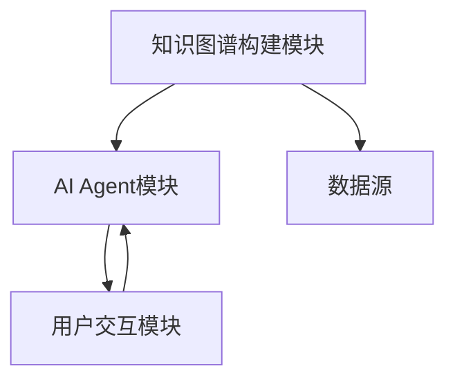
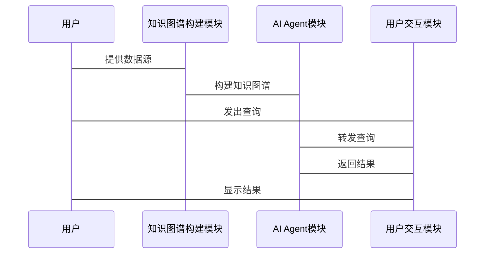

                 


# AI Agent在虚拟教师中的知识图谱应用

## 关键词：AI Agent，知识图谱，虚拟教师，教育技术，人工智能

## 摘要：
随着人工智能技术的快速发展，AI Agent在教育领域的应用逐渐成为研究热点。本文探讨AI Agent在虚拟教师中的知识图谱应用，从知识图谱的构建与管理、AI Agent的知识表示与推理、虚拟教师的具体应用场景等方面展开分析。文章详细介绍了知识图谱的基本概念、构建流程、存储技术、推理算法，以及在虚拟教师系统中的实际应用。同时，通过系统架构设计和项目实战，展示了如何将知识图谱应用于虚拟教师系统，以实现个性化教学和智能问答等功能。最后，本文总结了当前技术的挑战，并展望了未来的发展方向。

---

# 第1章: AI Agent与知识图谱概述

## 1.1 知识图谱的基本概念

### 1.1.1 知识图谱的定义与特点
知识图谱是一种以图结构表示知识的形式，由节点和边组成，节点代表实体或概念，边表示它们之间的关系。知识图谱具有以下特点：
- **结构化**：以图结构组织数据，便于计算机理解和推理。
- **语义丰富**：通过实体间的关系，构建复杂的语义网络。
- **可扩展性**：支持动态更新和扩展。

### 1.1.2 知识图谱的核心要素与结构
知识图谱的核心要素包括：
- **实体**：具体的人、事、物，如“课程”、“学生”。
- **属性**：描述实体的特征，如“课程编号”、“学生年龄”。
- **关系**：实体之间的关联，如“学生选修课程”。

知识图谱的结构通常由三元组（头实体、关系、尾实体）表示，例如：（学生，选修，课程）。

### 1.1.3 知识图谱与传统数据库的区别
传统数据库通常以关系型结构存储数据，而知识图谱更注重语义表达和实体间的关系，适合复杂知识的建模。

## 1.2 AI Agent的基本原理

### 1.2.1 AI Agent的定义与分类
AI Agent是一种智能体，能够感知环境、执行任务并做出决策。根据功能可分为：
- **简单反射型**：基于规则执行任务。
- **基于模型的反应型**：利用环境模型进行推理和决策。
- **实用器型**：基于效用函数优化决策。

### 1.2.2 AI Agent的核心功能与能力
AI Agent的核心功能包括：
- **感知环境**：通过传感器或数据接口获取信息。
- **知识表示**：将知识以结构化形式存储。
- **推理与决策**：基于知识进行推理并做出最优选择。
- **学习与自适应**：通过学习提升能力。

### 1.2.3 AI Agent与知识图谱的结合
知识图谱为AI Agent提供了丰富的知识库，AI Agent则利用这些知识进行推理和决策。

## 1.3 知识图谱在教育领域的应用前景

### 1.3.1 教育领域的知识图谱构建挑战
教育领域的知识图谱构建需要处理多学科知识，数据来源广泛，且知识点间关系复杂。

### 1.3.2 AI Agent在教育中的潜在价值
AI Agent可以为学生提供个性化的学习建议，帮助教师优化教学方案。

### 1.3.3 知识图谱与虚拟教师的结合场景
虚拟教师可以通过知识图谱实现知识点推理、智能问答等功能，提升教学效果。

## 1.4 本章小结
本章介绍了知识图谱和AI Agent的基本概念，并分析了它们在教育领域的应用前景，为后续章节奠定了基础。

---

# 第2章: 知识图谱的构建与管理

## 2.1 知识图谱构建的基本流程

### 2.1.1 数据采集与预处理
数据来源包括结构化数据（如数据库）和非结构化数据（如文本）。预处理步骤包括清洗、去重和格式转换。

**数据处理流程：**
1. 数据清洗：去除无效数据。
2. 数据格式转换：统一数据格式。
3. 数据去重：消除重复数据。

### 2.1.2 知识抽取与实体识别
知识抽取包括信息抽取（IE）、信息融合（IF）和信息扩展（IE）。实体识别是通过自然语言处理技术从文本中提取实体。

### 2.1.3 关系抽取与属性建模
关系抽取通过模式匹配或机器学习方法识别实体间的关系。属性建模将属性和关系规范化为统一的形式。

## 2.2 知识图谱的存储与管理

### 2.2.1 知识图谱的存储技术
常用的知识图谱存储技术包括：
- **RDF（Resource Description Framework）**：用于存储语义数据。
- **图数据库**：如Neo4j，支持高效的图结构查询。

### 2.2.2 知识图谱的查询与检索
查询语言如SPARQL用于在知识图谱中进行复杂查询。检索算法包括基于标签的传播和基于路径的查询。

### 2.2.3 知识图谱的动态更新与维护
动态更新需要考虑数据一致性和版本控制。维护过程包括数据清洗和增量更新。

## 2.3 知识图谱的质量评估与优化

### 2.3.1 知识图谱的质量指标
- **完整性**：覆盖所有相关知识点。
- **准确性**：数据的正确性。
- **一致性**：数据无矛盾。

### 2.3.2 知识图谱的清洗与优化方法
- **数据清洗**：去除错误或冗余数据。
- **规则优化**：通过预定义规则提升质量。

### 2.3.3 知识图谱的可扩展性设计
通过模块化设计和分层架构，提升知识图谱的扩展性。

## 2.4 本章小结
本章详细介绍了知识图谱的构建流程和管理方法，为后续章节的应用奠定了基础。

---

# 第3章: AI Agent的知识表示与推理

## 3.1 知识表示的基本方法

### 3.1.1 符号表示与语义网络
符号表示通过符号和规则表示知识，语义网络通过节点和边表示语义关系。

### 3.1.2 向量表示与分布式表示
向量表示将知识表示为向量，分布式表示通过词嵌入技术（如Word2Vec）生成向量。

### 3.1.3 知识图谱中的表示学习
表示学习通过神经网络学习实体和关系的向量表示，常用方法包括TransE、TransH等。

## 3.2 知识推理的原理与算法

### 3.2.1 基于规则的推理
通过预定义规则进行推理，例如（如果A，则B）。

### 3.2.2 基于逻辑的推理
利用逻辑推理（如演绎推理、归纳推理）进行知识推理。

### 3.2.3 基于机器学习的推理
使用深度学习模型（如RNN、Transformer）进行知识推理。

## 3.3 知识图谱中的推理优化

### 3.3.1 知识图谱的可解释性增强
通过可视化和规则优化提升推理的可解释性。

### 3.3.2 知识图谱的推理效率优化
采用分布式计算和增量推理提升推理效率。

### 3.3.3 知识图谱的动态推理与实时更新
通过实时更新和在线推理支持动态知识图谱的推理。

## 3.4 本章小结
本章分析了知识表示和推理的方法，为虚拟教师的知识图谱应用提供了理论基础。

---

# 第4章: 虚拟教师的知识图谱应用

## 4.1 虚拟教师的核心功能与需求

### 4.1.1 虚拟教师的定义与特点
虚拟教师是基于AI技术的智能教学系统，能够提供个性化的教学服务。

### 4.1.2 虚拟教师的知识表示需求
虚拟教师需要丰富的知识库支持教学任务。

### 4.1.3 虚拟教师的交互方式与能力
虚拟教师支持文本、语音等多种交互方式，并具备自主学习能力。

## 4.2 知识图谱在虚拟教师中的具体应用

### 4.2.1 基于知识图谱的个性化教学
通过分析学生的学习情况，提供个性化的学习建议。

### 4.2.2 基于知识图谱的知识点推理
通过知识图谱推理相关知识点，支持教学内容的扩展。

### 4.2.3 基于知识图谱的智能问答系统
利用知识图谱实现智能问答，提高教学效率。

## 4.3 虚拟教师的知识图谱构建与优化

### 4.3.1 教育领域知识图谱的构建方法
结合教育领域的特点，构建结构化的知识图谱。

### 4.3.2 虚拟教师知识图谱的动态更新
通过持续学习和数据反馈，动态更新知识图谱。

### 4.3.3 虚拟教师知识图谱的可扩展性设计
通过模块化设计和分层架构，提升知识图谱的扩展性。

## 4.4 本章小结
本章分析了知识图谱在虚拟教师中的具体应用，展示了其在教育领域的巨大潜力。

---

# 第5章: 系统架构与设计

## 5.1 系统架构设计概述

### 5.1.1 系统功能模块划分
系统功能模块包括：
- **知识图谱构建模块**：负责知识图谱的构建和管理。
- **AI Agent模块**：实现知识表示与推理。
- **用户交互模块**：处理用户输入和输出。

### 5.1.2 系统模块之间的关系
各模块通过接口进行数据交互，协同完成教学任务。

### 5.1.3 系统的可扩展性与可维护性设计
通过模块化设计和接口标准化，提升系统的可扩展性和可维护性。

## 5.2 系统架构图


## 5.3 系统接口设计

### 5.3.1 知识图谱构建接口
- 输入：数据源
- 输出：知识图谱

### 5.3.2 AI Agent接口
- 输入：用户查询
- 输出：推理结果

### 5.3.3 用户交互接口
- 输入：用户输入
- 输出：系统反馈

## 5.4 系统交互流程图


## 5.5 本章小结
本章通过系统架构设计和接口设计，展示了知识图谱在虚拟教师系统中的具体应用。

---

# 第6章: 项目实战

## 6.1 环境安装

### 6.1.1 安装Python
```bash
# 安装Python
sudo apt-get install python3
```

### 6.1.2 安装依赖库
```bash
pip install neo4j
pip install spacy
```

## 6.2 系统核心实现源代码

### 6.2.1 知识图谱构建代码
```python
from neo4j import GraphDatabase
from spacy.lang.en import English

nlp = English()

def extract_entities(text):
    doc = nlp(text)
    entities = set()
    for ent in doc.ents:
        entities.add(ent.text)
    return entities

def build_knowledge_graph(text):
    entities = extract_entities(text)
    # 连接Neo4j数据库
    driver = GraphDatabase.driver("bolt://localhost:7687", auth=("user", "password"))
    with driver.session() as session:
        for entity in entities:
            session.write_transaction(lambda tx: tx.run("CREATE (n:Entity {name: $name})", name=entity))
    driver.close()

build_knowledge_graph("学生选修课程")
```

### 6.2.2 AI Agent推理代码
```python
from neo4j import GraphDatabase

def query_knowledge_graph(query):
    driver = GraphDatabase.driver("bolt://localhost:7687", auth=("user", "password"))
    with driver.session() as session:
        result = session.read_transaction(lambda tx: tx.run(query))
    driver.close()
    return result

# 查询学生选修的课程
result = query_knowledge_graph("MATCH (s:Entity) WHERE s.name = '学生' RETURN s")
```

### 6.2.3 项目实战总结
通过实际案例展示了知识图谱在虚拟教师系统中的构建和应用过程。

## 6.3 本章小结
本章通过项目实战，展示了如何将知识图谱应用于虚拟教师系统，为读者提供了实践指导。

---

# 第7章: 总结与展望

## 7.1 本章总结
本文详细探讨了AI Agent在虚拟教师中的知识图谱应用，从知识图谱的构建与管理、AI Agent的知识表示与推理，到虚拟教师的具体应用场景，系统地分析了相关技术和实现方法。

## 7.2 当前技术的挑战
- 知识图谱的质量控制
- AI Agent的推理效率
- 系统的可扩展性

## 7.3 未来的发展方向
- 更加智能化的知识图谱构建方法
- 增强AI Agent的推理能力
- 推动知识图谱在教育领域的广泛应用

## 7.4 最佳实践 tips
- 在构建知识图谱时，需注重数据质量和可扩展性。
- AI Agent的设计应结合具体应用场景，注重实用性和可解释性。

## 7.5 本章小结
本文总结了知识图谱在虚拟教师中的应用，并展望了未来的发展方向，为读者提供了有益的指导。

---

# 结语
通过本文的系统分析和深入探讨，我们看到了知识图谱在虚拟教师中的巨大潜力。未来，随着技术的不断进步，AI Agent和知识图谱的结合将为教育领域带来更多创新和突破。

