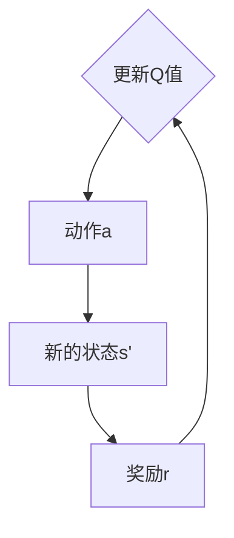
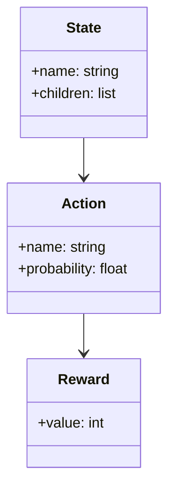
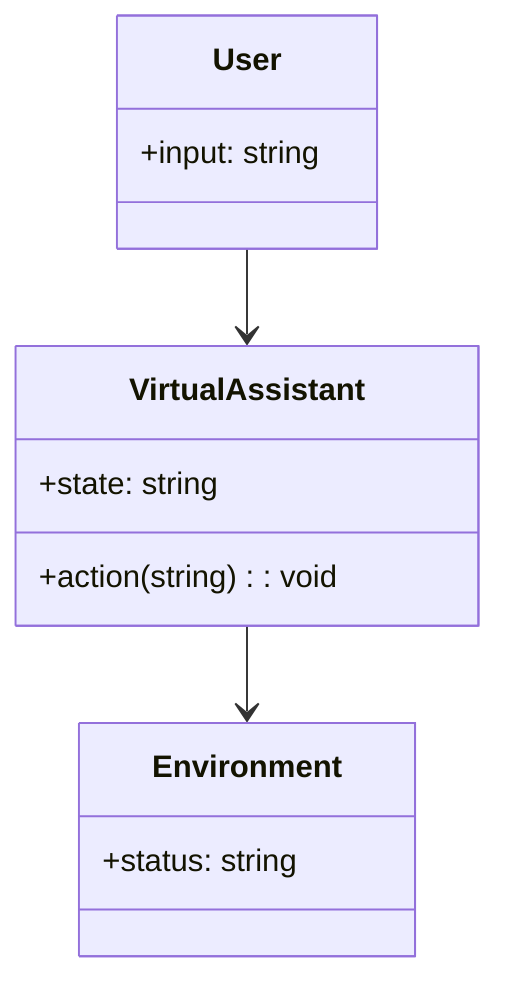
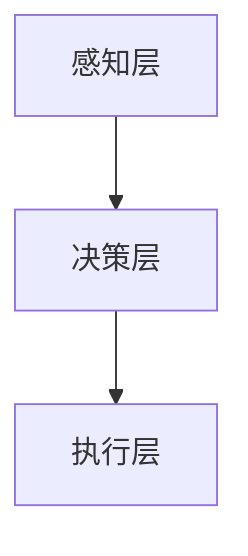
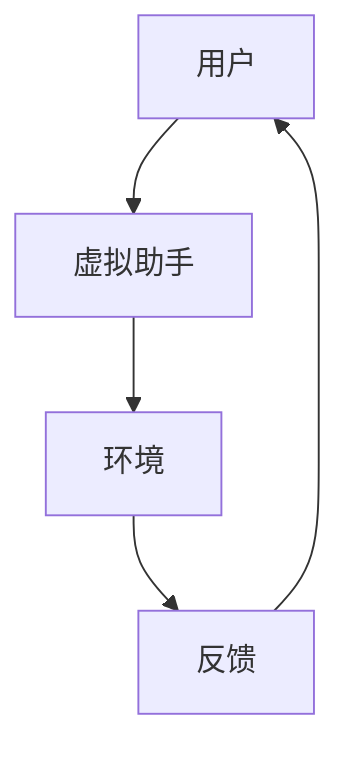

                 


# AI Agent在虚拟现实中的应用

## 关键词：AI Agent，虚拟现实，增强现实，人工智能，虚拟助手，交互设计

## 摘要：  
本文深入探讨了AI Agent在虚拟现实（VR）中的应用，从基本概念到核心原理，再到实际项目实现，全面解析了AI Agent如何提升虚拟现实的交互体验。文章首先介绍了AI Agent和虚拟现实的基本概念，然后分析了AI Agent在VR中的核心原理和算法，接着通过系统架构设计和项目实战，展示了如何将AI Agent应用于实际VR项目。最后，总结了当前的应用现状和未来的发展方向，为读者提供了全面的技术指南。

---

## 第一部分: AI Agent与虚拟现实概述

### 第1章: AI Agent与虚拟现实的基本概念

#### 1.1 AI Agent的基本概念
AI Agent（人工智能代理）是一种能够感知环境、做出决策并采取行动的智能实体。它可以分为简单反射型Agent、基于模型的反射型Agent、目标驱动型Agent和效用驱动型Agent四种类型。AI Agent的核心特征包括自主性、反应性、目标导向性和学习能力。

#### 1.2 虚拟现实的基本概念
虚拟现实（Virtual Reality，VR）是一种通过计算机技术模拟三维环境的技术，用户可以通过头显设备、手柄等设备与虚拟环境进行交互。VR的核心组成部分包括显示设备、定位追踪系统、交互设备和内容生成引擎。

#### 1.3 AI Agent与虚拟现实的结合
AI Agent在VR中的作用主要体现在智能化交互设计、实时环境适应和个性化用户体验三个方面。例如，在VR游戏中，AI Agent可以作为智能NPC（非玩家角色）与玩家进行互动；在虚拟助手场景中，AI Agent可以实时响应用户的语音指令并调整虚拟环境。

### 第2章: AI Agent在虚拟现实中的应用背景

#### 2.1 虚拟现实的发展现状
VR技术的发展经历了从简单图形界面到高度沉浸式体验的历程。当前，VR技术主要应用于游戏、教育培训、医疗仿真和工业设计等领域。未来，随着5G和AI技术的融合，VR的应用场景将更加广泛。

#### 2.2 AI Agent在VR中的应用背景
随着VR设备的普及和AI技术的快速发展，用户对VR系统的需求逐渐从单一的视觉体验向智能化交互体验转变。AI Agent的引入可以显著提升VR系统的智能化水平，例如实现动态环境适应和个性化服务推荐。

#### 2.3 本章小结
本章介绍了AI Agent和VR的基本概念，并分析了AI Agent在VR中的应用背景和潜在价值，为后续内容奠定了基础。

---

## 第二部分: AI Agent的核心原理与技术

### 第3章: AI Agent的核心原理

#### 3.1 AI Agent的基本原理
AI Agent的感知、决策和执行是其核心功能模块。感知模块通过传感器获取环境信息，决策模块基于感知数据做出最优决策，执行模块通过动作影响环境。例如，在VR游戏中，AI Agent可以通过视觉和听觉感知玩家的行为，并实时调整其动作策略。

#### 3.2 AI Agent的感知技术
AI Agent的感知技术包括视觉感知、听觉感知和多模态感知。视觉感知主要通过计算机视觉技术（如深度学习）实现，听觉感知主要通过语音识别技术实现。多模态感知则是结合视觉和听觉信息，进一步提升感知的准确性和鲁棒性。

#### 3.3 AI Agent的决策算法
AI Agent的决策算法主要包括基于规则的决策和基于学习的决策。基于规则的决策通过预定义的规则库实现，适用于规则清晰的场景；基于学习的决策通过强化学习、决策树等算法实现，适用于复杂动态环境。

---

### 第4章: AI Agent的算法原理与实现

#### 4.1 强化学习算法
强化学习是一种通过试错机制优化决策的算法。在VR中，强化学习可以用于AI Agent的路径规划和策略优化。例如，使用Q-learning算法训练AI Agent在虚拟迷宫中的最优路径。

**Q-learning算法公式：**
$$ Q(s,a) = r + \gamma \max_{a'} Q(s',a') $$

**Q-learning流程图：**


#### 4.2 决策树算法
决策树是一种通过树状结构进行决策的算法。在VR中，决策树可以用于AI Agent的多步骤决策，例如在虚拟客服场景中，根据用户的输入生成相应的回复策略。

**决策树类图：**


---

## 第三部分: AI Agent在虚拟现实中的系统设计与实现

### 第5章: 系统架构设计

#### 5.1 问题场景介绍
以一个VR虚拟助手项目为例，系统需要实现用户与虚拟助手之间的智能交互。用户可以通过语音指令控制虚拟助手完成任务，例如调整虚拟环境中的灯光亮度。

#### 5.2 系统功能设计
系统功能包括用户输入解析、环境状态感知、决策逻辑执行和用户反馈输出四个模块。通过领域模型类图可以清晰地展示各个模块之间的关系。

**领域模型类图：**


#### 5.3 系统架构设计
系统架构采用分层设计，包括感知层、决策层和执行层。感知层负责获取环境信息，决策层负责生成决策，执行层负责输出动作。

**系统架构图：**


#### 5.4 系统接口设计
系统接口包括用户输入接口、环境感知接口和执行输出接口。每个接口都需要定义明确的输入输出格式和调用方式。

#### 5.5 系统交互设计
系统交互采用基于语音的自然语言处理技术，用户可以通过语音指令与虚拟助手进行交互。交互流程图展示了从用户输入到系统响应的完整流程。

**交互流程图：**


---

### 第6章: 项目实战

#### 6.1 项目背景与目标
本项目旨在开发一个基于AI Agent的VR虚拟助手系统，实现用户与虚拟助手之间的智能交互。项目需求包括语音识别、环境感知和智能决策三大功能。

#### 6.2 环境搭建
项目采用Python作为开发语言，使用TensorFlow框架训练AI Agent的决策模型。同时，使用OpenCV库实现视觉感知功能。

#### 6.3 核心代码实现

**AI Agent决策模块代码：**
```python
import numpy as np
from tensorflow import keras

class AI-Agent:
    def __init__(self):
        self.model = self.build_model()

    def build_model(self):
        model = keras.Sequential([
            keras.layers.Dense(64, activation='relu', input_dim=10),
            keras.layers.Dense(32, activation='relu'),
            keras.layers.Dense(1, activation='sigmoid')
        ])
        model.compile(optimizer='adam', loss='binary_crossentropy', metrics=['accuracy'])
        return model

    def decide(self, state):
        # 简单决策逻辑，可以根据具体需求扩展
        if state == 'start':
            return 'action1'
        elif state == 'end':
            return 'action2'
        else:
            return 'action3'
```

**训练代码：**
```python
agent = AI-Agent()
# 假设X和y是训练数据
model.fit(X, y, epochs=10, batch_size=32)
```

#### 6.4 代码解读与分析
上述代码实现了AI Agent的决策模块，使用了一个简单的神经网络模型。在实际应用中，可以根据具体需求扩展模型的复杂度。例如，可以引入强化学习算法来优化决策模型。

#### 6.5 实际案例分析
以一个VR虚拟助手项目为例，系统可以通过语音识别获取用户的指令，并通过AI Agent的决策模块生成相应的动作。例如，当用户说“调暗灯光”，系统会通过AI Agent调用灯光调节接口，实现灯光亮度的降低。

#### 6.6 项目小结
本章通过一个实际项目展示了AI Agent在VR中的应用，从环境搭建到代码实现，详细讲解了系统设计和实现过程。

---

## 第四部分: 总结与展望

### 第7章: 总结与展望

#### 7.1 当前应用现状
当前，AI Agent在VR中的应用主要集中在游戏、教育培训和虚拟助手等领域。随着技术的不断进步，AI Agent在VR中的应用将更加广泛。

#### 7.2 未来发展方向
未来，AI Agent在VR中的发展方向包括多模态感知技术、强化学习算法优化和边缘计算应用。例如，通过多模态感知技术实现更逼真的虚拟交互体验。

#### 7.3 本章小结
本文总结了AI Agent在VR中的应用现状，并展望了未来的发展方向，为读者提供了更广阔的技术视野。

---

## 最佳实践 tips

- 在实际项目中，建议先从简单场景入手，逐步实现复杂功能。
- 注意数据质量和模型泛化能力的平衡，避免过拟合问题。
- 在系统设计阶段，建议绘制清晰的架构图和交互流程图，便于团队协作。

---

通过本文的系统讲解，读者可以全面了解AI Agent在虚拟现实中的应用，从理论到实践，掌握相关技术和实现方法。希望本文能为从事相关领域的读者提供有价值的参考和指导。

