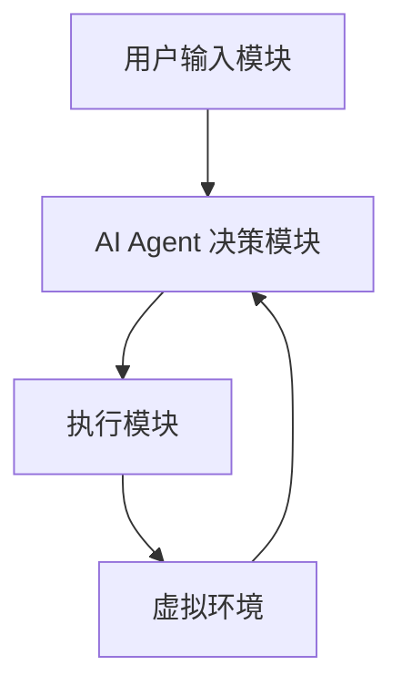
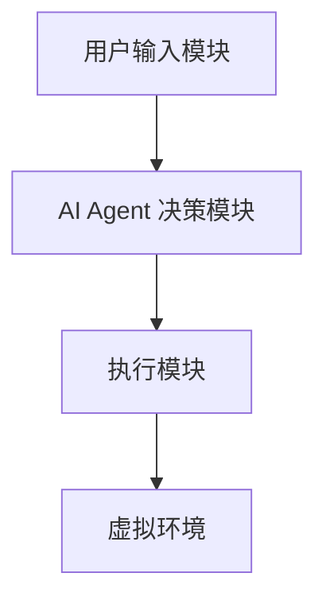

                 


# AI Agent在虚拟现实中的应用：沉浸式体验增强

---

## 关键词：
AI Agent, 虚拟现实, 沉浸式体验, 增强现实, 人工智能

---

## 摘要：
本文探讨了AI Agent在虚拟现实（VR）中的应用，重点分析了如何通过AI Agent提升沉浸式体验。从AI Agent的基本概念到其在VR系统中的核心算法，再到系统的架构设计，本文详细阐述了AI Agent如何增强用户的沉浸感。通过实际案例分析和代码实现，本文为读者提供了从理论到实践的全面指南。

---

# 第一部分: AI Agent与虚拟现实的背景介绍

## 第1章: AI Agent与虚拟现实的背景介绍

### 1.1 AI Agent的基本概念
#### 1.1.1 AI Agent的定义与特点
AI Agent（人工智能代理）是指能够感知环境、自主决策并执行任务的智能实体。其特点包括：
- **自主性**：能够在没有外部干预的情况下自主运作。
- **反应性**：能够实时感知环境并做出反应。
- **目标导向**：以特定目标为导向，优化决策过程。
- **学习能力**：通过学习提升自身的决策能力和行为效果。

#### 1.1.2 虚拟现实的基本概念与技术
虚拟现实（Virtual Reality，VR）是一种能够提供沉浸式体验的技术，通过计算机生成的三维环境，让用户获得身临其境的感觉。关键技术包括：
- **头显设备**：如 Oculus Rift、HTC Vive 等。
- **图形渲染**：通过高性能 GPU 实现逼真的三维图形渲染。
- **交互技术**：包括手柄、追踪系统等，让用户能够在虚拟环境中进行交互。

#### 1.1.3 AI Agent与虚拟现实的结合背景
随着 VR 技术的快速发展，用户对沉浸式体验的需求日益增长。然而，传统的 VR 系统主要依赖于固定的规则和脚本，缺乏灵活性和智能性。AI Agent 的引入为 VR 系统带来了更高的智能性和互动性，使其能够根据用户的实时行为和环境变化进行自适应调整。

---

## 第2章: AI Agent的基本原理

### 2.1 AI Agent的核心概念
#### 2.1.1 AI Agent的类型与分类
AI Agent 可以根据其智能性和行为模式进行分类：
- **反应式 AI Agent**：基于当前感知做出反应，不依赖于内部状态。
- **认知式 AI Agent**：具备复杂的状态管理、目标设定和推理能力。
- **协作式 AI Agent**：能够与其他 AI Agent 或人类进行协作。

#### 2.1.2 AI Agent的核心算法
AI Agent 的核心算法包括：
- **强化学习（Reinforcement Learning）**：通过奖励机制优化决策。
- **注意力机制（Attention Mechanism）**：聚焦于重要的环境信息。
- **生成对抗网络（GAN）**：用于生成逼真的虚拟内容。

#### 2.1.3 AI Agent的决策机制
AI Agent 的决策机制通常包括以下步骤：
1. **感知环境**：通过传感器或 API 获取环境信息。
2. **分析信息**：利用算法对信息进行处理和分析。
3. **制定决策**：基于分析结果生成行动计划。
4. **执行行动**：将决策转化为具体的操作。

---

## 第3章: AI Agent在虚拟现实中的核心算法

### 3.1 强化学习算法
#### 3.1.1 强化学习的基本原理
强化学习是一种通过试错机制优化决策的算法。其基本原理如下：
1. **环境感知**：AI Agent 通过传感器感知环境状态。
2. **动作选择**：基于当前状态选择一个动作。
3. **奖励反馈**：根据动作的结果获得奖励或惩罚。
4. **策略优化**：根据奖励调整策略，优化未来的决策。

#### 3.1.2 在虚拟现实中的应用实例
在 VR 中，强化学习可以用于训练 AI Agent 学会如何与用户互动。例如，一个虚拟助手可以通过强化学习学会如何根据用户的情绪和行为调整其回答方式。

#### 3.1.3 算法实现的数学模型
强化学习的核心数学模型包括状态值函数（Value Function）和策略函数（Policy Function）。状态值函数用于评估某个状态下采取某动作的期望收益，策略函数用于确定在某个状态下采取某动作的概率。

数学模型示例：
- 状态值函数：$$ V(s) = \max_{a} [r + \gamma V(s') ] $$
- 策略函数：$$ \pi(a|s) = \text{softmax}(\theta^T \phi(s,a)) $$

---

## 第4章: AI Agent与虚拟现实的系统架构

### 4.1 系统架构设计
#### 4.1.1 系统功能模块划分
一个典型的 AI Agent 驱动的 VR 系统可以划分为以下几个功能模块：
- **用户输入模块**：接收用户的输入，如手柄操作、语音指令等。
- **环境感知模块**：通过传感器或 API 感知虚拟环境的状态。
- **AI Agent 决策模块**：根据环境信息和用户输入生成行动计划。
- **执行模块**：将决策转化为具体的操作，如移动角色、调整场景等。

#### 4.1.2 系统组件之间的关系
系统组件之间的关系可以用以下 Mermaid 图表示：



#### 4.1.3 系统架构的优缺点分析
- **优点**：灵活性高、适应性强、能够实现实时互动。
- **缺点**：开发复杂度高、对硬件要求高、需要大量的训练数据。

### 4.2 系统接口设计
#### 4.2.1 用户与AI Agent的交互接口
用户与 AI Agent 的交互接口包括：
- **视觉界面**：如 HUD（ heads-up display ）显示提示信息。
- **语音交互**：通过语音命令与 AI Agent 互动。
- **手势交互**：通过手势识别技术实现交互。

#### 4.2.2 系统内部组件之间的接口
系统内部组件之间的接口可以用以下 Mermaid 图表示：



#### 4.2.3 接口设计的注意事项
- **简洁性**：接口设计应尽量简洁，避免过多的功能叠加。
- **兼容性**：确保接口能够兼容不同的设备和平台。
- **实时性**：接口设计应考虑实时交互的需求。

### 4.3 系统交互流程
#### 4.3.1 用户发起请求
用户通过手柄或语音命令向系统发起请求。

#### 4.3.2 AI Agent处理请求
AI Agent 接收用户的请求，分析环境信息，生成行动计划。

#### 4.3.3 执行模块执行操作
执行模块根据 AI Agent 的决策执行具体的操作，如移动角色、调整场景等。

#### 4.3.4 系统反馈
系统将执行结果反馈给用户，用户可以根据反馈继续操作或调整需求。

---

## 第5章: 项目实战

### 5.1 环境搭建
要实现一个 AI Agent 驱动的 VR 系统，需要以下环境：
- **硬件**：高性能计算机、VR 头显设备、手柄等。
- **软件**：Python、TensorFlow、OpenCV、Unity 或 Unreal Engine。

### 5.2 核心代码实现
以下是一个简单的强化学习算法的 Python 实现示例：

```python
import numpy as np
import gym

# 初始化环境
env = gym.make('CartPole-v0')
env.seed(1)

# 初始化参数
theta = np.random.randn(4, 1)
alpha = 0.1
gamma = 0.99

# 强化学习算法
for episode in range(1000):
    state = env.reset()
    total_reward = 0
    done = False
    while not done:
        # 计算动作概率
        action_probs = np.exp(theta.T.dot(state)) / np.sum(np.exp(theta.T.dot(state)))
        # 选择动作
        action = np.random.choice(2, p=action_probs)
        # 执行动作
        next_state, reward, done, _ = env.step(action)
        # 计算损失
        target = reward + gamma * np.max(theta.T.dot(next_state))
        loss = target - theta.T.dot(state)
        # 更新参数
        theta += alpha * loss
        total_reward += reward
    print(f'Episode {episode}, Total Reward: {total_reward}')
```

### 5.3 案例分析与优化建议
通过上述代码实现的强化学习算法，可以在虚拟环境中训练 AI Agent 学会如何控制小车保持平衡。优化建议包括：
- **增加训练次数**：通过更多的训练数据提升算法的稳定性。
- **优化算法参数**：调整学习率和折扣因子，找到最佳参数组合。
- **引入复杂环境**：在虚拟环境中增加更多的障碍和目标，提升算法的适应性。

### 5.4 项目小结
通过本次项目实战，我们了解了如何将强化学习算法应用于虚拟现实系统中。通过代码实现和案例分析，我们掌握了 AI Agent 在 VR 系统中的核心算法和实现方法。

---

## 第6章: 总结与展望

### 6.1 总结
本文详细探讨了 AI Agent 在虚拟现实中的应用，从基本概念到核心算法，再到系统架构，全面分析了如何通过 AI Agent 提升沉浸式体验。通过实际案例分析和代码实现，我们掌握了 AI Agent 在 VR 系统中的实现方法。

### 6.2 未来展望
随着 AI 技术的不断发展，AI Agent 在虚拟现实中的应用前景广阔。未来的研究方向包括：
- **更智能的 AI Agent**：通过深度学习和强化学习的结合，提升 AI Agent 的智能性和适应性。
- **更逼真的虚拟环境**：通过生成对抗网络（GAN）生成逼真的虚拟内容，进一步提升沉浸式体验。
- **更高效的交互方式**：探索更自然的交互方式，如脑机接口（BCI），进一步提升用户体验。

---

## 第7章: 最佳实践 tips

### 7.1 小结
AI Agent 在虚拟现实中的应用为沉浸式体验的提升提供了新的可能性。通过本文的分析和实践，我们掌握了 AI Agent 的基本原理和实现方法。

### 7.2 注意事项
- **数据质量**：AI Agent 的性能依赖于数据质量，确保训练数据的多样性和代表性。
- **算法选择**：根据具体需求选择合适的算法，避免盲目追求复杂性。
- **系统优化**：通过优化系统架构和算法参数，提升系统的运行效率和用户体验。

### 7.3 拓展阅读
- **《强化学习入门》**：深入理解强化学习的基本原理和实现方法。
- **《生成对抗网络实战》**：学习如何使用 GAN 生成逼真的虚拟内容。
- **《虚拟现实系统设计》**：掌握 VR 系统的设计原则和实现技巧。

---

通过本文的系统讲解和实战分析，读者可以全面掌握 AI Agent 在虚拟现实中的应用，为未来的沉浸式体验增强打下坚实的基础。

