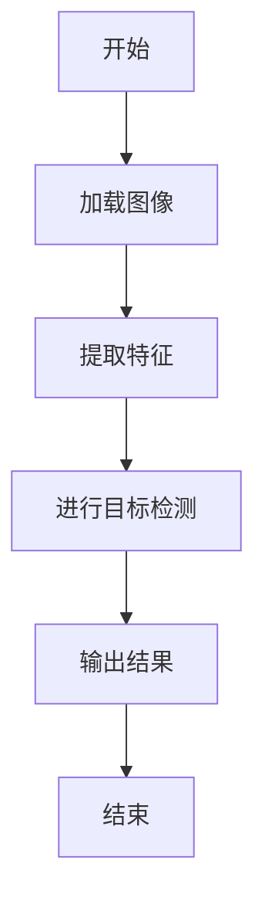
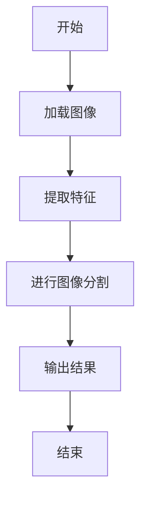
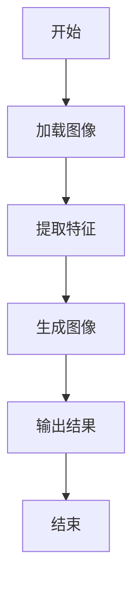
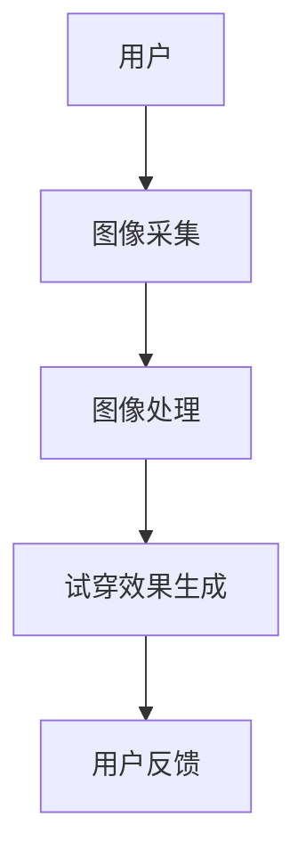
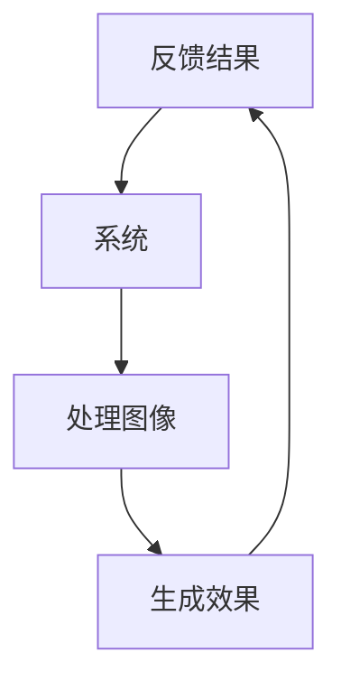

                 


# AI Agent在虚拟试衣中的图像处理

> 关键词：AI Agent、虚拟试衣、图像处理、目标检测、图像分割、深度学习

> 摘要：本文详细探讨了AI Agent在虚拟试衣中的图像处理技术，涵盖核心概念、算法原理、系统架构、项目实战及优化与提升。通过分析AI Agent与传统算法的差异，结合实际案例，阐述了基于深度学习的目标检测、图像分割和图像生成算法在虚拟试衣中的应用，最终提出了一套完整的系统架构方案和优化策略。

---

# 第一部分: AI Agent与虚拟试衣概述

## 第1章: 背景介绍

### 1.1 问题背景

#### 1.1.1 虚拟试衣的定义与现状
虚拟试衣是一种通过计算机视觉和人工智能技术，让用户在线上环境中试穿衣物的虚拟体验。随着电子商务的快速发展，虚拟试衣技术在提升用户体验、降低退货率方面发挥了重要作用。然而，传统的虚拟试衣技术在图像处理和用户交互方面存在诸多局限性。

#### 1.1.2 AI Agent在虚拟试衣中的作用
AI Agent（智能体）通过实时分析用户的试穿数据，优化试衣体验。其主要作用包括：
1. 自动调整衣物尺寸以匹配用户体型。
2. 实时反馈试穿效果，提供个性化建议。
3. 提供多角度的试穿视角，提升用户体验。

#### 1.1.3 当前技术的局限性与挑战
当前虚拟试衣技术面临以下挑战：
1. 图像处理精度不足，导致试穿效果不准确。
2. 用户交互延迟较高，影响用户体验。
3. 多样化衣物模型的处理效率有待提升。

### 1.2 问题描述

#### 1.2.1 虚拟试衣的核心问题
虚拟试衣的核心问题在于如何通过图像处理技术，实现精准的衣物试穿效果。具体包括：
1. 如何准确识别用户的体型特征。
2. 如何实时生成高质量的试穿图像。
3. 如何优化试穿效果的反馈机制。

#### 1.2.2 AI Agent在图像处理中的应用
AI Agent通过图像处理技术实现以下功能：
1. 基于深度学习的目标检测，识别用户的体型特征。
2. 基于图像分割技术，生成试穿效果的虚拟模型。
3. 基于图像生成技术，优化试穿效果的视觉呈现。

#### 1.2.3 用户需求与系统目标
用户需求包括：
1. 高精度的试穿效果。
2. 实时的试穿反馈。
3. 多角度的试穿视角。

系统目标包括：
1. 实现高精度的图像处理。
2. 提供实时的用户反馈。
3. 优化系统的运行效率。

### 1.3 问题解决

#### 1.3.1 AI Agent的核心功能
AI Agent在虚拟试衣中的核心功能包括：
1. 用户体型特征的自动识别。
2. 试穿效果的实时生成。
3. 多角度试穿效果的优化。

#### 1.3.2 图像处理的关键技术
图像处理的关键技术包括：
1. 基于深度学习的目标检测。
2. 基于图像分割的虚拟模型生成。
3. 基于图像生成的试穿效果优化。

#### 1.3.3 解决方案的可行性分析
解决方案的可行性分析包括：
1. 技术可行性：基于深度学习的目标检测和图像分割技术已较为成熟。
2. 用户可行性：实时反馈的试穿效果能够提升用户体验。
3. 经济可行性：AI Agent的部署成本相对较低。

### 1.4 概念结构与核心要素

#### 1.4.1 AI Agent的系统架构
AI Agent的系统架构包括：
1. 用户端：负责接收用户的试穿请求。
2. 云端：负责处理图像数据并生成试穿效果。
3. 反馈端：负责将试穿效果反馈给用户。

#### 1.4.2 图像处理的流程
图像处理的流程包括：
1. 用户图像采集。
2. 图像特征提取。
3. 试穿效果生成。
4. 试穿效果反馈。

#### 1.4.3 核心要素的组成与关系
核心要素的组成与关系包括：
1. 用户：试穿请求的发起者。
2. 图像数据：试穿效果的输入。
3. AI Agent：试穿效果的生成者。
4. 试穿效果：用户的视觉反馈。

---

## 第2章: 核心概念与联系

### 2.1 AI Agent的原理

#### 2.1.1 AI Agent的基本原理
AI Agent的基本原理包括：
1. 用户输入试穿请求。
2. AI Agent接收请求并分析图像数据。
3. AI Agent生成试穿效果并反馈给用户。

#### 2.1.2 基于图像处理的AI Agent实现
基于图像处理的AI Agent实现包括：
1. 图像特征提取。
2. 图像分割。
3. 图像生成。

#### 2.1.3 AI Agent与虚拟试衣的结合
AI Agent与虚拟试衣的结合包括：
1. 实现精准的试穿效果。
2. 提供实时的用户反馈。
3. 优化试穿效果的视觉呈现。

### 2.2 核心概念对比

#### 2.2.1 AI Agent与传统算法的对比
AI Agent与传统算法的对比包括：
| 对比维度 | AI Agent | 传统算法 |
|----------|----------|----------|
| 精度     | 高       | 一般     |
| 实时性   | 实时     | 非实时   |
| 可扩展性 | 高       | 低       |

#### 2.2.2 图像处理技术的对比
图像处理技术的对比包括：
| 对比维度 | 目标检测 | 图像分割 | 图像生成 |
|----------|----------|----------|----------|
| 精度     | 高       | 高       | 高       |
| 实时性   | 中       | 中       | 低       |
| 可扩展性 | 高       | 高       | 高       |

#### 2.2.3 虚拟试衣系统与其他应用的对比
虚拟试衣系统与其他应用的对比包括：
| 对比维度 | 虚拟试衣 | 电子商务 | 游戏开发 |
|----------|----------|----------|----------|
| 图像处理 | 高       | 中       | 高       |
| 用户交互 | 高       | 中       | 高       |
| 精度要求 | 高       | 中       | 高       |

### 2.3 ER实体关系图

#### 2.3.1 实体关系图的绘制
```mermaid
erDiagram
    user}+---{request
    request}+---{image
    image}+---{segment
    segment}+---{detection
    detection}+---{result
```

#### 2.3.2 实体关系的详细描述
- `user`：用户，发起试穿请求。
- `request`：试穿请求，包括用户的基本信息。
- `image`：用户图像，用于生成试穿效果。
- `segment`：图像分割结果。
- `detection`：目标检测结果。
- `result`：试穿效果结果。

#### 2.3.3 实体关系图的作用
实体关系图用于描述系统中的实体及其关系，帮助理解系统架构和数据流。

---

## 第3章: 算法原理讲解

### 3.1 算法原理

#### 3.1.1 基于深度学习的目标检测算法
目标检测算法用于识别用户图像中的关键特征。

#### 3.1.2 图像分割算法
图像分割算法用于生成试穿效果的虚拟模型。

#### 3.1.3 基于图像生成的虚拟试衣技术
图像生成算法用于优化试穿效果的视觉呈现。

### 3.2 算法流程图

#### 3.2.1 目标检测流程图


#### 3.2.2 图像分割流程图


#### 3.2.3 图像生成流程图


### 3.3 算法实现

#### 3.3.1 Python源代码实现
目标检测算法的Python实现：
```python
import cv2
def detect_object(image):
    # 加载预训练模型
    net = cv2.dnn.readNet("yolov4.weights", "yolov4.cfg")
    # 获取图像的宽度和高度
    height, width = image.shape[:2]
    # 创建blob输入
    blob = cv2.dnn.blobFromImage(image, 1/255, (416, 416), swapRB=True, crop=False)
    # 前向传播
    net.setInput(blob)
    # 获取输出层名称
    output_layers = net.getUnconnectedOutLayersNames()
    # 前向传播并获取结果
    outputs = net.forward(output_layers)
    # 解析结果
    for output in outputs:
        for detection in output:
            # 解析检测结果
            pass
    return result
```

#### 3.3.2 算法的数学模型与公式
目标检测的数学模型：
$$
\text{损失函数} = \lambda_1 \text{分类损失} + \lambda_2 \text{定位损失}
$$

---

## 第4章: 系统分析与架构设计

### 4.1 系统架构设计

#### 4.1.1 系统功能设计
系统功能设计包括：
- 用户图像采集模块
- 图像处理模块
- 试穿效果生成模块
- 用户反馈模块

#### 4.1.2 系统架构图


### 4.2 系统交互设计

#### 4.2.1 系统交互流程
系统交互流程包括：
1. 用户发起试穿请求。
2. 系统接收请求并采集图像数据。
3. 系统处理图像数据并生成试穿效果。
4. 系统将试穿效果反馈给用户。

#### 4.2.2 系统交互流程图


### 4.3 系统接口设计

#### 4.3.1 接口描述
- 输入接口：用户图像数据
- 输出接口：试穿效果数据
- 反馈接口：用户反馈数据

#### 4.3.2 接口交互流程
1. 用户通过输入接口提交图像数据。
2. 系统处理图像数据并生成试穿效果。
3. 系统通过反馈接口将试穿效果反馈给用户。

---

## 第5章: 项目实战

### 5.1 项目介绍

#### 5.1.1 项目背景
本项目旨在通过AI Agent实现虚拟试衣的图像处理功能。

#### 5.1.2 项目目标
1. 实现高精度的目标检测。
2. 实现实时的图像分割。
3. 优化试穿效果的生成过程。

### 5.2 系统核心实现

#### 5.2.1 环境安装
- Python 3.8+
- OpenCV
- TensorFlow
- YOLOv4

#### 5.2.2 核心代码实现
目标检测代码：
```python
import cv2
def detect_object(image):
    # 加载预训练模型
    net = cv2.dnn.readNet("yolov4.weights", "yolov4.cfg")
    # 获取图像的宽度和高度
    height, width = image.shape[:2]
    # 创建blob输入
    blob = cv2.dnn.blobFromImage(image, 1/255, (416, 416), swapRB=True, crop=False)
    # 前向传播
    net.setInput(blob)
    # 获取输出层名称
    output_layers = net.getUnconnectedOutLayersNames()
    # 前向传播并获取结果
    outputs = net.forward(output_layers)
    # 解析结果
    result = []
    for output in outputs:
        for detection in output:
            # 解析检测结果
            pass
    return result
```

#### 5.2.3 代码应用解读与分析
目标检测代码解析：
1. 加载预训练模型。
2. 创建blob输入。
3. 前向传播并获取结果。
4. 解析检测结果并返回。

### 5.3 实际案例分析

#### 5.3.1 案例背景
用户上传一张试穿请求图像。

#### 5.3.2 处理过程
1. 系统接收图像数据。
2. 系统进行目标检测。
3. 系统生成试穿效果。
4. 系统反馈试穿效果给用户。

#### 5.3.3 案例分析
通过案例分析，验证系统的处理能力。

### 5.4 项目小结

#### 5.4.1 项目总结
总结项目的实现过程和成果。

#### 5.4.2 经验与教训
总结项目中的经验和教训。

---

## 第6章: 优化与提升

### 6.1 算法优化

#### 6.1.1 算法性能优化
通过模型压缩和优化算法提升处理效率。

#### 6.1.2 系统性能优化
通过分布式训练和并行计算优化系统性能。

### 6.2 实时反馈机制

#### 6.2.1 实时反馈的实现
通过优化算法实现实时反馈。

#### 6.2.2 反馈机制的优化
通过改进反馈机制提升用户体验。

### 6.3 系统优化方案

#### 6.3.1 系统架构优化
优化系统架构以提升处理效率。

#### 6.3.2 系统接口优化
优化系统接口以提升用户体验。

---

## 第7章: 总结与展望

### 7.1 总结

#### 7.1.1 核心观点总结
总结AI Agent在虚拟试衣中的图像处理技术。

#### 7.1.2 主要结论
总结项目的实现成果和意义。

### 7.2 展望

#### 7.2.1 未来发展方向
展望AI Agent在虚拟试衣中的未来发展方向。

#### 7.2.2 拓展研究
提出进一步研究的方向和建议。

### 7.3 最佳实践 Tips

#### 7.3.1 实践建议
给出实际应用中的建议。

#### 7.3.2 注意事项
提醒读者注意的问题。

#### 7.3.3 拓展阅读
推荐相关领域的拓展阅读材料。

---

# 附录

## 附录A: 术语表

## 附录B: 参考文献

## 附录C: 工具安装指南

## 附录D: 源代码清单

---

# 结束语

感谢您的阅读！希望本文对您理解AI Agent在虚拟试衣中的图像处理技术有所帮助。如需进一步探讨或合作，请随时联系！

