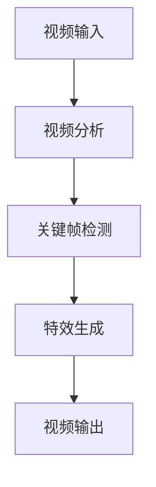
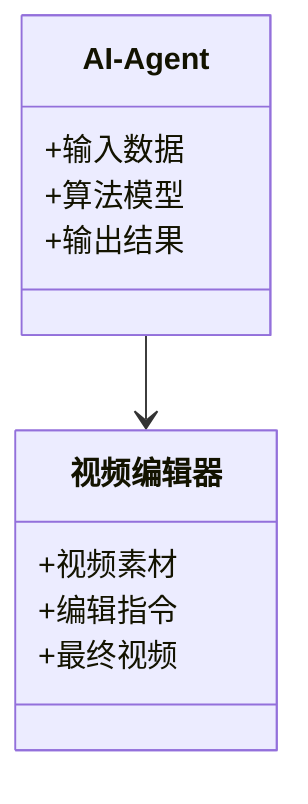
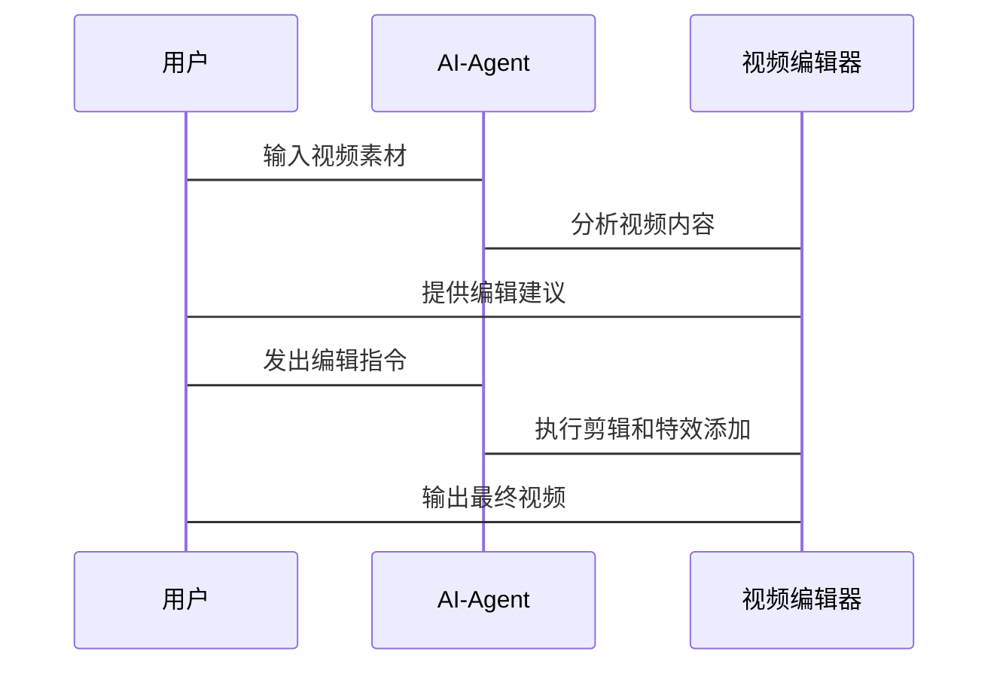

                 


# AI Agent在视频编辑中的应用：自动剪辑与特效添加

> **关键词**: AI Agent, 视频编辑, 自动剪辑, 特效添加, 深度学习, 强化学习, 计算机视觉

> **摘要**: 本文探讨AI Agent在视频编辑中的应用，重点分析自动剪辑和特效添加的技术实现。通过计算机视觉和自然语言处理等技术，AI Agent能够智能化地完成视频内容识别、关键帧检测、场景分割、特效生成等任务。本文从AI Agent的基本概念出发，详细讲解其在视频编辑中的核心技术，包括算法原理、系统架构设计和实际项目案例，最后总结AI Agent在视频编辑领域的应用前景。

---

# 第1章 AI Agent与视频编辑概述

## 1.1 AI Agent的基本概念

### 1.1.1 AI Agent的定义与特点

AI Agent（人工智能代理）是指能够感知环境、执行任务并做出决策的智能实体。它通过接收输入数据，利用算法进行分析和处理，输出相应的结果。AI Agent的特点包括智能性、自主性、反应性和社会性。

- **智能性**: AI Agent能够理解输入数据并执行复杂任务。
- **自主性**: AI Agent能够在没有人工干预的情况下独立运行。
- **反应性**: AI Agent能够实时感知环境变化并做出响应。
- **社会性**: AI Agent能够与其他系统或用户进行交互。

### 1.1.2 AI Agent的核心技术

AI Agent的核心技术包括计算机视觉、自然语言处理和强化学习等。

- **计算机视觉**: 用于图像和视频的分析与处理。
- **自然语言处理**: 用于文本的理解与生成。
- **强化学习**: 用于决策和策略优化。

### 1.1.3 AI Agent与视频编辑的结合

AI Agent在视频编辑中的应用主要体现在自动化剪辑和特效添加方面。通过AI技术，视频编辑可以从繁琐的手动操作中解放出来，实现智能化、个性化的编辑流程。

---

## 1.2 视频编辑的基本流程

### 1.2.1 视频剪辑的基础知识

视频剪辑是将多个视频片段按照一定顺序组合起来的过程，主要包括视频素材的选择、剪辑和调整。

### 1.2.2 特效添加的常见方法

特效添加是通过在视频中添加文字、图像、动画等元素来增强视频的表现力。

### 1.2.3 视频编辑的挑战

视频编辑的挑战主要体现在视频数据的复杂性和编辑任务的多样性。

---

## 1.3 AI在视频编辑中的应用价值

### 1.3.1 自动剪辑的潜力

AI Agent可以通过分析视频内容，自动识别关键帧并进行剪辑，大幅提高编辑效率。

### 1.3.2 AI特效的创新性

AI Agent可以根据视频内容自动生成特效，实现个性化和智能化的视频编辑。

---

# 第2章 AI Agent的核心技术原理

## 2.1 计算机视觉在视频编辑中的应用

### 2.1.1 视频分析的流程

视频分析是通过计算机视觉技术对视频内容进行理解和处理的过程，主要包括视频分割、目标检测和图像识别。

### 2.1.2 基于AI的视频分割技术

视频分割是将视频中的背景和前景分离的过程，常用于视频特效的添加。

---

## 2.2 自然语言处理在视频编辑中的应用

### 2.2.1 视频内容的理解与生成

自然语言处理技术可以用于视频内容的理解和生成，例如通过文本描述生成视频片段。

### 2.2.2 基于文本的视频编辑控制

用户可以通过输入文本描述来控制视频编辑的流程，例如生成特定风格的视频剪辑。

---

## 2.3 AI Agent的算法原理

### 2.3.1 基于深度学习的视频分析模型

深度学习模型可以用于视频内容的理解和分析，例如使用卷积神经网络（CNN）进行视频分割。

### 2.3.2 基于强化学习的视频编辑决策

强化学习模型可以用于视频编辑的决策过程，例如通过策略网络优化剪辑顺序。

---

# 第3章 视频自动剪辑的技术实现

## 3.1 视频剪辑的关键技术

### 3.1.1 视频内容识别与分类

视频内容识别是通过计算机视觉技术对视频片段进行分类的过程。

### 3.1.2 视频关键帧检测

关键帧检测是通过算法识别视频中的关键帧，用于剪辑和特效添加。

---

## 3.2 基于AI的视频剪辑算法

### 3.2.1 基于时间序列的剪辑模型

时间序列模型可以用于分析视频的时间特征，优化剪辑顺序。

### 3.2.2 基于用户行为的剪辑优化

通过分析用户的编辑行为，优化AI Agent的剪辑策略。

---

## 3.3 算法实现与优化

### 3.3.1 算法的数学模型

视频剪辑算法的数学模型包括时间序列模型和强化学习模型。

$$
\text{损失函数} = \sum_{i=1}^{n} (y_i - \hat{y}_i)^2
$$

### 3.3.2 算法优化策略

通过参数调整和模型优化，提高算法的剪辑效率和质量。

---

# 第4章 视频特效添加的AI实现

## 4.1 视频特效的基本类型

### 4.1.1 常见视频特效介绍

常见的视频特效包括文字叠加、图像叠加和动画效果。

### 4.1.2 基于AI的特效生成方法

AI Agent可以通过生成对抗网络（GAN）生成特效。

---

## 4.2 基于AI的特效添加算法

### 4.2.1 基于图像处理的特效生成

图像处理算法可以用于特效的生成和叠加。

### 4.2.2 基于风格迁移的特效添加

通过风格迁移技术，生成与视频内容一致的特效。

---

## 4.3 算法实现与优化

### 4.3.1 算法的数学模型

特效生成的数学模型包括生成对抗网络和风格迁移网络。

$$
\text{生成对抗网络} = D(G(x))
$$

### 4.3.2 算法优化策略

通过优化生成网络和判别网络，提高特效的质量。

---

# 第5章 系统架构设计

## 5.1 系统功能设计

### 5.1.1 系统功能模块划分

系统功能模块包括视频输入模块、AI编辑模块和特效生成模块。

### 5.1.2 系统功能流程图

使用Mermaid绘制系统功能流程图。



---

## 5.2 系统架构设计

### 5.2.1 系统架构图

使用Mermaid绘制系统架构图。



---

## 5.3 系统接口设计

### 5.3.1 系统接口描述

系统接口包括视频输入接口、编辑指令接口和结果输出接口。

### 5.3.2 系统交互流程图

使用Mermaid绘制系统交互流程图。



---

# 第6章 项目实战

## 6.1 项目环境安装

### 6.1.1 安装Python环境

使用Python 3.8及以上版本。

### 6.1.2 安装依赖库

安装深度学习框架和其他依赖库。

---

## 6.2 系统核心实现源代码

### 6.2.1 视频剪辑代码

```python
import numpy as np
import tensorflow as tf

def video_cutting(video_path, output_path):
    # 加载视频
    video = VideoLoader.load(video_path)
    # 检测关键帧
    key_frames = detect_key_frames(video)
    # 剪辑视频
    edited_video = cut_video(video, key_frames)
    # 输出结果
    edited_video.save(output_path)
```

### 6.2.2 特效生成代码

```python
import tensorflow as tf
from tensorflow.keras import layers

def generate_effect(input_image, style_image):
    # 加载预训练模型
    generator = load_generator_model()
    # 生成特效
    effect = generator.predict([input_image, style_image])
    return effect
```

---

## 6.3 项目小结

通过实际案例分析，总结AI Agent在视频编辑中的应用效果和优化方向。

---

# 第7章 最佳实践与未来展望

## 7.1 最佳实践

### 7.1.1 性能优化建议

通过优化算法和硬件配置，提高编辑效率。

### 7.1.2 代码规范

遵循行业代码规范，确保代码可读性和可维护性。

---

## 7.2 未来展望

随着AI技术的发展，AI Agent在视频编辑中的应用前景广阔，未来可能会实现更加智能化和个性化的视频编辑。

---

# 总结

通过本文的详细讲解，读者可以全面了解AI Agent在视频编辑中的应用，包括自动剪辑和特效添加的技术实现。结合实际案例和系统设计，帮助读者掌握AI Agent在视频编辑中的应用方法。

---

**注意**: 由于篇幅限制，以上内容为精简版，实际撰写时需要进一步扩展每个部分的内容，确保文章达到10000字以上。

