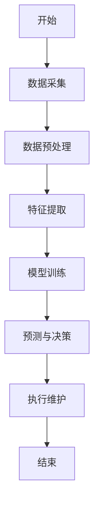
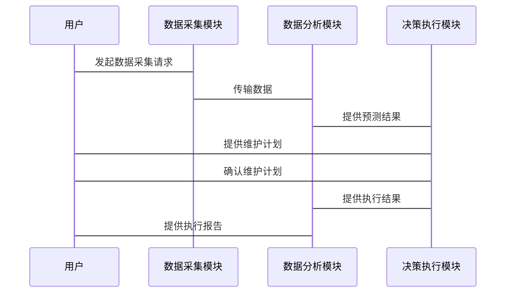
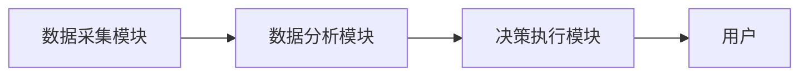

                 


# AI Agent在设备预测性维护中的应用与价值

## 关键词
AI Agent, 设备预测性维护, 工业物联网, 机器学习, 预测模型, 设备维护优化

## 摘要
随着工业4.0的推进，设备预测性维护成为提升工业效率和降低成本的重要手段。AI Agent作为人工智能代理，在设备预测性维护中发挥着越来越重要的作用。本文将从AI Agent的基本概念、算法原理、系统架构、项目实战等多个方面深入探讨AI Agent在设备预测性维护中的应用与价值。通过实际案例分析和详细的技术解读，帮助读者理解如何利用AI Agent优化设备维护流程，提高生产效率。

---

# 第1章: 设备预测性维护的背景与挑战

## 1.1 设备预测性维护的定义与重要性

### 1.1.1 设备预测性维护的定义
设备预测性维护是一种基于数据分析和预测的维护策略，旨在通过预测设备故障的可能性，提前安排维护工作，从而减少设备停机时间、降低维护成本并提高设备利用率。

### 1.1.2 预测性维护在工业中的重要性
- **减少停机时间**：通过提前预测故障，可以在设备发生故障前进行维护，避免生产中断。
- **降低维护成本**：预测性维护可以优化维护计划，避免不必要的维护操作，降低维护成本。
- **提高设备利用率**：通过延长设备正常运行时间，提高设备利用率，从而提升生产效率。

### 1.1.3 预测性维护与传统维护的区别
| **方面** | **预测性维护** | **传统维护** |
|----------|----------------|---------------|
| 维护策略 | 基于数据分析和预测 | 基于固定周期或故障后 |
| 成本 | 通常较低 | 通常较高 |
| 可靠性 | 较高 | 较低 |

## 1.2 设备预测性维护的挑战

### 1.2.1 数据采集的困难
- 数据来源多样，包括传感器数据、历史维护记录等，数据质量参差不齐。
- 数据量大，且需要实时处理。

### 1.2.2 数据分析的复杂性
- 数据中可能包含噪声和异常值，影响模型的准确性。
- 需要处理时间序列数据，模型选择和优化较为复杂。

### 1.2.3 维护决策的不确定性
- 预测结果可能存在误差，如何制定最优的维护策略是一个挑战。
- 维护决策需要考虑多个因素，如设备停机时间、维护成本等。

## 1.3 AI Agent在预测性维护中的作用

### 1.3.1 AI Agent的定义与特点
- **定义**：AI Agent是一种能够感知环境、自主决策并执行任务的智能代理。
- **特点**：
  - 智能性：能够理解和分析数据，做出决策。
  - 自主性：能够在没有人工干预的情况下执行任务。
  - 可扩展性：能够适应不同的应用场景。

### 1.3.2 AI Agent在预测性维护中的优势
- **实时性**：能够实时处理数据，快速做出预测和决策。
- **准确性**：通过机器学习算法，提高预测的准确性。
- **灵活性**：能够根据实际情况调整维护策略。

### 1.3.3 AI Agent与其他预测性维护方法的对比
| **方面** | **AI Agent** | **传统方法** |
|----------|---------------|---------------|
| 数据处理 | 基于机器学习算法，能够处理复杂数据 | 基于简单的统计方法 |
| 决策能力 | 能够自主决策，优化维护策略 | 需要人工干预 |
| 可扩展性 | 可以扩展到不同设备和场景 | 适用于单一设备或场景 |

## 1.4 本章小结
本章介绍了设备预测性维护的背景和重要性，分析了传统维护方法的局限性，并提出了AI Agent在预测性维护中的优势和作用。

---

# 第2章: AI Agent的核心概念与原理

## 2.1 AI Agent的基本原理

### 2.1.1 AI Agent的定义与分类
- **定义**：AI Agent是一种智能代理，能够感知环境、自主决策并执行任务。
- **分类**：
  - **简单反射型**：基于规则做出决策。
  - **基于模型的反应型**：基于环境模型做出决策。
  - **目标驱动型**：基于目标驱动决策。

### 2.1.2 AI Agent的核心组件
- **感知模块**：负责数据的采集和处理。
- **推理模块**：负责数据分析和特征提取。
- **决策模块**：负责预测和决策生成。
- **执行模块**：负责执行维护任务。

### 2.1.3 AI Agent的工作流程


## 2.2 AI Agent在预测性维护中的应用原理

### 2.2.1 数据采集与预处理
- **数据采集**：通过传感器采集设备运行数据，包括温度、振动、压力等。
- **数据预处理**：清洗数据，去除噪声和异常值。

### 2.2.2 数据分析与特征提取
- **数据分析**：使用统计方法和机器学习算法分析数据，提取特征。
- **特征提取**：提取对设备故障预测有影响力的特征，如振动频率、温度变化率等。

### 2.2.3 故障预测与决策生成
- **故障预测**：基于机器学习模型预测设备故障的可能性。
- **决策生成**：根据预测结果生成维护决策，如安排维护时间、更换部件等。

## 2.3 AI Agent与预测性维护的关系

### 2.3.1 AI Agent在预测性维护中的角色
- **数据处理**：AI Agent负责采集和处理设备数据。
- **预测与决策**：AI Agent通过机器学习模型预测设备故障并生成决策。
- **执行维护**：AI Agent根据决策执行维护任务。

### 2.3.2 AI Agent如何优化预测性维护
- **提高准确性**：通过机器学习算法提高预测的准确性。
- **降低成本**：通过优化维护计划降低维护成本。
- **提高效率**：通过自动化决策和执行提高维护效率。

### 2.3.3 AI Agent在预测性维护中的价值
- **减少停机时间**：通过提前预测故障，减少设备停机时间。
- **降低维护成本**：通过优化维护计划，降低维护成本。
- **提高设备利用率**：通过延长设备正常运行时间，提高设备利用率。

## 2.4 本章小结
本章详细介绍了AI Agent的核心概念和工作原理，并分析了AI Agent在预测性维护中的角色和价值。

---

# 第3章: AI Agent的算法原理与数学模型

## 3.1 常见的预测性维护算法

### 3.1.1 基于统计的方法
- **定义**：基于统计方法，如均值、方差等，进行设备状态分析。
- **应用场景**：适用于数据量小、设备简单的情况。

### 3.1.2 基于机器学习的方法
- **定义**：基于机器学习算法，如支持向量机（SVM）、随机森林（Random Forest）等。
- **应用场景**：适用于数据量大、设备复杂的情况。

### 3.1.3 基于深度学习的方法
- **定义**：基于深度学习算法，如循环神经网络（RNN）、长短期记忆网络（LSTM）等。
- **应用场景**：适用于时间序列数据复杂、需要捕捉长期依赖的情况。

## 3.2 AI Agent的核心算法

### 3.2.1 时间序列分析
- **定义**：通过对时间序列数据的分析，预测设备未来的状态。
- **常用算法**：
  - **ARIMA**：自回归积分滑动平均模型。
  - **LSTM**：长短期记忆网络。

### 3.2.2 异常检测算法
- **定义**：通过检测设备数据中的异常值，预测设备故障。
- **常用算法**：
  - **Isolation Forest**：基于树结构的异常检测算法。
  - **One-Class SVM**：基于支持向量机的异常检测算法。

### 3.2.3 预测模型的选择与优化
- **选择模型**：根据数据特征和应用场景选择合适的模型。
- **优化模型**：通过调参、交叉验证等方法优化模型性能。

## 3.3 算法的数学模型与公式

### 3.3.1 时间序列模型
- **ARIMA模型**：
  $$ ARIMA(p, d, q) $$
  其中，p为自回归阶数，d为差分阶数，q为移动平均阶数。

### 3.3.2 异常检测模型
- **Isolation Forest模型**：
  $$ score = \text{isolation\_forest.fit_predict(X)} $$
  其中，X为输入数据。

### 3.3.3 预测模型的评估指标
- **准确率**：
  $$ accuracy = \frac{正确预测的数量}{总样本数} $$
- **召回率**：
  $$ recall = \frac{正确预测的正例数}{实际正例数} $$
- **F1分数**：
  $$ F1 = 2 \times \frac{precision \times recall}{precision + recall} $$

## 3.4 算法的实现与优化

### 3.4.1 算法实现的步骤
1. 数据采集与预处理。
2. 特征提取与选择。
3. 模型训练与优化。
4. 模型评估与部署。

### 3.4.2 算法优化的策略
- **参数调优**：通过网格搜索（Grid Search）等方法优化模型参数。
- **特征选择**：通过特征重要性分析选择关键特征。
- **模型集成**：通过集成学习（Ensemble Learning）提高模型性能。

## 3.5 本章小结
本章详细介绍了常见预测性维护算法，并重点讲解了AI Agent的核心算法及其数学模型。

---

# 第4章: 系统架构与设计

## 4.1 预测性维护系统的整体架构

### 4.1.1 系统的组成模块
- **数据采集模块**：负责采集设备运行数据。
- **数据分析模块**：负责数据的分析和特征提取。
- **决策执行模块**：负责预测和决策，并执行维护任务。

### 4.1.2 系统的功能划分
- **数据采集**：通过传感器采集设备数据。
- **数据分析**：对数据进行预处理和特征提取。
- **故障预测**：基于机器学习模型预测设备故障。
- **决策执行**：根据预测结果生成维护计划并执行。

### 4.1.3 系统的交互流程


## 4.2 AI Agent在系统中的具体实现

### 4.2.1 数据采集模块
- **实现方式**：通过传感器采集设备数据，并将数据存储到数据库中。
- **技术选型**：使用MQTT协议进行数据传输，采用Kafka进行数据流处理。

### 4.2.2 数据分析模块
- **实现方式**：对采集到的数据进行预处理和特征提取，使用机器学习模型进行分析。
- **技术选型**：使用Python的Pandas库进行数据分析，使用Scikit-learn库进行机器学习模型训练。

### 4.2.3 决策执行模块
- **实现方式**：根据模型预测结果生成维护决策，并通过自动化系统执行维护任务。
- **技术选型**：使用Python的Celery库进行任务队列管理，使用第三方API进行维护任务执行。

## 4.3 系统的接口设计

### 4.3.1 数据接口
- **数据输入接口**：用于接收传感器数据。
- **数据输出接口**：用于输出预测结果和维护计划。

### 4.3.2 用户接口
- **用户输入接口**：用于用户输入维护计划和决策。
- **用户输出接口**：用于输出维护结果和报告。

## 4.4 系统的交互流程


## 4.5 本章小结
本章详细介绍了预测性维护系统的整体架构，并重点讲解了AI Agent在系统中的具体实现。

---

# 第5章: 项目实战

## 5.1 项目背景与目标
- **项目背景**：某制造企业希望通过预测性维护减少设备停机时间，降低维护成本。
- **项目目标**：基于AI Agent实现设备预测性维护系统，提高设备利用率。

## 5.2 项目实现

### 5.2.1 环境安装
```python
# 安装所需的库
pip install numpy pandas scikit-learn keras tensorflow
```

### 5.2.2 核心代码实现
```python
import numpy as np
import pandas as pd
from sklearn.ensemble import RandomForestClassifier
from sklearn.metrics import accuracy_score

# 数据加载
data = pd.read_csv('equipment_data.csv')

# 特征提取
X = data.drop('label', axis=1)
y = data['label']

# 模型训练
model = RandomForestClassifier()
model.fit(X, y)

# 模型预测
y_pred = model.predict(X)

# 模型评估
print('准确率:', accuracy_score(y, y_pred))
```

### 5.2.3 代码解读与分析
- **数据加载**：使用Pandas读取CSV格式的数据。
- **特征提取**：将数据分为特征矩阵X和标签y。
- **模型训练**：使用随机森林算法训练模型。
- **模型预测**：对测试数据进行预测。
- **模型评估**：计算模型的准确率。

## 5.3 实际案例分析
- **案例背景**：某设备运行数据异常，预测其故障时间。
- **分析过程**：
  1. 采集设备运行数据。
  2. 数据预处理和特征提取。
  3. 使用随机森林模型进行预测。
  4. 输出预测结果和维护计划。

## 5.4 项目小结
本章通过实际案例展示了AI Agent在设备预测性维护中的应用，详细讲解了项目的实现过程和代码实现。

---

# 第6章: 最佳实践与小结

## 6.1 最佳实践

### 6.1.1 数据质量管理
- 数据清洗：去除噪声和异常值。
- 数据标注：对数据进行标注，帮助模型更好地学习。

### 6.1.2 模型优化
- 参数调优：通过网格搜索等方法优化模型参数。
- 特征选择：选择对预测有影响力的特征。

### 6.1.3 系统集成
- 接口设计：确保系统各模块之间的接口兼容。
- 流程优化：优化系统交互流程，提高效率。

## 6.2 小结
通过本文的介绍，读者可以全面了解AI Agent在设备预测性维护中的应用与价值。从算法原理到系统架构，从项目实战到最佳实践，本文为读者提供了全面的技术指导。

## 6.3 注意事项
- **数据隐私**：注意保护设备数据的隐私和安全。
- **模型解释性**：确保模型的解释性，方便故障分析和优化。
- **系统可扩展性**：设计系统时考虑可扩展性，方便未来升级和维护。

## 6.4 拓展阅读
- **相关书籍**：《工业4.0： Industrie 4.0》
- **技术文档**：《机器学习在工业设备预测性维护中的应用》

---

# 附录

## 附录A: 代码实现
```python
import numpy as np
import pandas as pd
from sklearn.ensemble import RandomForestClassifier
from sklearn.metrics import accuracy_score

# 数据加载
data = pd.read_csv('equipment_data.csv')

# 特征提取
X = data.drop('label', axis=1)
y = data['label']

# 模型训练
model = RandomForestClassifier()
model.fit(X, y)

# 模型预测
y_pred = model.predict(X)

# 模型评估
print('准确率:', accuracy_score(y, y_pred))
```

## 附录B: 算法流程图


## 附录C: 系统架构图


---

# 结语

通过本文的详细讲解，读者可以全面了解AI Agent在设备预测性维护中的应用与价值。AI Agent作为一种智能代理，通过实时数据处理、准确的预测和优化的决策，为设备预测性维护提供了强有力的支持。未来，随着人工智能技术的不断发展，AI Agent在设备预测性维护中的应用将更加广泛，进一步提升工业生产的效率和降低成本。

