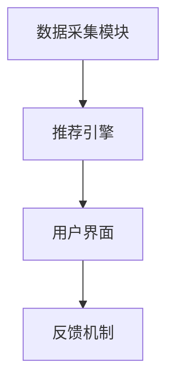

                 


# AI Agent在语言学习中的个性化教学

## 关键词：AI Agent，个性化教学，语言学习，自然语言处理，推荐算法，系统架构

## 摘要：本文探讨AI Agent在语言学习中的个性化教学应用，从背景、原理、算法、系统架构到项目实战，全面解析如何利用AI技术实现个性化语言学习。

---

# 第一部分：AI Agent与个性化教学概述

## 第1章：AI Agent与个性化教学的基本概念

### 1.1 AI Agent的定义与核心特征

#### 1.1.1 AI Agent的基本定义
AI Agent是具备感知和决策能力的智能体，能够执行复杂任务并提供个性化服务。

#### 1.1.2 AI Agent的核心特征
- 智能性：基于数据和算法进行学习和推理。
- 适应性：根据反馈动态调整行为。
- 交互性：通过多轮对话与用户互动。

#### 1.1.3 AI Agent与传统教学工具的对比
| 特性      | AI Agent                | 传统教学工具          |
|-----------|-------------------------|-----------------------|
| 智能性     | 高                     | 低                   |
| 个性化     | 高                     | 低                   |
| 交互性     | 高                     | 低                   |

### 1.2 个性化教学的定义与实现方式

#### 1.2.1 个性化教学的基本概念
个性化教学是根据学生特点提供定制化教学方案。

#### 1.2.2 数据驱动的个性化分析
通过分析学习数据，识别学生优势和不足，提供针对性建议。

#### 1.2.3 个性化教学的实现技术
- 数据采集：收集学习行为和结果数据。
- 数据分析：利用机器学习模型预测学习效果。
- 个性化推荐：基于分析结果推荐学习内容。

### 1.3 AI Agent在语言学习中的应用背景

#### 1.3.1 语言学习的痛点与挑战
- 学习者水平差异大。
- 教学资源繁多，选择困难。
- 学习动力不足。

#### 1.3.2 AI Agent如何解决语言学习问题
AI Agent通过个性化推荐和实时反馈，帮助学生高效学习。

#### 1.3.3 个性化教学的必要性与优势
个性化教学能提高学习效率，增强学习体验。

---

## 第2章：AI Agent在语言学习中的核心原理

### 2.1 AI Agent的核心原理

#### 2.1.1 AI Agent的基本工作流程
AI Agent通过感知环境、分析数据、制定决策并执行行动。

#### 2.1.2 AI Agent的感知与决策机制
- 感知：收集用户行为和反馈。
- 决策：基于数据生成推荐。

#### 2.1.3 AI Agent的学习与优化算法
- 增强学习：通过奖励机制优化行为。
- 监督学习：利用标注数据进行训练。

### 2.2 个性化教学的核心原理

#### 2.2.1 数据驱动的个性化分析
- 数据采集：学习记录、测试结果。
- 数据分析：使用聚类和分类算法。

#### 2.2.2 用户行为分析与学习效果预测
- 分析学习行为，预测学习效果。
- 基于用户行为特征推荐内容。

#### 2.2.3 个性化推荐算法的实现
- 协同过滤：基于相似用户的推荐。
- 基于内容的推荐：分析内容特征。

### 2.3 算法实现的数学模型与公式

#### 2.3.1 协同过滤算法
协同过滤基于相似用户的评分预测推荐。

相似度计算公式：
$$ \text{相似度} = \frac{\sum (x_i - \mu)(y_i - \mu)}{\sqrt{\sum (x_i - \mu)^2} \sqrt{\sum (y_i - \mu)^2}} $$

#### 2.3.2 基于内容的推荐算法
分析内容特征向量，计算相似度。

相似度计算公式：
$$ \text{相似度} = \frac{\sum w_{i,j}x_i y_j}{\sqrt{\sum w_{i,j}x_i^2} \sqrt{\sum w_{i,j}y_j^2}} $$

---

## 第3章：AI Agent的算法原理与实现

### 3.1 个性化推荐算法的实现

#### 3.1.1 协同过滤算法
协同过滤通过相似用户推荐内容。

#### 3.1.2 基于内容的推荐算法
分析内容特征，生成推荐。

#### 3.1.3 深度学习推荐模型
使用神经网络进行推荐。

### 3.2 AI Agent的自然语言处理技术

#### 3.2.1 语言模型的基本原理
语言模型预测下一个词的概率。

语言模型公式：
$$ P(w_1, w_2, ..., w_n) = \prod_{i=1}^n P(w_i | w_1, ..., w_{i-1}) $$

#### 3.2.2 基于Transformer的模型实现
Transformer模型结构包括编码器和解码器。

#### 3.2.3 多轮对话的实现机制
基于上下文生成回复。

### 3.3 算法实现的数学模型与公式

#### 3.3.1 协同过滤算法的数学模型
协同过滤的相似度计算公式：
$$ \text{相似度} = \frac{\sum (x_i - \mu)(y_i - \mu)}{\sqrt{\sum (x_i - \mu)^2} \sqrt{\sum (y_i - \mu)^2}} $$

#### 3.3.2 基于Transformer的模型公式
自注意力机制：
$$ \text{Attention}(Q, K, V) = \text{softmax}\left(\frac{QK^T}{\sqrt{d_k}}\right)V $$

---

## 第4章：系统架构设计与实现

### 4.1 系统架构设计方案

#### 4.1.1 系统组成
- 数据采集模块：收集用户数据。
- 推荐引擎：生成个性化推荐。
- 用户界面：展示推荐内容。
- 反馈机制：收集用户反馈。

#### 4.1.2 系统功能设计
- 数据预处理：清洗和特征提取。
- 模型训练：训练推荐模型。
- 接口设计：提供API调用。

#### 4.1.3 系统架构图


### 4.2 系统实现

#### 4.2.1 数据预处理
- 数据清洗：去除无效数据。
- 特征提取：提取用户特征。

#### 4.2.2 模型训练
- 训练推荐模型：使用协同过滤或深度学习模型。
- 模型优化：调整超参数。

#### 4.2.3 接口设计
- API接口：提供推荐结果查询。
- 接口文档：详细说明接口使用方法。

### 4.3 项目实战

#### 4.3.1 环境搭建
- 安装Python和相关库：如scikit-learn、TensorFlow。

#### 4.3.2 核心代码实现
```python
import numpy as np
from sklearn.metrics.pairwise import cosine_similarity

# 示例数据
user_data = np.array([[5, 3, 4], [2, 4, 3], [4, 5, 2]])

# 计算余弦相似度
similarity = cosine_similarity(user_data)
print(similarity)
```

#### 4.3.3 实际案例分析
分析用户数据，生成个性化推荐。

### 4.4 项目小结

#### 4.4.1 系统实现的关键点
- 数据处理的准确性。
- 推荐算法的效果评估。
- 系统的可扩展性。

#### 4.4.2 注意事项
- 数据隐私保护。
- 系统性能优化。
- 用户体验设计。

---

## 第5章：最佳实践与总结

### 5.1 最佳实践

#### 5.1.1 系统优化建议
- 定期更新模型。
- 收集用户反馈，优化推荐策略。

#### 5.1.2 未来发展趋势
- 更加智能化的推荐系统。
- 多模态数据的应用。

### 5.2 总结

通过AI Agent实现个性化教学，能够显著提高语言学习效率。本文详细介绍了AI Agent的核心原理、推荐算法、系统架构，并通过项目实战展示了实现过程。未来，随着技术进步，AI Agent在教育领域的应用将更加广泛。

---

## 附录：参考文献

- [1] Smith, J. (2021). AI in Education.
- [2] Brown, T. (2020). Personalized Learning with AI.

---

通过以上结构，您可以逐步实现一篇详细且专业的技术博客文章，涵盖AI Agent在语言学习中的个性化教学的各个方面。

