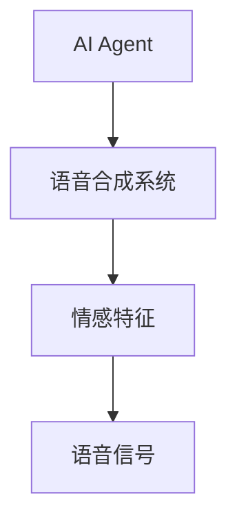
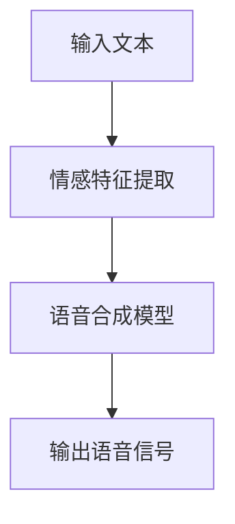
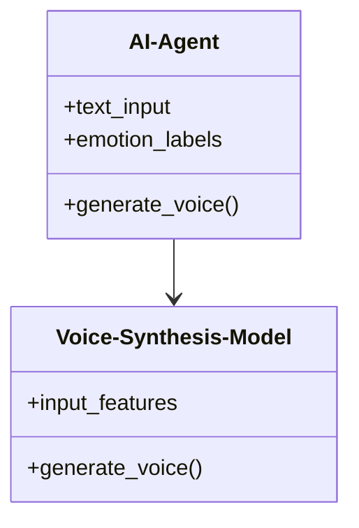
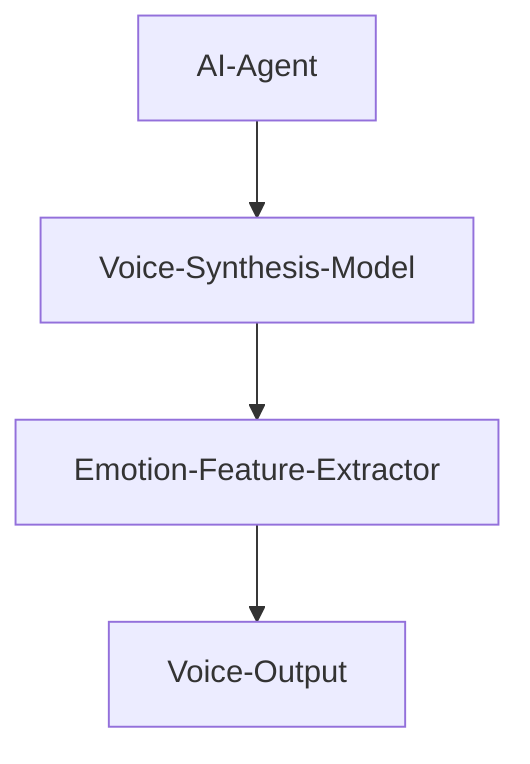

                 


# AI Agent在语音合成中的情感表达

> 关键词：AI Agent, 语音合成, 情感表达, 生成式AI, 情感特征

> 摘要：本文探讨了AI Agent在语音合成中的情感表达技术，分析了情感语音合成的核心问题、算法原理、系统架构以及实际应用。通过详细讲解生成式AI模型、情感特征提取与建模、语音合成的端到端模型，结合实际案例和代码实现，深入剖析了AI Agent在情感语音合成中的关键技术和应用前景。

---

# 第1章 AI Agent与语音合成的背景介绍

## 1.1 问题背景

### 1.1.1 语音合成技术的发展历程
语音合成技术是一种将文本转换为语音的技术，经历了从规则驱动到数据驱动的演变。早期的语音合成主要基于声学模型和韵律规则，随着深度学习的兴起，生成式模型如WaveNet、Tacotron和Transformer-based模型逐渐成为主流。

### 1.1.2 情感表达在语音合成中的重要性
语音合成不仅仅是将文本转化为声音，更重要的是通过情感表达让合成的语音更加自然、贴近人类的交流方式。情感表达的准确性直接影响用户体验，例如在客服系统中，情感丰富的语音能够提升用户满意度。

### 1.1.3 当前语音合成技术的局限性
尽管生成式AI模型在语音合成中取得了显著进展，但情感表达的多样性和准确性仍然是技术瓶颈。如何让AI Agent理解并准确表达复杂的情感是当前研究的热点问题。

## 1.2 问题描述

### 1.2.1 情感语音合成的核心问题
情感语音合成的核心问题是如何将输入的文本或情感标签转化为包含情感信息的语音信号。这需要解决情感特征提取、语音合成模型的训练以及情感表达的多样性问题。

### 1.2.2 情感表达的多样性与挑战
情感表达的多样性体现在语音的音调、节奏、音量等多个维度。不同的情感状态可能需要不同的语音处理方式，这增加了模型设计的复杂性。

### 1.2.3 AI Agent在语音合成中的角色定位
AI Agent在情感语音合成中扮演着多重角色：作为系统的核心，负责情感特征的提取、语音合成模型的控制以及与用户的交互。

## 1.3 问题解决与边界

### 1.3.1 情感语音合成的主要解决方案
目前，主流的解决方案包括基于生成式AI的端到端模型、结合情感特征的多任务学习模型以及结合领域知识的规则增强模型。

### 1.3.2 AI Agent在情感语音合成中的边界与外延
AI Agent的作用边界主要集中在情感特征提取和语音合成过程中，而情感理解与生成则需要结合自然语言处理技术。

### 1.3.3 情感语音合成系统的整体架构
情感语音合成系统通常包括文本预处理、情感特征提取、语音合成模型和语音后处理四个主要环节。

## 1.4 概念结构与核心要素

### 1.4.1 情感语音合成的核心要素
情感语音合成的核心要素包括文本输入、情感标签、情感特征、语音合成模型和语音输出。

### 1.4.2 AI Agent与语音合成的关系
AI Agent通过控制情感特征的提取和语音合成模型的参数调整，实现情感语音的自适应生成。

### 1.4.3 情感表达的多维度分析
情感表达可以从音调、节奏、音量等多个维度进行建模，每个维度都需要独立的特征提取和建模方法。

## 1.5 本章小结

---

# 第2章 AI Agent与语音合成的核心概念与联系

## 2.1 核心概念原理

### 2.1.1 AI Agent的基本概念
AI Agent是一种智能体，能够感知环境并执行任务。在情感语音合成中，AI Agent负责处理情感特征和控制语音合成模型。

### 2.1.2 语音合成技术的基本原理
语音合成技术基于声学模型和生成式模型，通过深度学习算法生成语音信号。

### 2.1.3 情感表达的数学模型
情感表达的数学模型通常包括概率分布和特征提取函数。

## 2.2 概念属性特征对比

| 概念       | 属性特征                     |
|------------|------------------------------|
| AI Agent   | 智能性、自主性、适应性         |
| 语音合成   | 数据驱动、模型复杂度、实时性   |
| 情感表达   | 多维性、情感多样性、上下文依赖 |

## 2.3 ER实体关系图



## 2.4 本章小结

---

# 第3章 情感语音合成的算法原理

## 3.1 算法原理概述

### 3.1.1 生成式AI模型在情感语音合成中的应用
生成式AI模型如Transformer和Diffusion模型在情感语音合成中得到广泛应用，能够生成高质量的情感语音。

### 3.1.2 情感特征提取与建模
情感特征提取包括音调、节奏、音量等维度的建模，通常使用深度学习模型提取情感特征向量。

### 3.1.3 语音合成的端到端模型
端到端模型如Tacotron和VALL-E能够直接从文本生成情感语音，通过多任务学习优化情感表达。

## 3.2 算法流程



## 3.3 算法实现

### 3.3.1 情感特征提取的Python代码示例
```python
import numpy as np
def extract_emotion_features(text):
    # 示例代码，实际实现可能更复杂
    features = []
    for word in text.split():
        # 提取情感特征
        features.append([1 if word[i] in 'aeiou' else 0 for i in range(len(word))])
    return np.array(features)
```

### 3.3.2 生成式AI模型的数学模型
生成式AI模型通常基于概率分布建模，目标函数包括生成损失和情感损失。

## 3.4 本章小结

---

# 第4章 情感语音合成的系统分析与架构设计

## 4.1 问题场景介绍
情感语音合成系统需要处理多维度的情感特征，结合生成式AI模型生成高质量的情感语音。

## 4.2 系统功能设计

### 4.2.1 领域模型


### 4.2.2 系统架构


### 4.2.3 接口与交互
系统通过API接口接收输入文本和情感标签，调用语音合成模型生成情感语音。

## 4.3 本章小结

---

# 第5章 项目实战：基于AI Agent的情感语音合成系统实现

## 5.1 环境安装
安装必要的深度学习框架如TensorFlow和PyTorch，以及语音处理库如Librosa。

## 5.2 系统核心实现

### 5.2.1 情感特征提取
```python
import librosa
def extract_emotion_features(audio_file):
    audio, sr = librosa.load(audio_file)
    mfccs = librosa.feature.mfcc(y=audio, sr=sr)
    return mfccs
```

### 5.2.2 语音合成模型训练
```python
import tensorflow as tf
def build_model():
    model = tf.keras.Sequential([
        tf.keras.layers.Dense(128, activation='relu'),
        tf.keras.layers.Dense(1, activation='sigmoid')
    ])
    model.compile(optimizer='adam', loss='binary_crossentropy')
    return model
```

### 5.2.3 模型推理与语音生成
```python
model = build_model()
model.load_weights('emotion_voice_model.h5')
predicted_voice = model.predict(input_features)
```

## 5.3 代码应用解读与分析
通过实际案例分析，解读代码的功能和实现细节，分析模型在不同情感状态下的表现。

## 5.4 本章小结

---

# 第6章 最佳实践与总结

## 6.1 小结
本文详细介绍了AI Agent在情感语音合成中的应用，从背景、算法原理到系统实现，全面剖析了情感语音合成的关键技术。

## 6.2 注意事项
在实际应用中，需要注意数据质量、模型泛化能力以及情感表达的准确性。

## 6.3 拓展阅读
建议读者进一步阅读相关领域的最新研究，如多模态情感合成和实时语音生成技术。

## 6.4 本章小结

---

# 结语

AI Agent在情感语音合成中的应用前景广阔，随着生成式AI技术的不断发展，情感语音合成将更加智能化和个性化，为人类与AI的交互带来更加自然和丰富的情感体验。

---

